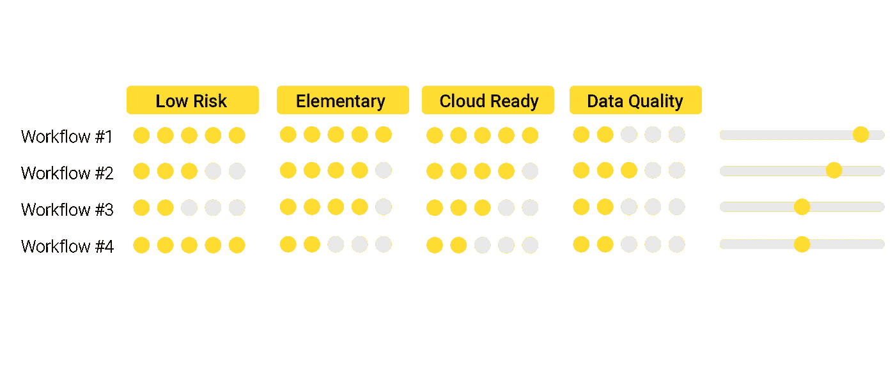
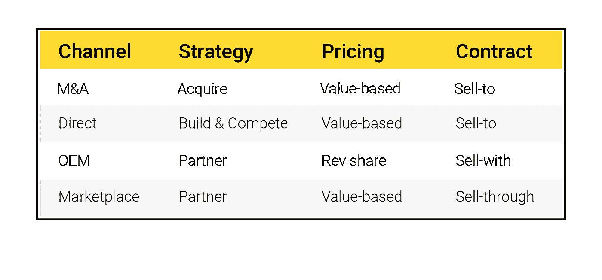

# 数据产品的战略蓝图

> 原文：<https://towardsdatascience.com/a-strategy-blueprint-for-data-products-a158ad6bf449?source=collection_archive---------37----------------------->

## 如何用数据构建战略护城河

在当今的商业环境中，战略护城河是用数据构建的。不用数据游戏就能在软件上建立新的业务线的日子已经一去不复返了。数据最初被比作石油，表明数据为创新引擎提供燃料。最近，[经济学家](https://www.economist.com/special-report/2020/02/20/are-data-more-like-oil-or-sunlight)将数据比作阳光，因为像太阳光线一样，数据将无处不在，成为一切的基础。数据也是精明的商业人士建立差异化商业模式的新基础设施。

[航空焦点](https://unsplash.com/@airfocus?utm_source=medium&utm_medium=referral)在 [Unsplash](https://unsplash.com?utm_source=medium&utm_medium=referral) 上拍摄的照片

设计数据产品成本高昂。数据科学家和机器学习工程师是收入最高的专业人士，仅次于外科医生和医生。不用说，将一个数据科学项目从实验转变为生产应用需要强大的财务实力和一致的商业激励。成功数据产品的蓝图由三个核心要素组成:业务工作流、分销渠道和数据源。

# 业务工作流程

数据产品作为建立在业务工作流之上的应用层出现。数据产品在管理流程自动化、客户支持、法规遵从性等运营环境中部署时，都有成功的记录。也就是说，数据产品目前被分配给“安全”的后台部门，在那里性能故障的代价较低。

并不是每个业务流程都能支持一个数据产品。我已经为许多企业准备并审核了记分卡，以证明数据产品应用程序的业务工作流是合格的。看看吧！

# 数据源

公共数据或开放数据可供每个人访问、修改、重用和共享。开放数据组织是支持开放源代码软件的组织的对应组织。他们的工作赋予公民权力，可以加强民主，简化社会、政府和私营企业的流程和系统。几个很棒的开放数据源是[世界银行开放数据](https://data.worldbank.org/)、[全球健康观察站数据](https://www.who.int/gho/database/en/)、[谷歌公共数据浏览器](https://www.google.com/publicdata/directory)、[AWS 开放数据注册中心](https://registry.opendata.aws/)、[美国人口普查局](https://www.census.gov/data.html)。

**私有数据**来源是谷歌、亚马逊和脸书等差异化公司的支柱。先发战略使公司能够在数据聚合游戏→数据引力中实现跨越。搜索结果、产品/电影推荐和社交网络随着数据而改善。这就是为什么老牌玩家会留在这里，除非我们让机器学习系统简单地分享和学习不同的数据源。
私有数据的许可权变得复杂。一个普遍的问题是，数据源的所有者不能从外部再授权数据。这意味着私有数据只能由拥有该数据的同一组织所拥有的产品利用。第二十二条军规？如果数据是根据带有分许可条款的许可收集的，这就为在母公司之外将私人数据商业化提供了机会。我们必须解决房间里的大象。在各公司中，数据管理实践的范围很广。领先的公司通过遵守道德、隐私和安全规则树立了榜样。一些行业自行处理事务，并建立了数据隐私标准和框架。在医疗保健和金融服务领域，数据隐私由监管机构强制执行。消费行业必须遵守消费者隐私法。适用于任何人的经验法则:总是尽可能经常地消除数据标识并许可聚合数据的孤岛。

**合成数据**是一种可取之处，取决于手头的数据产品。计算机算法已经非常擅长生成合成数据:无论是名人的视频还是《T2》杂志的文章，我们都可以伪造。类似的技术可以用来生成合成数据，这些数据训练数据产品背后的机器学习模型。为了用相关的数据种子引导这样的算法，公司可以建立数据捐赠计划——内部的或外部的——并签订适当的数据使用协议。

# 分配路线

一个好的产品只是故事的一半。您的产品已经签名盖章，现在需要交付。一些分销渠道可用于企业产品。每个分销渠道都对产品定价模式和整体产品策略有影响(构建对购买对收购)。

最后，数据驱动型产品需要持续监控质量表现。你可能会问，为什么所有这些审查，做同样工作的人没有被全天候监控。这么说吧，人类每季度都要接受伦理方面的培训，并对自己的行为负责。机器在沉默中行动，所以我们需要使用监控脚本来查询它们的行为。监控产品性能和标记角落案例是一个很好的做法。从定义故障管理、产品道德和人在回路中的审查的内部政策开始。