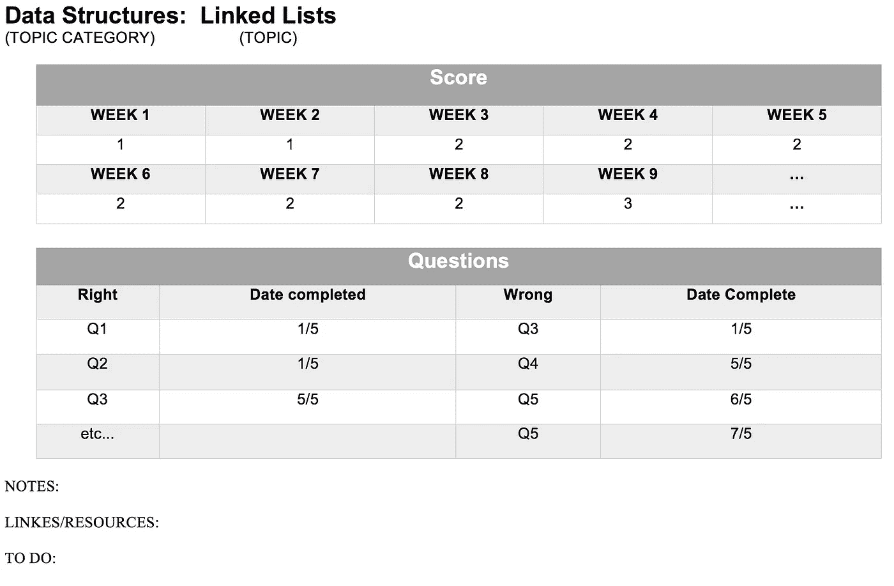
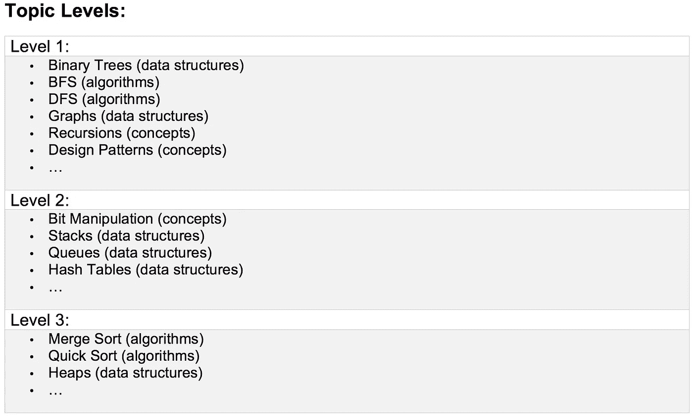
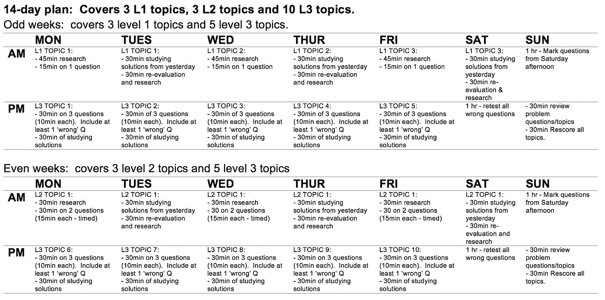
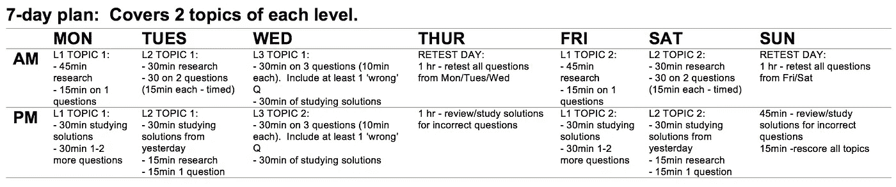
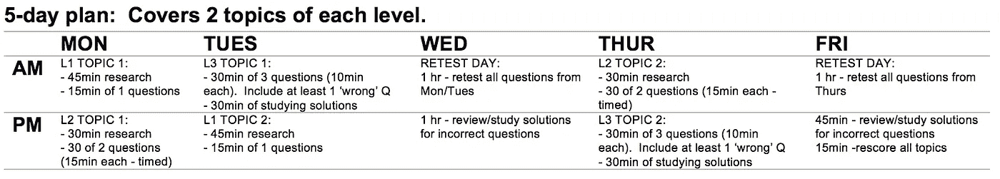

# 软件工程面试者的学习计划

> 原文：<https://towardsdatascience.com/a-study-plan-for-software-engineering-interviewees-b67914520489?source=collection_archive---------28----------------------->

## 成为技术面试的专家——第三部分

照片由来自[佩克斯](https://www.pexels.com/photo/adult-blank-business-copy-1181343/?utm_content=attributionCopyText&utm_medium=referral&utm_source=pexels)的[克里斯蒂娜·莫里洛](https://www.pexels.com/@divinetechygirl?utm_content=attributionCopyText&utm_medium=referral&utm_source=pexels)拍摄

这是软件工程师面试准备系列的第三部分。

我强烈建议您查看本系列的[第一部分](/become-an-expert-at-the-technical-interview-part-i-2f3db6273982)和[第二部分](https://medium.com/swlh/become-an-expert-at-the-technical-audition-part-ii-a337f979b88a)，以了解该学习计划的背景。

该计划旨在实施我在[第二部分](https://medium.com/swlh/become-an-expert-at-the-technical-audition-part-ii-a337f979b88a)中提到的刻意练习方法。

以此为指导——这里的主要目的是遵循有意练习的原则和我将在下面谈到的 7 步流程。享受旅程！

# 学习计划

## 设置:

好了，我们已经就什么是刻意练习*进行了一次大讨论，但是现在让我们来谈谈我们如何实际实施刻意练习以达到我们的最终目标并赢得现场面试。*

总结一下，我们的最终目标是:

> 每个主题都达到 3 级。

我们首先需要拿出一个空间，在那里我们可以客观地捕捉和跟踪每个主题的进展，每周。为此，我们将利用上面提到的 3 分制评分系统。这就是我们如何努力保持这个过程*客观*。

我将通过一个例子向你展示我如何跟踪进度，但我鼓励你发挥创造力，想出一种适合你和你的学习风格的方式。

首先，创建一个谷歌文档或表格来跟踪每个主题的进展。对于每个主题，创建一个表格来记录该主题每周的分数，并创建另一个表格来记录您的带有“正确/错误”列的题库。

我个人也喜欢用分区来记录每个主题的笔记、有用的链接和待办事项。这将成为下一步要做什么、你遇到了什么问题以及你克服了什么的列表——这有助于你更加关注自己一周的进步。

对我来说，布局可能是这样的:

如何跟踪主题进展的示例。(图片由作者提供)

我还会在周末维护一个每周更新的每个主题的水平表。刚开始的时候，这些话题大部分会是 1 级(也没关系！！).我可能会这样追踪:

每周记录每个主题的水平。(图片由作者提供)

## 日程安排:

既然我们已经有了一个有组织的空间来跟踪我们的进展，我们需要弄清楚 ***什么时候*** 我们实际上要把所有这些研究都放进去！

每个人的时间表都不一样——有些人在全职工作时准备面试，有些人在全职找工作(🙋🏼‍♀️).因此，你学习每个主题的时间和顺序完全取决于你自己和你的时间。

不管你如何选择你的主题，你有多少时间来学习，你的学习课程的结构将是相同的，并遵循以下循环:

1.  **确定问题区域**
2.  **研究问题领域**(谷歌/YouTube/书籍/同行讨论等。)
3.  **测试**(来自 LeetCode 等的问题。)
4.  **学习试题解答**(重要！！！)
5.  **重新评估和反思**(确定成功和问题领域)
6.  **复试**(与#3 相同的问题)
7.  **重复**

我们需要在这些步骤之间留出空间。例如，你不会在同一个小时内重新测试同一个问题。这通常会在当天晚些时候完成，或者最好在几天后完成。

我们还需要决定如何平衡 20 个主题，以及如何为每个级别适当地学习。谢天谢地，我们有一个评级系统，这将有助于指导我们。

> 一级主题:

*   这些主题在开始时不会有很多“测试”。
*   在研究开始时做其中的一两个问题可以帮助你找到不足之处，并指导你的研究工作，但除此之外，钻研一个你一无所知的问题没有多大用处。
*   1 级课题的研究将主要包括整理一份棘手领域的清单，然后研究/学习这些领域。
*   根据题目的不同，你可能会在解决一个问题之前花整整一周的时间做研究(尤其是如果这是一个大题目的话)。
*   对于困难的话题，在一周结束时(经过一周的集中研究)尝试问一个问题，给自己一个新的基线。这里的要点不是把问题做对，而是把你所学的内容放回背景中，给自己机会去研究解决方案。即使你不知道从哪里开始，也要给这个问题一个明确的答案——说点什么。然后，花大量时间研究解决方案——这就是你学习如何解决问题的方法！(相对于仅仅阅读理论)。然后将这个问题添加到你的“错误”堆中，你将在以后再次测试它。

> 二级主题:

*   这些主题将在研究和测试之间保持平衡。
*   保持与这些主题的良好流程:确定问题领域、研究、测试、研究解决方案、评估、重新测试。
*   强调 ***做*** 题对二级题目很重要。
*   真正挑战自己，只是“做”。这就是这些主题如何到达第三级的原因！

> 第 3 级主题:

*   某样东西被评为 3 级意味着你对它“几乎无所不知”,根本不需要做太多的研究。
*   在这个阶段，只是实践:测试、解决方案、测试、解决方案…
*   (当然还要重新测试你做错的题！).

> 改变级别:

不要对自己太苛刻——如果你觉得自己在某个话题上取得了进步，那就让自己进步吧！

然而，在以这种方式学习之后，你可能会意识到你需要把某些东西**降低**一个等级——不要为此惊慌。这是发现问题领域过程的一部分。你可能习惯于通过“感觉”来评估你在某方面的能力——现在我们有了一个客观的衡量标准，所以可以预料我们可能会出错。

对于第 2 级主题，如果你花更多的时间研究而不是做题，那么这是一个信号，表明这个主题可能应该下降到第 1 级。

对于第 3 级问题，如果你发现你得到了正确的答案，但是它的时间和空间复杂度一直很低，并且你的解决方案感觉有点“粗糙”，那么也许将这个问题移到第 2 级并研究这些类型问题的一些更优的解决方案是一个好主意。

相信你的判断，不要想太多！

## 学习计划示例:

这里有几个学习计划的例子，告诉你如何安排我们刚刚谈到的所有内容。抱歉，它们不太漂亮。

我假设每个计划每天学习 2 小时。当然，这些只是建议**——你显然可以根据你的时间表和时间框架进行相应的调整。我相信你会想出更好的时间表！**

**关键是**保持上面的 7 步流程**。**

# **14 天计划示例:**

****

**实施深思熟虑练习的 14 天学习计划示例。(图片由作者提供)**

# **7 天计划示例:**

****

**实施深思熟虑练习的 7 天学习计划示例。(图片由作者提供)**

# **5 天计划示例:**

****

**实施深思熟虑练习的 5 天学习计划示例。(图片由作者提供)**

**我在这里提供了 5、7 和 14 天的计划，告诉你无论你的时间表是什么，你都可以适应学习！作为一名教师，我听过各种各样的借口，比如“你不适合学习”，但我更乐意和你坐在一起，为你找时间！**

**请给我发消息告诉我你想到了什么——我总是很想知道人们是如何利用他们的时间来创造的！**

# **数据科学家注意:**

**我和软件工程师一起实施了这个学习计划，并取得了巨大的成功。然而，我是一名数据科学家，目前正在接受数据科学职位的面试。这个领域比软件工程面试稍微微妙一些，因为对于数据科学的角色还没有直接的共识。**

**[直接联系我](https://www.linkedin.com/in/leana-critchell/)如果你想讨论如何准备数据科学面试，以防你不知道，我喜欢谈论这个话题😝。**

# **我们到了！**

**现在我知道了，我知道了。这是一个很大的数字，可能看起来有点过了。这是一个我充满热情的话题，我也相信这个话题的需求量很大。**

**让我们提高现场面试成功率，同时提高我们的学习效率！**

****

**照片由来自 [Pexels](https://www.pexels.com/photo/black-computer-keyboard-4567338/?utm_content=attributionCopyText&utm_medium=referral&utm_source=pexels) 的[伊恩·帕内洛](https://www.pexels.com/@ian-panelo?utm_content=attributionCopyText&utm_medium=referral&utm_source=pexels)拍摄**