# Twitter 美国航空公司情感数据集的监督或半监督 ULMFit 模型

> 原文：<https://towardsdatascience.com/a-supervised-or-semi-supervised-ulmfit-model-to-twitter-us-airlines-sentiment-dataset-db3a6550abdf?source=collection_archive---------29----------------------->

## Twitter 美国航空公司情感数据集的监督或半监督 ULMFit 模型

我们的任务是将类似 ULMFit (Ruder 等人，2018 年)的监督/半监督技术应用于 Twitter 美国航空公司情绪分析数据。
这个问题是半监督的原因是，它首先是一种非监督的训练方式，然后通过在网络顶部添加一个分类器网络来微调网络。

> **我们使用 Twitter 美国航空公司数据集(**[**https://www . ka ggle . com/crowd flower/Twitter-airline-情操**](https://www.kaggle.com/crowdflower/twitter-airline-sentiment) **)**


[https://unsplash.com/photos/rf6ywHVkrlY](https://unsplash.com/photos/rf6ywHVkrlY)

我们将从 **开始:**

*   浏览数据集，为模型进行预处理和准备
*   探索情感分析的历史
*   探索语言模型及其重要性
*   设置基线模型
*   探索文本分类技术
*   ULMFit 概述
*   将 ULMFIT 应用于 Twitter 美国航空公司数据
*   结果和预测
*   结论和未来方向

# 数据集

我们将从探索数据集统计数据和执行所有强制特征转换开始。

*   由于这是一个多类分类问题，我们将对目标变量进行编码。
*   我们将改变列的显示顺序
*   我们将执行基本的统计以从数据中获得一些洞察力
*   最后，我们将把新的数据帧分成 df_train、df_val 和 df_test

```
# Loading datasetdf = pd.read_csv(DATA_DIR)# LabelEncoder to change positive, negative and neutral to numbers (classes)labelEncoder = LabelEncoder()def cleanAscii(text):"""Remove Non ASCII characters from the dataset.Arguments:text: str"""return ''.join(i for i in text if ord(i) < 128)def gather_texts_and_labels(df=None, test_size=0.15,random_state=42):"""Gathers the text and the corresponding labels from the dataset and splits it.Arguments:df: Pandas DataFrametest_size: represents the test sizerandom_state: represents the random stateReturns:(x_train, x_test, y_train, y_test, new_df)"""# textstexts = df["text"].values# encoding labels (positive, neutral, negative)df['airline_sentiment'] = labelEncoder.fit_transform(df['airline_sentiment'])labels = df['airline_sentiment'].values# changing the order for fastai tokenizers to capture data.new_df = pd.DataFrame(data={"label":labels, "text":texts})df_train, df_test = train_test_split(new_df, stratify = new_df['label'], test_size=test_size, random_state = random_state)df_train, df_val = train_test_split(df_train, stratify = df_train['label'], test_size = test_size,random_state = random_state)print("Training: {}, Testing: {}, Val: {}".format(len(df_train), len(df_test), len(df_val)))return df_train, df_test, df_val,new_dfdef describe_dataset(df=None):"""Describes the datasetArguments:df: Pandas Dataframe"""print(df["airline_sentiment"].value_counts())print(df["airline"].value_counts())print("\nMean airline_sentiment_confidence is {}".format(df.airline_sentiment_confidence.mean()))# Optionaldef add_negativereason_to_text(df=None):# change negativereason to "" if NaN else remain as is.df['negativereason'] = df['negativereason'].apply(lambda x: "" if pd.isna(x) else x)# add negativereason to textdf['text'] = df['text'] + df['negativereason']add_negativereason_to_text(df)df['text'] = df['text'].apply(cleanAscii)describe_dataset(df)df_train, df_test, df_val, new_df = gather_texts_and_labels(df)
```

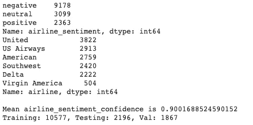

数据的统计

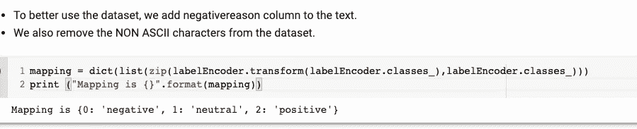

一些基本功能

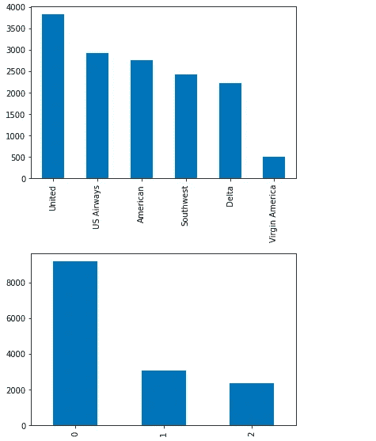

一些视觉统计

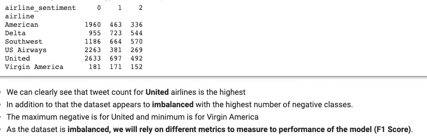

更多统计数据

> **我们将依靠不同的指标来衡量模型的性能(**精度**、召回率、F1 得分)**。

历史

# 历史

B 在 ULMFit (2018)或 NLP 中的迁移学习之前准确地说，我们使用 word2Vec 或 GLove 等单词嵌入将单词表示为密集稀疏向量表示。通常，我们使用嵌入层作为模型中的第一层，然后根据我们的需要附加一个分类器。这使得该系统很难训练，因为它需要大量的数据。这些语言模型是早期的统计 LMs，使用概率分布来表示单词。(《由公司一言保管》)。

*   ULMfit，BERT，Universal sentence encoder，OpenAI GPT-2 使用一种叫做神经语言模型的东西来以分布式方式表示单词，并允许微调一个大型预训练语言模型来帮助我们完成任务。
*   具体来说，ULMfit (2018)引入了三种新技术来微调预训练语言模型
*   微调是计算机视觉中的一种流行方法，虽然这种方法在 NLP 上尝试过，但结果证明这种方法在 ULMFit 之前是错误的。

> 在本文的后面，我们将看到语言模型和分类器的概述。

# 设定基线

B 在任何机器学习实验之前，我们都应该设立一个基线，并与我们的结果进行比较。

为了建立基线，**我们将使用 word2vec 嵌入矩阵来尝试预测情绪。**

*   为了加载我们的 word2vec，我们将使用嵌入层，然后是基本的前馈神经网络来预测情绪。

**我们也可以加载一个预先训练好的 word2vec 或 glove 嵌入，并输入到我们的嵌入层中。
我们可以在嵌入层之后使用 LSTM 或 CNN，然后激活 softmax。**

```
# The word2vec requires sentences as list of lists.texts = df['text'].apply(cleanAscii).valuestokenizer = keras.preprocessing.text.Tokenizer(num_words=5000, oov_token='<OOV>')# fittingtokenizer.fit_on_texts(texts)vocab_size = len(tokenizer.word_index) + 1# max length to be padded (batch_size, 100)max_length = 100train_text = tokenizer.texts_to_sequences(df_train['text'].values)test_text = tokenizer.texts_to_sequences(df_test['text'].values)# getting the padded length of 100padded_train_text = keras.preprocessing.sequence.pad_sequences(train_text, max_length, padding='post')padded_test_text = keras.preprocessing.sequence.pad_sequences(test_text, max_length, padding='post')labels_train = keras.utils.to_categorical(df_train['label'].values, 3)labels_test = keras.utils.to_categorical(df_test['label'].values, 3)metrics = [keras.metrics.Accuracy()]net = Sequential()# return 50 dimension embedding representation with input_length as 100net.add(keras.layers.Embedding(vocab_size, 50, input_length=max_length))net.add(keras.layers.Flatten())net.add(keras.layers.Dense(512, activation='relu'))net.add(keras.layers.Dense(3, activation='softmax'))net.compile(optimizer='adam', loss=keras.losses.categorical_crossentropy, metrics=metrics)net.summary()# The word2vec requires sentences as list of lists.texts = df['text'].apply(cleanAscii).valuestokenizer = keras.preprocessing.text.Tokenizer(num_words=5000, oov_token='<OOV>')# fittingtokenizer.fit_on_texts(texts)vocab_size = len(tokenizer.word_index) + 1# max length to be padded (batch_size, 100)max_length = 100train_text = tokenizer.texts_to_sequences(df_train['text'].values)test_text = tokenizer.texts_to_sequences(df_test['text'].values)# getting the padded length of 100padded_train_text = keras.preprocessing.sequence.pad_sequences(train_text, max_length, padding='post')padded_test_text = keras.preprocessing.sequence.pad_sequences(test_text, max_length, padding='post')labels_train = keras.utils.to_categorical(df_train['label'].values, 3)labels_test = keras.utils.to_categorical(df_test['label'].values, 3)metrics = [keras.metrics.Accuracy()]net = Sequential()# return 50 dimension embedding representation with input_length as 100net.add(keras.layers.Embedding(vocab_size, 50, input_length=max_length))net.add(keras.layers.Flatten())net.add(keras.layers.Dense(512, activation='relu'))net.add(keras.layers.Dense(3, activation='softmax'))net.compile(optimizer='adam', loss=keras.losses.categorical_crossentropy, metrics=metrics)net.summary()
```

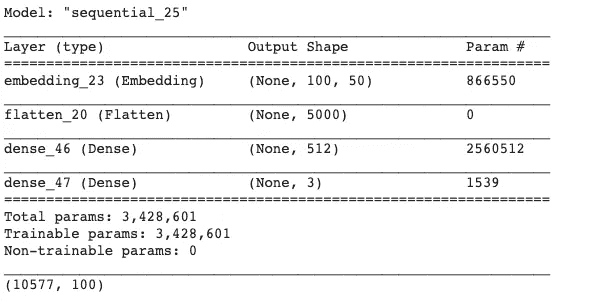

模型摘要

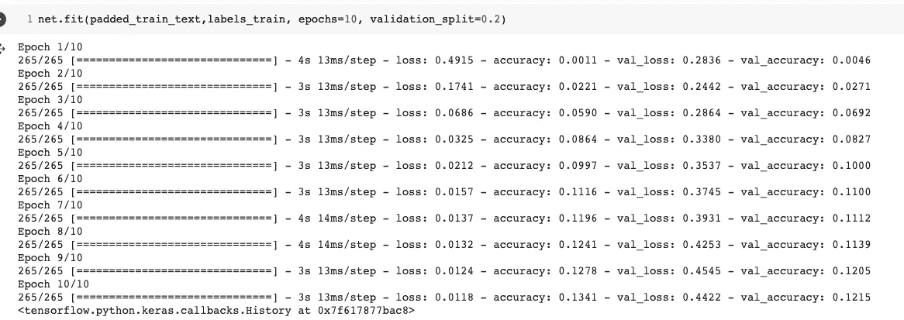

培养

```
# test the baseline model
def test_baseline_sentiment(text):"""Test the baseline modelArguments:text:str"""padded_text = keras.preprocessing.sequence.pad_sequences(tokenizer.texts_to_sequences([text]), max_length, padding='post')print(net.predict(padded_text).argmax(axis=1))net.evaluate(padded_test_text, labels_test)preds = net.predict(padded_test_text).argmax(axis=1)
```

> **如您所见，使用简单的前馈神经网络和嵌入层，我们很难达到 12%的精度**

# 加载语言模型和微调

astAI 为我们提供了一个易于使用的基于维基文本(AWD)的语言模型。

我们将从加载 LM 数据并使用所需的数据初始化它开始。

```
data_lm = TextLMDataBunch.from_df(train_df = df_train, valid_df = df_val, path = "")# Saving the data_lm as backupdata_lm.save("data_lm_twitter.pkl") # saving as a back stop# Loading the language model (AWD_LSTM)learn = language_model_learner(data_lm, AWD_LSTM, drop_mult=0.3)print(learn)
```

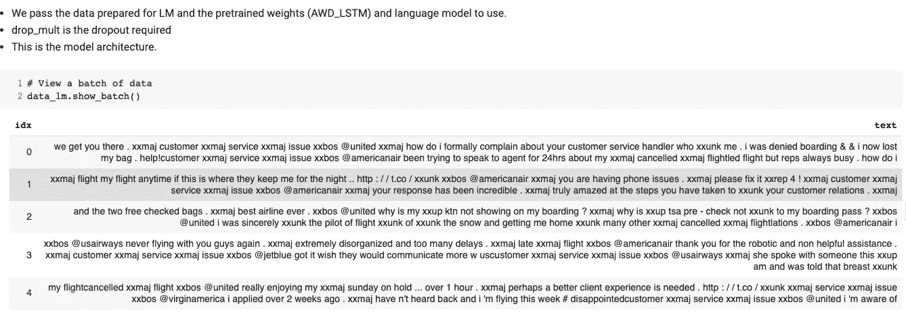

我们的样本数据

> 正如你所看到的，fastai 库使用了 spacy tokenizer，所以除了删除 asci 字符之外，我们不对数据进行任何预处理。ULMFit 的作者在经验上很好地检验了标记化过程。

# 培养

```
# Finding the optimal learning ratelearn.lr_find(start_lr=1e-8, end_lr=1e2)learn.recorder.plot()# Fit using one cycle policylearn.fit_one_cycle(1, 1e-2)# Unfreeze all layerslearn.unfreeze()# fit one cycle for 10 epochslearn.fit_one_cycle(10, 1e-3, moms=(0.8,0.7))# save the encoderlearn.save_encoder('fine_tuned_enc') # we need the encoder in particular..FOr classifier
```

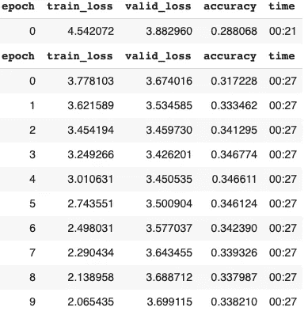

模型进度

# 文本分类

我们现在创建添加我们的分类器在下面的网络(微调)。这是将指定的任务分类器添加到预训练语言模型中的最后一步

这是**逐步冻结步骤。**

```
# Preparing the classifier datadata_clas = TextClasDataBunch.from_df(path = "", train_df = df_train, valid_df = df_val, test_df=df_test, vocab=data_lm.train_ds.vocab)# Building the classifierlearn = text_classifier_learner(data_clas, AWD_LSTM, drop_mult=0.5)# loading the saved encoderlearn.load_encoder('fine_tuned_enc') # load th encoder from the LM# slanted learning rate scheduler# fine tuning the whole networklearn.fit_one_cycle(3, 1e-2, moms=(0.8,0.7))  # you can of course train more, Jeremy promises its hard to over fit here :D# fine tuning the network layer by layer to preserve as much information is possible.learn.freeze_to(-2) # unfreeze last 2 layerslearn.fit_one_cycle(2, slice(1e-2/(2.6**4),1e-2), moms=(0.8,0.7))learn.freeze_to(-3) # unfreeze last 3 layerslearn.fit_one_cycle(2, slice(5e-3/(2.6**4),5e-3), moms=(0.8,0.7))learn.freeze_to(-4) # unfreeze last 4 layerslearn.fit_one_cycle(2, slice(5e-3/(2.6**4),5e-3), moms=(0.8,0.7))learn.freeze_to(-5) # unfreeze last 5 layerslearn.fit_one_cycle(2, slice(5e-3/(2.6**4),5e-3), moms=(0.8,0.7))# Unfreezing all the layers and traininglearn.unfreeze() # unfreze alllearn.fit_one_cycle(3, slice(1e-3/(2.6**4),1e-3), moms=(0.8,0.7))
```

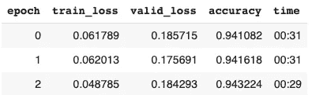

我们达到了 94%的准确率

# ULMFit 概述

ULMfit 流程的回顾

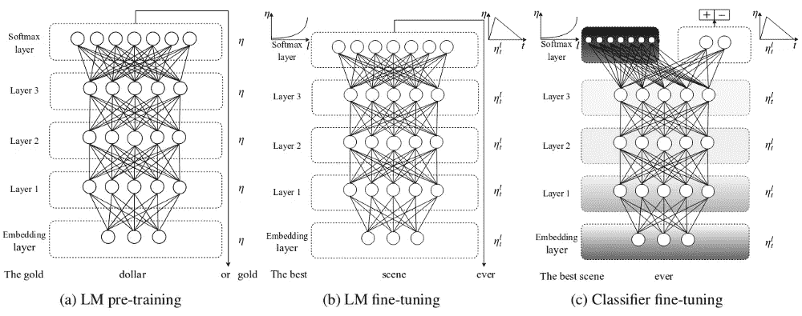

[https://arxiv.org/abs/1801.06146](https://arxiv.org/abs/1801.06146)

不同类型的流程如下:

*   LM 预训练:这是我们遵循无监督学习来捕获大型语料库的语义和概率表示的步骤。(维基文本-103)
*   LM 微调:这是我们通过使用某些新技术来微调 LM 的步骤。由于 AWD-LSTM(预训练模型)的每一层都捕获关于语料库的不同信息，我们首先微调最后一层，因为它包含最少的信息，而所有其他层都被冻结。然后，我们解冻所有其他层，用指定的任务重新训练模型。这样，我们不会丢失信息。通过使用倾斜的三角形学习率(模式为三角形的循环学习率)来完成训练。
*   最后一步是分类器微调，其中分类器模型附加到模型的顶部，并通过使用逐步解冻来训练，我们通过逐层解冻来训练模型。

T *这些技术是:*

*   区别微调
*   倾斜三角形学习率
*   逐渐冻结

# 乌尔菲特在推特上表达了美国航空公司的观点。(预测和准确性)

```
def get_sentiment(text:str):"""Get the sentiment of text.Arguments:text: the text sentiment to be predicted"""index = learn.predict("This was a great movie!")[2].numpy().argmax()print("Predicted sentiment: {}".format(mapping[index]))def evaluate():"""Evaluates the networkArguments:NoneReturns:accuracy: float"""texts = df_test['text'].valueslabels = df_test['label'].valuespreds = []for t in texts:preds.append(learn.predict(t)[1].numpy())acc = (labels == preds).mean() * 100print("Test Accuracy: {}".format(acc))return preds, labelsget_sentiment("This is amazing")preds, labels = evaluate()print(classification_report(labels, preds, labels=[0,1,2]))print(confusion_matrix(labels, preds))
```

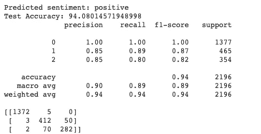

模型结果

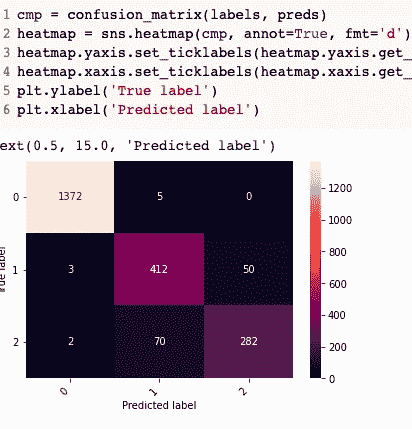

混淆矩阵

*   如你所见，我们的模型很好，但可以通过试验超参数来改进。
*   如果我们看到混淆矩阵，我们可以看到我们的模型对大多数类别进行了正确的分类。
*   黑色代表 0，从图上看，我们得到的大多数预测都是黑色的

# 结论和未来方向

到得出结论，我们取得以下结果:

*   我们使用美国航空公司的推文数据库训练一个模型来预测推文的情绪。
*   我们使用 ULMFit (Ruder 等人，2018 年)通过上面给出的新技术来训练我们的模型。
*   我们使用流行的 fastai 库来训练模型，因为它包含 AWD-LSTM 的预训练权重。
*   我们实现了 94 的测试准确度，由于我们的数据集不平衡，我们使用 F1 分数等指标。
*   我们得到一个 F1 分，即 **89** 的准确度。
*   我们使用混淆矩阵进一步检验我们的模型的性能。

> 为了建立一个更好的模型，我们还可以使用其他语言模型和技术，如 BERT、use、Transformers、XLNet 等。

**Colab 笔记本:**[https://Colab . research . Google . com/drive/1 eismifjg 1 aengepsfseb 55 bjcciop 5 pq？usp =共享](https://colab.research.google.com/drive/1eiSmiFjg1aeNgepSfSEB55BJccioP5PQ?usp=sharing)