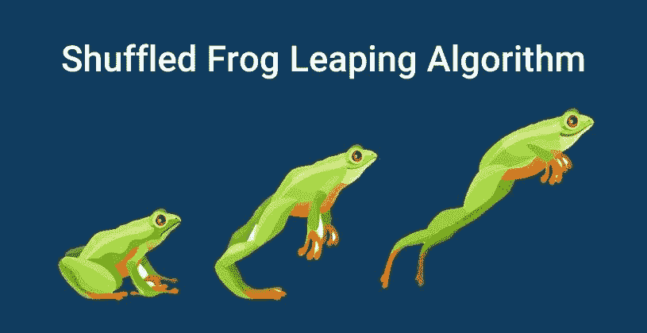
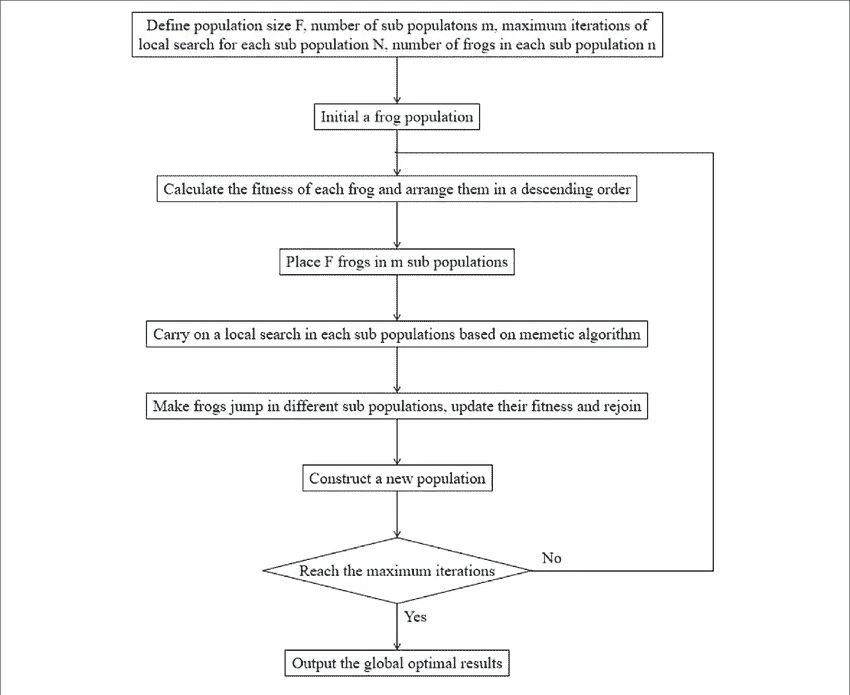

# 混合蛙跳算法综述

> 原文：<https://towardsdatascience.com/a-survey-on-shuffled-frog-leaping-algorithm-d309d0cf7503?source=collection_archive---------27----------------------->

## 自然；人类最优秀的老师

穆罕默德·N·穆罕默迪的图片

T 何混合蛙跳算法(SFLA)是受自然界中青蛙的社会行为启发的最具创新性的优化算法之一，在分类方面，行为算法或模因算法都包含在其中。蛙跳优化算法的其他名称包括蛙跳算法、蛙跳算法和 SFLA 算法。该算法由 Eusuff 和 Lansey 在 2003 年首次提出，尽管此后提交了许多论文来改进该算法。在下载链接的底部是青蛙优化算法的主要文章。

# 什么是 SFLA 算法？

SFLA 算法是一种基于元启发式模因论的算法。memetic 算法是一种基于种群的算法，用于复杂而重要的优化问题。该算法的主要思想是在遗传算法的结构中使用一种局部搜索方法来提高搜索强化过程的水性能。memetic 算法首先加密初始答案的总和，然后 Ibn 算法基于一个适应度函数计算每个答案的效用，并生成新的解。

SFLA 算法的灵感来自青蛙寻找食物的方式。该算法使用诺模法在青蛙子群中进行局部搜索。青蛙混合跳转算法使用混合策略，并允许在局部搜索中交换消息。该算法结合了诺模算法和粒子群优化的优点。在青蛙混合跳转算法中，不仅在局部搜索中而且在全局搜索中交换单词。因此， ***局部*** 和 ***全局*** 搜索在该算法中得到了很好的结合。青蛙混合跳转算法是高度可搜索和易于实现的。青蛙混合跳转算法可以解决许多非线性、不可检测和多状态问题。

## 青蛙变异算法的描述

该算法结合了两类基于遗传算法(如模因论)和基于社会行为算法(如粒子群鸟算法)的优点。它试图在可能的答案空间中的广泛审查之间取得平衡。在这种群体算法中，一群青蛙(答案)组成，每只青蛙在遗传算法中都有一个类似染色体的结构。青蛙的整个种群被分成更小的组，每组代表不同类型的青蛙，它们分散在答案空间的不同地方。然后，每组青蛙开始在它们的栖息地周围进行精确的局部搜索。

每一类中的每一只青蛙都受到其群体中其他成员以及其他群体的影响。几个步骤之后，混合发生了，信息在所有组中传播，以建立收敛和到达答案的条件。如何在该算法中找到最优解包括全局和局部搜索两个阶段。

## 初级种群形成

在初始种群的形成中，首先确定群体的数量和每个类别中应该有的青蛙数量。如果群体的数量和每个群体中青蛙的数量被认为是 1，那么样本的总数量将是 F = m * n。然后为生产的所有样本计算成本函数。分类和分配基于计算的成本函数来计算选择的青蛙的总数，使得具有最低成本函数和最佳位置的示例在第一位置。最佳青蛙的位置存储在整个种群中。然后将所有的青蛙分成 m 个选定的类别，这样每个类别中就有一只青蛙。

划分方法如下:在有序群体中，第一个成员在第一个类别中，第二个成员在第二个类别中，依此类推，直到受托人被选择并被置于“m”类别中，然后 1 + m 成员将在第一个类别中，因此划分青蛙的过程将继续。

群体的进化青蛙在每个群体的不同类别之间的划分以预定的数量重复进化的步骤。在这个步骤之后，所有的青蛙被组合，并且重复全局搜索步骤。

SFLA 流程图

# SFLA 蛙跳算法的步骤

> SFLA 算法的元探索策略按照以下步骤概括为全局探索和局部探索两个主要阶段。

> **全球勘探阶段**

*   第一步:初始化

选择 M，N. M 代表 memeplex 的数量，n 代表每个 meme plex 中青蛙的数量，所以池塘的总种群大小由关系式 f = m * n 得到。

*   步骤 2:虚拟人口的产生

从可用空间中，采样 F 个虚拟青蛙 U(1)，U(2)，…，U(F)。计算每个 U(i)的能力值。

u(I)=(ui1 \u 2，…\u Uid)。此外，d 是决策变量的数量。

*   步骤 3:对青蛙进行分级和分类

将青蛙按优劣降序存放在数组 X = {U(i)，f(i) & i=1…，F}中。记录种群中最好的 Px 蛙的位置。(U = Px(1))。

*   第四步:把青蛙分成复合物

将数组 X 分成 Y，每个数组包含 n 只青蛙。

*   第五步:模因论在每个模因丛中的进化

每个 Yk memeplex(k = 1，2，3，…，m)由下面描述的局部搜索蛙跳算法进化而来。

*   第六步:合并 memeplexes

在每个模因丛中发生一定数量的模因进化后，将模因丛(Y1，…，Ym)置于 X 中，使得关系 X = {Y(k)，k = 1，2，…。，m}成立。然后，更新(Px)种群的最佳位置。

*   步骤 7:趋同研究

如果满足收敛条件，则停止。否则，转到全局搜索的第四步。

穆罕默德·N·穆罕默迪的图片

> **当地探险步骤:**

在全局搜索的第五阶段，每个迷因复合体的进化被独立执行 **N** 次。在 memeplexes 进化之后，算法返回到全局搜索以完成组合。以下描述了每个 memeplex 中本地搜索的详细信息:

*   步骤 1:初始化

将中的 *im、*和*置零，im 统计 memeplexes 的个数，iN 统计进化步数。*

*   第二步:1 + im = im
*   第三步:1 + iN = iN
*   步骤 4:创建一个子复合体

青蛙的目标是通过改善它们的迷因来移动到最佳位置。选择子丛的方法是给性能较高的青蛙分配较多的权重，给性能值较低的青蛙分配较低的权重。权重通过三角概率分布来分配，Pi = {2(j-1 + n) / n(n+1)，j = 1，…，n}。为了构建子 memeplex Z 数组，从每个 memeplex 的 n 只青蛙中随机选择 q 只青蛙。子丛中的那些分别用 PB 和 PW 表示。

*   第五步:纠正最差青蛙的位置。

子模板中最差的青蛙(具有最差性能的青蛙)的新位置通过关系 U(q) = S + PW 来计算。s 是青蛙的步长(跳跃的速率),它将被获得:

如果新位置比前一个位置更好，那么用前一个 U(q)替换新的 U(Q ),并转到局部搜索的步骤 8。否则，转到本地搜索的步骤 6。

*   第六步:用 PX 计算步长。

如果在步骤 5 中没有获得更好的结果，那么使用下面的等式计算青蛙的步长:

并且通过关系式 U (q) = S + PW 来计算新位置(U(q))。如果 U(q)在可能的空间内，则计算新效率 f(q)的值。如果 f(q)新的优于前一个，那么用前一个 U(q)替换新的 U(q ),进入局部搜索的第八步。否则，转到本地搜索的第七步。

*   第七步:审查

如果新位置不在可实现区域内或不比先前位置好，则在可用位置随机产生新的辙叉(r ),并替换其新位置不适合前进的辙叉。计算 f(r)，设 U(q)等于 r，f(q)等于 f(r)。

*   第八步:更新 memeplex。

在子丛中最差的青蛙模仿变化后，将 Z 中的青蛙放在 Yim 上它们原来的位置。按性能降序排列 Yim。

*   第九步:如果 N > iN，转到第三步本地搜索。
*   第十步:如果 m > im，则进入本地搜索的第一步。否则，返回全局搜索以合并 memeplexes。

希望有帮助。如果您对 Linkedin 有任何问题或反馈，请告诉我。