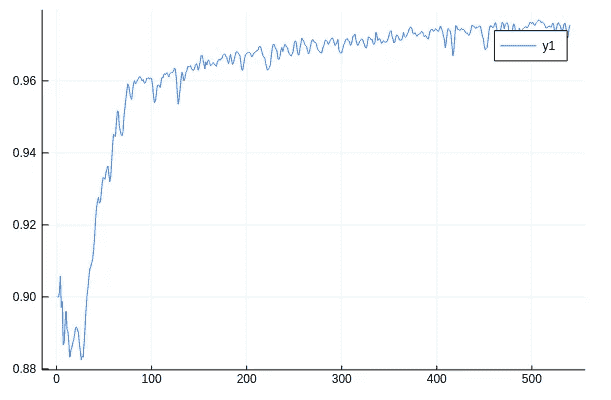

# Julia 对 Flux 的快速介绍(使用 CUDA)

> 原文：<https://towardsdatascience.com/a-swift-introduction-to-flux-for-julia-with-cuda-9d87c535312c?source=collection_archive---------21----------------------->

## 用 Flux 在 Julia 中建立你的第一个渐变模型


(src = http://fluxml.ai)

自从经典的 Mocha.jl 时代以来，Julia 中的机器学习已经走过了漫长的道路，对该生态系统做出贡献的最具开创性的创造之一是 Flux.jl. Flux 是 Julia 的权威梯度下降库，可以与 Python 的 Tensorflow 相提并论。Flux 遵循与许多 Julia 包类似的概念，如 Lathe.jl 和 DataFrames.jl，只用大约 1000 行代码编写，并且只依赖于 Julia 本身。与 Tensorflow 和 Pytorch 等解决方案相比，它们都使用各种语言，包括 C++、Go 和 C。


(src = http://juliacomputing.com)

Julia 的一个优点是并行计算平台和多线程与语言的无缝结合。没有比这更形象化的了(明白吗？相比 NVIDIA 图形处理器的古老平台 CUDA。Julia 和您的硬件之间的紧密集成很好地延续到 Flux 中，使 Flux 和 CUDA 成为真正的天作之合。将机器代码中的零标志设置为一，系好安全带，因为这肯定会令人兴奋！

# 获取数据

对于我今天的样本数据，我选择了来自 MLDatasets.jl 的数据集，它是可爱的 Julia Computing 的产品，您可以使用 Pkg 添加它:

```
using Pkg;Pkg.add("MLDatasets")
```

或者，在 Pkg REPL:

```
bash -$ julia
julia> ]
pkg> add "MLDatasets"
```

我通常不从常用的包中选择数据集，但是我做了这个例外，以确保这段代码不需要任何下载就可以重现(至少不需要通过您的 web 浏览器)。我要使用的数据集是时尚敏斯特数据集，我们可以这样下载:

```
**using** MLDatasets FashionMNIST.download(i_accept_the_terms_of_use=true)
train_x, train_y = FashionMNIST.traindata();  
test_x,  test_y  = FashionMNIST.testdata();
```

您还可以选择添加一个验证集，或者用 Lathe 分割您自己的数据集:

```
using Pkg; Pkg.add("Lathe")
using Lathe.preprocess: TrainTestSplitusing DataFrames
# Validation:
train_x, train_y = FashionMNIST.traindata();
test_x, test_y = FashionMNIST.testdata();
df = DataFrame(:Feature => train_x, :Target => train_y)
train, val = TrainTestSplit(df)f = :Featuret = :Target
val_x = val[f]
val_y = val[t]
train_x = train[f]
train_y = train[t]# Bring your own data:
using CSV
df = CSV.read("data.csv")
train, test = TrainTestSplit(df)
```

因为我的数据集处理图像，所以我应该将数据从各自的文件格式转换成图像，我们可以这样做:

```
**using** ImageCore
FashionMNIST.convert2image(FashionMNIST.traintensor(4))
```

# 建模

首先，我们需要导入通量本身:

```
**using** Flux, Statistics 
**using** Flux: onehotbatch, onecold, crossentropy, throttle, params **using** Lathe.stats: mean 
**using** Base.Iterators: partition 
**using** Random
```

我还直接从 Flux 导入了几个模块包括 onehotbatch，onecold，crossentropy，throttle，params，还有从 Lathe.stats 导入的 mean 函数，从 Julia 的迭代器导入的 partition，还有 Random。所有这些都是我们可以用来制作通量模型的拼图的一部分。下一步将是构建模型链。这是 Flux 真正闪光的地方，因为与大多数其他机器学习库不同，Flux 的渐变层使用链工作。Flux 使用 Julia 语言中各种独特而令人敬畏的语法点的组合来创建一个非常优雅的机器学习环境，chain 就是一个很好的例子。

```
model() = Chain(
  Conv((5, 5), 1 => 64, elu, pad=(2, 2), stride=(1, 1)),
  BatchNorm(64),
  MaxPool((3, 3), pad=(2, 2), stride=(2, 2)),
  Dropout(0.25),
  Conv((5, 5), 64 => 128, elu, pad=(2, 2), stride=(1, 1)),
  BatchNorm(128),
  MaxPool((2, 2), stride=(2, 2)),
  Dropout(0.25),
  Conv((5, 5), 128 => 256, elu, pad=(2, 2), stride=(1, 1)),
  BatchNorm(256),
  MaxPool((2, 2), stride=(2, 2)),
  Dropout(0.25),
  x -> reshape(x, :, size(x, 4)),
  Dense(2304, 256, elu),
  Dropout(0.5),
  Dense(256, 10),
  softmax) |> gpu
```

接下来，我们需要为我们的训练数据获取 N:

```
N = size(train_x)[**end**]
```

现在，我们可以使用 N 通过范围迭代来随机混洗和排列我们训练索引:

```
ixs = collect(1:N)
shuffle!(ixs)
n = Int(floor(.9 * N))
```

这里需要注意的重要一点是，我们的数据需要存储在子数组或字典中。鉴于这将适用于字典，它很可能也适用于数据帧。将我们的数据转换成 Flux 批处理可以接受的格式后，我们可以像这样对数据进行批处理:

```
**function** make_batches(data; bs=100)
    n = size(data[1])[**end**]
    sz = (28, 28, 1, bs)
    iter = [(reshape(Float32.(data[1][:, :, i]), sz), onehotbatch(data[2][i], 0:9)) **for** i **in** partition(1:n, bs)] |> gpu
**end**

train = make_batches(train)
val = make_batches(val)
test = make_batches(test);
```

现在，我们简单地用预期回报构建我们的模型:

```
m = model()
```

这是输出:

```
**Chain(Conv((5, 5), 1=>64, elu), BatchNorm(64), MaxPool((3, 3), pad = (2, 2), stride = (2, 2)), Dropout(0.25), Conv((5, 5), 64=>128, elu), BatchNorm(128), MaxPool((2, 2), pad = (0, 0, 0, 0), stride = (2, 2)), Dropout(0.25), Conv((5, 5), 128=>256, elu), BatchNorm(256), MaxPool((2, 2), pad = (0, 0, 0, 0), stride = (2, 2)), Dropout(0.25), #9, Dense(2304, 256, elu), Dropout(0.5), Dense(256, 10), softmax)**
```

我没有为这个特定的模型进行超参数调整，所以很可能只需要一点优化就可以提高精度。

接下来，我们需要一个度量函数，它将允许我们的模型检测它什么时候做得好或者坏。为此，我们需要三大部分:

> 尝试、验证、重建

我喜欢把这种尝试称为网络学习任何东西之前的初步猜测。验证是该过程中的一个重要步骤，模型需要检测它是变得更准确了，还是变得不准确了。最后但同样重要的是，重构是一个递归过程，在这个过程中，猜测被恢复并从中学习。这是我的函数:

```
**function** met(data)
    **global** batch_idx
    acc = 0
    **for** batch **in** data
        x, y = batch
        pred = m(x) .> 0.5
        tp = Float32(sum((pred .+ y) .== Int16(2)))
        fp = Float32(sum((pred .- y) .== Int16(1)))
        fn = Float32(sum((pred .- y) .== Int16(-1)))
        tn = Float32(sum((pred .+ y) .== Int16(0)))
        acc += (tp + tn) / (tp + tn + fp + fn)
    **end**
    acc /= length(data)
    push!(eval_acc, acc)
    **if** batch_idx % 100 == 0
        @show(batch_idx)
    **end**

    batch_idx += 1
**end**
```

然后我们可以将所有这些部分插入语法表达式:

```
loss(x, y) = crossentropy(m(x), y)
evalcb = () -> met(val)
```

然后训练我们的模型！

```
Flux.train!(loss, params(m), train, opt, cb = evalcb)
```

现在，我们可以使用相同的度量函数来检查我们的精度:

```
met(test)
println("accuracy:", eval_acc[1])
```

> 百分之九十七的准确率！



# 结论

Flux 的语法、表达式和速度使其成为在 Julia 工作的数据科学家的一个非常有价值的工具。Flux 在许多测试中击败了竞争对手，因为它体积小、简单、快速且有效。Flux 的另一个巨大好处是模块化模型可以是什么样的，正如我通过在一个链中构建我的网络层，然后在其上传递更多内置来说明的那样。总的来说，我对 Flux 的发展以及 Julia 在机器学习和统计方面的整体发展感到兴奋。如果你对 Flux 感兴趣，另一个你可能感兴趣的很酷的东西是 KNet，我将很快写一篇关于它的“快速介绍”!你现在可以亲自去看看 Metalhead.jl，这是一个用 Flux 编写的图像分类器，可以适应新数据，并可回收用于任何分类用例。