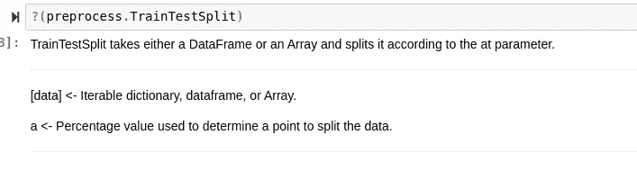

# 车床快速入门:面向对象建模语言

> 原文：<https://towardsdatascience.com/a-swift-introduction-to-lathe-oop-ml-for-julia-8208bcbb4fc8?source=collection_archive---------61----------------------->

## 车床机器学习库使用介绍。


(图片由作者提供)

# 介绍

在 Julia 生态系统中，有许多针对数据科学学科的包。有用于分布、推理和贝叶斯统计、数据可视化甚至深度学习的包。虽然这些包中的许多都是很棒的解决方案，并且分别工作得很好，但是还有一个更新的、更具包容性的解决方案，它在 Julia 语言中提供了类似 Sklearn 的语法，这通常有助于编写更多的函数代码。

车床。jl 是一个统计，预测建模，数据处理和深度学习库，所有这些都浓缩到一个单一的包中，您可以通过 Pkg 添加。与机器学习的其他 Julian 解决方案相比，Lathe.jl 的一个优势是，Lathe 利用 Julia 的调度类型来创建具有子调度方法的类型。这对于像模型这样的东西非常有用，在这种情况下，您可能希望有一个在拟合或预测之前执行一些逻辑的初始化函数。此外，使用包含在给定类型中的类型和数据的能力，而不是为了使用给定的方法而需要提供它们，对于机器学习来说也是非常有价值的。

> [笔记本](https://github.com/emmettgb/Emmetts-DS-NoteBooks/blob/master/Julia/Introduction%20To%20Lathe.ipynb)

# 入门指南

为了开始用车床处理算法，你首先需要安装它。虽然这很简单，但重要的是要确保你使用的是正确的分支和版本的车床。要添加最新版本的车床，可以这样做

```
using Pkg;Pkg.add("Lathe")
```

你体内的朱莉娅·REPL。


(图片由作者提供)

这将给你车床版本 0.1.1“黄油球。”只要您使用的是车床“Butterball”的版本，本教程应该适用于所有涉及的代码。如果您想先睹为快，也可以添加不稳定分支:

```
julia>]
pkg> add Lathe#Unstable
```

您还可以为 0.1.0 以上的每个特定版本添加分支:

```
add Lathe#Butterball
add Lathe#0.1.0
add Lathe#0.1.1
add Lathe#0.1.2
```

您还需要添加 DataFrames.jl。它不仅是这台车床唯一的依赖项，而且还与车床中的许多函数相关联，这些函数将采用数据帧类型。

```
add DataFrames
```

现在你应该可以导入车床了:

```
using Lathe
```

关于使用任何 Julia 包，我能给出的一些很好的建议是熟悉如何使用？()方法来浏览文档。大多数软件包使用 Documenter.jl 来创建它们的文档，这些文档通常是通过 Juliahub 生成的(这真的很酷)，所以经常会有一些文档，你可以很容易地在你的 REPL 或笔记本中访问它们。如果你想了解更多关于用 doc-strings 和 Documenter.jl 创建自动化文档的知识，我写了一个完整的教程，你可以在这里查看:

[](/how-to-automate-julia-documentation-with-documenter-jl-21a44d4a188f) [## 如何用 Documenter.jl 自动化 Julia 文档

### 没有文档，软件是没有用的，所以用 Documenter.jl 把文档的痛苦去掉吧

towardsdatascience.com](/how-to-automate-julia-documentation-with-documenter-jl-21a44d4a188f) 

每当我们运行我们的。()方法放在车床模块上，我们得到这样的回报:


(图片由作者提供)

让我们先来看看 Lathe.stats，它是 Lathe.jl 包含的统计库。我们将在下面的代码中直接使用它:

```
using Lathe: stats
```

现在我们将调用我们的？()方法在上面:


(图片由作者提供)

作为回报，我们得到了这个库中所有可用函数的详细列表。今天，我们将忽略统计库，直接进入预处理，但是如果您需要的话，统计数据总是存在的。

# 数据

为了开始使用车床，我们当然需要一些数据来支持它。用于基本示例的一个很好的格式是逗号分隔值，我们需要 CSV.jl 包来读取它。如果您的计算机上没有该包，您可以使用以下命令获取它:

```
pkg> add CSV
```

在本例中，我将使用一些汽车数据训练一个模型，这些数据包含欧洲汽车的信息，如里程、价格和转售价值。

```
using CSV
df = CSV.read("car data.csv")
```

该数据有两个可能相关联的特征，并且用线性回归来探索是有趣的，那就是汽车的销售价格和它的制造年份。让我们从删除所有我们不需要的特性开始。为此，我们可以创建一个全新的数据框，或者删除我们不需要的要素。我更喜欢后者。

```
using DataFrames
df = DataFrame(:Year => df[:Year], :Price => df[:Selling_Price])
```

为了检查缺少的值，我们将运行一个快速 for 循环来检查值是否缺少:

```
for year in df[:Year]
    if year == Missing
        println("missing")
    end
end
for price in df[:Price]
    if price == Missing
        println("missing")
    end
end
```

幸运的是，这个数据没有值，所以我们将继续把数据分成测试和训练集。为此，我们将使用车床:


(图片由作者提供)

我们正在寻找的方法是 TrainTestSplit()。要找到关于函数的更多信息，我们可以使用？()方法上也是如此:



(图片由作者提供)

这不是最好的文档，但是它确实给了我们一个概念，我们需要为这个函数提供什么参数。有趣的是，这个函数使用 Julia 的 dispatch，所以我们也可以直接调用 dispatch 函数，就像这样:

```
train, test = preprocess._dfTrainTestSplit(df, .75)
```


(图片由作者提供)

现在，我们将把它放入新的数组中，用于训练值和测试值:

```
trainX = train[:Price]
trainY = train[:Year]
testX = test[:Price]
testY = test[:Year]
```

# 建模

最后，我们可以从 Lathe.models 获取 LinearRegression。如果您使用的是更新版本的 Lathe，您可能需要调用 SimpleLinearRegression。

```
?(models.LinearRegression)
```


(图片由作者提供)

如您所见，我们需要为 y 和 x 提供一个一维数组，并将调用 predict 函数来返回一个预测值。我们可以像在 Julia 甚至 Python 中创建类型一样拟合模型:

```
model = models.LinearRegression(trainX, trainY)
```

现在我们可以在没有测试数据的情况下调用这个模型。

```
yhat = model.predict(testX)
```


(图片由作者提供)

因为年份是整数，所以我将遍历这些值，并将它们四舍五入为最接近的整数:

```
yhat = [year = Int64(round(year)) for year in yhat]
```


(图片由作者提供)

> 注意:
> 
> 如果您使用的是车床 1.2 +，那么在直接调用模块时，您将能够调用所有函数作为导出。或者，您可以调用作为由车床导出的模块的子模块的函数。

为了验证我们的模型，我们可以使用来自 Lathe.stats 的平均绝对误差指标:

```
using Lathe.stats: mae
println(mae(yhat, testY))
```

我认为这是非常准确的！如果我们真的需要，我们也可以使用来自 Lathe.preprocess 的规格化器。对于这个例子，我打算迭代最小可行产品，但是 MAE 为 0 意味着模型在这个测试中是完美的，所以我真的没有任何改进可以做，除非我着手建立一个验证集并进一步提高模型的准确性——并冒过度拟合的风险。

# 结论

车床是一个伟大的上升和未来的工具，我非常兴奋。虽然肯定还有很多工作要做，但我认为它对 Julia 语言的影响是相当大的。有了类似 Sklearn 的语法，以及非常容易理解的函数和类型，我认为它可以为许多 Python 用户搭建一座桥梁，这些用户不太习惯于将参数放入一个结构并将它们作为参数传递，以使方法适合模型类型和数据。