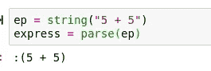
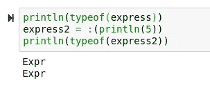
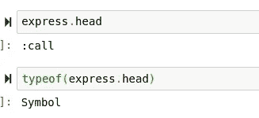
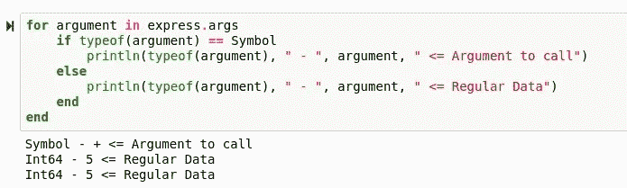
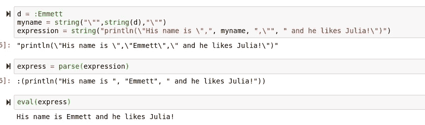

# Julia 中元编程的快速介绍

> 原文：<https://towardsdatascience.com/a-swift-introduction-to-metaprogramming-in-julia-5eef529f5a8a?source=collection_archive---------68----------------------->

## 在 Julia 中使用 Julia 的元包进行编程的基础。


(茱莉亚 logo src = http://julialang.org)

> [笔记本](https://github.com/emmettgb/Emmetts-DS-NoteBooks/blob/master/Julia/intro%20to%20Julian%20meta.ipynb)

# 介绍

Julia 语言因其许多相对有用的特性而备受推崇。然而，我认为在 Julia 语言中经常被忽略的一个特性是 Julia 的元编程能力。元编程是一种编程方式，其中一个程序使用另一个程序作为其数据。当我说程序时，我指的是可以在该语言中运行的任何可执行代码，而不是单独的语言或应用程序。

元编程非常有用。有些事情你可以用代码作为数据来做，而这些事情在编程语言中是无法做到的。我想从我的文件夹中给大家带来一个很好的例子是 Hone.jl. Hone.jl 使用元标记，这些元标记只是包含代码的字符串，可以随后连接和修改这些字符串以形成图和绘图。如果不使用这些元标记，有些事情是不可能实现的，那就是扩展 Hone 的能力。如果你想了解更多关于如何编写 Hone 扩展的知识，你可以看看这篇文章:

[](/how-i-programmed-the-first-hone-extension-in-julia-edf7813d0e1b) [## 我是如何在 Julia 中编写第一个 Hone 扩展的

### 在 Julia 中创建和使用我的绘图库的扩展。

towardsdatascience.com](/how-i-programmed-the-first-hone-extension-in-julia-edf7813d0e1b) 

幸运的是，Julia 中的元编程很容易上手。朱莉娅的元是很容易掌握和学习的东西之一，但要掌握起来要困难得多。使用元编程的一个很大的缺点是，它会使调试变得特别困难，因为您的代码都包含在表达式中，一个小错误，比如省略一个逗号，就会使您的代码无法运行。这是因为在线上读取错误返回比解析错误要容易得多。

# 表达式类型

为了在 Julia 中有效地进行元编程，你需要很快习惯的一件事是一种新的类型。让我给你介绍一下:

> :Expr

表达式类型是一种旨在存储可评估的已解析元代码的类型。为了进行基本的字符串到表达式的转换，您需要熟悉 Base.Meta 中的 parse()方法。

```
using Base.Meta: parse
```

让我们试着在一个字符串上使用它:



请注意，我们的输出现在变成了一个符号。这个符号在某种程度上可以被看作是我之前谈到的应用程序。这是一个运行该符号内部代码的表达式。或者，我们也可以创建一个我们自己的符号来执行这个运算。



正如您所看到的，这两个都是表达式，一个是解析的，另一个是使用内部带有语法的符号创建的。这实际上是存储在符号数据类型中的代码。

## 表达式的属性

Expr 类型实际上有一些您可能没有想到的有趣属性。真正酷的是，它们允许我们剖析数据/代码的内容，并对它们有更多的了解。我想给你看的第一个财产是人头。Expr 类型包含两种主要的数据类型，头数据和参数数据。head 用于界定要传递的是哪种表达式。在这个例子以及大多数例子中，我们使用:call 类型。这不是一个实际的数据类型，只是一个存储在 Expr 结构中的符号。



接下来我们有参数。Args 是我们的数据包含的所有参数。这些争论可以分为两类。他们要么是

> 操作

其中包括方法和操作数。这些将用符号数据类型来表示。事实上，这些是你的元表达式的元部分。然而，如果没有数据，这些操作是没有用的，所以除了操作之外，我们还有

> 数据。

我们可以通过打印所有参数的类型来可视化这一点。



这基本上就是解析器为我们做的事情。解析器将需要执行的功能和数据相互分离。之后，它会把所有东西按正确的顺序排列，这样它就可以被正确地评估。另一件应该提到的事情是从字符串类型到表达式类型的转换。

# 解析和评估

既然我们理解了 parse()的作用，以及它如何将字符串转换成表达式类型，我们现在可以开始创建一些表达式，然后用 eval()对其求值:

```
data_code = "mean([5,10,15,20])"
expression = parse(data_code)
mu = eval(expression)
```

这是相对基本的，但也有一些事情你应该注意。首先，如果你所有的数据都在一个字符串中，你如何使用字符串数据类型？不幸的是，在 Julia 中没有办法像在 Python 中那样在字符串内部分隔字符串，所以我们需要使用正则表达式。仔细想想，正则表达式本身也是元程序；所以我们真的是在兜圈子。在 Julia 中获取字符串而无需创建字符串的最简单方法是使用一个符号:

```
symb = :hello_world
a_string = string("\"",string(symb),"\"")
```

正则表达式\ "用于在字符串中分隔引号。



> 这真的就是全部了！

元编程是一个强大的工具，我相信有时会被忽略。我认为茱莉亚的处理方式是最完美的处理方式。虽然它肯定不是这门语言的重点，但是它的实现非常好，使用起来也非常简单。Julia 有很强的元编程能力，我已经享受了很长时间了！