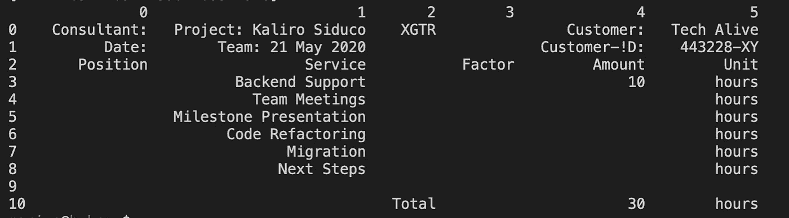

# 一种表格检测、单元格识别和文本提取算法，用于将图像中的表格转换为 excel 文件

> 原文：<https://towardsdatascience.com/a-table-detection-cell-recognition-and-text-extraction-algorithm-to-convert-tables-to-excel-files-902edcf289ec?source=collection_archive---------0----------------------->

## 如何使用 OpenCV 和 pytesseract 将表格截图转换成可编辑的数据


来源:pixabay

假设您在文章、pdf 或图像中有一个表格，并希望将其转换为 excel 表格或数据框架，以便能够对其进行编辑。特别是在机器学习的预处理领域，这种算法将非常有助于将许多图像和表格转换为可编辑的数据。如果您的数据存在于**基于文本的 pdf 文件**中，已经有一些免费的解决方案。最受欢迎的是*表格式，卡梅洛特/神剑*，你可以在[https://tabula.technology/](https://tabula.technology)，[https://camelot-py.readthedocs.io/en/master/](https://camelot-py.readthedocs.io/en/master/)，[https://excalibur-py.readthedocs.io/en/master/](https://excalibur-py.readthedocs.io/en/master/)下找到。

但是，如果您的 PDF 是基于图像的，或者您在网上找到一篇带有表格的文章，该怎么办？为什么不直接截图转换成 excel 表呢？因为基于图像的数据(jpg、png、基于图像的 pdf 等)似乎没有免费或开源软件。)的想法是开发一个通用的解决方案，将表格转换成可编辑的 excel 文件。

但是现在已经足够了，让我们看看它是如何工作的。

# 入门指南

**该算法由三部分组成:**第一部分是使用*打开 CV* 的表格检测和单元格识别，第二部分是将单元格彻底分配到适当的行和列，第三部分是使用 *pytesseract* 通过光学字符识别(OCR)提取每个分配的单元格。

和大多数表格识别算法一样，这种算法是基于表格的行结构的。清晰和可检测的线条对于正确识别细胞是必要的。具有虚线、间隙和孔洞的表格导致较差的识别，并且没有检测到仅部分被线包围的单元。如果您的某些文档出现断行，请务必阅读本文并修复断行:[单击此处](https://link.medium.com/JuV77oma08)。

首先，我们需要输入数据，在我的例子中是 png 格式的截图。目标是拥有一个具有相同表格结构的数据框架和 excel 文件，其中每个单元格都可以编辑并用于进一步分析。


用于进一步表格识别和提取的输入数据。

让我们导入必要的库。

关于图书馆的更多信息:
cv2—[https://opencv.org/](https://opencv.org/)宇宙魔方—[https://pypi.org/project/pytesseract/](https://pypi.org/project/pytesseract/)

```
**import** cv2
**import** numpy as np
**import** pandas as pd
**import** matplotlib.pyplot as plt
**import** csvtry:
    **from** PIL **import** Image
except ImportError:
    **import** Image
**import** pytesseract
```

第一步是从正确的路径读入文件，使用阈值将输入图像转换为二进制图像，并将其反转以获得黑色背景、白色线条和字体。

```
**#read your file** file=r'/Users/YOURPATH/testcv.png'
img = cv2.imread(file,0)
img.shape**#thresholding the image to a binary image** thresh,img_bin = cv2.threshold(img,128,255,cv2.THRESH_BINARY |cv2.THRESH_OTSU)**#inverting the image** img_bin = 255-img_bin
cv2.imwrite('/Users/YOURPATH/cv_inverted.png',img_bin)**#Plotting the image to see the output**
plotting = plt.imshow(img_bin,cmap='gray')
plt.show()
```


二进制反转图像。

[](https://medium.com/subscribe/@hucker.marius) [## 请继续关注马里乌斯·哈克的新文章

### 请继续关注 Marius Hucker 的新文章。如果您还没有注册，您将创建一个中型帐户…

medium.com](https://medium.com/subscribe/@hucker.marius) 

下一步是定义一个内核来检测矩形框，然后是表格结构。首先，我们定义核的长度，然后沿着垂直和水平核检测所有的垂直线和水平线。

```
**# Length(width) of kernel as 100th of total width**
kernel_len = np.array(img).shape[1]//100**# Defining a vertical kernel to detect all vertical lines of image** ver_kernel = cv2.getStructuringElement(cv2.MORPH_RECT, (1, kernel_len))**# Defining a horizontal kernel to detect all horizontal lines of image** hor_kernel = cv2.getStructuringElement(cv2.MORPH_RECT, (kernel_len, 1))**# A kernel of 2x2** kernel = cv2.getStructuringElement(cv2.MORPH_RECT, (2, 2))
```

下一步是垂直线的检测。

```
**#Use vertical kernel to detect and save the vertical lines in a jpg**
image_1 = cv2.erode(img_bin, ver_kernel, iterations=3)
vertical_lines = cv2.dilate(image_1, ver_kernel, iterations=3)
cv2.imwrite("/Users/YOURPATH/vertical.jpg",vertical_lines)**#Plot the generated image**
plotting = plt.imshow(image_1,cmap='gray')
plt.show()
```


提取的垂直线。

现在所有的水平线都一样。

```
**#Use horizontal kernel to detect and save the horizontal lines in a jpg**
image_2 = cv2.erode(img_bin, hor_kernel, iterations=3)
horizontal_lines = cv2.dilate(image_2, hor_kernel, iterations=3)
cv2.imwrite("/Users/YOURPATH/horizontal.jpg",horizontal_lines)**#Plot the generated image**
plotting = plt.imshow(image_2,cmap='gray')
plt.show()
```


提取的水平线。

我们通过用 0.5 对水平线和垂直线进行加权，将它们组合成第三幅图像。目的是得到一个清晰的表格结构来检测每个细胞。

```
**# Combine horizontal and vertical lines in a new third image, with both having same weight.** img_vh = cv2.addWeighted(vertical_lines, 0.5, horizontal_lines, 0.5, 0.0)**#Eroding and thesholding the image**
img_vh = cv2.erode(~img_vh, kernel, iterations=2)
thresh, img_vh = cv2.threshold(img_vh,128,255, cv2.THRESH_BINARY | cv2.THRESH_OTSU)
cv2.imwrite("/Users/YOURPATH/img_vh.jpg", img_vh)bitxor = cv2.bitwise_xor(img,img_vh)
bitnot = cv2.bitwise_not(bitxor)**#Plotting the generated image**
plotting = plt.imshow(bitnot,cmap='gray')
plt.show()
```


提取的不包含文本的表格结构。

有了表格结构后，我们使用 findContours 函数来检测轮廓。这有助于我们检索每个盒子的准确坐标。

```
**# Detect contours for following box detection** contours, hierarchy = cv2.findContours(img_vh, cv2.RETR_TREE, cv2.CHAIN_APPROX_SIMPLE)
```

以下函数是获取轮廓序列并从上到下对其进行排序所必需的([https://www . pyimagesearch . com/2015/04/20/sorting-contours-using-python-and-opencv/](https://www.pyimagesearch.com/2015/04/20/sorting-contours-using-python-and-opencv/))。

```
def sort_contours(cnts, method="left-to-right"): **# initialize the reverse flag and sort index** reverse = False
    i = 0 **# handle if we need to sort in reverse**
    if method == "right-to-left" or method == "bottom-to-top":
    reverse = True **# handle if we are sorting against the y-coordinate rather than
    # the x-coordinate of the bounding box** if method == "top-to-bottom" or method == "bottom-to-top":
    i = 1 **# construct the list of bounding boxes and sort them from top to
    # bottom** boundingBoxes = [cv2.boundingRect(c) for c in cnts]
    (cnts, boundingBoxes) = zip(*sorted(zip(cnts, boundingBoxes),
    key=lambda b:b[1][i], reverse=reverse)) **# return the list of sorted contours and bounding boxe**s
    return (cnts, boundingBoxes) **# Sort all the contours by top to bottom.** contours, boundingBoxes = sort_contours(contours, method=”top-to-bottom”)
```

# 如何检索单元格的位置

需要进一步的步骤来定义每个单元的正确位置，这意味着正确的列和行。首先，我们需要检索每个单元格的高度，并将其存储在列表 heights 中。然后我们从高处取平均值。

```
**#Creating a list of heights for all detected boxes**
heights = [boundingBoxes[i][3] for i in range(len(boundingBoxes))]**#Get mean of heights**
mean = np.mean(heights)
```

接下来，我们检索每个轮廓的位置、宽度和高度，并将其存储在盒子列表中。然后我们在所有的盒子周围画出矩形，并绘制图像。在我的例子中，我只对宽度小于 1000 像素、高度小于 500 像素的盒子这样做，以忽略可能没有单元格的矩形，例如整个表格。这两个值取决于你的图像大小，所以如果你的图像变小或变大，你需要调整两者。

```
**#Create list box to store all boxes in** 
box = []**# Get position (x,y), width and height for every contour and show the contour on image**
for c in contours:
    x, y, w, h = cv2.boundingRect(c) if (w<1000 and h<500):
        image = cv2.rectangle(img,(x,y),(x+w,y+h),(0,255,0),2)
        box.append([x,y,w,h])plotting = plt.imshow(image,cmap=’gray’)
plt.show()
```


由检测到的轮廓/方框包围的每个单元。

现在我们有了每个单元格，它的位置、高度和宽度，我们需要在表格中得到正确的位置。因此，我们需要知道它位于哪一行哪一列。只要一个盒子的差异不超过它自己的(高度+平均值/2 ),这个盒子就在同一行。一旦高度差高于当前值(高度+平均值/2)，我们就知道新的一行开始了。列在逻辑上从左到右排列。

```
**#Creating two lists to define row and column in which cell is located** row=[]
column=[]
j=0**#Sorting the boxes to their respective row and column**for i in range(len(box)): if(i==0):
        column.append(box[i])
        previous=box[i] else:
        if(box[i][1]<=previous[1]+mean/2):
            column.append(box[i])
            previous=box[i] if(i==len(box)-1):
                row.append(column) else:
            row.append(column)
            column=[]
            previous = box[i]
            column.append(box[i])print(column)
print(row)
```

接下来，我们计算最大列数(意味着单元格),以了解我们最终的数据框架/表格将有多少列。

```
**#calculating maximum number of cells**countcol = 0
for i in range(len(row)):
    countcol = len(row[i])
    if countcol > countcol:
        countcol = countcol
```

拥有最大数量的单元格后，我们将每列的中点存储在一个列表中，创建一个数组并对值进行排序。

```
**#Retrieving the center of each column**center = [int(row[i][j][0]+row[i][j][2]/2) for j in range(len(row[i])) if row[0]]center=np.array(center)
center.sort()
```

此时，我们有了所有的框和它们的值，但是正如您可能在您的行列表的输出中看到的，这些值并不总是按照正确的顺序排序。这就是我们下一步要做的，关于到列中心的距离。我们存储在列表最终框中的正确顺序。

```
**#Regarding the distance to the columns center, the boxes are arranged in respective order**finalboxes = []for i in range(len(row)):
    lis=[]
    for k in range(countcol):
        lis.append([])
    for j in range(len(row[i])):
        diff = abs(center-(row[i][j][0]+row[i][j][2]/4))
        minimum = min(diff)
        indexing = list(diff).index(minimum)
        lis[indexing].append(row[i][j])
    finalboxes.append(lis)
```

# 让我们提取值

在下一步中，我们将使用我们的列表终结框。我们取每一个基于图像的盒子，通过扩张和腐蚀来为光学字符识别做准备，并让 pytesseract 识别包含的字符串。循环遍历每个单元格，并将值存储在外部列表中。

```
**#from every single image-based cell/box the strings are extracted via pytesseract and stored in a list**outer=[]
for i in range(len(finalboxes)):
    for j in range(len(finalboxes[i])):
        inner=’’
        if(len(finalboxes[i][j])==0):
            outer.append(' ') else:
            for k in range(len(finalboxes[i][j])):
                y,x,w,h = finalboxes[i][j][k][0],finalboxes[i][j][k][1], finalboxes[i][j][k][2],finalboxes[i][j][k][3]
                finalimg = bitnot[x:x+h, y:y+w]
                kernel = cv2.getStructuringElement(cv2.MORPH_RECT, (2, 1))
                border = cv2.copyMakeBorder(finalimg,2,2,2,2,   cv2.BORDER_CONSTANT,value=[255,255])
                resizing = cv2.resize(border, None, fx=2, fy=2, interpolation=cv2.INTER_CUBIC)
                dilation = cv2.dilate(resizing, kernel,iterations=1)
                erosion = cv2.erode(dilation, kernel,iterations=1)

                out = pytesseract.image_to_string(erosion)
                if(len(out)==0):
                    out = pytesseract.image_to_string(erosion, config='--psm 3')
                inner = inner +" "+ out outer.append(inner)
```

最后一步是将列表转换成数据帧，并将其存储到 excel 文件中。

```
**#Creating a dataframe of the generated OCR list** arr = np.array(outer)
dataframe = pd.DataFrame(arr.reshape(len(row),countcol))
print(dataframe)
data = dataframe.style.set_properties(align="left")**#Converting it in a excel-file** data.to_excel(“/Users/YOURPATH/output.xlsx”)
```



终端中的最终数据帧。


包含所有单元格的最终 excel 文件。

**就是这样！**您的表格现在应该存储在数据帧和 excel 文件中，可用于自然语言处理、通过统计进行进一步分析或仅用于编辑。这适用于结构清晰简单的表格。如果你的表格有一个非常特殊的结构，在某种意义上说，许多单元格被组合在一起，单元格的大小变化很大，或者使用了许多颜色，那么这个算法可能必须被采用。此外，OCR 在识别计算机字体方面近乎完美。但是，如果您有包含手写输入的表格，结果可能会有所不同。

如果你把它用在你自己的桌子上，让我知道它是如何工作的。

[](https://medium.com/subscribe/@hucker.marius) [## 请继续关注马里乌斯·哈克的新文章

### 请继续关注 Marius Hucker 的新文章。如果您还没有注册，您将创建一个中型帐户…

medium.com](https://medium.com/subscribe/@hucker.marius) 

# 你喜欢这个故事？

## [支持我和我在这里的工作](https://medium.com/@hucker.marius/membership)

***亦读:***

[如何修复表格识别中的断线](/how-to-recognize-and-fix-broken-lines-in-table-recognition-1a19f22d59f2)