# 一个关于巨人、机器学习药丸和汽车工业的故事

> 原文：<https://towardsdatascience.com/a-tale-about-a-giant-a-machine-learning-pill-and-the-automotive-industry-7c74b2bcb09c?source=collection_archive---------23----------------------->

## [汽车中的人工智能](https://towardsdatascience.com/tagged/ai-in-automotive)

## 关于人工智能对世界上最重要的行业之一的影响的童话三部曲的第二个故事。

从前，有一个巨人。一个巨大而强大的巨人，每个人都知道这个巨人。人们为巨人工作，为自己和他人创造巨大的财富。然后，巨人从一个友好的仙女那里收到了一颗神奇的机器学习药丸，承诺让巨人变得更加强大。

[来源](https://wallpaperaccess.com/vintage-sci-fi-robot)

这是这个关于机器学习对汽车行业影响的三部曲的第二部。为了更好地说明在老牌汽车制造商中使用机器学习的复杂性和挑战，这个关于巨人和神奇药丸的故事补充了主要观点。这些见解基于我在汽车行业的工作经验以及与来自世界各地的汽车专家的长期对话。三部曲分为以下几个部分:[重要性](/a-tale-about-a-giant-a-machine-learning-pill-and-the-automotive-industry-part-i-299a9ad5653f)(一)、汽车行业在实现机器学习这一超越性技术方面的机遇(二)、挑战(三)。

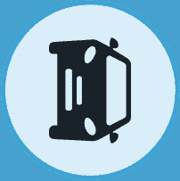

第二部分详细阐述了机器学习药丸可以给巨人带来的机会。它承诺让这个巨人变得更大更强大。让我们看看怎么做。

# 自动驾驶

今天，汽车由人类驾驶，从一个地方到达另一个地方。机器学习是一项关键技术，可以让人们或货物自动驾驶到目标目的地。这就是所谓的自动驾驶(AD)。

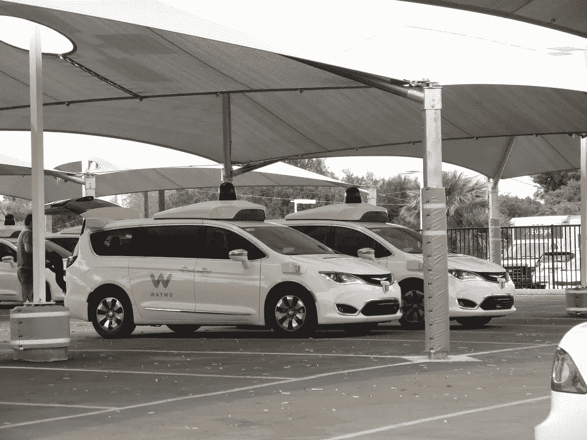

[来源](https://www.flickr.com/photos/zombieite/41307386844)

AD 允许创建多种应用程序。机器人轴立即浮现在脑海中，它在城市环境中运送人们。[谷歌子公司 Waymo](https://waymo.com/) 被视为未来城市交通的领跑者。2019 年，该公司开始在亚利桑那州凤凰城测试其自动驾驶出租车服务，车辆中没有[安全驾驶员](https://waymo.com/journey/)。

然而，AD 要大得多，不仅允许人类自主地从 A 地运输到 B 地，还允许货物运输。[汽车制造商大众](https://www.volkswagen.com/)承认，物流行业对自动驾驶的需求最为迫切。因此，它将[大众汽车自主有限公司](https://www.ft.com/content/f646649a-f8d0-11e9-a354-36acbbb0d9b6)从其商用车子公司中剥离出来。在物流业务中，三个主要的成本构成是车辆价格、汽油和工资。降低薪资成本最能提高物流行业的盈利能力。

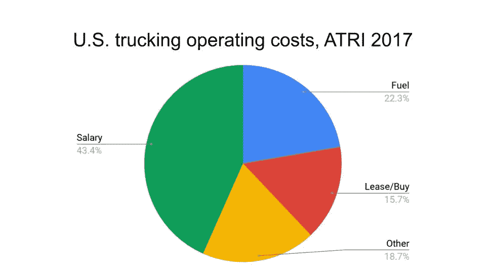

[来源](http://truckingresearch.org/wp-content/uploads/2018/10/ATRI-Operational-Costs-of-Trucking-2018.pdf)

AD 技术还支持其他用例，如[斯堪尼亚的](https://www.scania.com/group/en/section/about-scania/) [自主运输设备](https://www.scania.com/group/en/autonomous-transport-solutions/)、[采矿卡车](https://www.scania.com/group/en/a-new-cabless-concept-revealing-scania-axl/)、[拖拉机](https://www.asirobots.com/farming/)或任何其他工作车辆。重型设备制造商 John Deere 已经研发半自动拖拉机 20 年了。在一些农田需要一整天犁一条线的地方，自动拖拉机有望带来巨大的好处。

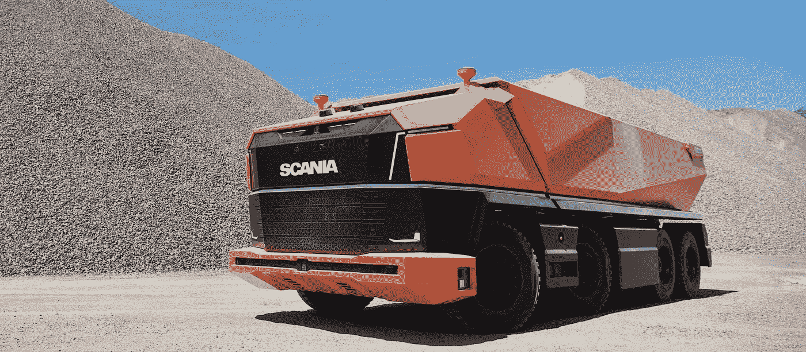

[斯堪尼亚自主采矿卡车概念](https://www.scania.com/group/en/a-new-cabless-concept-revealing-scania-axl/)

自动驾驶车辆承诺打破车辆的神奇产品三角。产品三角形表明，你应该致力于在短时间内，以高质量和低成本创造任何产品。你可以沿着神奇的产品三角排列任何产品。当今汽车的产品三角如下。

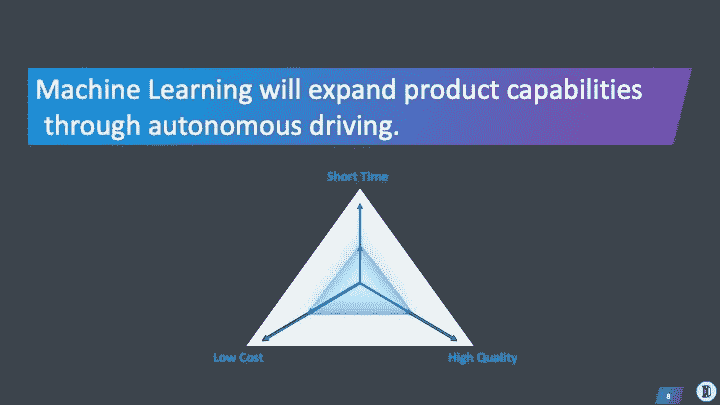

汽车可以在短时间内把人或货物从 A 地送到 B 地，成本低，质量合理。AD 提供了将每种产品的能力扩展到可以想象的最大限度的机会。

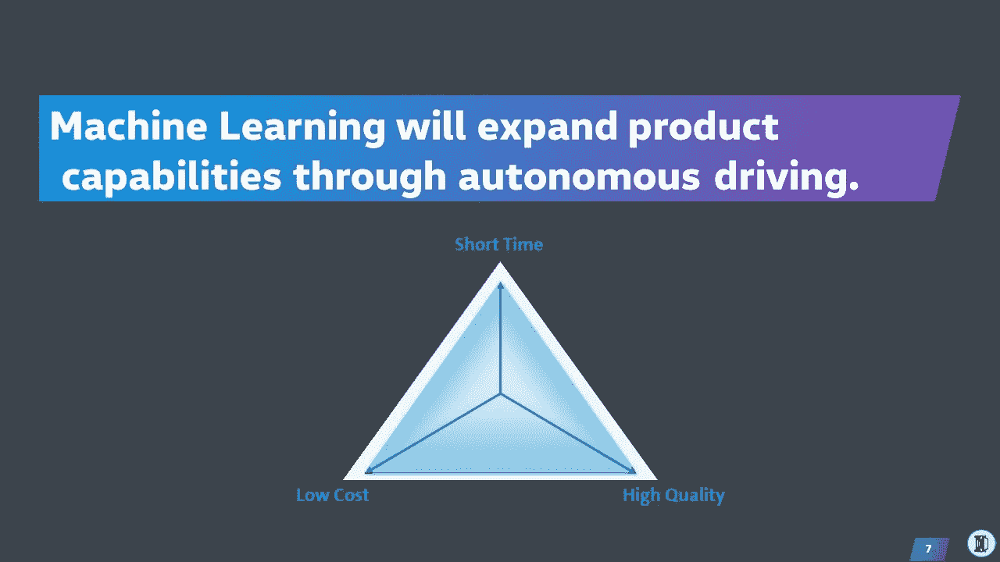

打车公司优步估计，无人驾驶汽车可以将每英里费用从 T2 的 2.86 美元降低到仅 0.35 美元。这种几乎 90%的成本降低提高了产品三角的成本能力。AD 通过让司机有时间在车内阅读、睡觉或工作，潜在地提高了乘坐的质量。当卡车可以自主移动时，卡车司机所需的休息时间也可以减少到最低限度。AD 扩展了移动车辆的所有产品功能，从而为客户满意度和公司发展提供了巨大的机会。

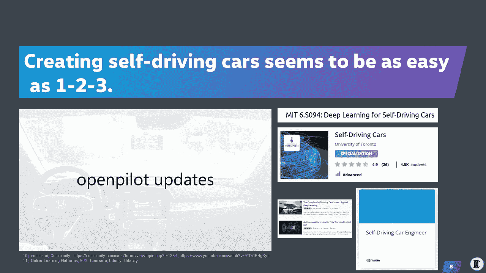

鉴于人们对广告的极度兴奋，消费者期待着无人驾驶汽车的到来。主要汽车制造商宣布了自主打车服务的雄心勃勃的开始日期，从而加剧了这种兴奋。[电动汽车制造商特斯拉](https://www.tesla.com/)宣布其计划在 2019 年年底[推出自动驾驶班车服务。这一切似乎都很容易，到处都有关于自动驾驶汽车的精彩玩具视频。此外，在线学习平台](https://fortune.com/2019/11/20/tesla-full-self-driving-car-tsla-stock/) [Udacity](https://www.udacity.com/) 从 2011 年开始提供[自动驾驶汽车工程师纳米学位](https://www.udacity.com/course/self-driving-car-engineer-nanodegree--nd013)。创业公司如此接近解决 AD 的故事比比皆是，就像下面这个。

> 谷歌正在研究自动驾驶汽车，他们似乎也在努力。人们在驾驶汽车方面如此糟糕，以至于计算机不必那么好就能好得多。— [马克·安德森](https://twitter.com/pmarca?lang=de)，风险投资家于 [a16z](https://a16z.com/) ， [NYT 2011](https://www.nytimes.com/2011/07/10/magazine/marc-andreessen-on-the-dot-com-bubble.html)

[硅谷著名企业家、](https://www.linkedin.com/in/george-hotz-b3866476/) [comma ai](https://medium.com/u/330bac69b283?source=post_page-----7c74b2bcb09c--------------------------------) 创始人乔治·霍兹，在 2016 年底差点提供自动驾驶功能。乔治入侵了一辆 Acure 汽车，给它配备了一部智能手机，让它的摄像头透过挡风玻璃对准前方的道路。然后他突然打方向盘、加速和刹车信号来操纵汽车。点击此处查看[open pilot 发布视频。Comma.ai 开始以 999 美元的价格出售广告硬件，外加每月订阅费。在第三部分，你会听到这个故事是如何展开的。](https://www.youtube.com/watch?v=9TDi0BHgXyo&t=12s)

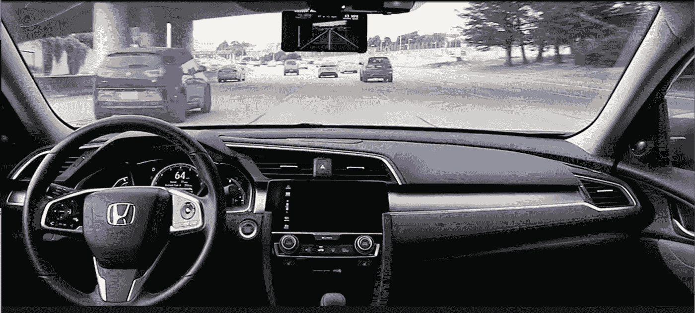

[来源](https://www.facebook.com/commadotai/)

不管这些雄心勃勃的声明，许多汽车制造商已经推迟了将广告投放市场的时间表。机器学习是帮助这家巨头创造变革性新产品的关键促成因素。让我们调查一下机器学习药丸如何帮助这个巨人带来另一个基石产品。

# 个人助理

让我们假设有一天自动驾驶能力无处不在。那么是什么将一辆车与另一辆区分开来呢？越来越多的关注将转向室内用户体验。

如今，汽车驾驶舱是手动操作的。按钮和旋钮让驾驶员无法选择操纵汽车设置。想提高汽车温度？打开空调，向右转动两个轮子以提高目标温度，并增大风扇。四个步骤，为了一个目的。机器学习使汽车能够预测用户需求，并立即满足基于语音的请求。

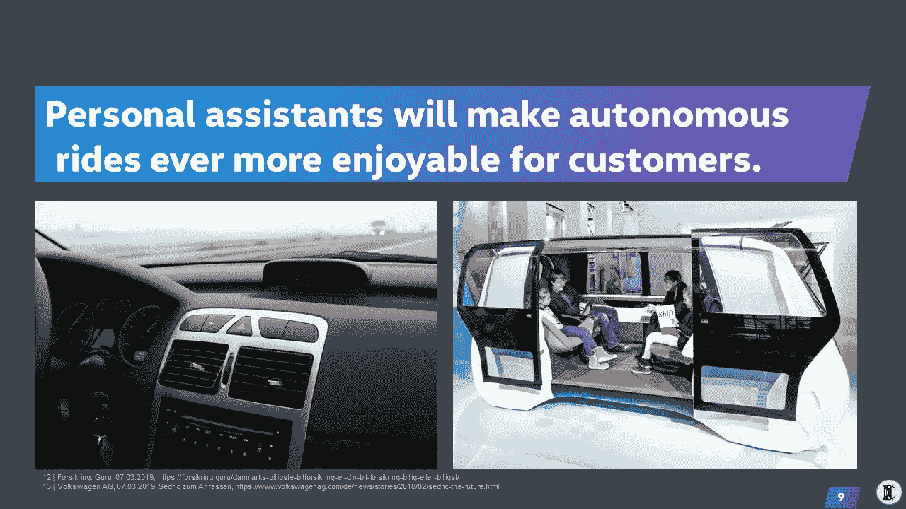

机器学习是实现汽车个人助理的关键技术。这个助手可以学习司机喜欢的温度，并自动调整汽车的设置。用户通过语音与汽车互动，省略了按钮和旋钮。

据 Samsung Next 报道，风险投资者对投资平台感兴趣。正如[、](https://www.linkedin.com/in/sarahxguo/) [Greylock Partners](https://www.greylock.com/) 的风险投资人 Sarah Guo 在 2018 人工智能前沿大会[期间提到的，互联网平台催生了谷歌或脸书这样的独角兽。移动作为下一个平台推动了像 Lyft 或 AirBnB 这样的公司达到独角兽的估值。自动驾驶汽车会成为下一个平台，推动独角兽游戏、娱乐或 VR/AR 初创企业的崛起吗？](https://aifrontiers.com/schedule/)

机器学习为汽车公司提供了巨大的新产品机会。个人助理和自动驾驶只是机器学习使之成为可能的少数面向客户的应用。在智能生产、RPA 和营销领域存在更多机会。

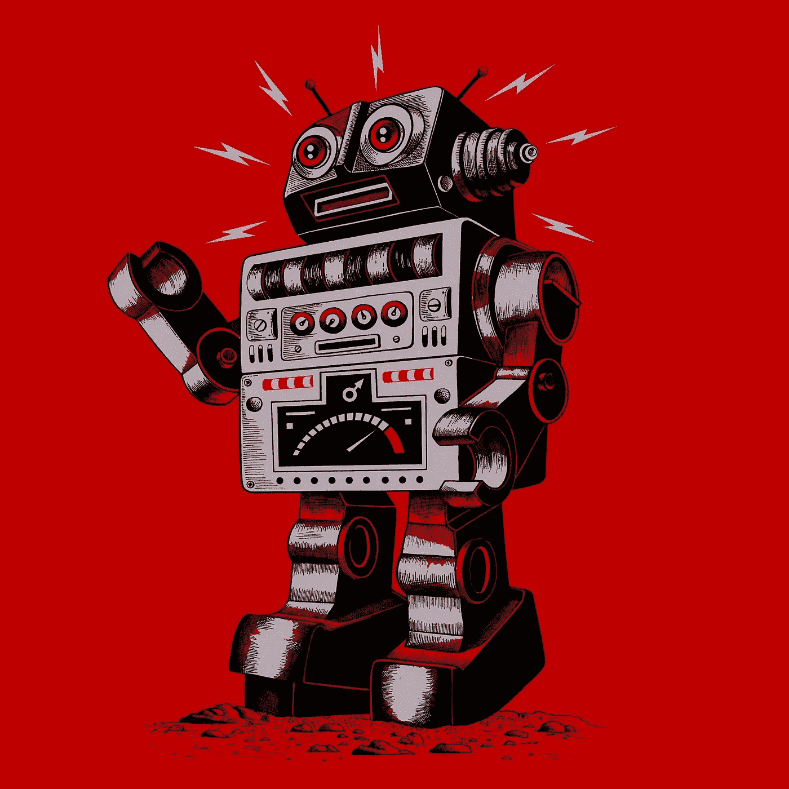

回到故事。现在，这位巨人明白了这种神奇的机器学习药丸是如何让它变得更大更强的。但是巨人仍然在思考经历这些成长的烦恼是否值得。毕竟，它是世界上最强大的巨人之一，不怕任何人。然后，在远处的地平线上，巨人发现了一个小巨人。走近小巨人，巨人意识到它一直在享用机器学习药丸。小巨人还不会走路，但很明显，一旦它长到最大力气，它就能轻而易举地打败巨人。接下来我们来检查一下小巨人。

# 竞争对手

以下两张图表值得你高度关注。下图显示了六家移动公司的公司估值。Waymo 目前的估值最高，为[1050 亿美元](https://www.cnbc.com/2019/09/27/waymo-valuation-cut-40percent-by-morgan-stanley-to-105-billion.html)。特斯拉的股票一直不稳定，仅在过去的两个月里，公司价值在 2020 年 1 月就翻了一番，达到约 810 亿美元。像 Waymo、优步或特斯拉这样的公司代表了这个小巨人。这个巨人的代表是大众、宝马或戴姆勒这样的汽车巨头。

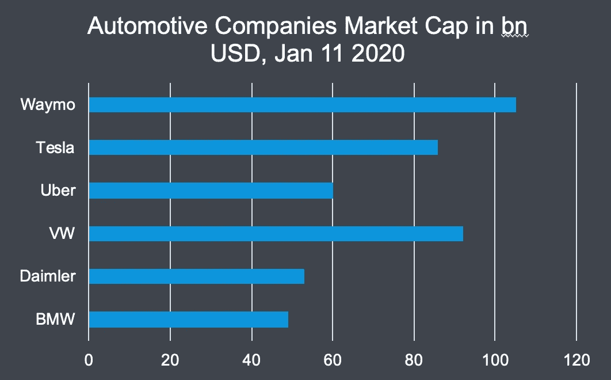

Waymo 的估值超过了所有其他公司的估值。在获得一美元收入之前，它的价值已经高于宝马和戴姆勒的总和。 [Waymo 的技术](https://www.theverge.com/2018/5/9/17307156/google-waymo-driverless-cars-deep-learning-neural-net-interview)非常依赖机器学习来创造世界上最安全的司机。优步和泰斯拉的估值也受到他们努力将广告变成现实的推动。优步创始人特拉维斯·卡兰尼克称自动驾驶汽车是优步未来最重要的技术。[特斯拉著名的自动驾驶功能](https://electrek.co/2019/11/11/tesla-train-neural-networks-self-driving-video/)完全依靠机器学习来检测物体，并使汽车保持在车道上。

相比之下，下图显示了每家公司达到预期估值所需的员工数量。2018 年，Waymo 勉强跨过了 1000 名员工的大关。另一个极端是，大众汽车目前在全球雇佣了超过 66 万名员工。你可以看到这个小巨人比巨人需要更少的员工来创造惊人的市场估值。

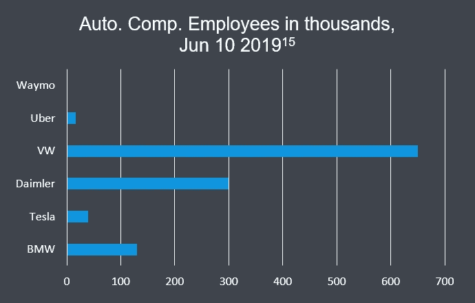

现在，让我们不要不公平。汽车制造商今天生产有形的价值。他们每年销售数千万辆汽车。如果自动驾驶汽车技术没有得到验证，投资者将会损失很多钱，但也仅此而已。但是如果它被证实了呢？

又怕又急，巨人吞下了苦涩的机器学习药丸。

# 结局(二)

这篇文章展示了通过机器学习药丸可以实现的变革机会。虽然巨人仍然对服用这种药丸犹豫不决，但其他一直在享用这些机器学习药丸的小巨人看到他们的力量爆炸了。

接下来会发生什么，当巨人吞下药丸，对它的身体造成严重压力？继续在这里(即将于 1 月 19 日)阅读在这个成熟的行业中实现机器学习的挑战和副作用。重读三部曲开篇[这里](/a-tale-about-a-giant-a-machine-learning-pill-and-the-automotive-industry-part-i-299a9ad5653f)。

这个故事是在[数据节 2019](https://www.datafestival.de/en/) 上呈现的。点击此处查看本次[演讲的视频。如果你想听更多关于商业、项目管理和数据科学的交集，**在**](https://youtu.be/kwcnHFPjGo0) **[Medium](https://medium.com/@janzawadzki) 、 [LinkedIn](https://www.linkedin.com/in/jan-zawadzki/) 或 [Twitter](https://twitter.com/janmzawa) 上关注** me。