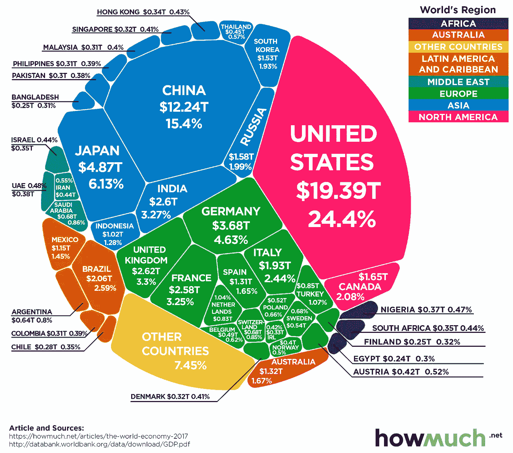
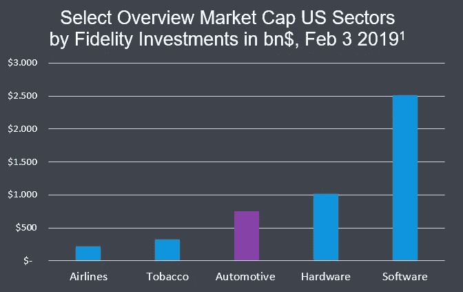
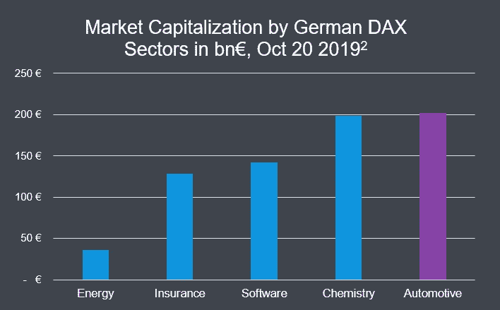
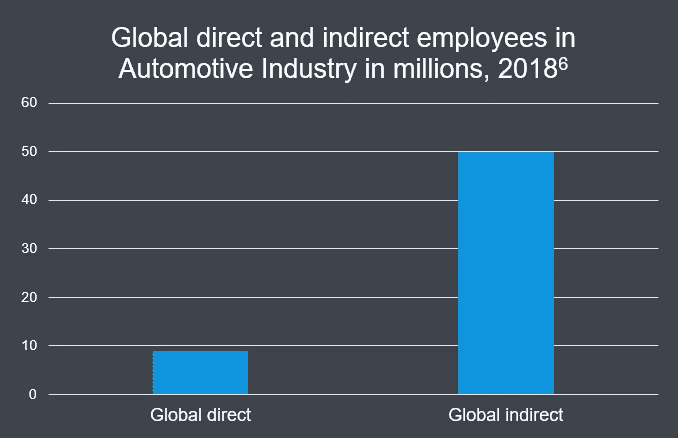
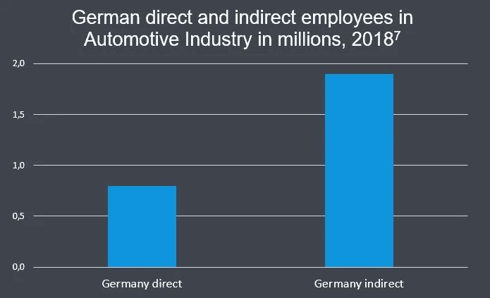
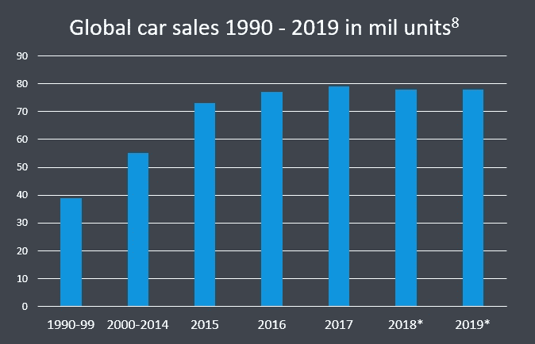
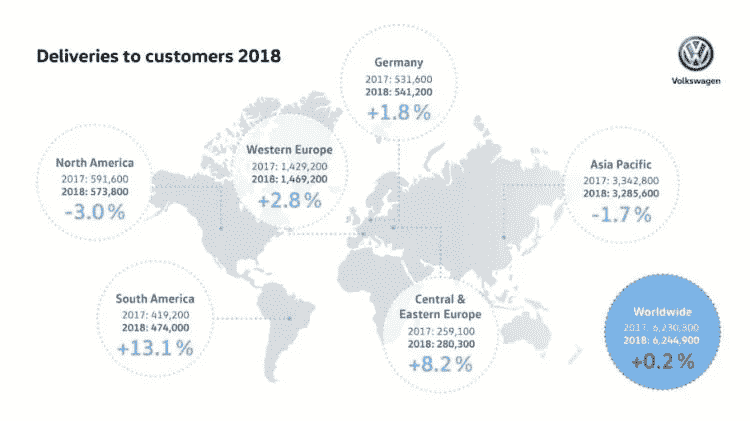
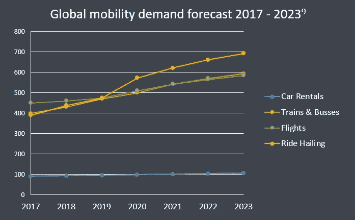

# 一个关于巨人、机器学习药丸和汽车工业的故事

> 原文：<https://towardsdatascience.com/a-tale-about-a-giant-a-machine-learning-pill-and-the-automotive-industry-part-i-299a9ad5653f?source=collection_archive---------35----------------------->

## [汽车中的人工智能](https://towardsdatascience.com/tagged/ai-in-automotive)

## 打开童话三部曲，讲述人工智能对世界上最重要的行业之一的影响。

从前，有一个巨人。一个巨大而强大的巨人，每个人都知道这个巨人。它有一种相当特殊的气味，对环境有害，但那是另一回事了。世界各地的人们热爱这个巨人，顺从地为它工作。

[来源](https://wallpaperaccess.com/vintage-sci-fi-robot)

一天，一个仙女飞向巨人。仙女给了巨人一颗药丸，并说:“这颗机器学习药丸是来自一个很远很远的地方的强大魔术师创造的。它会给你巨大的力量，但是要小心，它也会给你带来严重的痛苦。".

图片由 [Pixabay](https://pixabay.com/?utm_source=link-attribution&utm_medium=referral&utm_campaign=image&utm_content=1618242) 上的 [Oberholster Venita](https://pixabay.com/users/artsybee-462611/?utm_source=link-attribution&utm_medium=referral&utm_campaign=image&utm_content=1618242) 拍摄

这是这个关于机器学习对汽车行业影响的三部曲的第一部。为了更好地说明在老牌汽车制造商中使用机器学习的复杂性和挑战，这个关于巨人和神奇药丸的故事补充了主要观点。这些见解基于我在汽车行业的工作经验以及与来自世界各地的汽车专家的长期对话。该三部曲分为以下几个部分:汽车行业在实施机器学习的卓越技术方面的重要性(I)、机遇(II)和挑战(III)。

让我们在第一部分集中讨论为什么这个童话的主角是一个巨人而不是一只乌龟或小马。虽然汽车行业可能面临严峻的挑战，但你为什么要在乎呢？让我们看看汽车行业的经济、社会和未来影响。

# 汽车工业的经济影响

汽车行业是世界上最重要的行业之一。为了证明这一点，让我们来看看对世界 GDP 贡献最大的四个国家中的两个，美国和德国，以及汽车行业在其中的重要性。

[来源](https://www.visualcapitalist.com/80-trillion-world-economy-one-chart/)

下图显示了按行业分组的上市公司的市值。市值表明市场认为某个公司或行业有多大价值。它的计算方法是将当前股票价格乘以发行在外的股票数量。例如，美国大型汽车制造商[通用汽车](https://www.gm.com/)的股票在[2019 年 12 月 30 日](https://finance.yahoo.com/quote/GM/key-statistics?p=GM)今天的价格是 36.56 美元。该公司有 14.3 亿股流通股。因此，通用汽车的市场价值为 36.56 美元* 1.43 亿美元= 52.28 亿美元。

[来源](https://bit.ly/2QhS0Ma)

如果你把美国所有汽车行业公司的市值加起来，你会得到 8000 亿美元的行业估值。如上图所示，汽车工业比航空业或烟草业更重要。软件业的价值远远高于所有其他行业。对汽车行业未来发展方向的暗示？尽管如此，图表显示了汽车行业对世界最大经济体的重要性。

接下来，让我们考虑一下汽车行业对世界第四大经济体德国的重要性。

[来源](https://bit.ly/37uYInT)

德国拥有全球汽车公司，如[大众](https://www.volkswagenag.com/)、[宝马](https://www.bmw.com/en/index.html)、[戴姆勒](https://www.daimler.com/en/)、[大陆](https://www.continental.com/en)或[博世](https://www.bosch.de/en/products-and-services/mobility/)。他们的总市值超过了 2000 亿€，略微超过了化学工业的头把交椅。德国经济的主要驱动力是汽车。

在理解了汽车工业的经济影响之后，让我们更个人化地评价一下汽车工业对全球就业的社会影响。

# 汽车工业的社会影响

根据国际汽车制造商组织的数据，全球汽车行业雇佣了超过 900 万人在 T2 工作。此外，汽车行业创造了一个相邻企业的生态系统。汽车经销商、保险公司或洗车店依赖于汽车工业的持续运转。如果算上在汽车相邻企业工作的人，超过 5000 万人间接受雇于汽车行业。这相当于 60 个工作成年人中有 1 个。

[来源](https://bit.ly/36lEkp2)

如果我们比较德国的数据，我们会发现类似的分布。德国汽车工业协会估计超过 80 万人直接受雇于汽车工业，近 200 万人间接受雇于汽车工业。在德国，依赖汽车行业的成年人中有 1/50 的比例更为极端。

[来源](https://bit.ly/36knIy6)

在了解了汽车行业对你或你邻居的薪水有多重要之后，让我们来看看汽车行业的现状和未来预测。

# 汽车工业的前景

[来源](https://bit.ly/2sIexbU)

根据丰业银行 2019 年的报告，过去 5 年来，[全球汽车销量一直持平](https://www.scotiabank.com/content/dam/scotiabank/sub-brands/scotiabank-economics/english/documents/global-auto-report/GAR_2019-01-30.pdf)。自 1990 年以来，汽车行业取得了巨大的增长，汽车销量在 15 年内翻了一番。然而，这种增长停滞不前，尤其是富裕市场的需求停滞不前，正如下面的[按地区分列的大众汽车销量信息图](https://www.best-selling-cars.com/brands/2018-international-volkswagen-global-sales/)所示。一些希望在于南美等新兴市场需求的上升，但尚不清楚它们是否能弥补现有市场的增长不足。为了扩大业务和市值，汽车公司可以做些什么？

[来源](https://bit.ly/2QDwwbt)

另一方面，全球对移动解决方案的需求预计将在未来十年内激增。 [Statista](https://www.statista.com/) 估计对打车、公共交通或航班等服务的需求将继续增长。对于一些客户来说，共享移动解决方案而非所有权将变得更具吸引力。抓住这个机会，一些汽车公司开始将自己重新定位为移动提供商。例如，宝马的企业使命是“[塑造明天的个人高级流动性](https://www.bmwgroup.com/en/company/strategie.html)”，而不是生产汽车。

[来源](https://bit.ly/35hytzy)

总而言之，目前全球汽车销售停滞不前，而对移动性的需求却在增加。汽车行业在寻找发展和繁荣的机会方面面临着严峻的挑战。机器学习药丸能延长巨人的寿命并帮助它成长为新的力量吗？

# 结局(一)

第一部分向您展示了汽车行业有多重要，以及您为什么应该关注它。汽车巨头就在我们身边，影响着许多人的生活。

继续下一集(将于 1 月 12 日播出)，阅读机器学习药丸对巨人的影响。最后一部分(将于 1 月 19 日发布)详细阐述了在这个成熟的行业中实施机器学习的挑战和副作用。

这个故事是在[数据节 2019](https://www.datafestival.de/en/) 上呈现的。点击这里可以找到这个演讲的视频[。如果你想了解更多关于商业、项目管理和数据科学的交集，**在**](https://youtu.be/kwcnHFPjGo0) **[Medium](https://medium.com/@janzawadzki) 、 [LinkedIn](https://www.linkedin.com/in/jan-zawadzki/) 或 [Twitter](https://twitter.com/janmzawa) 上关注**我。