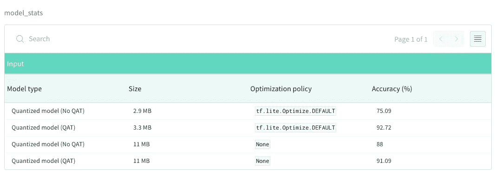
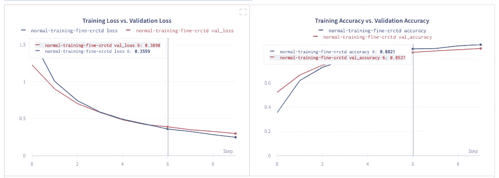
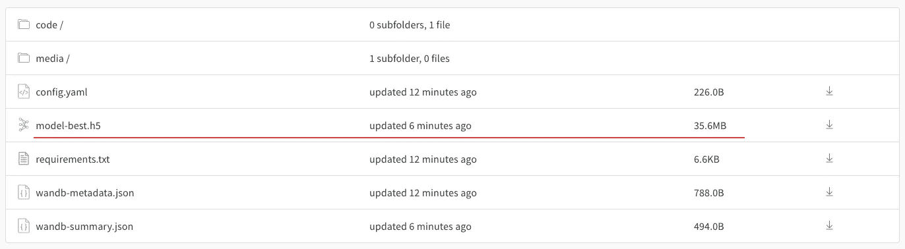
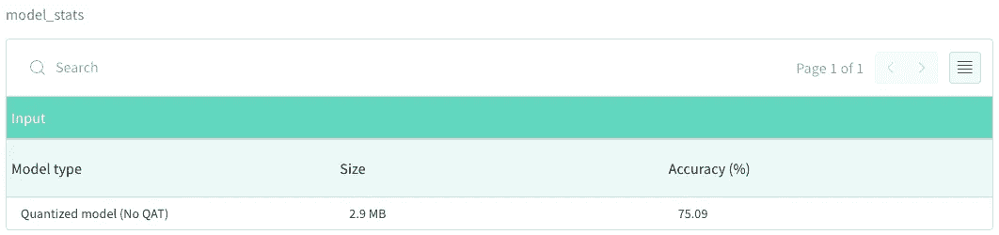
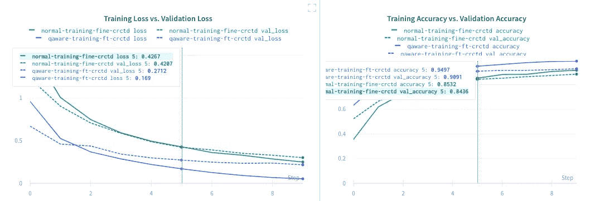
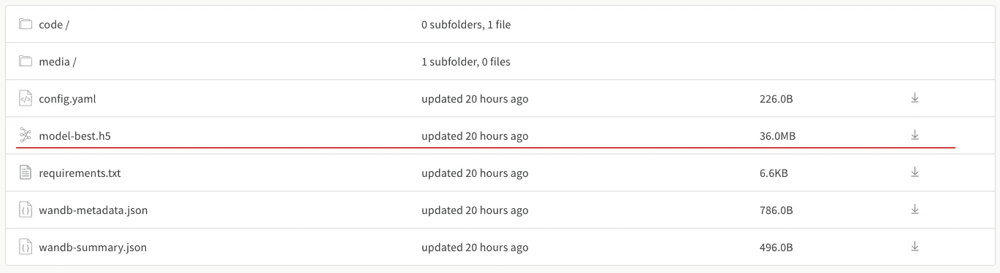
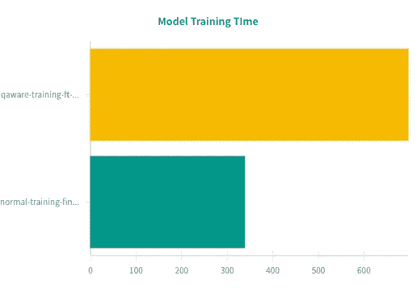
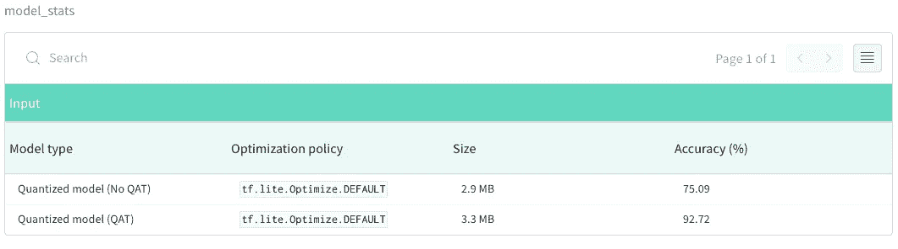
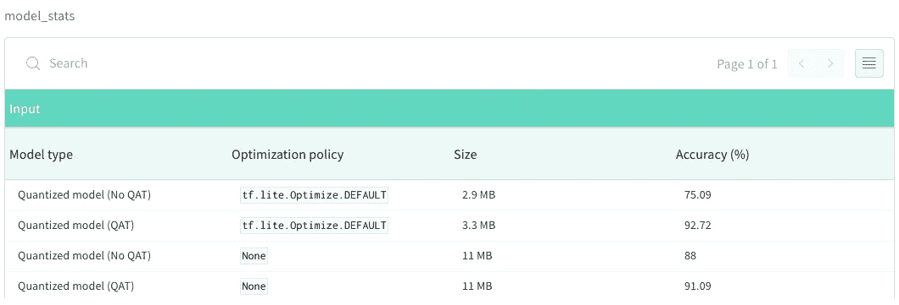

# TF Lite 中模型量化的故事

> 原文：<https://towardsdatascience.com/a-tale-of-model-quantization-in-tf-lite-aebe09f255ca?source=collection_archive---------29----------------------->

## [生产中的机器学习](https://towardsdatascience.com/tagged/production-ml)

## 模型优化策略和量化技术，帮助在资源受限的环境中部署机器学习模型。

在此与结果仪表板[互动。](https://app.wandb.ai/sayakpaul/tale-of-quantization)

最新的机器学习模型通常体积庞大，这使得它们在资源受限的环境中部署时效率低下，如移动电话、树莓 pi、微控制器等。即使您认为您可以通过在云上托管您的模型并使用 API 来提供结果来解决这个问题，也要考虑到互联网带宽可能并不总是很高，或者数据不能离开特定设备的受限环境。

我们需要一套工具来无缝过渡到设备上的机器学习。在这篇报道中，我将向你展示 **TensorFlow Lite (TF Lite)** 如何在这种情况下大放异彩。我们将讨论 TensorFlow 支持的模型优化策略和量化技术。

[查看 GitHub 上的代码](https://github.com/sayakpaul/Adventures-in-TensorFlow-Lite) →

感谢 **Arun** 、 **Khanh** 和 **Pulkit** (谷歌)为这篇报道分享了非常有用的技巧。

不同量化实验之间的性能概述(此处[可用](https://app.wandb.ai/sayakpaul/tale-of-quantization)

## 概观

在本文中，我们将涵盖以下主题

*   对设备上机器学习的需求
*   TensorFlow 支持的模型优化策略
*   量化技术
*   执行量化时需要记住的事项

# 对设备上机器学习的需求

在他们的演讲[tensor flow Lite:ML for mobile and IoT devices(TF Dev Summit ' 20)](https://www.youtube.com/watch?v=27Zx-4GOQA8)中，Tim Davis 和 T.J. Alumbaugh 强调了以下几点:

*   **更低的延迟&紧密互动**:在许多关键应用中，你可能希望预测的延迟为零，例如无人驾驶汽车。您可能还需要保持系统的所有内部交互非常紧凑，这样就不会引入额外的延迟。
*   **网络连接**:正如我之前提到的，当你依赖云托管模式时，你实际上是将你的应用程序限制在一定的网络带宽水平上，而这可能并不总是能够实现的。
*   **隐私保护**:对隐私有硬性要求，例如，数据不能离开设备。

为了使大型 ML 模型能够部署在小型设备上，我们需要对它们进行优化，例如，将 1.9GB 的模型放入 2GB 的应用程序中。为了帮助 ML 开发者和移动应用开发者，TensorFlow 团队提出了两个解决方案:

*   [TensorFlow Lite](https://www.tensorflow.org/lite)
*   [TensorFlow 模型优化工具包](https://www.tensorflow.org/model_optimization/)

# TensorFlow 支持的模型优化策略

通过 TensorFlow Lite 和模型优化工具包，TensorFlow 目前支持以下模型优化策略-

*   **量化**你可以使用不同的低精度格式来减小模型的大小。
*   **修剪**在这里，您可以丢弃模型中对模型预测意义不大的参数。

在本文中，我们将重点讨论量子化。

# 量化技术

通常，我们的机器学习模型以`float32`精度格式运行。所有模型参数都以这种精度格式存储，这通常会导致模型更重。模型的重量与模型进行预测的速度直接相关。因此，你可能会自然而然地想到，如果我们能降低模型运行的精度，我们就能减少预测时间。这就是量化的作用——它将精度降低到更低的形式，如 float16、int8 等，来表示模型的参数。

量子化可以以两种方式应用于一个模型

*   **训练后量化**在训练后应用于模型*。*
*   **量化感知训练**通常对模型进行训练，以补偿量化可能带来的精度损失。当您降低模型参数的精度时，可能会导致信息丢失，您可能会看到模型的精度有所降低。在这些情况下，感知量化的训练会非常有帮助。

我们将在这份报告中看到这两种味道。我们开始吧！

# 实验设置

我们在这份报告中做的所有实验都是在 [Colab](https://colab.research.google.com/) 上进行的。我使用 **flowers** 数据集进行实验，并微调了一个预先训练好的 MobileNetV2 网络。这是定义网络架构的代码-

对网络进行 10 个时期的训练，批次大小为 32。

# 正常微调下的性能

运行页面可用[此处](https://app.wandb.ai/sayakpaul/tale-of-quantization/)

所有这些文件都可以在[这里](https://app.wandb.ai/sayakpaul/tale-of-quantization/runs/normal-training-fine-crctd/files?workspace=user-sayakpaul)找到

我们看到网络运行良好，达到 35.6 MB。

# 量化微调后的模型

当你在`tf.keras`中训练好一个模型后，量化部分只是几行代码的事情。所以，你可以这样做-

首先将您的模型加载到一个`TFLiteConverter`转换器类中，然后指定一个优化策略，最后，您要求 TFLite 使用优化策略转换您的模型。序列化转换后的 TF Lite 文件非常简单

这种量化形式也被称为**训练后动态范围量化**。它将模型的*权重*量化到 8 位精度。[在这里](https://www.tensorflow.org/lite/performance/post_training_quantization)你可以找到关于这个和其他训练后量化方案的更多细节。

# 关于为转换设置配置选项的说明

TF Lite 允许我们在转换模型时指定许多不同的配置。我们在前面提到的代码中看到过一次这样的配置，其中我们指定了优化策略。

除了`tf.lite.Optimize.DEFAULT`，还有另外两个政策可供选择- `tf.lite.Optimize.OPTIMIZE_FOR_SIZE` & `tf.lite.Optimize.OPTIMIZE_FOR_LATENCY`。从名称中可以看出，基于策略的选择，TF Lite 会相应地尝试优化模型。

我们可以指定其他事情，比如-

*   `target_spec`
*   `representative_dataset`

点击了解更多关于`TFLiteConverter`类[的信息。值得注意的是，这些不同的配置选项允许我们在模型的预测速度和准确性之间保持平衡。](https://www.tensorflow.org/api_docs/python/tf/lite/TFLiteConverter)[在这里](https://www.tensorflow.org/lite/performance/post_training_quantization)，你可以找到 TF Lite 中不同训练后量化方案的一些权衡。

下面我们可以看到这个转换模型的一些有用的统计数据。

餐桌可用[此处](https://app.wandb.ai/sayakpaul/tale-of-quantization)

我们看到模型的规模大幅缩小，但这是以准确性为代价的。理想情况下，我们不希望转换后的模型精度损失这么大。这表明，我们需要探索其他量化方案，以进一步提高转换模型的准确性。

# 具有相同模型的量化感知训练(QAT)

这里一个好的第一个方法是训练你的模型，让它学会补偿可能由量化引起的信息损失。通过量子化感知训练，我们可以做到这一点。为了以量化感知的方式训练我们的网络，我们只需添加以下代码行-

现在，你可以像训练一个`tf.keras`模型一样训练`qat_model`。[在这里](https://www.tensorflow.org/model_optimization/guide/quantization/training_comprehensive_guide)你可以找到 QAT 的全面报道。

下面，我们可以看到这个量化感知模型比我们之前的模型稍好一些。

运行可用的[这里](https://app.wandb.ai/sayakpaul/tale-of-quantization)

# QAT 与非 QAT 模型的简要比较

就模型大小而言，QAT 模型与非 QAT 模型相似:

请记住，这些文件可以在任何运行的“文件”选项卡下找到

但是在模型训练时间方面，我们看到 QAT 模型需要更多的时间。这是因为在 QAT 过程中，模型中引入了伪量化节点来补偿信息损失，这使得 QAT 模型需要更多的时间来收敛。

在优化收敛时间的情况下，记住这一点很重要。如果你的训练模型需要很长的训练时间，那么引入 QAT 会进一步增加这个时间。

量化 QAT 模型与我们在上一节中看到的完全相同(我们将使用相同的量化配置)。

现在让我们比较量化版本的 QAT 模型的性能。

模型训练时间的比较

# 评估量化的 QAT 模型

在下表中，我们看到量化版本的 QAT 模型确实比以前的模型表现得更好。

此处可用的表[为](https://app.wandb.ai/sayakpaul/tale-of-quantization)

我们清楚地看到，用 QAT 训练的模型没有引起任何精度下降。在下一节中，我们将把两个模型的参数都保持为浮点数，看看我们能在多大程度上推动模型大小和准确性之间的权衡。

# 量化为浮动模型

为了将我们的模型量化到浮点精度，我们只需要丢弃这条线— `converter.optimizations = [tf.lite.Optimize.DEFAULT]`。如果你想利用 [GPU 代理](https://www.tensorflow.org/lite/performance/gpu)，这个策略尤其有用。注意， [float16 量化](https://www.tensorflow.org/lite/performance/post_training_float16_quant)在 TensorFlow Lite 中也是支持的。在下表中，我们可以看到使用该方案量化的模型的大小和精度。

此处可用的表[为](https://app.wandb.ai/sayakpaul/tale-of-quantization)

虽然这些型号的尺寸有所增加，但我们看到这些型号的原始性能仍然很高。注意，不建议使用这种方案转换 QAT 模型，因为在 QAT 期间，插入的伪量化运算具有`int`精度。因此，当我们使用这种方案量化 QAT 模型时，转换后的模型可能会出现不一致。

此外，硬件加速器，如边缘 TPU USB 加速器，将不支持浮动模型。

# 探索其他量化方案和总结思路

还有其他训练后量化技术可用，如全整数量化、浮点量化等。这是你可以了解他们更多的地方。请记住，全整数量化方案可能并不总是与 QAT 模型兼容。

有许多 SoTA 预训练的 TF Lite 模型可供开发人员在其应用中使用，它们可以在以下位置找到:

*   [https://www.tensorflow.org/lite/guide/hosted_models](https://www.tensorflow.org/lite/guide/hosted_models)
*   [https://tfhub.dev/s?deployment-format=lite&publisher = tensor flow&q = lite](https://tfhub.dev/s?deployment-format=lite&publisher=tensorflow&q=lite)

对于希望在应用程序中集成机器学习的移动开发人员来说，[TF Lite 中有许多示例应用程序](https://www.tensorflow.org/lite/examples)值得一试。TensorFlow Lite 还为嵌入式系统和微控制器提供工具，您可以从[这里](https://www.tensorflow.org/lite/guide)了解更多信息。

如果您想重现此分析的结果，您可以–

[查看 GitHub 上的代码→](https://github.com/sayakpaul/Adventures-in-TensorFlow-Lite)