# 双城记！(用数据讲故事)

> 原文：<https://towardsdatascience.com/a-tale-of-two-cities-e693c15b3ddb?source=collection_archive---------34----------------------->

## 基于 Foursquare 数据和机器学习的城市对比分析

*关键词:数据科学、机器学习、Python、网络抓取、Foursquare*


图片来源:【https://www.sussexscenes.co.uk/view-shard-london/ 


【https://br.pinterest.com/pin/92816442292506979/ 

*这篇文章涵盖了在* [*IBM 数据科学专业*](https://www.coursera.org/professional-certificates/ibm-data-science) *课程中用于最终顶点项目的方法和分析。详细的报告、代码和结果可以在 Github 上找到，并在文章末尾有链接。*

# **1。简介**

当谈到伦敦和巴黎时，选择一个城市总是一个艰难的决定，因为这两个城市都是真正的全球化、多元文化和国际化城市，位于两个欧洲国家的中心。除了作为欧洲两个最重要的外交中心，它们还是金融、商业、科学、时尚、艺术、文化和美食的主要中心。伦敦(英国首都)和巴黎(法国首都)都有着丰富的历史，是欧洲游客最多、最受欢迎的两个城市。伦敦是英国最大的城市，位于英格兰东南部的泰晤士河畔。另一方面，巴黎位于国家的中北部。与伦敦相似，这座城市也坐落在一条通常被称为塞纳河的河边。

我们的目标是对这两个城市进行比较，看看它们有多相似或不相似。这种技术使用户能够根据当地提供的便利设施或服务来确定城市中的类似社区，从而有助于了解当地的活动，不同活动的中心是什么，市民如何体验城市，以及他们如何利用城市资源。

什么样的客户会从这样的分析中受益？

1.  具有可转移技能的潜在求职者可能希望在特定的城市寻找工作，这些城市在工资、社会福利，甚至在适合外籍人士的文化方面，为他们的资格和经验提供最合适的匹配。
2.  此外，在新城市购买或租赁房屋的人可能想要寻找该城市中与他们所知的其他城市相似的位置的推荐。
3.  类似地，一家希望将其地点扩展到其他城市的大公司可能会从这种分析中受益。
4.  许多市内城市规划计算也可能受益于模拟一个城市与其他城市的关系。

# **2。数据准备**

为了解决手头的问题，数据提取如下进行:

***网络抓取:*** 城市数据是使用[请求](https://requests.readthedocs.io/en/master/)和 [BeautifulSoup](https://www.crummy.com/software/BeautifulSoup/bs4/doc/) 库从各自的维基百科页面【1】【2】中提取的。

```
*## URL to extract City neighbourhood information*
urlL = "https://en.wikipedia.org/wiki/List_of_London_boroughs"
urlP = "https://en.wikipedia.org/wiki/Arrondissements_of_Paris"
pageLondon = urllib.request.urlopen(urlL)
pageParis = urllib.request.urlopen(urlP)wikitablesL = read_html(urlL,  attrs={"class":"wikitable"})
print ("Extracted **{num}** wikitables from London Wikipedia".format(num=len(wikitablesL)))
wikitablesP = read_html(urlP,  attrs={"class":"wikitable"})
print ("Extracted **{num}** wikitables from Paris Wikipedia".format(num=len(wikitablesP)))dfP = wikitablesP[0]
dfL0 = wikitablesL[0]
dfL1 = wikitablesL[1]*## Request & response* 
s = requests.Session()
responseL = s.get(urlL,timeout=10)
```

对提取的数据执行进一步的数据清理，以便存储关于其邻近地区、其相应的坐标、面积和人口以及相应的区编号的相关信息。

```
**def** scrapeLondonTable(table):
    c1=[]
    c2=[]
    c3=[]
    c4=[]
    c5=[]
    c6=[]
    c7=[]
    c8=[]
    c9=[]
    c10=[]
    c11=[]

    **for** row **in** table.findAll("tr"):
        cellsL = row.findAll('td')
        **if** len(cellsL)==10: *#Only extract table body not heading*
            c1.append(cellsL[0].find('a').text)
            c2.append(cellsL[1].find(text=**True**))   
            c3.append(cellsL[2].find(text=**True**))
            c4.append(cellsL[3].find(text=**True**))
            c5.append(cellsL[4].find(text=**True**))
            c6.append(cellsL[5].find(text=**True**))
            c7.append(cellsL[6].find(text=**True**))
            c8.append(cellsL[7].find(text=**True**))
            c9.append(cellsL[8].find('span',{'class': 'geo'}))
            c10.append(cellsL[9].find(text=**True**))
    *# create a dictionary*
    d = dict([(x,0) **for** x **in** headerL])
    *# append dictionary with corresponding data list*
    d['Borough'] = c1
    d['Inner']= c2
    d['Status']=c3
    d['Local authority']=c4
    d['Political control']=c5
    d['Headquarters']=c6
    d['Area (sq mi)']=c7
    d['Population (2013 est)[1]']=c8
    d['Co-ordinates']=c9
    d[' Nr. in map']=c10
    *# convert dict to DataFrame*
    dfL_table = pd.DataFrame(d)
    *## convert Area units to kms^2*
    *#dfL["Area"] = 2.59 * (pd.to_numeric(dfL["Area"]))*
    Latitude = []
    Longitude = []
    **for** i **in** range(len(dfL_table)):
        locationSplit = dfL_table['Co-ordinates'].iloc[i].getText().split("; ") 
        Latitude.append(locationSplit[0])
        Longitude.append(locationSplit[1])
    dfL_table['Latitude'] = Latitude
    dfL_table['Longitude'] = Longitude
    dfL_table.drop(['Inner','Status','Local authority','Political control','Headquarters','Co-ordinates'],axis=1,inplace=**True**)
    dfL = dfL_table.rename(columns={'Area (sq mi)': 'Area', 'Population (2013 est)[1]': 'Population',' Nr. in map':'District Number'})
    dfL['District Number']  = dfL['District Number'].astype(int)
    **for** i **in** range(len(dfL)):
        dfL['Area'].iloc[i] = float(re.findall(r'[\d\.\d]+', dfL['Area'].iloc[i])[0])
        dfL['Population'].iloc[i] = int(dfL['Population'].iloc[i].replace(',',''))
    **return** dfL
```

在必要的数据清理之后，我们获得了以下用于研究的数据框架:

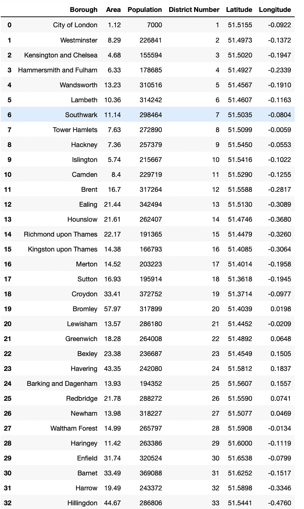

伦敦市区列表。

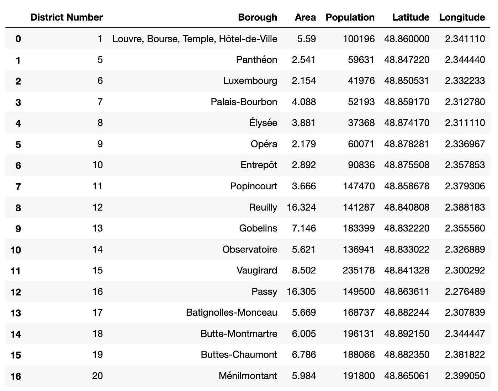

巴黎市的区列表(1-4 区合并为 1 区)。

***Foursquare 位置数据:*** [Foursquare](https://foursquare.com/) 是一个社交位置服务，允许用户探索周围的世界。Foursquare API 提供了基于位置的体验，包含关于地点、用户、照片和签到的各种信息。我们利用 Foursquare 数据来提取所有被研究社区的基于地点的信息。对 API 的调用返回一个 JSON 文件，我们需要将它转换成数据帧。然后，位置数据被用来在每个街区寻找顶级和独特的场地。我决定在方圆 1 公里内的每个街区挑选 100 个最受欢迎的景点。

# 3.探索性数据分析

## 城市数据

维基百科的数据为我们提供了各个城市中每个行政区的坐标、面积和人口信息。人们可以利用这一信息来绘制一张城市地图，根据人口密度标出每个行政区。 [Geocoder](https://geopy.readthedocs.io/en/stable/#module-geopy.geocoders) 和“[leave map](https://python-visualization.github.io/folium/)库用于活页地图上的数据可视化，根据人口密度标记行政区。密度越高，标记的半径越大。

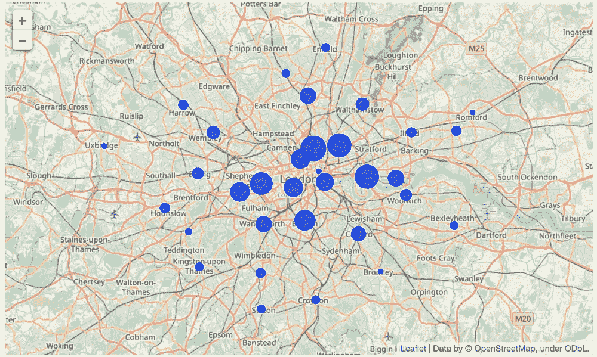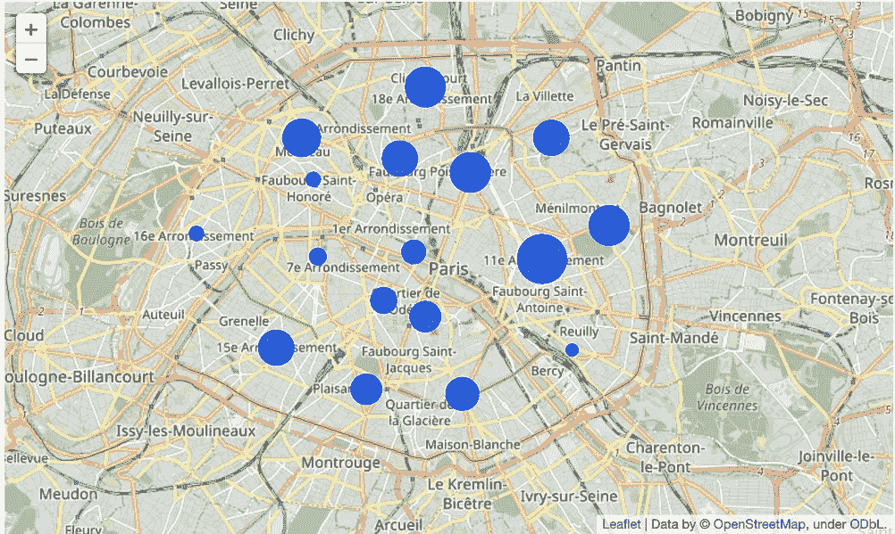

基于人口密度的伦敦(左)和巴黎(右)地图。(注:伦敦地图上的标记已按 1/1000 的比例缩小，巴黎地图上的标记已按 1/2000 的比例放大)。

## 场馆数据

Foursquare 的位置数据给出了每个区 1 公里半径内的地点列表信息。这是了解街区特征的合理距离。

```
## Extracting Foursquare venue data
LIMIT = 100 *# limit of number of venues returned by Foursquare API*
radius = 1000 *# define radius*

**def** getNearbyVenues(names, latitudes, longitudes, radius=500):

    venues_list=[]
    **for** name, lat, lng **in** zip(names, latitudes, longitudes):
        print(name)

        *# create the API request URL*
        url = 'https://api.foursquare.com/v2/venues/explore?&client_id=**{}**&client_secret=**{}**&v=**{}**&ll=**{}**,**{}**&radius=**{}**&limit=**{}**'.format(
            CLIENT_ID, 
            CLIENT_SECRET, 
            VERSION, 
            lat, 
            lng, 
            radius, 
            LIMIT)

        *# make the GET request*
        results = requests.get(url).json()["response"]['groups'][0]['items']

        *# return only relevant information for each nearby venue*
        venues_list.append([(
            name, 
            lat, 
            lng, 
            v['venue']['name'], 
            v['venue']['location']['lat'], 
            v['venue']['location']['lng'],  
            v['venue']['categories'][0]['name']) **for** v **in** results])

    nearby_venues = pd.DataFrame([item **for** venue_list **in** venues_list **for** item **in** venue_list])
    nearby_venues.columns = ['Borough', 
                  'Borough Latitude', 
                  'Borough Longitude', 
                  'Venue', 
                  'Venue Latitude', 
                  'Venue Longitude', 
                  'Venue Category']

    **return**(nearby_venues)print("Getting venues inside the following Boroughs of London:")
London_venues = getNearbyVenues(names=tableL['Borough'],
                                   latitudes=tableL['Latitude'],
                                   longitudes=tableL['Longitude']
                                  )
```

伦敦总共有大约 219 个独特的场馆类别，巴黎有 180 个。我用这些信息在一个条形图上显示了伦敦市中心和巴黎市中心区的一些最常见的场馆。

```
*## Picking major districts inside inner London and inner Paris respectively*
districtsL = ['City of London','Westminster','Kensington and Chelsea','Hammersmith and Fulham', 'Wandsworth']
districtsP = ['Louvre, Bourse, Temple, Hôtel-de-Ville', 'Panthéon', 'Luxembourg', 'Palais-Bourbon', 'Élysée']

**def** nearbyvenues_count(venues_df, district):
    venues_count = venues_df
    venues_count = venues_count.rename(columns={'Venue Category': 'Category'})
    venues_count = venues_count.groupby(['Borough']).Category.value_counts().to_frame("Counts")
    fig, ax = plt.subplots(1,1,figsize=(20, 7)) 
    fig.subplots_adjust(left=0.115, right=0.88)
    venues_plot =  venues_count['Counts'].loc[district][:10].head(10) 
    pos = np.arange(len(venues_plot))
    ax.set_title(district,size=20)
    freqchart = ax.barh(pos, venues_plot,align='center',height=0.5,tick_label=venues_plot.index)

    **return** freqchart
```

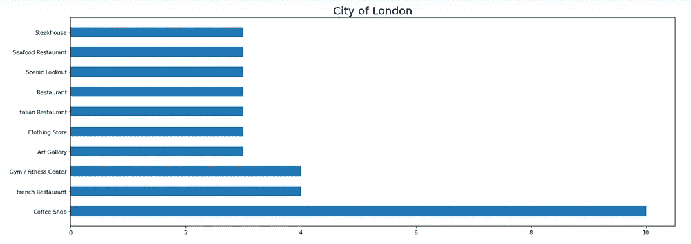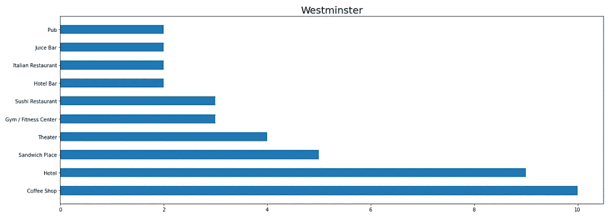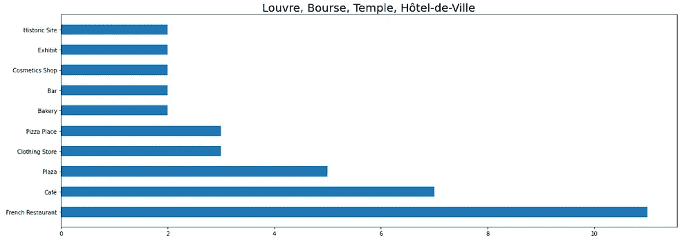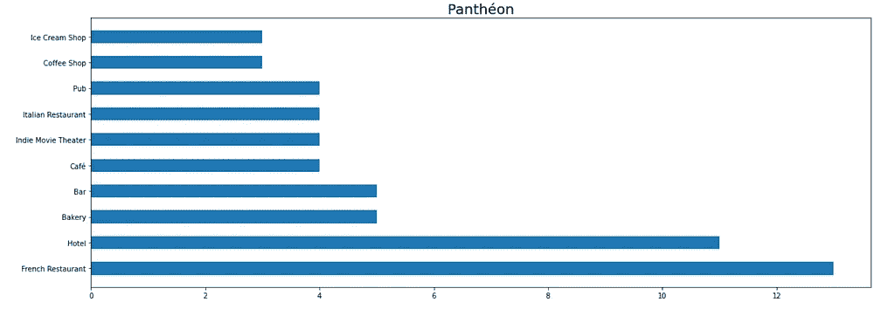

伦敦内城区(上图)和巴黎内城区(下图)最常见的比赛场地。

虽然伦敦市中心最常见的场所在咖啡馆/咖啡店、酒吧、果汁吧或酒店之间，但在巴黎市中心或主要地区的行政区，最常见的场所大多是法国或意大利餐馆以及酒店。

为了以更全面的方式探索场馆数据并进一步用于分析，foursquare 场馆数据被安排到 pandas 数据框架中，如下所示:

*   首先，为每个场馆类别创建一个带有[熊猫和一个热编码](https://pandas.pydata.org/pandas-docs/stable/reference/api/pandas.get_dummies.html)的数据框
*   使用熊猫[组通过](https://pandas.pydata.org/pandas-docs/stable/reference/api/pandas.DataFrame.groupby.html)方法在区列获得每个一个热门编码场馆类别的平均值
*   使用场地类别均值获取每个城市的基于场地的数据框，给出每个行政区十个最常见的场地

```
## Categorizing venues into pandas
*# one hot encoding*
London_onehot = pd.get_dummies(London_venues[['Venue Category']], prefix="", prefix_sep="")

*# add neighborhood column back to dataframe*
London_onehot['Borough'] = London_venues['Borough'] 

*# move neighborhood column to the first column*
fixed_columns = [London_onehot.columns[-1]] + list(London_onehot.columns[:-1])
London_onehot = London_onehot[fixed_columns]
London_onehot.head()
London_grouped = London_onehot.groupby('Borough').mean().reset_index()**def** return_most_common_venues(row, num_top_venues):
    row_categories = row.iloc[1:]
    row_categories_sorted = row_categories.sort_values(ascending=**False**)
    **return** row_categories_sorted.index.values[0:num_top_venues]num_top_venues = 10
indicators = ['st', 'nd', 'rd']

*# create columns according to number of top venues*
columns = ['Borough']
**for** ind **in** np.arange(num_top_venues):
    **try**:
        columns.append('**{}{}** Most Common Venue'.format(ind+1, indicators[ind]))
    **except**:
        columns.append('**{}**th Most Common Venue'.format(ind+1))

*# create a new dataframe for London*
Londonboroughs_venues_sorted = pd.DataFrame(columns=columns)
Londonboroughs_venues_sorted['Borough'] = London_grouped['Borough']**for** ind **in** np.arange(London_grouped.shape[0]):
    Londonboroughs_venues_sorted.iloc[ind, 1:] = return_most_common_venues(London_grouped.iloc[ind, :], num_top_venues)

Londonboroughs_venues_sorted.head(10)
```

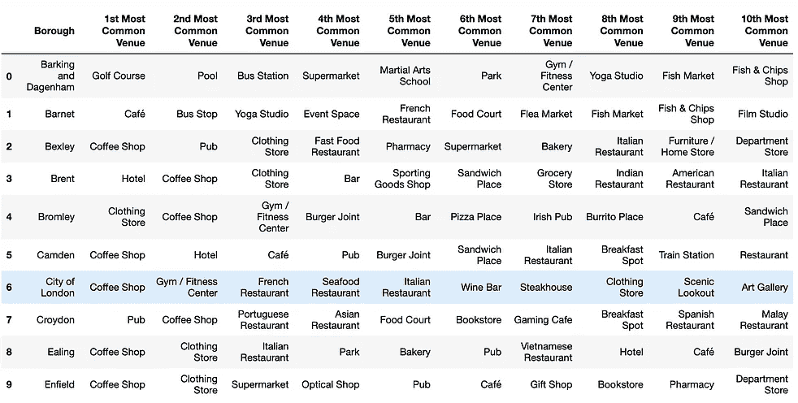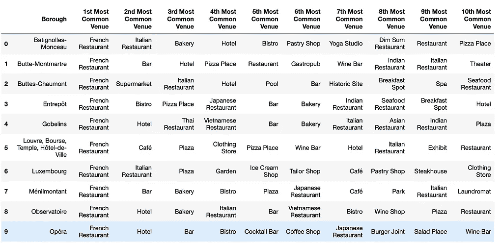

伦敦(左)和巴黎(右)的熊猫数据框中排列的 Foursquare 场馆数据部分。

然后，使用“[*”k-means*](https://en.wikipedia.org/wiki/K-means_clustering)”将提供每个区最常见的场地数据的信息用于对街区进行分类。

# **4。聚集街区**

我使用' [*k-means*](https://en.wikipedia.org/wiki/K-means_clustering) '算法进行了聚类分析，以便根据场地类别提供的相似性将相似的街区分类成簇。为了获得一些理解，我决定对将要使用的聚类数(k)进行一些研究，如下所示:

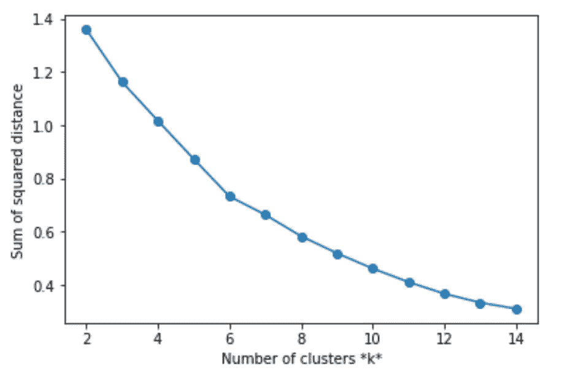

[肘形法](https://en.wikipedia.org/wiki/Elbow_method_(clustering)):我尝试使用肘形法确定伦敦聚类分析的有效聚类数(k)，并在 k = 6 附近看到一个小扭结(虽然不清楚也不尖锐)。肘形法对不同的 k 值使用组内误差平方和(WSS ),并且可以选择 WSS 开始减小的 k 值，并且可以被视为 WSS 对 k 图中的肘形。然而，对于 Paris 数据，没有明显看到扭结，因此我试图查看每个 k 值的聚类的[剪影得分](https://en.wikipedia.org/wiki/Silhouette_(clustering))。剪影值衡量一个点与其自己的聚类(内聚)相比与其他聚类(分离)的相似程度。k = 2 左右的值给出了轮廓分数的全局最大值。尽管从这些研究中可以看出，我们没有明确的聚类数据，但为了我们的分析目的，我决定将伦敦街区分为 6 组聚类，将巴黎街区分为 2 组聚类。这可能是有益的，看看一个更详细的分析，以优化 k 在未来的此类研究。

# **5。结果讨论**

为了解决手头的业务问题，我们考虑了伦敦内外的 33 个区和巴黎内的 16 个区。虽然这些社区中的每一个都可能是独一无二的，但其中一些在提供的便利设施方面可能更相似。执行聚类分析以找到那些相似的邻域。值得注意的一点是，从伦敦维基中提取的数据给出了伦敦内外各区的信息，因此将郊区也考虑在内。而巴黎维基提供的数据只给出了巴黎市内各区的信息，不包括巴黎周围大部分人口居住的郊区的信息。因此，这项研究中进行的分析需要更多的信息，以便在平等的基础上比较这些城市。

从解释性分析中得出的一些推论如下:

*   巴黎市中心的大部分地区比伦敦市中心的类似地区人口更稠密。伦敦 33 个区中有 9 个区的人口密度超过 1 万，而巴黎 16 个区中只有 3 个区的人口密度低于 1 万，4 个街区的人口密度超过 3 万。
*   在地图上，密集的行政区更多地集中在伦敦的内部区域，而不是外部区域，对于巴黎来说，最密集的行政区位于塞纳河以北。
*   对 Foursquare 场所数据的初步研究显示，咖啡店、咖啡馆、酒吧和果汁吧是伦敦市中心五个主要行政区最常见的场所。类似地，法国餐馆、意大利餐馆和酒店是在内巴黎五个主要行政区最常见的场所。

此外，对基于地点的数据的机器学习分析揭示了伦敦的大部分区可以被分组到一个聚类中。在这些区最常见的场所总是咖啡店、咖啡馆、酒吧、旅馆或餐馆，然后是某种服装、便利店或药店。巴黎总共被分为两个独立的区域。虽然两个集群中最常见的场所总是法国餐厅，但第一个集群中有大量的意大利餐厅、酒店和咖啡馆，第二个集群中有其他美食餐厅、酒吧、小酒馆、服装店或超市。

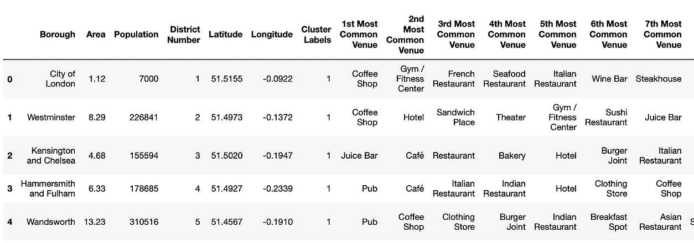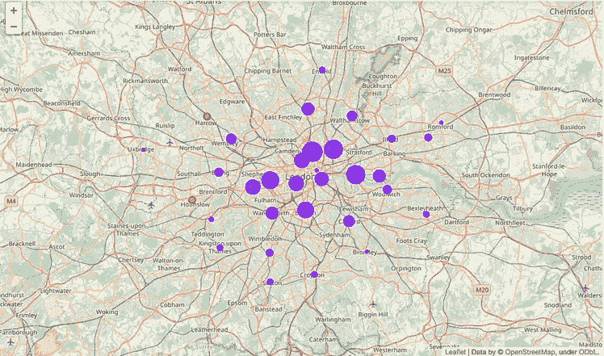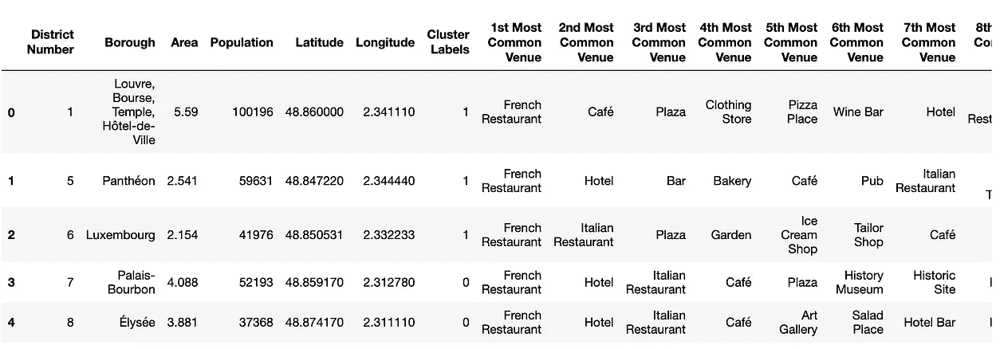

在这两个城市中，最常见的场所类型大多是餐馆、咖啡馆、酒店、酒吧、服装店或公园。这在某种程度上凸显了伦敦和巴黎在提供服务方面的相似性。

> 人们可以进一步使用场馆数据来比较城市，这是一种更全面的方式，人们也可以探索不同层次的空间聚合，即网格、街区和城市整体。当从场馆的角度来描述一个城市时，空间聚集的水平可能是一个重要的因素。

使用不同级别的空间聚合可以回答的一些问题可能是:

*   场馆类别在一个街区内是如何分布的，也就是说，这个街区是居住区还是商业区？
*   哪个城市的各种便利设施(酒吧、餐馆、公园、大学、图书馆、购物中心等)的数量最多？)

# **6。结论**

总之，使用 Foursquare 基于场馆的数据分析城市，可以对每个街区的场馆类型有一个总体的了解，并呈现城市的一些关键特征，但是数据水平不足以提供城市间比较的全面分析。对于潜在的感兴趣的人(求职者或决定搬到两个城市之一的人)或更大的客户，如商业公司或城市规划者，需要做更详细的分析，增加诸如租金、工资、交通、生活成本、增长率、经济等特征。

capstone 项目提供了一个深入了解现实生活中数据科学项目如何工作以及构建数据科学方法的所有步骤的媒介。这里详细讨论了从理解业务问题、数据理解到数据准备和模型构建的所有步骤。还提到了目前分析的许多缺点和改进分析的进一步方法。这是理解和解决手头业务问题的初步尝试。然而，这个项目在现实生活中仍然有巨大的扩展潜力。

# 参考

[1] [伦敦维基百科](https://en.wikipedia.org/wiki/List_of_London_boroughs)

[2] [巴黎百科](https://en.wikipedia.org/wiki/Arrondissements_of_Paris)

***关于我:***

我是一名物理学家，几年来一直在分析粒子物理数据。在过去的几年里，我在卡尔斯鲁厄、日内瓦、圣保罗和芝加哥之间工作，目前居住在巴黎。尽管这样的数据分析将是设计一种方法来比较任何城市的垫脚石，但比较伦敦和巴黎是出于个人对这些城市的热爱。❤

你可以在 Linkedin 上找到更多关于我的信息。

链接到项目[概要](https://github.com/sudhaahuja/Coursera_Capstone/wiki/Week2_Capstone_Report)和[代码](https://github.com/sudhaahuja/Coursera_Capstone/tree/master/Week2)。


"此刻做得最好会让你在下一刻处于最好的位置."保持安全和健康。