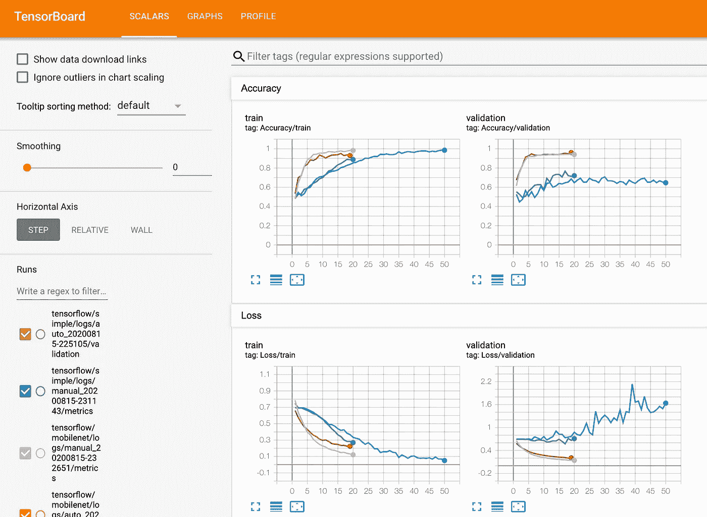

# 两种框架的故事

> 原文：<https://towardsdatascience.com/a-tale-of-two-frameworks-985fa7fcec?source=collection_archive---------9----------------------->

## Tensorflow 和 Pytorch:终于并肩了。

如果你像我一样，你在每个项目中都有一个最喜欢的框架。对我来说，这是 Tensorflow，特别是因为他们在 tf2.0 中更好地集成了 Keras。但每次 PyTorch 中发布另一个功能时，另一边的草看起来会更绿一些。所以本教程是为那些对一个框架有很强理解，对另一个有好奇心的人准备的。

在本教程中，我将带您浏览两个框架中的相同示例，包括一些最佳实践的并排比较，例如:

1.  [**数据生成器**应对大数据集](#6f89)
2.  [**从头开始创建模型**](#4445)
3.  [设置一个**损失函数**和**优化器**和](#bc2a)
4.  [带**张量板**测井和**检查点**T21 的训练循环](#f8a5)
5.  [通过微调**预训练模型**](#5ace) 改善结果
6.  [**评估**你的一个测试集的模型](http://99b2)


克里斯·亚瑟·柯林斯在 [Unsplash](https://unsplash.com?utm_source=medium&utm_medium=referral) 上拍摄的照片

# 资料组

我将使用一个熟悉的数据集，Cats v Dogs，因为本指南不是要解决一个棘手的问题(您可能已经想到了自己的问题)，而是要创建一个您可以轻松适应的通用、最小的示例。不过，最主要的是，我使用这个数据集是因为如果我要花大量时间看图片，我宁愿它们是可爱的动物。如果你想完全跟随，从[这里](https://www.kaggle.com/c/dogs-vs-cats/data)下载数据。

我的数据集存储在包含我的训练脚本(“文件夹”)的文件夹的子目录(“数据”)中，其结构如下:

```
folder/
├── data/
    ├── test/
        ├──1.jpg
        ├──...
    └── train/
        ├──cat.0.jpg
        ├──dog.0.jpg
        ├──...
```

# 设置数据生成器

我的数据集不是很大(25，000 个相当小的图像，其中我只使用 1000 个作为最小的例子)，所以我可以将它们全部加载到内存中。但是数据集太大而无法加载到内存中变得越来越常见，因此拥有一个能够处理这些情况的管道非常重要。数据生成器是一个很好的选项，它允许您实时生成数据，批量运行预处理和扩充，并将其直接输入到模型中。这可以在训练期间带来巨大的效率，因为它允许在 GPU 正在运行训练的 CPU 上准备数据。

## 张量流数据生成器

对于我的 **Tensorflow 数据生成器，**我将从 **tf** 中继承。 **keras** 。**实用工具**。序列，这样我就可以利用多处理这样的额外好处。你会注意到我在这段代码中调用了一个函数‘augment ’,你可以在这里找到那个[的代码，或者创建你自己的函数，其中输入是一个图像，输出是那个图像的放大版本，大小固定(im_size ),范围在-1 和 1 之间。](https://github.com/KerryHalupka/dl_frameworks/blob/master/image_augmentation.py)

我们将重要信息作为**参数**，例如包含数据的目录(data_dir)、批量大小、图像将被重新缩放的大小(为此，它们将具有相同的高度和宽度)、要使用的图像数量(将此设置为小于图像总数的数字有助于测试网络和调试)，以及数据是否应该在每个时期被打乱。

该类需要一些**方法**才能正常工作:

*   **__init__** 是初始化方法，在类被实例化时调用。在这里，它定位我们的图像名称，把它们放在一个列表中，并洗牌。
*   **on_epoch_end** 在每个 epoch 结束时触发，这里只是对数据进行洗牌。
*   每次训练循环从生成器请求新数据时，索引将从 0 递增到由 **__len__** 定义的上限。最佳实践是将该上限值设置为每个时期中的批次数量，以便每个时期可以看到每个图像一次。
*   **__getitem__** 在每次请求数据时被调用，它获取前面提到的索引，基于该索引获得图像名称的 batch_size 列表，并获取它们。

该类中的另外两个方法不是严格必需的:

*   **__get_data** 是一个私有方法，由 __getitem__ 调用以获取图像并对其进行扩充。您可以将代码放在 __getitem__ 中，但是这种布局使代码更加模块化。
*   **load_val** 一次性加载所有验证图像。这与使用数据生成器处理大型数据集的目的背道而驰，但不幸的是，我将使用的一种训练方法(“fit”)不接受生成器作为验证数据集，希望在未来的版本中可以解决这个问题。

然后，在训练脚本中创建一个生成器实例，并读入所有验证图像，这是一件非常简单的事情。

## PyTorch 数据生成器

PyTorch 数据生成器与 Tensorflow 生成器非常相似。然而在这种情况下，传承自**的火炬**。 **utils** 。**数据**。**数据集**允许我们使用多重处理，类似于上一节中 tf.keras.utils.Sequence 的继承。还有很多其他的相似之处，我们使用了增强功能，我们也使用了类似的参数，包括批量大小、图像大小、图像数量和随机播放。

生成器包含三种相同的方法:

*   **__init__** 是初始化方法，这里是打乱图像文件名(它已经被传递了)，并设置增强参数。
*   **__len__** 的操作方式与上述相同
*   **__getitem__** 读取一幅图像并放大。注意，这个生成器与前面的生成器的一个关键区别是，这里的生成器只生成一个图像，而 label - PyTorch 管理图像的批处理。

这里需要注意的一件重要事情是，如果 mobilenet 中的模型类型是应用于图像的归一化，这是因为我们将用于“mobilenet”的网络是一个预先训练的 torchvision 模型，它是使用在这种情况下归一化的图像训练的。因此，在使用这个模型时，我们需要以同样的方式进行归一化。

在培训管道中创建 PyTorch 生成器需要一些额外的工作。首先，我们设置一些参数，包括用于并行加载数据的线程数量。然后我们实例化该类，并将其传递给 DataLoader 类，该类也接受我们设置的参数。我们为验证创建第二个生成器，传递验证标志以确保图像不会被放大。

# 创建简单的模型

现在让我们看看创建一个简单的 CNN 是什么样子的。在这两个框架中，我将设置一个具有 4 个卷积层的 CNN，由最大池分隔，然后是 50%的下降，然后是两个线性层。我们在这里不是为了表演，只是为了演示。

这两个框架都允许你从头开始创建你需要的层，这意味着你有相当多的可定制性。然而，除非你有一个非常好的理由想要创建你自己的定制层，否则我鼓励你省去麻烦，使用两个框架都提供的用户友好的包装器。

## 张量流简单模型

Tensorflow 最近正确集成了 Keras，这是一种非常受欢迎的包装器，可以简化深度神经网络的创建和训练。这就是在 Tensorflow Keras 中创建我们的简单 CNN 的样子。

使用顺序模型类型将一堆层组合在一起。层在序列内堆叠的顺序表示层在网络中的顺序。与我们将在 PyTorch 中看到的不同，所有的层，包括那些没有可训练参数的层(比如 MaxPooling 和 activation 函数)都包含在模型中。这是因为这个函数既声明了模型的结构，又定义了向前(和向后)传递的数据流。

## PyTorch 简单模型

在 PyTorch 中，模型被定义为从 nn 继承的类。模块，包含图层的 __init__ 和定义数据如何通过网络的 forward()方法，并返回网络的输出。

请记住，任何具有需要训练的参数的层(如卷积层)都需要在 __init__ 中注册。没有可训练参数(如最大池和激活函数)的层可以在 __init__ 或 forward()中注册。

这可能比我们在 Tensorflow 中连接网络的方式要复杂一点，但是层和连接的分离为 PyTorch 提供了相当大的灵活性，这在 Tensorflow 中是不容易实现的。

# 定义损失函数和优化器

损失函数将模型的输出与目标值进行比较，并估计它们之间的差距。您使用的损失函数将取决于您的应用，我使用的是**二元交叉熵和 Logit 损失**，因为我正在训练一个二元分类器。“logit 损失”部分是因为我的模型的输出具有线性激活函数，这在 DL 框架术语中意味着我的损失函数的输入是“logit”，该术语用于分类输出在通过 sigmoid 或 softmax 层之前。使用交叉熵计算 sigmoid/softmax 的计算效率更高，具有 logit 丢失层的 BCE 就是这样做的。

优化器用于更新模型的参数，以减少损失。有很多优化器可供选择，但我使用的是**亚当**。

## 张量流损失函数和优化器

在 Tensorflow 中，有和没有 logit 损失的二元交叉熵是通过相同的函数定义的。

## PyTorch 损失函数和优化器

在 PyTorch 中，有 logit 损失的二元交叉熵是一个独立于没有 logit 损失的函数。此外，优化器将模型参数和学习率作为输入。因此，如果您没有训练所有的参数(即，如果您正在微调模型)，那么请确保只传入您正在训练的参数。

# 训练循环(带记录)

最后，我们得到了好东西，训练我们的网络。我们还将在训练循环中添加两个独立的函数，一个用于将训练过程记录到 Tensorboard，另一个用于模型检查点。

**Tensorboard** 用于记录模型在训练过程中的损耗和精度。您还可以添加其他功能，如记录图像(如果您正在训练图像生成器，这将非常方便)和直方图(非常适合跟踪梯度)。



Tensorboard 提供了一个很好的方法来检查训练的结果，并比较不同的模型。

**模型检查点**在训练期间定期(默认为每个时期)将模型或权重保存在所选文件夹中。如果验证精度大于当前检查点，我们将只覆盖每一步的权重。

你可以(也应该)添加许多其他功能，比如学习率计划和提前停止。

## Tensorflow 训练循环(选项 1)

在 Tensorflow 中，有多种训练网络的方法。第一种是最简单的，它利用 Keras 的“fit”方法，使用您的数据生成器作为训练数据输入(请注意，在 Tensorflow 2.0 之前，您必须使用“fit_generator”将生成器作为输入，但这在最近的版本中已被否决)。不幸的是，验证数据不能作为生成器传入。

在调用“fit”之前，我们需要用优化器和 loss 编译我们的模型。我们还为多重处理设置了一些参数，以加速训练循环。这里要注意的另一件事是**回调**的使用，这就是我们如何定义 Tensorboard 和前面提到的模型检查点行为。

在没有 GPU 的 MacBook Pro 上，该训练代码应用于 850 个猫/狗训练图像，其中有 150 个验证图像，给出了以下结果:

## Tensorflow 训练循环(选项 2)

或者，我们可以更明确地定义训练循环。具体来说，我们定义了一个 for 循环，它遍历所有的历元，然后是另一个批量遍历数据集的循环。首先，我们定义了许多度量标准(训练/验证准确性和损失),它们在训练和测试步骤功能中得到更新。

然后我们定义训练和验证函数。在 train 函数中，我们打开一个 GradientTape()范围，在其中我们调用模型来运行正向传递并计算损失。然后，我们检索梯度，并使用优化器根据梯度更新权重。验证函数的不同之处在于，我们仅通过模型运行数据来计算损失和准确性，并记录两者。

这里需要注意的一点是在训练和测试步骤函数上面使用了 **tf.function 装饰符**。默认情况下，Tensorflow 2.0 以后以渴望模式运行，这对于逐行执行和调试非常有用，但会导致函数执行速度变慢。这个装饰器将 python 函数转换成静态张量流图，这样运行速度更快。

我们还需要手动设置 Tensorboard 日志记录，并检查验证准确性，以监控何时保存模型权重。

在没有 GPU 的 MacBook Pro 上，该训练代码应用于 850 个猫/狗训练图像，其中有 150 个验证图像，给出了以下结果:

## PyTorch 训练循环

Pytorch 循环遵循与 tensorflow 循环相同的逻辑，要注意的主要区别之一是向后传递是如何非常优雅和直观地运行的，方法是在丢失时调用 backward 方法，参数是通过在优化器上调用 step 方法来更新的。值得注意的是，在验证步骤中使用了 no_grad 范围，它会将模型参数中的所有“requires_grad”标志临时设置为 False。

还要注意“model.train()”和“model.eval()”的使用，它们用于在包含具有不同训练和评估行为(如批处理规范化)的模块的模型的模式之间切换。

在没有 GPU 的 MacBook Pro 上，该训练代码应用于 850 个猫/狗训练图像，其中有 150 个验证图像，给出了以下结果:

与张量流相比，这显然是每个历元更长的时间。尽管在数据加载器中设置了 num_workers 参数，但在执行过程中监控我的 CPU 内核的使用情况显示，与 Tensorflow 实现相比，它们没有得到充分利用。这是 Pytorch 目前已知的问题，如果您知道修复方法，请发表评论！

# 使用预先训练的模型改善结果

Tensorflow 和 PyTorch 作为深度学习框架的一个重要方面是能够利用内置的预训练模型。这两个框架都包括许多在 ImageNet 上预先训练的最流行的模型，供您免费使用。更好的是，很容易开始使用这些网络，并用更适合您的问题的东西替换分类图层。

## Tensorflow 预训练模型

在 Tensorflow 中使用预训练模型的一个特别简单的方法是通过 [Keras 应用](https://www.tensorflow.org/api_docs/python/tf/keras/applications)，这是带有预训练权重的固定架构。请注意，这不是使用预训练模型的唯一方式，但可能是最简单的方式。如果你选择的模特没有在[这里](https://www.tensorflow.org/api_docs/python/tf/keras/applications)列出，你可以去 [TFHub](https://tfhub.dev/) 或者 [TF 模特园](https://github.com/tensorflow/models)看看。

在没有 GPU 的 MacBook Pro 上，该训练代码应用于 850 个猫/狗训练图像，其中有 150 个验证图像，给出了以下结果:

这比简单模型好多了！请注意，训练时间比简单模型短，因为实际训练的参数数量较少(即使整个模型大得多)。

## PyTorch 预训练模型

与 Keras 应用程序相当的 Pytorch 是 Torchvision。火炬视觉预训练网络要求其输入以特定方式标准化，详情见[此处](https://pytorch.org/docs/stable/torchvision/models.html)。如前所述，我在数据扩充阶段对图像进行了归一化处理。

我们不想训练网络的特征提取阶段，因此在用我们自己的(可训练的)线性层替换第二分类层之前，我们为所有层关闭网络的‘requires _ grad’标志。我们只将这一层传递给优化器。

在没有 GPU 的 MacBook Pro 上，该训练代码应用于 850 个猫/狗训练图像，其中有 150 个验证图像，给出了以下结果:

# 模型评估

这是一个漫长的阅读，但我们几乎在那里，我们只需要评估模型。以下代码假设您已经创建了模型布局，因此只需要从文件中加载权重。

## 张量流模型评估

在预定义模型结构上使用的张量流方法“load_weights”加载并应用在所选检查点文件中找到的模型的训练参数。下面的代码从测试集中抓取一批图像，并在模型中运行它们。

## Pytorch 模型评估

Pytorch 函数' load_state_dict '应用在所选检查点文件中找到的' model '参数的状态。下面的代码从测试集中抓取一批图像，并在模型中运行它们。

# 摘要

我希望本教程能让你更好地理解你喜欢的框架的对应部分的用法。这两个框架都已经发展到这样一个程度，即它们既易于初学者使用，又在需要时高度可定制。要查看完整代码，请查看 GitHub 上的[代码。](https://github.com/KerryHalupka/dl_frameworks)