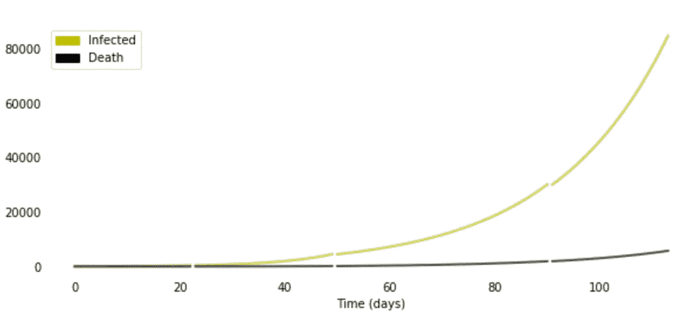
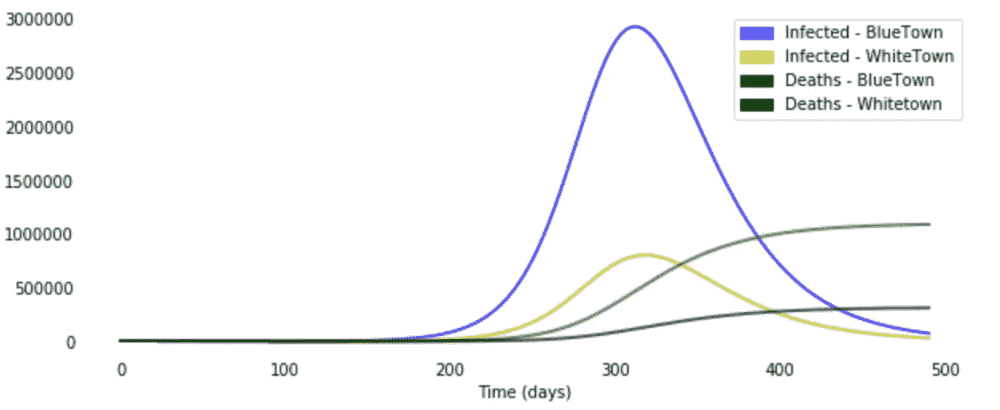
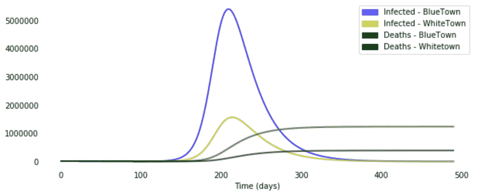

# 双城记

> 原文：<https://towardsdatascience.com/a-tale-of-two-towns-model-thinking-for-fighting-covid-cb2c16ca6ef8?source=collection_archive---------59----------------------->

由 [Unsplash](https://unsplash.com/s/photos/virus?utm_source=unsplash&utm_medium=referral&utm_content=creditCopyText) 上的[融合医学动画](https://unsplash.com/@fusion_medical_animation?utm_source=unsplash&utm_medium=referral&utm_content=creditCopyText)拍摄的照片

## 抗击新冠肺炎的模型思维

***编者按:*** [*走向数据科学*](http://towardsdatascience.com/) *是一份以数据科学和机器学习研究为主的中型刊物。我们不是健康专家或流行病学家，本文的观点不应被解释为专业建议。想了解更多关于疫情冠状病毒的信息，可以点击* [*这里*](https://www.who.int/emergencies/diseases/novel-coronavirus-2019/situation-reports) *。*

随着世界各地的城市和国家寻求在开放经济和将感染控制在可控水平之间找到正确的平衡，模型思维的应用可以帮助城市管理者更有信心地做出这些决定。

# 传统模型:严格但有限的决策支持

疫情最著名的模型将人群分为四大类:易感人群、已感染人群和已康复或死亡人群。然后根据新出现的数据对这些区间的相互作用进行建模和校准，然后用于预测感染。让我们称这些模型为 SIRD 模型。虽然这些是流行病学的优雅模型，但它们不适合在真实场景中评估影响和做出决策。关键缺点如下:

1.  **关注流行病学部分，而非行为/影响部分**:此类模型假设跨这些区间的传播参数相似。然而，传播可能因社会经济条件和工作性质而异，主要是因为这些因素影响采取预防措施的能力，如社会距离和在家工作。举例来说，送餐员必须在外面工作，同时与几个不同的陌生人打交道，优步的司机也是如此。然而，一名 IT 专业人员或大多数白领员工能够承受严格限制与人的身体接触。
2.  **作为平滑且通常固定的参数的传播** : SIRD 模型假设传染病的传播可以通过平滑曲线来建模。这在直觉上是没有帮助的，因为传导主要是一条不规则的曲线(比如说在封锁期间更平坦，但在开放经济期间更陡峭)。
3.  **依赖于确诊病例的模型校准**:对于像 Covid 这样的疾病，其检测具有很大的不确定性(围绕是否有一次感染以及何时可以检测到)，并且已经通过不同的检测方案得到满足(最初强调检测国际旅行者，后来转向基于医疗保健准备情况和预期的社区传播的更广泛的检测)，确诊病例可能不会有益地用于了解该疾病迄今为止是如何传播的。

由于每个城市都有不同比例的行为群体(比如白领和蓝领工人)，一直在试验不同的控制措施和测试模式，纯 SIRD 模型无法回答如下问题:

1.  哪些控制措施将允许无害的相互作用，但防止可能导致疾病传播增加的相互作用？
2.  对弱势群体有什么影响，国家提供什么支持可以减轻这种影响(例如，国有保险、公共部门床位的可用性、药品定价等)。)?
3.  鉴于目前的事态(比如严格的封锁，然后是宽松的封锁)，感染情况如何，政策措施将如何影响感染？
4.  确保每个城市都包含 Covid 并采取措施防止新浪潮的最终策略和阶段是什么？

# 给 SIRD 模型增加助推器

为了解决其中的一些缺点，提出了一些对香草 SIRD 模型的改进，以获得更好的决策话语。我还选择利用一些可用的数据点(这些数据点仍然非常非常有限或者很难找到)为德里创建一个代表性的模型。以下是建议的增强措施:

1.  **模拟社会经济区**:城市(德里)被分为白城和蓝城。BlueTown 代表人口密集、通常无规划的居住区，大多数居民从事需要体力劳动的活动，社会经济地位相对较低。WhiteTown 代表人口密度较低的地区，居民从事可以在家中进行的工作(在家工作)，具有相对较好的社会经济地位。传播模型既有细分市场内的(比如拥挤的贫民窟中使用社区设施的邻居)，也有跨细分市场的(比如一个来自 BlueTown 的披萨外卖男孩感染了 WhiteTown 的居民，后者已经点了餐)。虽然这是一个抽象概念，但其目的是在一个真实的模型中模拟相关的社会经济部分，也许不仅仅是这两个部分。
2.  **纳入已采取的控制措施**:该模型将截至日期的总持续时间视为一组间隔，其中传播与已采取的措施和观察到的影响相关联。举例来说，在严格的锁定期间，传输速度直观上会变慢，但一旦解锁，传输速度就会再次激增。对于我的玩具模型，具有不同检测的 4 个清晰间隔由关键事件分开建模——第一种情况检测、完全锁定、绿色区域的初始开放以及具有一些放松的延长锁定
3.  **传播系数的经验计算**:虽然传播率的评估仍然存在很大的不确定性，但我们可以做出一些简单的假设来简化这一点。我们可以假设，随着人均接触次数的减少(如在锁定场景中)，传播确实变慢了，并且在打开时再次移回。我们还可以假设检测率(每次感染的病例数)根据检测标准而变化。最后，使用一组职业的相互作用来估计白镇、蓝镇内部和之间的传播。

虽然很难对模型进行清晰的校准(由于渐近情况以及检测和报告中的延迟)，但通过上述经验估计将模型调整到合理的限度。下图说明了结果输出。虽然由于校准挑战，这些数字没有对齐，但输出反映了相对于具有平滑传输假设的德里 SIRD 模型的建模灵活性-例如，在经典 SIRD 模型中很难发现 6 月显示的陡度。此外，开放的可怕影响(以及在各个部门内)可以更好地从这一练习中收集，这可以创造必要的话语，说明在开放时可以做些什么来防止这种上升，以及这种措施是否足够，损害是否可以接受。

**德里的松散校准模型(直到 2020 年 6 月 23 日)**

# 创造可供选择的世界

扩展现状，看看它会把我们引向何方，然后考虑通过模拟两个场景对两个虚构的城镇进行影响评估。在第一种情况下，假设封锁后的传播率将继续(6 月份暗中观察到的传播率仍然低于疫情开始时的传播率，当时人们的认识甚至更低)。这表明明年二月会达到高峰。在另一种情况下，如果我们假设封锁前的传播率，我们会在 8 月看到高峰。还可以看到，对 BlueTown 的影响比对 WhiteTown 的影响大得多，预计是因为那里估计的高传输速率。结果绘制如下。

**场景 1:根据观察到的 6 月趋势控制传输**

**场景 2:遵循预锁定趋势的传输**

虽然该模型侧重于模拟对两个社会经济部分的影响，但必要时也可以确定对决策有用的多个部分——例如模拟热点地区的店主，然后模拟他们的传输参数。此外，关于受感染人员的指示可以帮助准备跨区域的医疗资源分配。因此，所有关键决策都可以通过模拟备选方案和评估相对影响来决定。

# 城市管理者的外卖

**好的模型有助于决策，即使他们的预测是错误的。**它有一个特定的决策者——城市管理者，他们希望做出决定抗击疫情，它的核心是定制化，以帮助做出相关的政策决策，从全面封锁、医疗准备、服务许可到甚至开放边境。**因此，城市管理者需要依赖代表他们的城市及其事务的模型，并使决策能够跨越他们所面临的决策**

该模型还需要在传统流行病学模型的范式中注入各种数据来源，对我来说，这在这样的危机中是必要的。城市管理者需要利用他们拥有的所有数据，而不是依赖清教徒式的传统数据,因为他们做出的任何决定都会影响生活、生计和经济。在这种情况下，这意味着**不仅考虑官方报告的数字，所有州可用数据，如第一次报告的可能病例症状(在医院)以及死亡，都被用来调整检测中的滞后。**

最后，虽然随着我们对疾病、死亡率和渐近人群的理解不断发展，像这样的修改模型仍可能产生不准确的数字，但**具有这种社会经济或细分市场的味道可以让我们更有意识地做出决策，同时了解各个细分市场的相对影响。这可以为更有针对性的干预提供信息**

**总的来说，当管理者在政治、社会和情感压力中挣扎的时候，他们不应该忘记一个好的决策只有一个定义特征，那就是它是有意识地做出的。**

**帽子提示**:

1.  [https://timesofindia . India times . com/city/Delhi/Half-of-Delhis-population-lives-in-sludges/articleshow/16664224 . CMS](https://timesofindia.indiatimes.com/city/delhi/Half-of-Delhis-population-lives-in-slums/articleshow/16664224.cms)
2.  [https://www . science direct . com/science/article/pii/s 0307904 x 11005191](https://www.sciencedirect.com/science/article/pii/S0307904X11005191)
3.  [https://www.ncbi.nlm.nih.gov/pmc/articles/PMC7190554/](https://www.ncbi.nlm.nih.gov/pmc/articles/PMC7190554/)
4.  [https://science . the wire . in/the-sciences/basic-reproductive-ratio-value-India-estimate/](https://science.thewire.in/the-sciences/basic-reproductive-ratio-value-india-estimate/)
5.  [https://assets . 2030 vision . com/files/resources/2030 vision-full-report . pdf？416997c759](https://assets.2030vision.com/files/resources/2030vision-full-report.pdf?416997c759)
6.  [https://www . lewuathe . com/新冠肺炎-dynamics-with-sir-model . html](https://www.lewuathe.com/covid-19-dynamics-with-sir-model.html)
7.  [https://www.thehindu.com/coronavirus/](https://www.thehindu.com/coronavirus/)