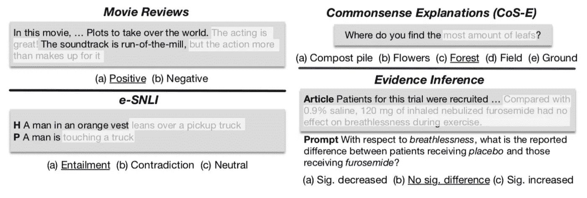
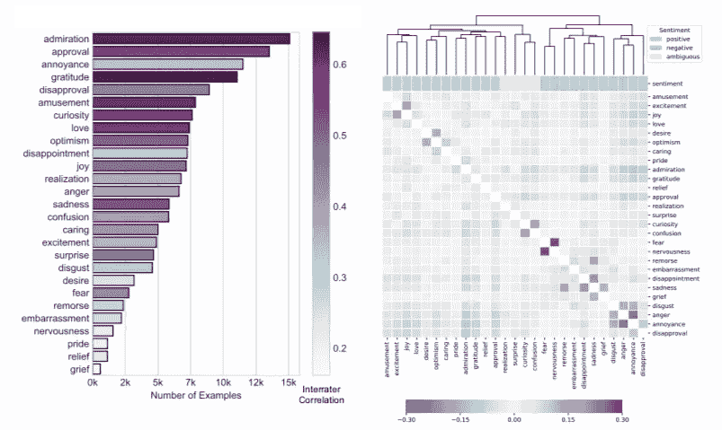
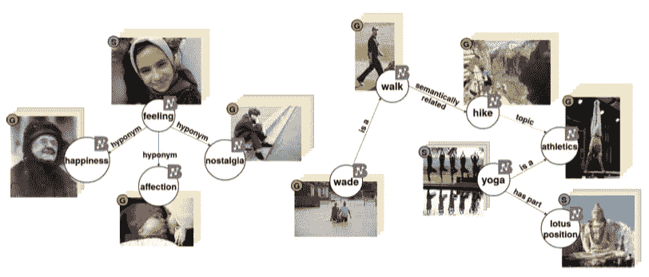
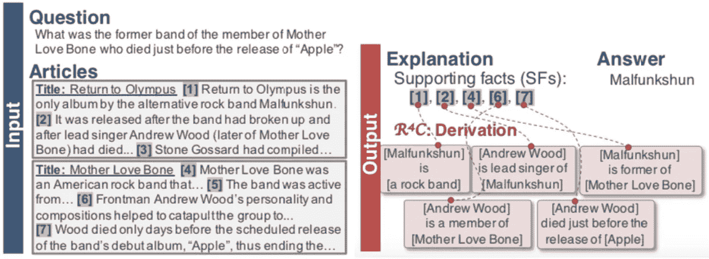

# 体验 ACL2020: 6 个新数据集和基准

> 原文：<https://towardsdatascience.com/a-taste-of-acl2020-6-new-datasets-benchmarks-4f5584f3f0ba?source=collection_archive---------34----------------------->

## 计算语言学协会今年的会议挤满了 700 多份出版物。为了让你更容易地浏览，这里有一个新的刷新数据集和语言任务基准的论文选择。

[周](https://unsplash.com/@phoebezzf?utm_source=medium&utm_medium=referral)在 [Unsplash](https://unsplash.com?utm_source=medium&utm_medium=referral) 上的照片

**数据集和基准是自然语言理解进展的核心(NLU)** :在排行榜驱动的研究中，进展受到我们评估的*质量*的上限。虽然机器学习的数据集曾经持续很久——即 MNIST 在推出十多年后才达到人类的表现——但最新的自然语言理解基准变得过时的速度比我们预期的还要快，这凸显了找到更好的基准的重要性。

关于这个主题的论文数量之多令人震惊，因此在 [Zeta-Alpha](https://www.zeta-alpha.com) 上，我们精选了 ACL2020 上最有趣的作品，这些作品**将影响如何衡量该领域的进展**。

## [1。对抗性 NLI:自然语言理解的新基准](https://www.aclweb.org/anthology/2020.acl-main.441/)

在这篇论文中——已经引起了+20 次引用——作者雄辩地说明了**为什么静态 NLU 基准很快就过时了**并且模型经常利用在数据收集阶段检测不到的虚假统计模式。

他们引入了自然语言推理的数据集(NLI)，其中给定了前提和本质，人们应该确定它们是必然的，矛盾的还是中性的。问题是，他们还引入了一个框架，根据来自训练模型的反馈对数据集进行迭代，并且人类在循环中引入了对立的例子；目的是在模型失败的地方创建数据集。如下图所示，注释的*圆*包括:

*   注释数据集并在其上训练模型。
*   让注释者在给定的上下文中编写新的对抗性假设，并在训练好的模型上测试它们。
*   如果模型成功，我们将新样本添加到训练集中。
*   当模型失败并且另一个人同意注释时，我们将他们添加到开发、测试或训练集中。

对抗性人在回路数据收集图。来源:[对抗性的 NLI:自然语言理解的新基准](https://www.aclweb.org/anthology/2020.acl-main.441/)

作者将这一过程称为 HAMLET ( *人和模型在回路中启用的培训*)，在论文中，他们展示了 3 轮数据集的创建，其中注释者受到激励，提出模型将失败的假设。这导致**的数据集**越来越具有挑战性，并且作为副作用，他们在 MNLI 数据集的一些变体上达到了最先进的水平。虽然他们推测，由于其收集方式，该基准不会很快饱和，但他们强调，即使如此，仍可以增加新的回合来克服这一点。

动态数据集的主要不便之处在于标准化的困难，这使得不同作品的比较成为可能。虽然**对抗性的人在回路中并不是一个新的想法**，但这个干净的实例有可能成为未来迭代的灵感，并可能克服标准化的障碍，在不久的将来，动态数据集将成为规范。

## [2。橡皮擦:评估合理化 NLP 模型的基准](https://www.aclweb.org/anthology/2020.acl-main.408/)

本文介绍了一个由 7 个任务组成的成熟的语言基准，这些任务不仅包括标签，而且受 [GLUE 基准](https://gluebenchmark.com)成功的启发，还有**人类注释的“基本原理”**。这些任务包括:[证据推理](https://www.aclweb.org/anthology/N19-1371.pdf)、 [BoolQ](https://arxiv.org/pdf/1905.10044.pdf) (布尔 QA)[影评](https://www.aclweb.org/anthology/D08-1004.pdf)、[发烧](https://www.aclweb.org/anthology/N18-1074.pdf)(事实提取验证) [MultiRC](https://cogcomp.seas.upenn.edu/papers/2018-MultiRC-NAACL.pdf) (阅读理解)[常识解释](https://www.aclweb.org/anthology/P19-1487.pdf)(CoS-E)[E-SNLI](https://arxiv.org/pdf/1812.01193.pdf)(语言蕴涵)*人情约定*。

作者提出了一个精确-召回曲线度量下的区域，用于评估模型和人类注释推理的符合性，但是他们知道这种评估很难客观地进行，这就是为什么他们明确地呼吁在这个方向上进行更多的研究。

这个被提议的基准测试是迈向一个更具解释力的语言模型综合评估的宏伟愿景的第一步。

擦除基准中的任务示例。来源: [ERASER:评估合理化 NLP 模型的基准](https://www.aclweb.org/anthology/2020.acl-main.408.pdf)

## [3。GoEmotions:一个细粒度情感的数据集](https://www.aclweb.org/anthology/2020.acl-main.372/)

情感分析长期以来一直是 NLP 中的一项基本任务，但一些最广泛使用的数据集(如具有二元积极/消极情感的 SST2)正在超越人类表现，对于衡量有意义的进展来说已经过时。

GoEmotions 是一个数据集，由来自流行英语 subreddit 评论的 58k 个人工注释样本组成，它**非常细粒度，有 27 个情感标签(或中性标签)**。数据收集过程坚持高标准，进行全面的人工审查、长度过滤、情感平衡、子编辑平衡以及屏蔽专有名称和宗教术语。伯特模型的早期基线测试表明，还有很大的改进空间，当前最先进的 NLU 模型未能在这一程度上理解情绪，使其成为一个具有挑战性的新情绪基准。

GoEmotions 数据集的类统计数据，以及情绪相关性的热图及其对粗糙情绪(积极、消极和模糊)的聚类。来源: [GoEmotions:一个细粒度情感的数据集](https://www.aclweb.org/anthology/2020.acl-main.372.pdf)

这种类型的数据集在这个时代非常有价值，可以帮助我们理解互联网上复杂的大规模社会动态。

类似地，也是在 ACL2020 上， [iSarcasm:一个有意讽刺的数据集](https://www.aclweb.org/anthology/2020.acl-main.118.pdf)，是一个专注于有意讽刺和感知讽刺之间的**区别的数据集**，这样我们就可以克服当前模型只检测更明显形式的偏见。该数据集规模较小，只有 4.4k 个样本，也强调了该主题作为理解社交媒体背景下的社交互动的一种手段的重要性。

## [4。SCDE:含有高质量考试干扰项的句子完形填空数据集](https://www.aclweb.org/anthology/2020.acl-main.502/)

句子完形填空任务包括从一组候选词中填充句子大小的空白。类似的句子级任务经常被用作语言模型预训练的自我监督(即 BERT 的下一句预测)；然而，这项任务通常*过于简单*，因为它可以依赖虚假的句子模式，因为自我监督的候选句子不够有挑战性。

在这项工作中，他们引入了**干扰句**，这是由英语教师设计的人类策划的句子，这些句子**需要语言的非本地语篇层面**才能成功完成任务。目前的模型只能达到 72%的准确率，而人类可以达到 87%左右，这表明还有相当大的改进空间。

## [5。死亡杀死了猫或者:BabelPic，一个非具体概念的多模态数据集](https://www.aclweb.org/anthology/2020.acl-main.425/)

人类不会孤立地学习语言，那么我们应该期待机器会这样做吗？多模态机器学习探索了利用不同模式的数据，如视觉和语言，来制作更好的世界模型的想法。

> “[……]语言理解系统应该能够对描绘**隐退**和**悔恨**的图像进行分类，而不仅仅是**猫**、**狗**和**桥**。”

在对大多数当前多模态视觉和语言数据集进行这种挑衅性的描述后，这项工作建立了关注非具体概念的****数据集，作为扩大多模态语义理解覆盖范围的一步。该数据集是通过结合 WordNet 和 BabelNet 词汇知识库建立的。****

****

**巴贝皮克的非混凝土样本。来源:[死亡杀死了猫或:BabelPic，一个非具体概念的多模态数据集](https://www.aclweb.org/anthology/2020.acl-main.425.pdf)**

**经过许多过滤技巧、试探法和手动验证后，最终的“黄金”数据集具有 2.7k *同义词集*(同义词集)和 15k 匹配图像，以及由视觉语言模型通过使用 WordNet 中的自然语言定义生成的具有 10k *同义词集*的扩展“白银”集。**

## **[6。R4C:评估 RC 系统的基准，以便为正确的原因获得正确的答案](https://www.aclweb.org/anthology/2020.acl-main.602/)**

**同样，正如对抗性的 NLI 指出的，许多阅读理解任务依赖于现有数据集中的注释工件和其他偏见，使得任务的完成不需要任何*理解*。为了减轻这一点，井上直也等人。艾尔提出了一个任务，不仅要求在阅读理解任务中找到正确答案，而且**还要求提供足够的支持事实**。**

****

**包括基本原理的问答示例，其中示例来自 HotpotQA⁶.来源: [R4C:一个评估 RC 系统的基准，为了正确的理由得到正确的答案](https://www.aclweb.org/anthology/2020.acl-main.602.pdf) & HotpotQA⁴**

**得到的带注释的数据集是总共 7.1k 个训练样本和 6.6k 个开发样本，它们是从 HotpotQA⁴数据集采样的，其中每个答案的理由都包含在注释中。这项任务的评估包括对答案打分和评估“基本原理与地面事实的一致性”的正确性。**

**虽然**这绝不是今年 ACL 中首次亮相的数据集和基准的全面列表**，但它是一个有代表性的样本，显示了会议是如何挤满了贡献。在 [@zetavector](https://twitter.com/ZetaVector) 的团队将会关注会议，并从我们的 twitter feed 中报告见解，所以请不要错过任何事情！**

## **参考**

1.  **[自然语言推理数据中的标注工件](https://www.aclweb.org/anthology/N18-2017.pdf)。Suchin Gururangan，Swabha Swayamdipta et。al 2017。**
2.  **WordNet:一个英语词汇数据库。乔治·米勒 1995。**
3.  **[BabelNet:一个广覆盖多语言语义网络的自动构建、评估和应用](https://www.sciencedirect.com/science/article/pii/S0004370212000793?via%3Dihub)。RobertoNavigli，Simone Paolo Ponzetto，2012 年。**
4.  **[HOTPOTQA:一个多样化的、可解释的多跳问答数据集](https://arxiv.org/pdf/1809.09600.pdf)。杨，彭琪，张赛正等。al 2018。**