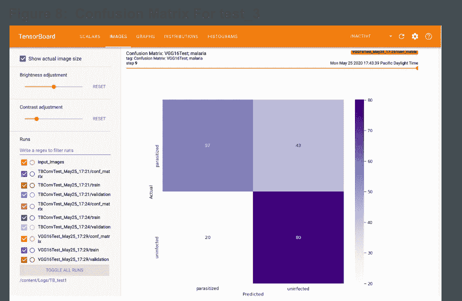

# 使用张量流数据集和张量板的张量流建模管道

> 原文：<https://towardsdatascience.com/a-tensorflow-modeling-pipeline-using-tensorflow-datasets-and-tensorboard-2152bb7f1023?source=collection_archive---------41----------------------->

## 介绍

在完成由泰勒·埃利奥特·贝蒂荣(TEB)教授的名为*面向开发人员的深度学习*的高信息量 AICamp 在线课程时，我对为机器学习模型构建者(像我这样的学生)创建一种更结构化的方法产生了兴趣，以理解和评估各种模型，并观察它们在应用于新数据集时的表现。因为这个特殊的类关注 TensorFlow (TF ),所以我开始研究 TF 组件来构建一个工具集，使这种类型的建模评估更加有效。在这样做的过程中，我了解了两个非常有用的组件， [TensorFlow 数据集](https://www.tensorflow.org/datasets) (TFDS)和 [TensorBoard](https://www.tensorflow.org/tensorboard) (TB)，这篇博文讨论了它们在这项任务中的应用。参见**参考文献**部分链接到 AICamp，TEB 和其他有用的资源，包括由 Neptune.ai 提供的全面的 TensorBoard 教程

## 目标

虽然术语“管道”在数据科学上下文中可能有多种含义，但我在这里使用它来表示一个建模管道或一组编程组件，它们可以从加载数据、应用预先确定的模型和记录性能结果中自动完成端到端建模。目标是建立大量的建模测试，并为每个测试自动运行管道。一旦模型经过训练，每个测试结果都可以很容易地与其他结果进行比较。总之，目标是为模型测试建立一个有效的、有组织的和系统的机制。

建模管道的逻辑流程

这种方法如图 1 所示。管道由三个步骤组成:

1.  **数据:**加载并处理一个数据集，
2.  **分析:**建立预定义模型并应用于该数据集，
3.  **结果:**为每个数据集-模型测试捕获关键指标，以便以后进行系统的比较。

任何研究甚至涉足深度学习神经网络的分析师可能都经历过看似无限的建模选择。任何数量的许多层类型，每种类型都有许多配置选项，可以相互连接，一旦堆叠，就可以使用多个优化例程和许多超参数来训练模型。还有数据的问题，因为可能需要将有前途的模型应用于新的数据集，以观察它们在看不见的数据上的性能，或者为进一步的模型迭代获得基础。

对于这个应用程序，我专门处理图像分类数据和模型。TFDS 包括音频、图像、对象检测、结构化、摘要、文本、翻译和视频数据，深度学习模型可以专门针对这些问题构建。虽然这里展示的现成代码需要一些修改和测试才能应用到其他集合，但是它的基本框架仍然是有帮助的。

## 张量流

本文中的代码总结在表 1 中，基于 TensorFlow 2.0(2019 年 9 月发布的产品)和两个组件 tensor flow 数据集和 TensorBoard。Keras 是一个与 TensorFlow 交互的高级 API，现在与 TF 2.x 深度集成，这里使用的许多工具都依赖于 Keras 组件。

建模管道中使用的关键 TensorFlow 组件

## 编码

事实证明，构建预期的建模管道需要相当多的编码。虽然可以更简单地部署这些 TF 模块的简单或直接的应用程序，但是在健壮的管道中使用它们需要一些定制的包装和实现组件来编排它们的使用，在该管道中数据和模型都被期望以编程方式改变。我把我的代码放在一个共享的 Google Colab [笔记本](https://colab.research.google.com/drive/18kklmZIT5S_lFoic2Jj_EVggskWbPlUU?usp=sharing) (TF_Modeling_Pipeline)中，所有人都可以访问。然而，我应该注意到，我使用 Colab Pro(一种订阅服务)，并在 GPU 设备上运行该笔记本。

虽然这个笔记本包含了很多代码，但我试图干净地组织和完整地记录这些工作，使其更易于浏览。此外，我在整个文档中添加了大量参考链接，以识别来源并提供对更多信息的快速访问。

调用 TensorFlow、TensorFlow 数据集和 TensorBoard 模块的关键自定义包装器

如前所述，这里的目标是构建一个自动化的管道。考虑到这个目标，我使用了几个定制的包装器来处理数据加载和处理、模型构建和训练以及结果记录过程。这些在图 2 中描述，并在表 2 中讨论。

调用 TensorFlow、TensorFlow 数据集和 TensorBoard 模块的关键自定义包装器

## 试验

为了演示这个管道，我设置了以下测试，其中数据集名称可以在 TFDS [目录](https://www.tensorflow.org/datasets/catalog/overview)中找到。

测试配置，检查应用于两个数据集的两个模型

回顾建立这些演示测试的思维过程，举例说明了这种管道方法的好处。在将 Tyler Bettilyon 的类和 TF 示例模型(TBConvTest)应用于 [MNIST](https://www.tensorflow.org/datasets/catalog/mnist) 数据集并发现良好结果后，我想看看它在彩色图像数据集上的性能。我最终选择了[疟疾](https://www.tensorflow.org/datasets/catalog/malaria)数据。正如你从 TFDS 目录链接或数据集信息[类](https://www.tensorflow.org/datasets/api_docs/python/tfds/core/DatasetInfo)中看到的，TFDS 数据集带有参考资料。

事实证明，这些材料非常有价值，因为 TBConvTest 模型在疟疾数据集上的早期测试结果不佳。这让我想到了 Sivaramakrishnan Rajaraman 等人的工作以及这篇[论文](https://lhncbc.nlm.nih.gov/publication/pub9932)和 GitHub [资源库](https://github.com/sivaramakrishnan-rajaraman/CNN-for-malaria-parasite-detection)。在那里，我能够找到关于他们对这些疟疾图像数据进行分类的方法的有用资源，vgg 16 测试模型相当于他们的一个模型。

## 数据

图 3 和图 4 中的训练数据图像示例保存在日志中，可以通过 TB 的图像特性获得(参见建模管道代码中的步骤 5)。

MNIST 图像示例

疟疾图像示例

## 模型

图 5 和图 6 中的模型图是由 TB 回调创建的，并且在 TB 的 graphs 特性中可用(参见建模管道代码中的步骤 7)。

TBConvTest 模型

vgg 16 测试型号

## 结果

这些测试的所有结果都存储在 TensorBoard 中，可以通过运行 TF_Modeling_Pipeline Colab [笔记本](https://colab.research.google.com/drive/18kklmZIT5S_lFoic2Jj_EVggskWbPlUU?usp=sharing)重新创建。作为概述，图 7 中的屏幕截图显示了 TB 仪表板。如您所见，有几个功能，其中一些我们已经讨论过，可以通过标题菜单访问。在这幅图中，我们正在查看标量下每个建模测试的关键准确性指标。

TB 仪表板和标量显示每次测试的预测准确性

从注释(我添加的)中，我们可以快速比较模型并进行一些观察。首先，test_1 和 test_2 之间明显的性能差异清楚地表明，TBConvTest 模型没有扩展到疟疾数据集。由于疟疾测试是一个二元分类，50%的准确率并不比猜测更好，并且该模型没有提供解释能力。其次，通过在疟疾数据集(test_3)上使用 VGG16Test 模型，我们可以看到增量改进。第三，通过查看每个时期(x 轴)的准确率，我们可以快速了解所有模型随着训练的改进。考虑到 Rajaraman 等人训练了至少 100 个时期，检查 test_3 的缓慢精度增长率并想知道额外训练的益处如何或何时显现是有趣的。

查看我们定制的指标“混淆矩阵”也很有帮助。假设我们的 TB 配置(参见建模管道代码中的步骤 7)在 IMAGES 选项卡中可用。该视图是在 10 个时期之后，但是顶部滑块允许用户浏览每个时期之后的混淆矩阵变化。从这个归一化矩阵中，我们注意到未感染类的准确率为 80%,而被感染类的准确率仅为 57%,这可以提供对其他模型变化和该模型的适当使用的洞察。

10 个时期后测试 3 的混淆矩阵

## 结论

建立一个半自动的、有组织的和有方法的管道来测试机器学习模型，并在多个数据集上验证它们的性能，这对建模者来说是一个有用的工具。TensorFlow 数据集和 TensorBoard 是 TensorFlow 2.x 开发套件中的两个组件，可提供大量管道功能，并可作为此类 TensorFlow 管道的基础。然而，为了实现自动化的好处，它们应该被包装在定制的编程组件中，这些组件提供有效构建深度学习模型所需的效率和可见性。

## 参考

*   如果你想了解更多关于 AICamp 或深度学习课程导师泰勒·埃利奥特·贝蒂莱恩(TEB)的信息，请访问他们这里: [AICamp](https://learn.xnextcon.com/) 和 [Teb 的实验室](https://www.tebs-lab.com/)。
*   关于全面的冲浪板教程，请看 Neptune.ai 的[深潜](https://neptune.ai/blog/tensorboard-tutorial)。

**博客**

*   [在 TensorFlow 1 & 2](https://medium.com/analytics-vidhya/basics-of-using-tensorboard-in-tensorflow-1-2-b715b068ac5a) 中使用 TensorBoard 的基础知识:塞巴斯蒂安·蒂勒非常有用的总结
*   [面向专家的 TensorFlow 2 快速入门](https://www.tensorflow.org/tutorials/quickstart/advanced)
*   [如何从头开始创建 TensorFlow 2 模型——一个“无用”的例子](/creating-a-trashy-model-from-scratch-with-tensorflow-2-an-example-with-an-anomaly-detection-27f0d1d7bd00)
*   [如何使用 Keras 的 TensorBoard】](https://www.machinecurve.com/index.php/2019/11/13/how-to-use-tensorboard-with-keras/#)
*   [tf。为 Keras 用户解释的 GradientTape】](https://medium.com/analytics-vidhya/tf-gradienttape-explained-for-keras-users-cc3f06276f22)
*   [如何在 TensorFlow 中使用数据集和迭代器](https://medium.com/@prasad.pai/how-to-use-dataset-and-iterators-in-tensorflow-with-code-samples-3bb98b6b74ab)
*   [用 TensorFlow 2 迁移学习](https://www.codeproject.com/Articles/5252014/Transfer-Learning-with-TensorFlow-2)

**张量流**

*   [TensorFlow 2.x](https://www.tensorflow.org/)
*   [Keras](https://www.tensorflow.org/guide/keras/overview)
*   [tf.data.Dataset](https://www.tensorflow.org/api_docs/python/tf/data/Dataset?hl=en)
*   [张量流数据集](https://www.tensorflow.org/datasets)
*   张量板

## 管道代码