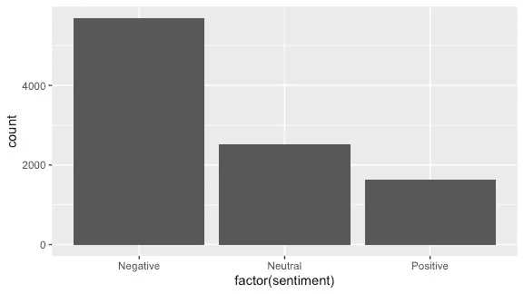
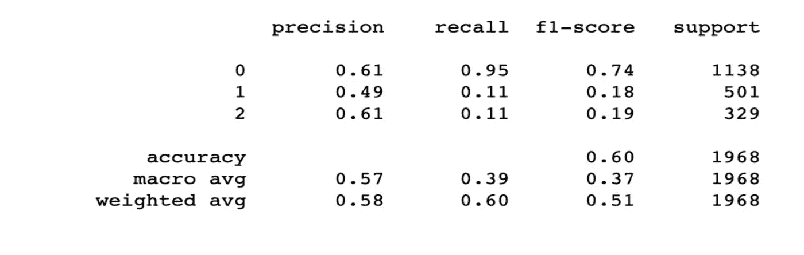
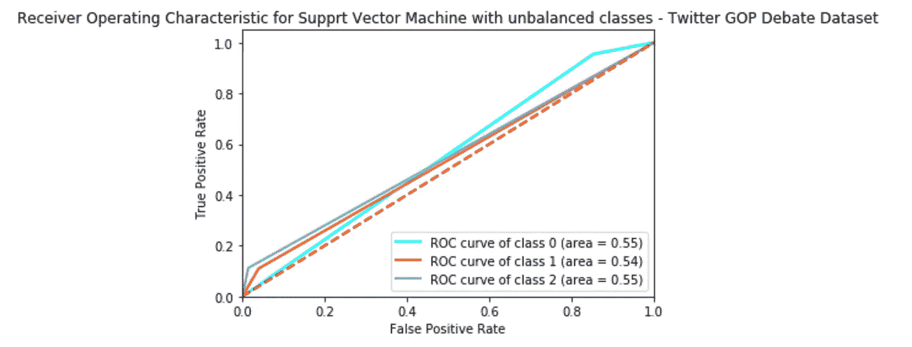
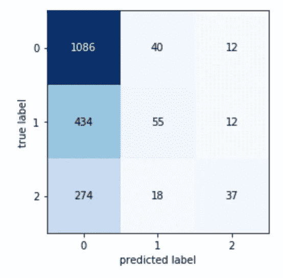
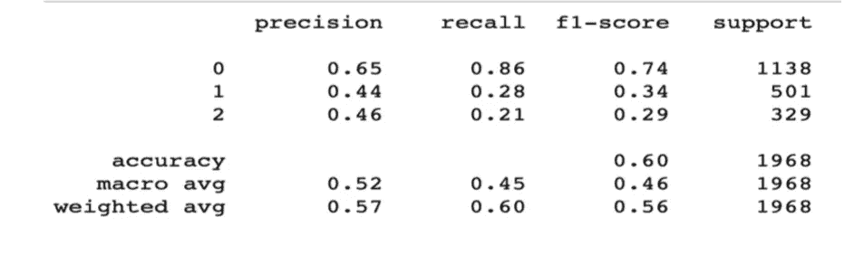
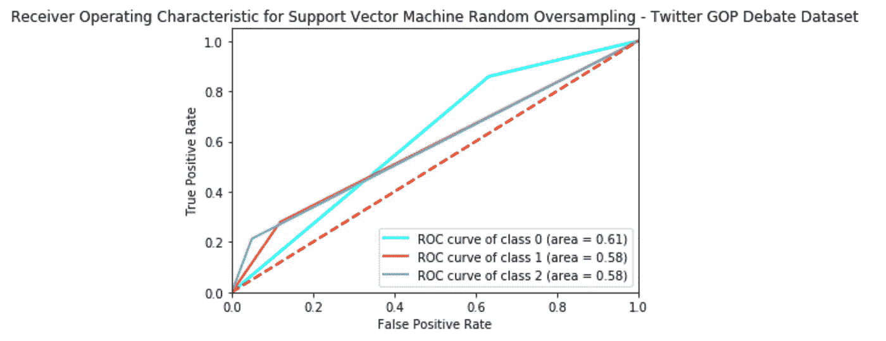
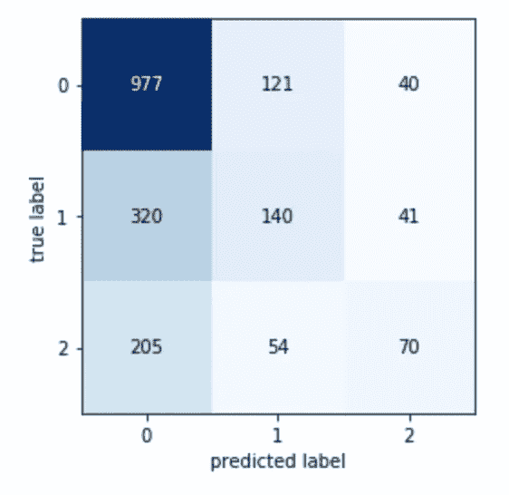
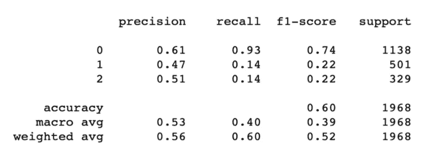
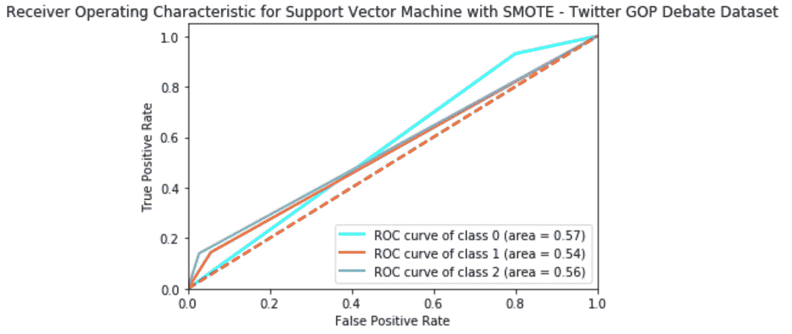
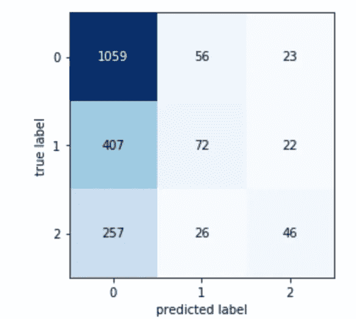

# 基于不平衡 Twitter 数据集的 SVM 三级情感分类

> 原文：<https://towardsdatascience.com/a-three-level-sentiment-classification-task-using-svm-with-an-imbalanced-twitter-dataset-ab88dcd1fb13?source=collection_archive---------33----------------------->

## 从现场反应推文到 2016 年第一次电视直播的共和党辩论，中国人正在学习情绪分类

由[在](https://unsplash.com/@historyhd?utm_source=medium&utm_medium=referral) [Unsplash](https://unsplash.com?utm_source=medium&utm_medium=referral) 上高清拍摄的历史

作为一名新闻迷，我喜欢看到政治如何在社交媒体上获得如此情绪化的回应，并想知道这种轶事般的激情感是否可以转化为机器学习分类。我发现了一个针对 2016 年第一次共和党总统辩论的推文数据集( [**h**](https://data.world/crowdflower/first-gop-debate) **ere** )，并希望创建一个三级情感分类器，可以从推文文本中解释情感。这篇文章是我整理的一套方法和技术的一部分，现在我将只关注一个方面；不起眼的支持向量机。作为次要任务，我注意到数据集严重不平衡，所以想尝试对少数类进行增采样，以提高分类器在所有标签中的有用性(这有望帮助分类器在所有类别中得到改进)。

# 数据探索和清理

谁能想到 Twitter 如此负面？作者图片

从数据集细分的原始数据中，我们立即看到了推文传播的问题。负面推文很普遍，是中性和正面推文总和的两倍多。这可能会对分类器在实践中的表现产生影响。(最有可能的是，如果像这样训练，分类器会很好地理解负面推文，但不会有太多识别其他任何东西的练习！)

“清理”数据的第一步是将所有字母转换成小写，然后从推文中删除标点符号、数字、网址和用户名。

使用“NLTK”停用词语料库从推文中删除停用词，并从推文中提取空白，每个词都被标记化，以便表示被视为停用词的单独数据块。

重复的推文随后被删除。在其他预处理步骤之后，我们决定删除重复的内容，因为 Twitter 的本质是由“转发”组成的，回复其他用户或评论的用户名可能会有完全相同的内容。这剩下总共 9836 条独特的推文准备分类。阴性:5692，中性:2521，阳性:1623。数据集被分成 80%用于训练，20%用于测试

# 矢量化— TF/IDF

出于对文本进行大多数数学建模的目的，以及出于该实验的目的，实施了不同的“矢量化”过程。

文本内容在没有被转换成数字以供机器学习算法读取的情况下，不能单独被改变和强制到数学空间中。

这就是为什么在本项目中，出于监督方法的目的，使用不同类型的矢量化将定性数据转换为定量数据，以便进行数学处理。这些向量成为模型的嵌入特征。

**术语频率/逆文档频率(TF/IDF)**

这是用于支持向量机模型的矢量化技术。TF/IDF 在训练数据上使用了一种单字方法，该方法将每个单词作为一个术语。“术语频率”是指某个单词在文本中出现的频率，“逆文档频率”是指降低在所有文本中出现频率最高的单词的重要性。

这用于产生在给定文档中频繁出现但不一定在所有文档中出现的单词。

# 数据平衡和采样技术

随机过采样、合成少数过采样和真实世界不平衡方法形式的数据平衡都被利用和比较。

**采样技术**

考虑数据平衡问题和协议是至关重要的，因为每一项行动都应减少偏差和提高真实性能，但也要尝试和减少过度拟合，并对模型的潜力有更细致的表示。考虑上采样技术很重要，因为它可以使模型更容易地勾勒出其决策边界。决定不使用欠采样技术，因为在这种情况下，由于数据集最初非常小，并且由于预处理措施和训练分割而进一步减少，所以感觉这对于提高性能没有什么作用。

**没有采样**

班级可能会不平衡，因为模型正在接受训练，以准确了解推文在现实生活中的表现。如果认为模型在之前没有进行上采样的情况下可能表现不佳，那就太天真了。如果给定领域中的数据天生严重不平衡，那么对不平衡数据的训练可以产生最佳输出。

**随机过采样**

随机过采样是从两个少数类中提取重复样本并将其添加到训练集中的过程。样本是从训练集中的少数类中随机选择的，然后被复制并添加到训练集中，在那里它们有可能被再次选择。

因为重复是精确的，并且重复的例子有可能出现多次，所以存在用这种方法过度拟合少数类的风险，并且对于实现这种技术的模型来说，数据的一般化增加了。

为了这个实验的目的，少数类都被上采样到与多数负类相同的值，因此在应用上采样之后，每个类有 5，692 个样本。

**合成少数过采样技术 SMOTE**

研究人员；舒拉、鲍耶、霍尔和凯格尔迈尔在他们的论文中创建了这种上采样技术，该论文以题为“SMOTE:合成少数过采样技术”的技术命名( [**看这里！**](https://arxiv.org/pdf/1106.1813.pdf)

**SMOTE 是另一种有用的上采样方法。与从少数类创建数据点的精确副本的随机过采样相反，SMOTE 使用一种类型的数据扩充来“合成”全新且独特的示例。通过在特征空间中选择彼此接近的实例，并在这些实例之间创建边界，以及在沿着该边界的某个点创建新样本，来实现 SMOTE。这种方法往往是有效的，因为新的合成推文更接近特征空间中的其他示例，因此它们的极性可能比随机上采样的示例更接近，并且因为它们与随机过采样中的示例不完全相同，所以过拟合的可能性降低了。**

# **估价**

**实验评估指标各不相同，通常取决于所执行任务的性质。一些常用于分析程序分析的评估指标包括但不限于:准确度、精确度、召回率、均方误差、损失函数分析、曲线下面积、F1 分数。不同领域中的不同模型将导致每个指标的不同结果，必须确定合适的模型，并且必须满足必要的评估标准。**

****精度****

**准确性是分类任务中最常测量的评估度量之一，并且最常被定义为正确分类的标签的数量与总预测数量的比例。**

****F1-得分****

**“F1 分数”、“F 分数”或“F 度量”是用于评估基于自然语言的任务的常见度量。它通常被认为是“精确度和召回率的调和平均值”，或者传达了精确度和召回率之间的平衡。**

**F-Measure 表达了精确度和召回率之间的平衡。由于准确性仅给出了模型正确结果的百分比，但并未显示出模型在寻找真正的正面结果方面的熟练程度，因此根据需要，这两种方法都有优点。**

****接收机工作特性(ROC)****

**ROC 是显示分类模型在其真阳性率(TPR)和假阳性率(FPR)方面的性能的图表。TPR 定义为模型输出的真阳性总数除以真阳性数加上假阴性总数。**

****曲线下面积(AUC)****

**AUC 统计是 ROC 曲线下的维度空间的度量。该图给出了所有潜在分类阈值的模型性能的综合得分。
对此的一种解释是，该模型将一个正的随机例子置于比一个随机负的例子更高的位置。AUC 总是介于 0 和 1 之间的数字。**

**ROC 度量是有用的，因为它对数据中的先验类别概率或类别流行度以及 AUC 具有不变性。这对于这项研究很重要，因为这些阶层是严重不平等的。负面类别的大量存在表明模型随机正确分类正面推文的概率增加了。**

# **结果**

**以下是从支持向量机获得的结果，该支持向量机利用各种过采样技术对少数类训练有词频率/逆文档频率向量。**

**下图显示了根据不平衡训练数据训练的支持向量机模型的结果。此处模型的总体准确率为 60%，但从这种方法的精确度、召回率和 f1 分数来看，我们可以看到该模型在对较小的类别进行分类时表现不佳。该模型理解负类，但未能从较小的类学到很多，这从中性类和正类相当低的 18%和 19%的“f1”中可以清楚地看出。**

****

**作者图片**

**从下面显示的 ROC 曲线和 AUC 中，我们看到了模型性能的更全面的观点。除了中性组的 AUC 比其他组低 1%之外，所有三组的真实阳性率几乎相同。即使该模型具有 60%真阳性率的总体准确度，该模型的总体分类能力也不是特别明显。**

**从所示的混淆矩阵中，我们看到了 SVM 模型的实际预测值。该模型清楚地显示了其在对负面类别进行分类时的最佳性能。**

**这个班有 1086 个正确的预测。然而，我们只看到 37 个负类的正确预测，比这里正确预测的 10%略少。中性类有 55 个正确的预测，比这里的负类略有改进。有趣的是，这个模型错误地将一条推文标记为负面的情况比其他任何类别都多。显示了该模型如何严重依赖于负面类别来影响其决策。**

****

**作者图片**

****

**作者图片**

****支持向量机 TF/IDF 随机过采样类****

**下面显示的分类报告显示了应用随机过采样技术对少数类进行上采样时 SVM TF/IDF 模型的结果。值得注意的是，这种方法的总体准确性与具有不平衡类别的相同方法没有不同，但是模型在正确分类较小类别方面的性能确实略有提高，如负面类别上改进的 f1 分数所示。**

****

**作者图片**

**下图显示了采用随机过采样的 SVM 模型的 ROC 曲线和 AUC 图。该模型在所有类别中的真实阳性率在所有类别中至少提高了 4%。该模型不仅通过增加少数民族类别的样本来改进其对否定类别的分类，而且该模型在所有类别中都有相当大的改进。该模型仍然最擅长发现负类，但是当呈现更多样化的训练示例时，它也没有丢失任何这种知识。**

****

**作者图片**

**下图显示了 SVM ROS 模型的混淆矩阵。值得注意的是，当与不平衡数据集相比时，分类器在正确分类负面类别方面稍差(分别为 1086 对 977)，但其正确分类正面类别的能力几乎加倍(37 对 70)。中性类的正确预测数量显著增加(从 55 到 140)。还需要指出的是，错误分类的负面例子的总数显著减少。**

****

**作者图片**

****支持向量机 TF/IDF SMOTE****

**下图显示了应用 SMOTE 上采样技术的 SVM-TF/IDF 的分类报告。该模型的总体准确性保持在 60%的静态水平，但是，与不平衡方法而不是随机向上采样方法相比，我们确实看到两个少数类的 f1 得分有所提高。**

****

**作者图片**

**下图显示了 SMOTE SVM 的 ROC 曲线和 AUC 数。通过比较下面的两个图表和指标可以清楚地看出，与 ROS 方法相比，真正的正数明显下降。当与不平衡方法相比时，这种方法仅略微有所改进。当与没有上采样相比时，负类的分类具有 2%的改进，并且通常该模型对任何类的分类能力降低 1%到 2%。**

****

**作者图片**

**最后，下图显示了带 SMOTE 的 SVM 的混淆矩阵。负面类别仍然是分类器正确识别的标签，但有趣的是，当使用这种技术时，中性类别的正确预测与 ROS 相比下降了几乎一半(72 对 140)。与 ROS 相比，这里的分类器使用这种技术也将推文错误分类为负面的。在这种情况下，分类器严重依赖于否定类标签，而不是使它做出的预测范围多样化。同样值得注意的是，这个模型不仅比 ROS 模型对阳性类别的错误分类更多，而且对这个标签的总预测也少得多。**

****

**作者图片**

# **评估和结论**

**当在不平衡的训练数据上训练时，支持向量机发现很难做出正确的分类。不使用参数调整技术和简单的线性方法也可能导致问题。**

**SVM 对不平衡的数据很敏感，对自然平衡的类工作得最好。这可能导致性能下降。这也解释了为什么不平衡的实验产生了不太有用的结果。**

**就一般意义上的总体精度而言，所有三种上采样技术给出了相同的精度度量，但是直观上清楚的是，最好的性能始终是标记负类。**

**参考分类器的“F1-Measure ”,随机上采样模型给出了最好的结果。但是，必须记住，随机过采样数据会精确地重新创建实例，这有可能导致过度拟合。**

**在 GitHub repo [**这里**](https://github.com/apcoyne/SVM-GOP-TWEETS) 上可以找到 Jupyter 笔记本以及伴随该报告的所有 python 代码！:)**

**爱尔兰都柏林自由数据科学家艾伦·科因撰写的报告和代码**