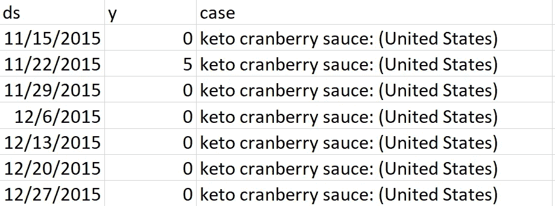

# 整洁的预言家

> 原文：<https://towardsdatascience.com/a-tidy-prophet-5a23382d59e3?source=collection_archive---------41----------------------->

由 [Unsplash](https://unsplash.com/s/photos/oracle?utm_source=unsplash&utm_medium=referral&utm_content=creditCopyText) 上的 [Viva Luna 工作室](https://unsplash.com/@vivalunastudios?utm_source=unsplash&utm_medium=referral&utm_content=creditCopyText)拍摄的照片

## 在许多没有显式循环的情况下进行预测

对于任何分析师/数据科学家来说，一个常见的问题是采用分析管道，然后在多个数据集上使用它。正如所料，R 有几种方法来处理这个问题——显式循环、[*应用函数](/dealing-with-apply-functions-in-r-ea99d3f49a71)和 purrr。Purrr 是新来者(特别是对于我们这些在 RStudio 出现之前就已经了解 R 的人来说)，但因为它承载了 tidyverse 背后所有深思熟虑的、富有表现力的设计，所以它可能是最强大的。

脸书的 [prophet](https://facebook.github.io/prophet/) 是一个越来越流行的时间序列建模包，有 R 和 python APIs。它建立在概率编程语言 stan 的基础上，速度很快，擅长用相对较少的分析师工作量对高频率(daily plus)数据做出相当好的预测。实现 prophet“大规模预测”的承诺需要拟合多个模型，这使得它成为展示 purrr 优势的一个很好的例子。

我们将使用 google trends 每日数据进行搜索，将流行饮食与蔓越莓酱结合起来，看看 tidyverse 和 prophet 如何在几行代码中结合起来，预测尽可能多的时间序列。

蔓越莓不仅仅是用来喝的！

对于那些不熟悉的人来说， [google trends](https://trends.google.com) 是一款用户可以输入搜索词并获得使用这些词的搜索历史的产品。可以并排放置多达五个搜索词，所有搜索词都按相同的因子缩放(我相信是屏幕上的最大值)，以查看搜索活动的时间轨迹。在这种情况下，我找到了五个关于蔓越莓酱的相关搜索。

谷歌趋势:keto 超过旧石器时代两年运行在重要的蔓越莓酱搜索量！

我们在每年的美国感恩节附近都会看到一个强劲的峰值(注意，趋势数据是针对美国搜索而提取的)，这与我们的直觉相匹配，并为我们提供了一组有趣的时间序列来建模。

为了将我们的重点紧紧放在结合 purrr 和 prophet 上，我已经手动将下载的数据重新调整为长格式。我还将日期列重命名为 ds，趋势卷列名设置为 y，以符合 prophet 包的要求。文件的顶部看起来像这样:

方便成形的输入数据是你如何知道这是一个教程！

为了设置我们的示例，我们需要导入。csv 文件作为我们的训练数据，并创建一个数据框架，以传递到拟合的先知模型进行预测(在代码中称为未来)。

现在，我们的表格中的数据基本上是按照。csv 文件。但是从 Hadley Wickham T1 的意义上来说，这并不十分整洁，因为对于我们的目的来说，每个搜索词(即表中的列的每个值*案例*、趋势数据)都是一个单独的案例或分析项目。

请记住，我们的目标是将第一个案例的数据传递给 prophet()，然后将下一个案例的数据传递给 prophet()，直到处理完所有案例。

分析大量案例的简洁方法是将给定案例所需的所有数据打包到表的一个单元格**中，这样表的每一行都包含标识符、函数参数和分析单个案例所需的数据。nest()函数用于从我们现在拥有的普通平面 tibble 转换为具有嵌套列的 tibble。它是嵌套的，因为新列的每个元素都是一个 TiB ble——我们在 tibbles 中得到 tibbles，就像嵌套的洋娃娃一样。嵌套的 tibble 在每个案例中只有一行(对我们来说是 5 行),而不会丢失原始表中的任何数据(本例中有 1300 行)。**

整洁怎么样？

第 7 行创建了嵌套的时间序列数据。使用默认参数调用 nest()意味着所有非分组列都嵌套到一个名为 *data* 的新列中。在第 14 行，我们还使用一个显式规范将未来数据案例嵌套到一个名为 future 的列中，其中嵌套的列名为 *future。*

现在我们可以在所有这些案例上训练我们的先知了！但是首先我们应该为 prophet()调用准备一个额外的输入。如果你记得上面的图表数据，我们可能需要包括感恩节的假日效应。prophet 包为此提供了两个选项，但是传入一个定义假日的 data.frame 与 purrr 一起使用效果更好。

第 12 行最后做了本文承诺的事情，用一行代码在每种情况下拟合一个先知模型。我们使用了*map 系列函数的最基本版本；map()有两个必需的参数:一个列表和一个函数名(不带括号！).map()所做的是遍历列表，依次获取每个成员，并将其作为函数的第一个参数传递给函数。每次调用函数的返回值都保存在一个列表中，map()调用返回所有函数返回的列表。在所有情况下都具有单个值的函数的附加参数(即，不是根据正在处理的数据列表的成员而变化的值)可以通过调用函数名后面的 map()来传递。在我们的例子中，holidays=turkeyDayUSA 论证了这一点。

我们要传递的列表在哪里？map()的第一个参数是*数据。*回想一下，这是我们用 nest()调用生成的 *nestedData* 中的列名。在 R 中，data.frame(以及 tibble，tidyverse 的等价物)的每一列都是一个列表。也就是说*数据*是一个列表。因为 map() **也输出**一个列表，这个输出可以用来创建一个 tibble 的列。mutate()函数在这里为我们处理这个问题，但是我们也可以很容易地用`nestedResults$model=map(data,prophet,holidays=turkeyDayUSA)`直接添加列。模型列表的每个成员都是类先知(具有复杂结构)的对象这个小细节根本不会困扰 R，也不应该困扰我们。

坦白地说，所有这些都很难想象，所以我建议您运行代码(来自 [github repo](https://github.com/lorenze3/aTidyProphet) )，然后使用 *nestedData* 表。你觉得 nestedData$data[[1]]是什么？或者 nestedData$data[[1]][1，:？

12 号线只是一个开始。因为一旦我们理解了 map()的工作方式和嵌套列的工作方式，我们就可以画一条线 19。这里我们展示了 pmap()，它只是对 map 的一个通用调用，允许从列表中提取任意数量的(可选的)命名参数并传递给函数。我们还利用了这样一个事实，即在单个 mutate()调用中，我们可以创建变量，然后在下一个要创建的变量中使用它们来为第 12 行中的模型创建预测和绘图。是的，我们可以很容易地在一个 mutate()调用中包含第 12 行的模型拟合。

我将把从 *nestedResults* 中提取情节的练习留给读者(提示:像访问常规列一样访问列名，然后记住它是一个列表！).

预言家预测 keto 蔓越莓酱去年达到顶峰

我希望这篇文章有助于解释 purrr 包的函数式编程工具。与其他 tidy 工具一样，*map 函数简化并阐明了一项常见任务的编码。在这种情况下，该任务在多个案例上运行一组步骤。更简单和更清晰的代码意味着更少的时间调试和检查搜索 [stackoverflow](https://stackoverflow.com/) 和更多的时间尝试花哨的模型和向关键的利益相关者展示结果——这对任何人来说都是一个胜利。

*本文引用的完整代码和附带的源数据文件可以在*[*github*](https://github.com/lorenze3/aTidyProphet)*上找到。*