# 从 a 到 Z:使用此规则集的主数据可视化

> 原文：<https://towardsdatascience.com/a-to-z-master-data-visualization-with-this-ruleset-73a22c29716?source=collection_archive---------77----------------------->

图片由 [Free-Photos](https://pixabay.com/photos/?utm_source=link-attribution&utm_medium=referral&utm_campaign=image&utm_content=1082309) 来自 [Pixabay](https://pixabay.com/?utm_source=link-attribution&utm_medium=referral&utm_campaign=image&utm_content=1082309)

**简介:**

无论您是尝试进入数据分析还是数据科学领域，无论您是产品经理、销售主管还是任何希望了解其业务的人，能够以有意义的方式利用数据都是关键。无论你使用的是 Tableau、Domo、PowerBI 等数据可视化软件。或者你用的是 R，Python 等语言。有各种各样的原则和概念可以帮助你开始。

**您分析的目的:**

首先，请记住，任何分析都应该有一定的目的。看着图表，很容易问自己:“我为什么要看这个？”或者“我应该在这里得到什么？”。归结为一个非常简单的原则，我们希望了解给定变量的性质&该变量可能与其他变量有什么关系。

**需要牢记的关键事项:**

维度，数据类型

**维度:**

这里我们讨论的是 3D 中 Ds 的数量。所以当你在二维空间玩超级马里奥的时候，你有一个 x 轴和一个 Y 轴。我们大多数人都见过许多二维图表和图形。思考这个问题的方法是，“在一个给定的可视化中，我想要包含多少个变量？”。作为这里的一般规则；少往往就是多。

**数据类型:**

字段是否为数值型；年龄、体重等。绝对的；性别，发色等。或者时间；某事发生的日期、月份或日期。一旦你理解了这一点，并对某些变量之间的关系有了一些假设，你就可以开始规划你可能使用的可视化类型。

**语言和数据集:**

所有的可视化都将使用 R 中的 ggplot2 包，使用各种样本数据集，包括 iris、mtcars、mpg 和 economics。我不会在这里包括太多的 r 代码，因为我希望这是广泛适用的，但如果你想要这些代码，请在下面评论或联系。

**跳跃中:**

在我们实际进行任何可视化之前，我们还需要做其他事情来理解数据，但是我们将直接进入可视化，以便具体了解可视化的规则。

我们将按照数据类型和维度，从一个维度开始，讨论各种选项和规则。

维度数量:1

数据类型:数字

数据集:mtcars 包含在 base R 中的样本数据集给出了汽车上的各种数据点

目的:了解分布和汇总统计

图表:直方图和箱线图

当试图孤立地理解一个数字变量时，你首先要理解它的分布。为此，您将使用一个简单的直方图来告诉您每个值出现了多少次。我们想了解的第一个变量是马力。

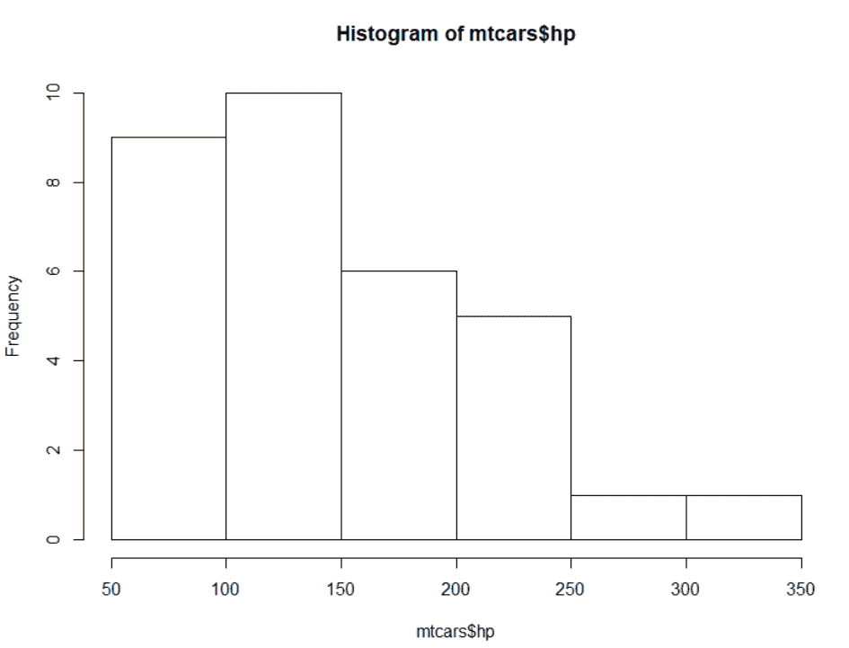

我们在这里看到的是，马力向右倾斜，或者说峰值右侧的尾部比左侧的尾部延伸得更远。如果你想一想一辆汽车的典型马力，大多数将小于 250，但肯定仍有汽车被制造来推动这一极限，尽管少得多。

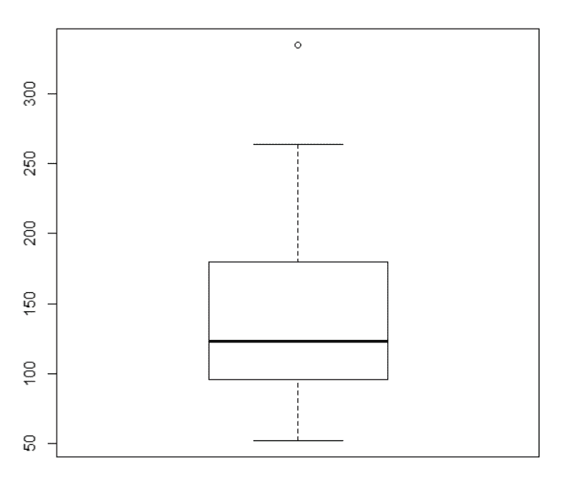

这是同一变量 hp 的盒状图、盒状图和须状图。箱线图对于可视化给定变量的大量汇总统计数据非常有用。图末端的水平线代表最大值和最小值。黑色水平线是中间值。中位数所在的方框表示 IQR 或四分位数范围(将数据分成四个偶数四分位数，IQR 表示第一个四分位数和第三个四分位数之间的范围)。

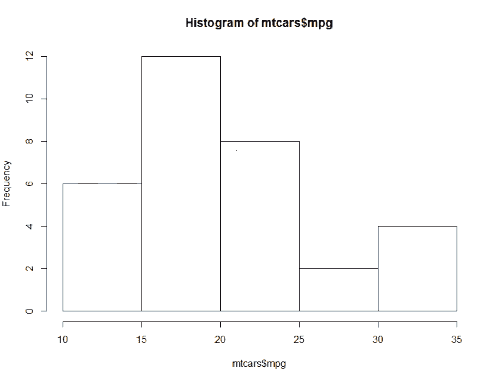

这里我们看到一个每加仑英里数的直方图，我们看到一个稍微右偏的分布。它也几乎呈现双峰。双峰是指实际上有两个峰值。一种解释是，我们重叠了燃气汽车和电动汽车的分布，所以我们假设燃气汽车的平均 mpg 在 15-20 之间，而电动汽车的平均 mpg 在 30-35 之间，那么如果有足够的量，我们可以在分布中看到两个峰值。

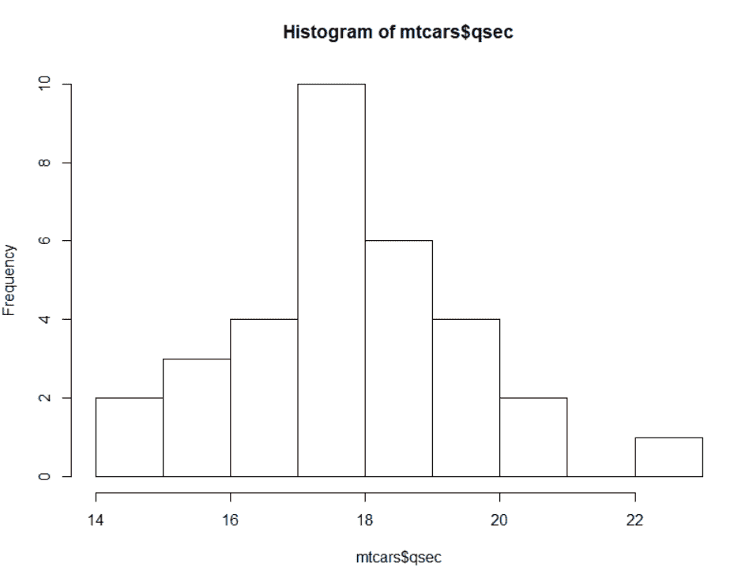

我们现在关注 qsec。汽车性能指标。这是汽车行驶一英里所需的时间。我们在这里看到的是一个非常标准的正态分布。

维度数量:1

数据类型:分类

数据集:mpg 包含在 base R 中的样本数据集给出了汽车上的各种数据点

目的:理解比例

图表:条形图和饼图

当试图孤立地理解单个分类变量时，您要考虑的主要问题是一个给定术语出现了多少次。

现在让我们来看看 mpg 数据集中的变速器和等级变量。为此，我们将创建一个条形图，X 轴上是分类变量，Y 轴上是出现次数。

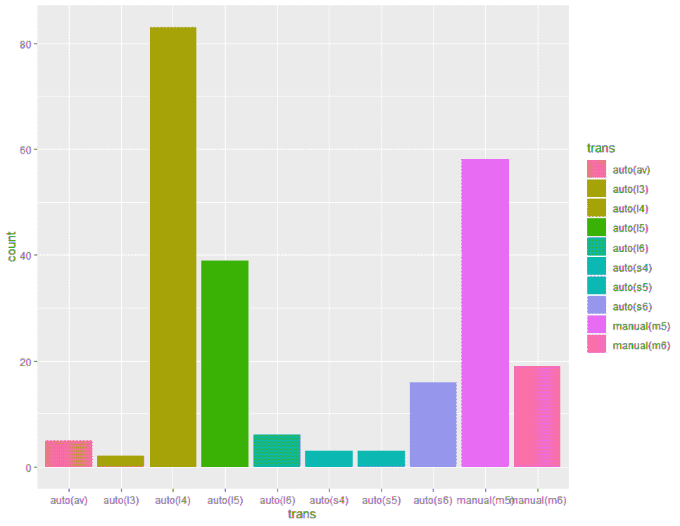

在这里，您可以了解到哪些传播是经常发生的，而哪些传播似乎稍微少见一些。通常你不需要包括颜色，只是为了让事情更清楚一点。

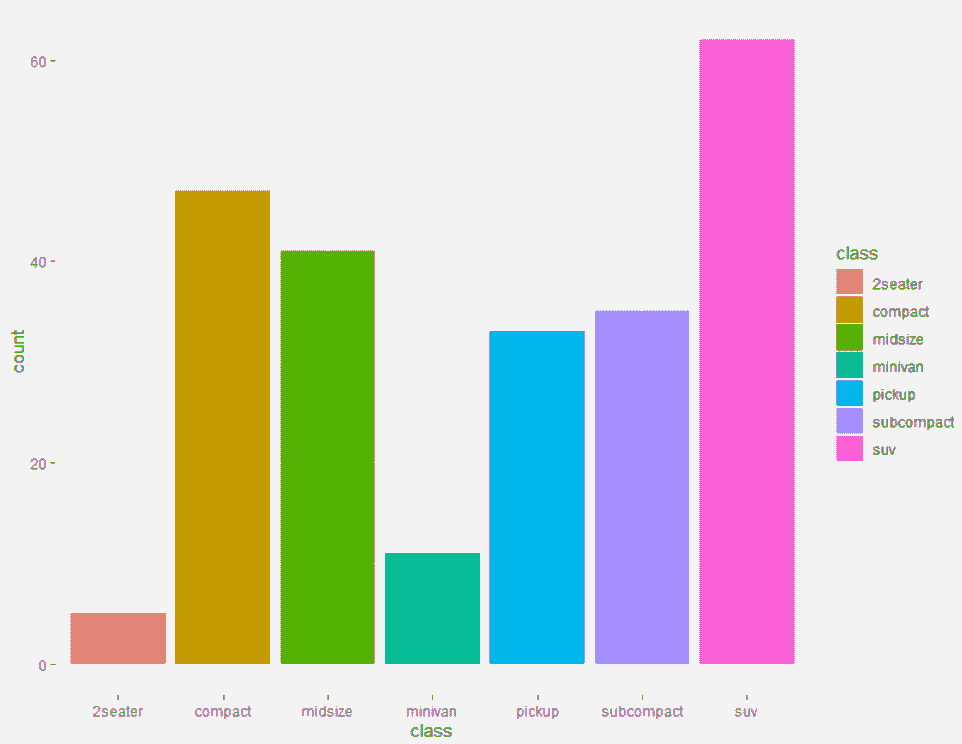

类似地，我们可以看到按类别绘制的事件计数。我们可以看到，与 SUV 或紧凑型车相比，2 座车和小型货车的出现频率要低得多。这个条形图可以像饼图一样容易地显示出来。饼图有时比条形图更难描绘给定切片的体积，因为任何给定切片都有不同的角度，可能在饼图的不同侧，等等。

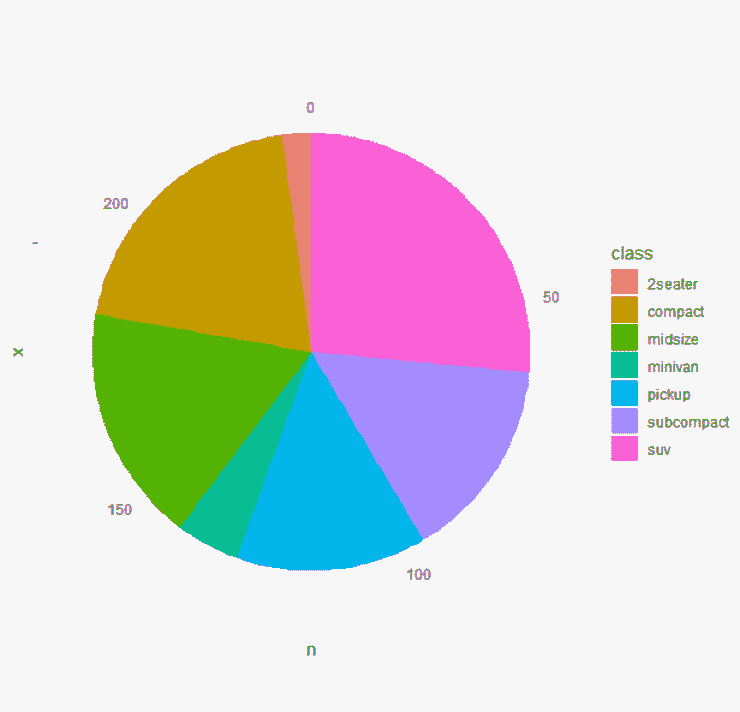

如上所述，这是一个类变量的饼状图。

此外，我们可以使用条形图来绘制分类变量的其他聚合。例如，每辆车平均每加仑跑多少英里，但我们会在后面讨论。

好了，现在我们已经单独研究了数字变量和分类变量；让我们将绘制的维度数量增加到两个，并查看一些不同的组合。

维度数量:2

数据类型:数字

数据集:Iris & mpg 包含在 base R 中的样本数据集给出了三种鸢尾的各种数据点以及它们的一些测量值

目的:理解两个变量之间的关系

图表:散点图

每当试图理解两个数值变量之间的关系时，散点图是最佳实践。

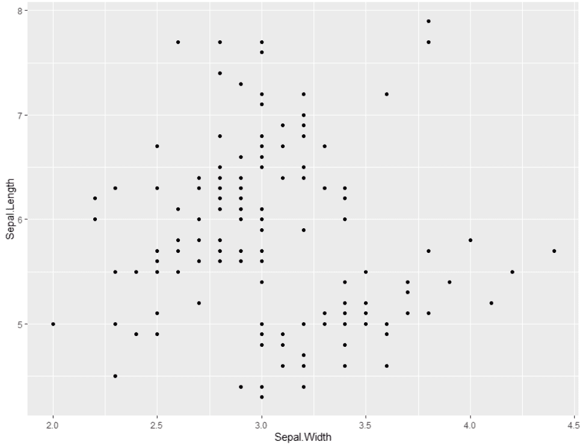

在这里，我们试图观察萼片的长度(Y 轴)和宽度(X 轴)之间的关系(对于植物解剖，只需运行快速谷歌搜索..:) )

我还查看了这两个变量的相关性(衡量两个变量如何相关或一起移动，1 表示移动完全同步，-1 表示它们完全相反，5 或-.5 是良好的关系，3 或-.3 可能是弱关系，任何低于这一水平的都是弱关系或随机关系)，发现它是-.11，表明没有真正的关系。虽然看起来这两个变量是不相关的；考虑变量之间关系的许多潜在层面是很重要的。

这个我以后再讲，现在先来先睹为快。虽然在前面的图中，我们看到宽度和长度似乎不相关，但尽可能多地包括潜在的视角是很重要的。看着和之前一样的剧情，我们准备给它再增加一个维度；物种。我们将用颜色来显示物种。

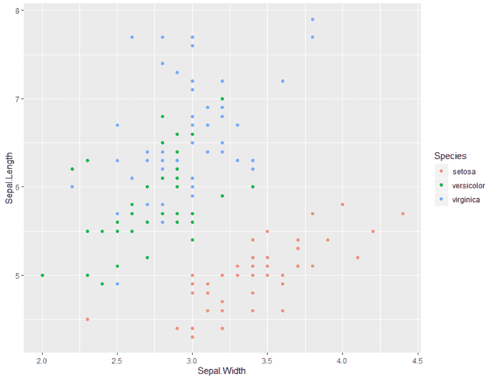

一旦我们添加了第三维，我们可以看到，在物种的长度和宽度之间有一个清晰的线性关系。

下面我已经包括了按物种分组时的相关性，我们可以看到在高端的相关性为 0.74，在低端的相关性为 0.46，这仍然是相当可观的。

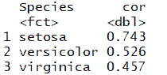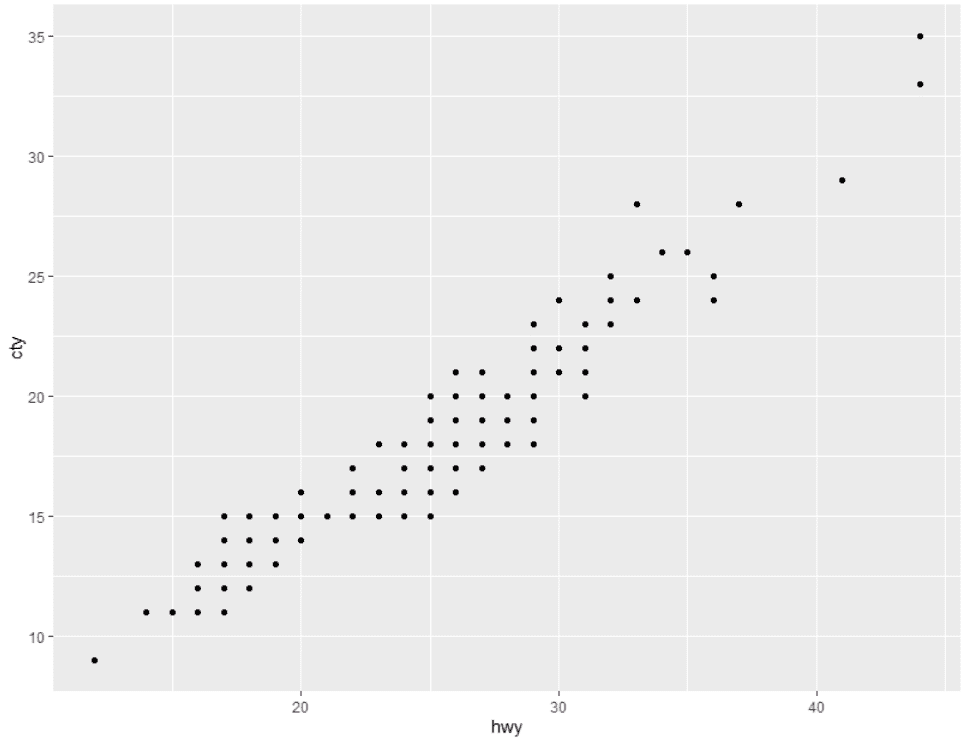

现在让我们回到评估两个数值变量。在这里，我们看到的是城市英里数和公路英里数。这里，散点图以线性方式向右上方移动，表明两者之间存在正相关关系。这两个变量的相关系数为 0.96。

如果你是统计学新手，需要记住一些事情。即使这些东西一起移动。并不一定意味着一个是另一个的原因。这只能说明他们有血缘关系。

为了继续评估二维数据的其他组合，让我们考虑如何分析两个分类变量之间的关系。

维度数量:2

数据类型:分类

数据集:mpg 包含在 base R 中的样本数据集

目的:理解两个变量之间的关系

图表:表格、热图、条形图

在开始可视化之前，我将在一个表格中展示两个分类变量，因为两个分类维度的可视化代表了我们在表格中会发现的内容。

下表来自 mpg 数据集；我们正在考虑汽车的级别，以及汽车是四轮驱动、前轮驱动还是后轮驱动。

在这里，我们可以看到属于任何给定分类变量组合的记录的频率

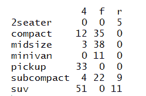

一眼就能看出 SUV，4 轮驱动是最常见的。你可以添加的另一层是把每个单元格看作整体的一个百分比。

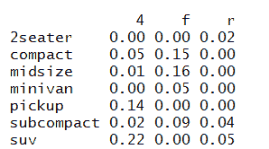

关于道具桌还有更多内容要做，但是我们将把它留到下一次。

从这里开始，我们要想象我们在道具桌上看到的东西。

将这个表格可视化的一个很好的方法是使用热图。看看下面的图表。在任一轴上，您可以看到分类变量，热图的颜色由出现次数表示。

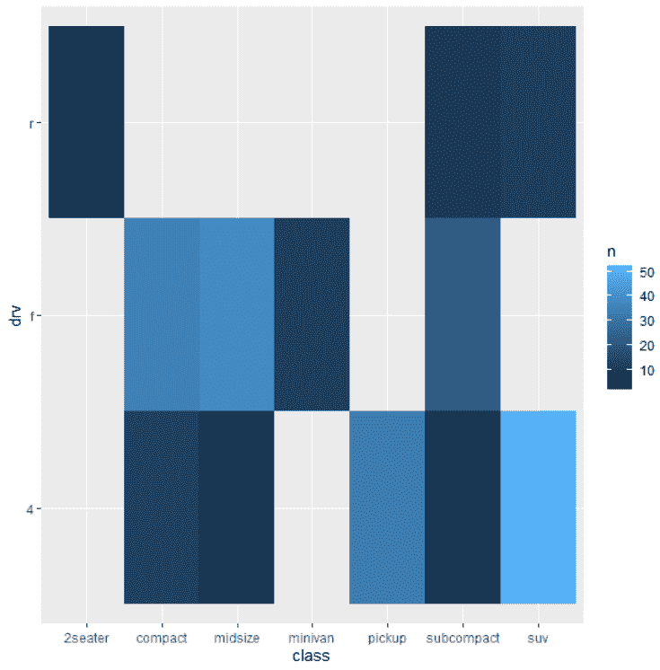

正如我们在原始表格中看到的，SUV，4 轮驱动是最常见的，中型前轮驱动次之，紧凑型前轮驱动第三。

热图在准确测量数量方面存在一些困难。我们有一个图例，根据你使用的软件，你可以很容易地把它作为工具提示。

另一个选项是返回到条形图，其中一个分类变量在 x 轴上，数值变量(计数)在 y 轴上，第二个分类变量在颜色维度上表示。

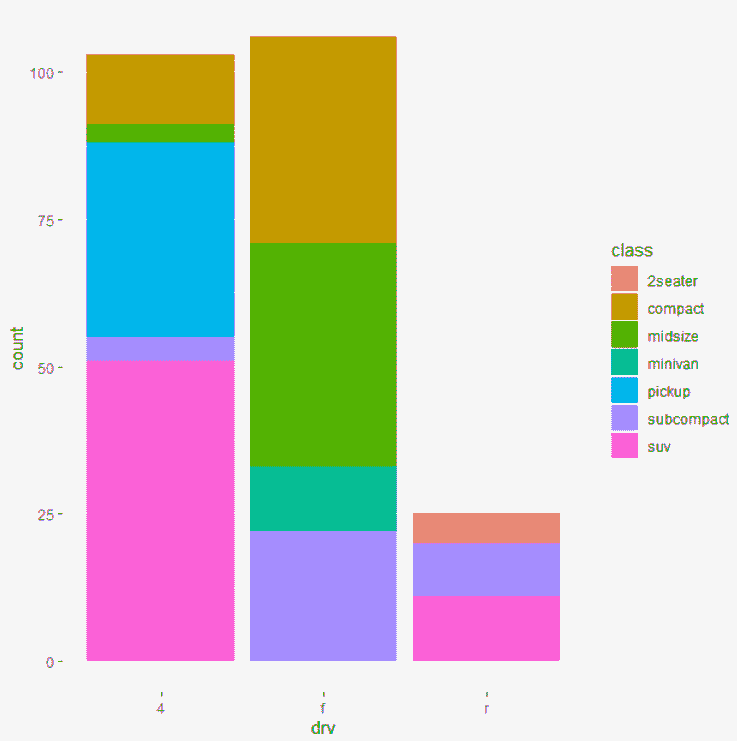

在这里，我们可以再次看到哪种组合是最频繁出现的，从而使我们达到类似的目的。

下一个绘图选项非常相似，但是除了用颜色表示第三维，我们还可以使用刻面。分面是一种技术，它允许您为分类变量的每个级别提供自己的绘图。看看下面。

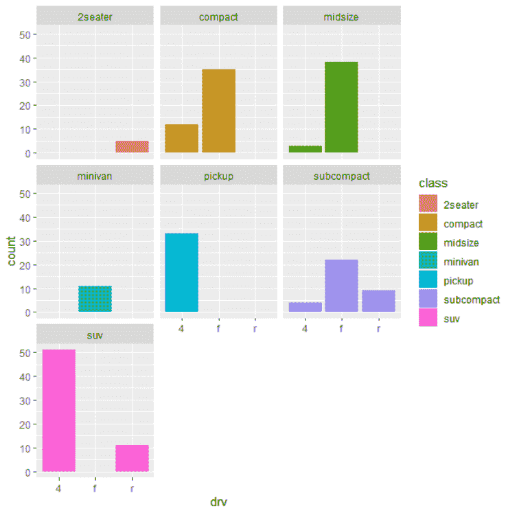

正如这里提到的，我们可以看到一个与之前非常相似的情节，但是每个职业等级都有自己的情节。

在这一点上，我们已经看到了各种图表非常相似的结果。你要考虑的是一个给定的情节在多大程度上传达了你的信息或产生了必要的洞察力，它是否过于复杂，它是否占用了太多的空间，潜在的利益相关者会在多大的屏幕上看到你的图表，等等。

现在我们开始绘制多维度的图。

维度数量:3–5

数据类型:数字和分类

数据集:mpg 包含在 base R 中的样本数据集

目的:了解多个变量之间的关系

图表:散点图

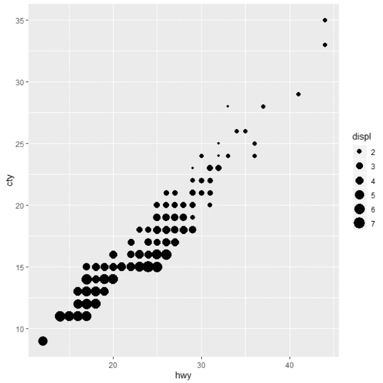

在这里，我们看到的是与之前相同的图，只做了一处修改。为了包括“发动机排量”的第三维度，我们现在改变点的大小以对应发动机排量。正如我们所见，它似乎与较高的城市和公路里程数成反比。

现在，添加维度的另一个选项是颜色。

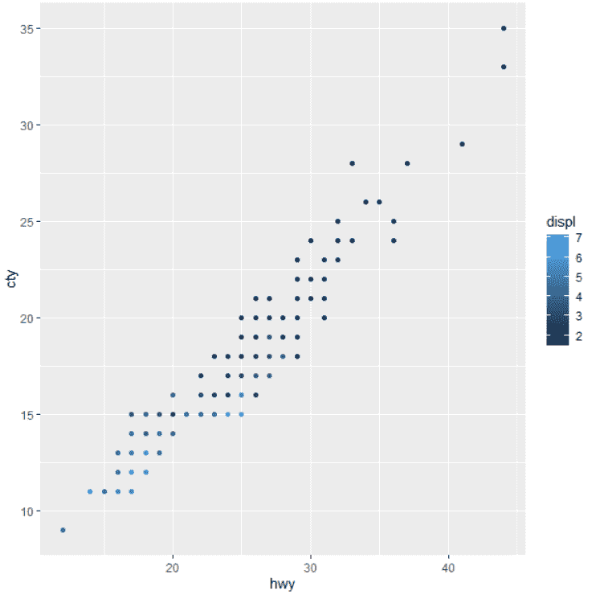

我现在用颜色来表示发动机排量，而不是用尺寸。

在下面，我添加了一个我们两者都做的额外的情节，这使得它更容易被看到。

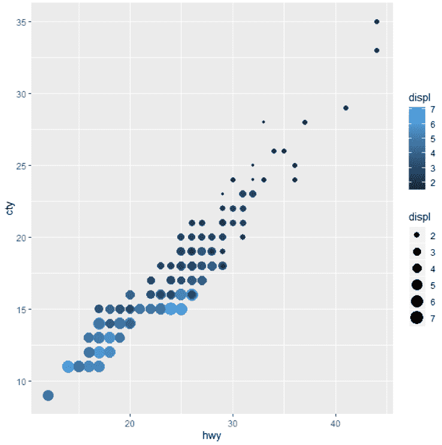

需要记住的一点是，我们可以引入第四个数字维度，而不是用颜色和大小来表示发动机排量。

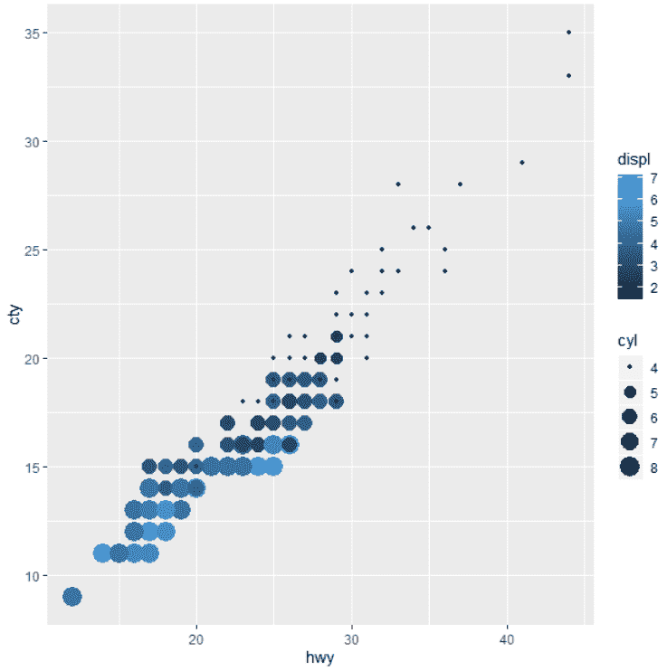

这里我已经换出了 cyl 来填充尺寸维度；这似乎也与公路和城市 mpg 成反比。

我们在这里可以介绍的几个其他选项可以是使用颜色来引入分类变量或根据分类变量来分面。

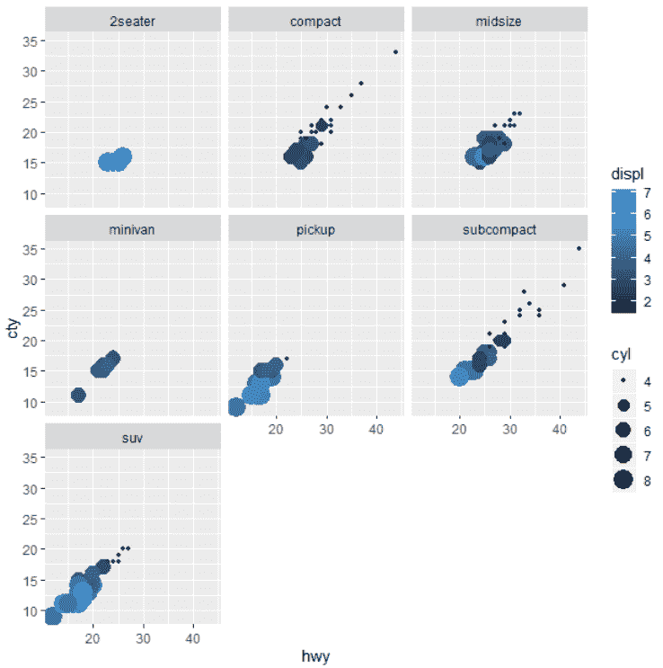

在这里，您可以看到现在按类分面的示例图，这使我们可以看到这些数字变量在分类变量的不同级别上如何相互关联。

在我们总结之前，最后要考虑的是我们是否有一个表示时间的变量的二维数据。时间的一个重要经验是使用折线图。

维度数量:2

数据类型:数字和时间

数据集:经济学；包含在 base R 中的样本数据集

目的:理解时间和数字变量之间的关系

图表:线条

我们将要研究的数据来自经济学样本数据集，代表了过去 50 年左右的失业率。

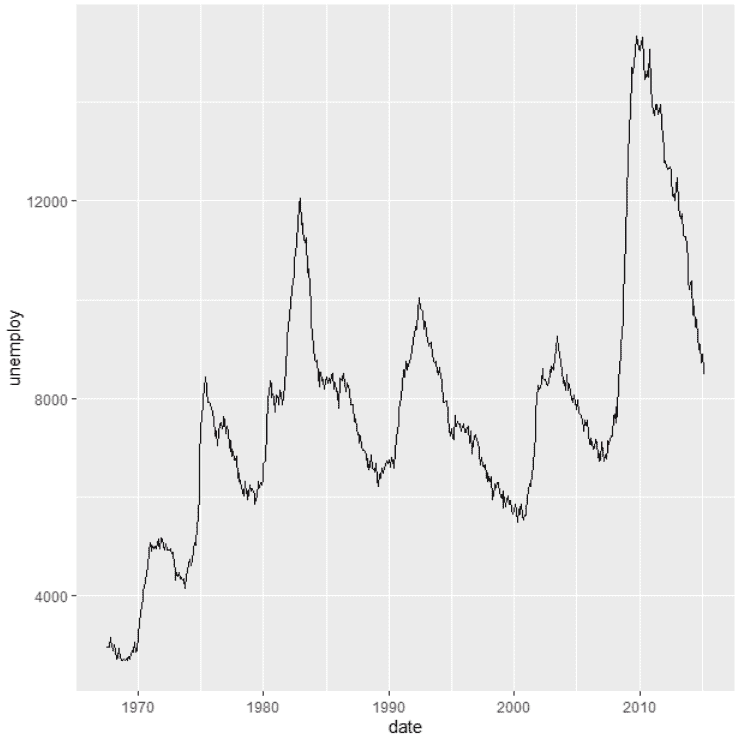

当绘制具有时间维度的数据集时，我们试图识别给定数值变量中的趋势，以了解趋势以及给定活动是否可能与该运动一致。把你的时间维度放在 X 轴上，把你测量的数值变量放在 Y 轴上。

即使在这里，还有很多事情可以做，但我将把它留到下次再做。

**外卖:**

*   一维
*   数字:直方图，盒状图
*   分类:表格、条形图、饼图
*   二维
*   数字/数字:散点图
*   数字/分类:条形图
*   分类/分类:条形图、表格
*   三维
*   数字/数字/数字:大小/颜色散点图
*   数值/数值/分类:带颜色/面的散点图
*   数字/分类/分类:带颜色/面的条形图
*   4+维度
*   在 x 和 y 轴上使用不同的数据类型和变量的组合，以及颜色、填充、大小、刻面等。

使用数据可视化可以做很多事情&这仅仅是开始。希望这能帮助你开始！

如果有帮助，请将您自己添加到我的电子邮件列表中；另外，如果您喜欢代码示例、附加信息等，请务必告诉我。

来看看我在 datasciencelessons.com 的其他帖子吧&祝数据科学快乐！