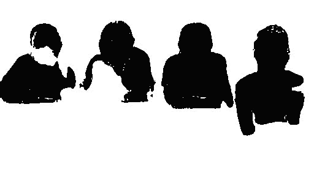
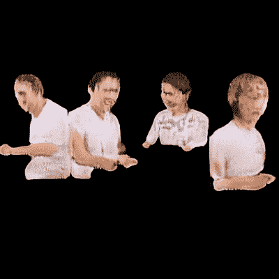
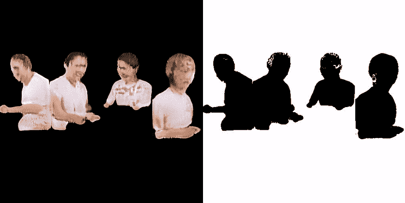
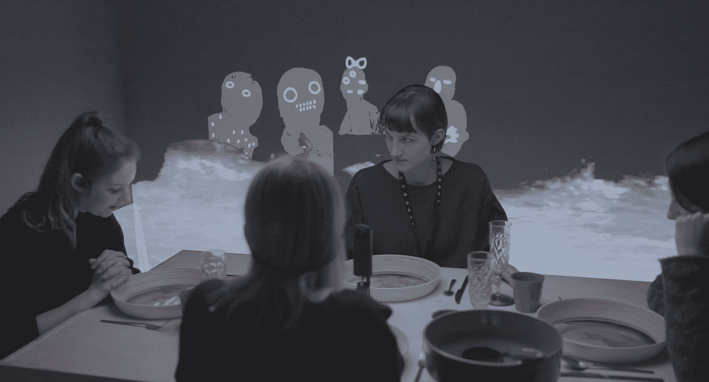
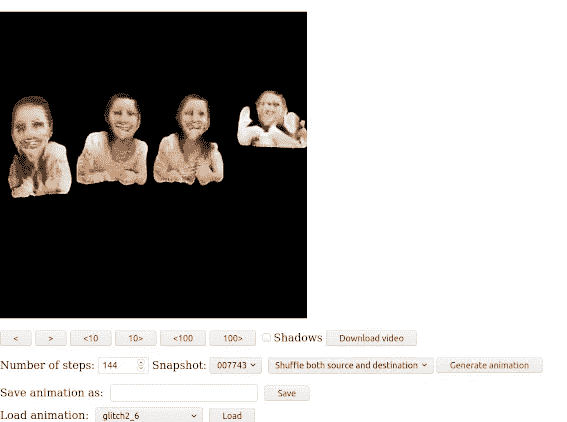
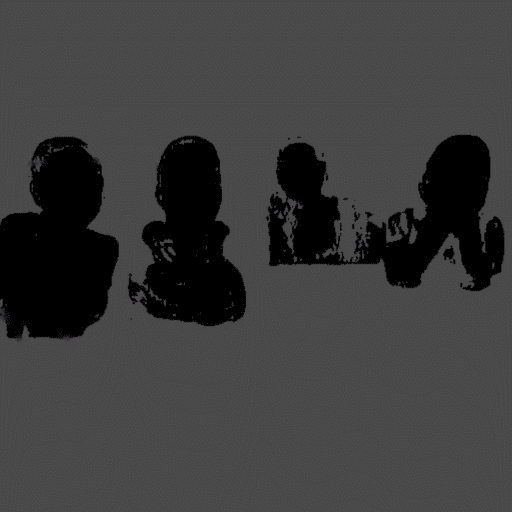
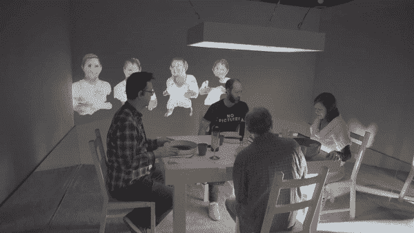

# 甘潜在空间的合作工具

> 原文：<https://towardsdatascience.com/a-tool-for-collaborating-over-gans-latent-space-b7ea92ad63d8?source=collection_archive---------53----------------------->

## 2020 年 1 月，我们完成了骨髓的开发阶段。 [shirin anlen](https://medium.com/@s.h.i.r.i.n) 和我正在分享在这个过程中吸取的经验教训，我们关于优化和扩充一个小数据集的帖子最近发表在了[*toward SATA science*](/small-family-small-dataset-7f7db708f06d)上。这篇文章着眼于在使用机器学习模型时，定制的基于网络的工具如何激发协作的艺术工作流。

利用网络浏览器工具制作甘《潜伏空间》中的阴影动画

# 我和骨髓

*髓*是[石林安伦](https://shirin.works/)的一个动手研究项目和互动剧场体验，探索[精神障碍在机器学习](https://immerse.news/when-machines-look-for-order-in-chaos-198fb222b60a)中的可能性。我之前与希林合作过许多项目，最著名的是虚拟现实纪录片[*Tzina:Symphony of desire*](https://tzina.space)。2018 年，我加入了 shirin，在 2018 年 IDFA Doclab[上预览*骨髓*装置。原型取得了成功，一年后我们作为合作者进入了由加拿大国家电影委员会和 Atlas V 共同制作的密集开发阶段。](https://www.doclab.org/2018/ive-always-been-jealous-of-other-peoples-families/)

# 关于甘及其潜在空间

生成对抗网络，或 GAN，是我们决定研究的第一个机器学习模型。它专注于生成性视觉意象，如果你试图用平庸的股票图像训练它复杂的概念，它会表现出非常明显的不协调。在[之前的一篇帖子](https://medium.com/@s.h.i.r.i.n/7f7db708f06d)中，我们描述了我们如何创建一个由“*完美家庭晚餐”*图像组成的数据集，并用它来训练[斯泰勒甘·V1](https://github.com/NVlabs/stylegan)。这个特殊的数据集是为体验的故事而构建的；一个功能失调的家庭，只能通过被训练出来的扭曲数据来看待自己。正因为如此，我们的目标是不完美的结果，并代表当模型试图深入社会叙事时出现的故障。

我们的数据集是一捆大约 6500 张图片，包含四个家庭成员的照片，从他们的家庭晚餐场景中剥离出来。一旦 StyleGAN 完成了训练过程，我们就有了一个新生成的包含四个扭曲家庭形象的图像的巨大空间。输出图像的无限、连续的可能性空间被称为 [*潜在空间*](https://en.wikipedia.org/wiki/Latent_variable) 。它是“潜在的”，因为 GAN 生成的输出图像是由一个看似*隐藏的*数学变换过程确定的，从一系列数字开始，以位图图像结束。当您更改系列中的任何初始数字时，生成的图像会略有不同。变换网络如此之深，以至于很难预测图像中会发生什么变化。

*潜在空间转换动画*

如果你有足够好的数据集和算法，你也许能够达到*解缠*:即当一个输入数字控制结果图像中一个有意义的元素；例如，一个数字会改变一个生成的人的年龄，而另一个数字会改变他们的头发颜色。不用说，我们无法解决小数据集的问题。从最初系列的一个单一数字的变化可能导致多个家庭成员的各种变化。同一个数字可以同时控制一个家庭成员的姿势，另一个成员的微笑，以及第三个人物的圣诞帽的外观(这似乎是日常图片中的重复主题)。这些家庭成员事实上是纠缠在一起的。

# 影子寓言

*髓*跟踪它的每个模型的“思考”过程，并询问什么可能出错。在 GAN 中，潜在空间为我们提供了关于输入数据如何被分解，然后重建成新的东西的信息。但是，尽管视觉化潜在空间很有趣，我们还是在寻找将讲故事融入体验的方法。我们想把甘扭曲的世界形象物化。

在观察甘正在进行的训练过程时，我们开始注意到来自源数据集的非人类的东西。这就像盯着罗夏测验；根据观看者的不同而呈现不同的平面图像。我们意识到，我们对 GAN 的了解不是通过看到我们期望的结果，而是通过看到它的中间空间。柏拉图的[洞穴寓言](https://en.wikipedia.org/wiki/Allegory_of_the_cave)谈到了在简单扁平的事物表象中寻找意义。寓言中的人被困在一个山洞里，外面着火了。火把经过的物体的影子投射在洞穴的墙壁上，这就是他们所能看到的现实。他们如此习惯于那些阴影，以至于一旦囚犯挣脱，他们的眼睛就会被耀眼的阳光灼伤。当囚犯的眼睛终于习惯了现实，他们回到洞穴告诉其他人，但现在他们在黑暗中什么也看不见。其他囚犯认为外面有邪恶的东西。

有趣的是，柏拉图的洞穴寓言与[的结构和甘](https://developers.google.com/machine-learning/gan/gan_structure)的训练过程非常吻合。甘始终处于现实、现实的再现和幻想的冲突之中。当该算法生成的图像过于接近原始数据集时，它会发现自己陷入了一个简单而扁平的世界表示中，无法逃脱创造性的途径。当甘的后代过于荒诞的时候，他们就不可避免地被认为是假的和错误的。甘一直在努力寻找现实与想象之间的平衡。因此，我们决定通过使用扭曲的家庭输出的*阴影表示*来可视化甘的斗争。

全色过渡与阴影模式

# 在潜在空间上制作动画

*髓*是一个互动的戏剧作品，参与者在家庭晚餐环境中扮演机器学习模型的角色。在体验中，一名代表甘的参与者讲述了他们在区分记忆和想象时面临的困难——这两种感知在甘的作品中实际上都被扭曲了，因此我们决定在这一阶段探索阴影世界中的附加幻想动画层，这将代表人物在真实和虚假之间的斗争。我们和才华横溢的[帕洛玛·道金斯](https://palomadawkins.com/)一起工作，他是手绘动画和交替维度的大师。现在，我们必须问自己:我们如何编排一个工作流程，从甘的数学深度开始，但以手绘动画结束，完美地匹配甘在图像空间中的潜在运动？答案来自我们定制的工具: ***骨髓甘探索者*。**

骨髓@ NFB 2020 _ 安德烈本达汉 2020 NFB。版权所有

# 骨髓甘探索者

*髓*甘探索者是一个基于网络的交互式工具，让团队成员探索[风格甘 V1](https://github.com/NVlabs/stylegan) 结果的潜在空间，并在潜在空间的不同点之间创建关键帧动画链。

来自 web 浏览器工具的屏幕截图

# 动机

开发这个工具的主要动机是让我们能够与一个额外的团队成员一起工作，在这个例子中是一个动画师，处理机器学习输出。我们希望动画师能够探索潜在的空间，选择他们感兴趣的过渡来制作动画。一旦他们做出选择，他们可以将该序列保存为机器学习模型可读的格式，并可以实时加载和推断。同时，他们可以将过渡保存为视频文件，以便加载到他们的动画软件中，并逐帧制作动画。这回答了我们当时的两个主要问题:第一，给动画师创作的自由，第二，确保在体验中链接时序列将完美同步。该工具还允许我们在网上交流，并在对创作过程进行头脑风暴时查看相同的序列。它还允许我们以彩色和理想的输出形式查看源:阴影。

# 用例场景

我们录制了一段视频，展示了我们工具的常见用例:

用例视频

# 链接动画

浏览器的一个更优雅的特性是链接动画的能力。假设动画师生成了一个 12 秒的潜在空间过渡，并在其上画了一个漂亮的动画。现在，他们可以使用该工具以另一个序列推进故事。通过加载第一个过渡，然后选择*使用目的地作为下一个源*，艺术家可以生成一个序列，它是前一个序列的延续，并在非线性潜在空间上创建一个线性故事。

*帕洛玛·道金斯的动画叠加甘的阴影输出*

# 在后台

潜伏空间探索者的代号是**免费提供** [**这里**](https://github.com/Raycasters/Marrow/tree/master/gan/gan-explore) **。**这将需要对其他项目进行调整，但只要该模型是基于 StyleGAN 的，就应该非常简单。迁移到其他类型的 gan 也应该相对简单。

在我们的 [GitHub](https://github.com/Raycasters/Marrow/tree/master/gan/gan-explore) 上，你可以找到浏览器各种特性的详细解释和代码遍历。

# 反光

这是为无障碍交流寻找解决方案的时候了——不仅为公众，也为团队成员之间。我们需要创造性地思考如何让每个人都参与到使用复杂技术的过程中。这是我们对彼此的责任。在某种程度上，与游戏中的关卡设计过程没有什么不同，像“潜在空间探索者”这样的工具将创作带到了前端，但在后端却讲述了模块化和娱乐的语言。

在整个过程中一起工作，并坚持在每一步中采取艺术方向，这是非常有力量的。在《骨髓》的创作过程中，我们坐在一起观看和选择镜头，玩得很开心。当我们目睹眼前紧张的视觉效果时，保存在服务器上的数据是一系列简单的数字，这些数字触发了一个巨大的计算网络，产生了不可预见但却惊人一致的后果。同样，我们并不总是知道为什么我们喜欢一个特定的序列，我们只是感觉到它。这是我们共同的直觉。

骨髓@ NFB 2020 _ 安德烈本达汉 2020 NFB。版权所有

> 开发阶段是与音效师菲利普·兰伯特和动画师帕洛玛·道金斯合作完成的。