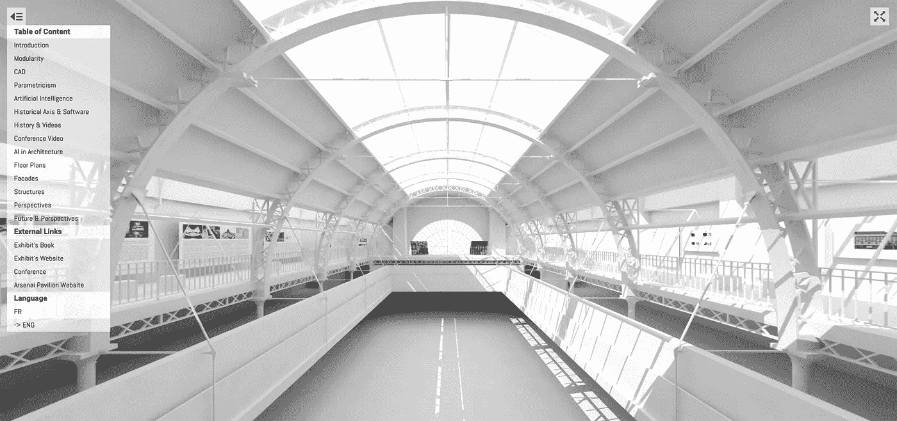
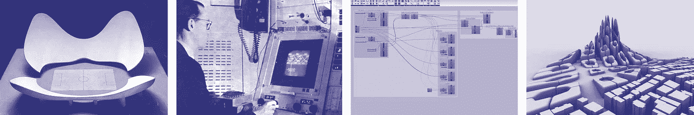
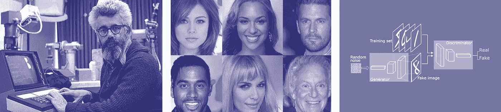
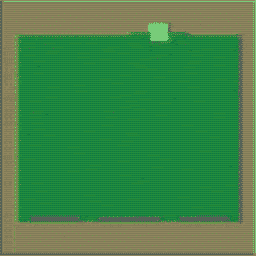
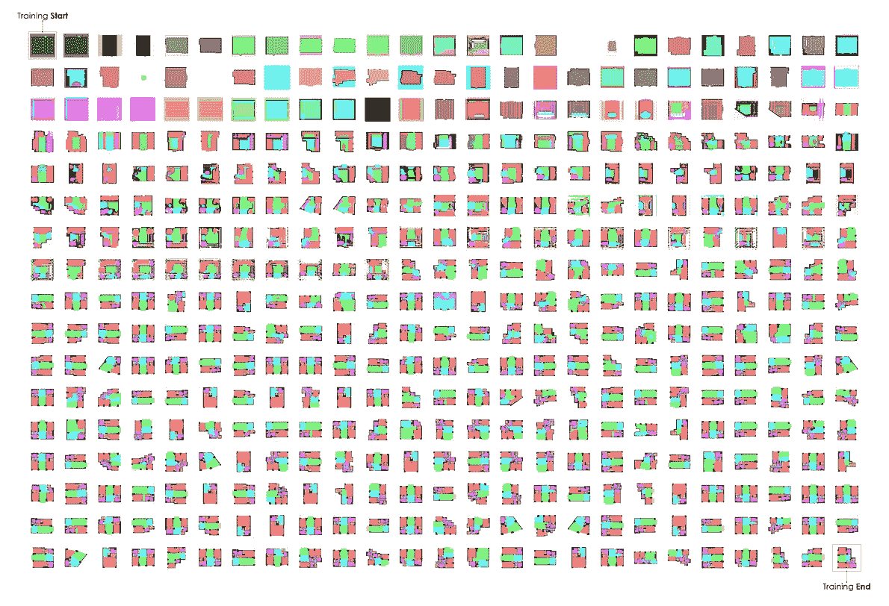
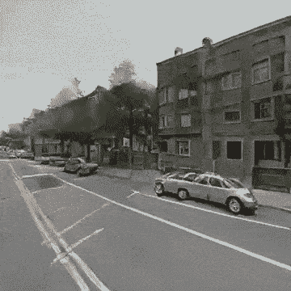
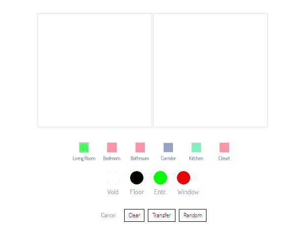
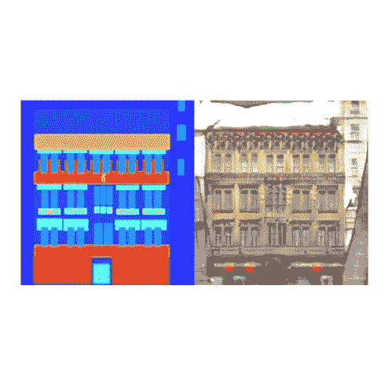
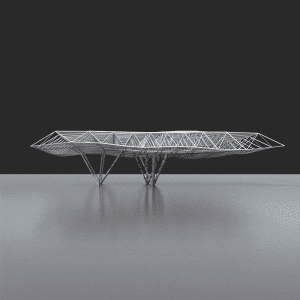

# 建筑中的人工智能之旅

> 原文：<https://towardsdatascience.com/a-tour-of-ai-in-architecture-ef8a6bf33fa8?source=collection_archive---------14----------------------->

## 阿森纳馆的虚拟之旅

人工智能与建筑虚拟之旅|来源:作者

在本文中，我们将介绍正在巴黎阿森纳馆博物馆展出的“人工智能建筑”的内容。由于最近发生的事件，博物馆已经关闭了大门，但重新在网上开放，并在今天提供展览的虚拟参观，免费提供。我们在这里揭开展览的部分内容，并邀请您参观，使用 t [*和兵工厂馆的虚拟之旅*](http://stanislaschaillou.com/arsenal/vtour/tour_eng.html) *。*

[***您现在可以在这个地址访问虚拟旅游。***](http://stanislaschaillou.com/arsenal/vtour/tour_eng.html)

展览虚拟参观演练

# 一、简介

人工智能(AI)已经进入了这个行业，为它提供了迎接新挑战的手段。它在建筑领域的应用仍处于初级阶段，但已经获得的预期结果是有希望的。这项技术不仅仅是一个机会，它无疑是向前迈出的决定性一步，完全有能力改变建筑实践。本次展览探索了这种参与及其在建筑环境中的应用。定义人工智能，解释它所包含的技术和范例，是理解它在建筑中出现的核心。

人工智能首先需要从科学史和建筑史的角度来考虑。围绕和支持人工智能的技术进化不是“颠覆”，而是一个缓慢成熟的结果。事实上，这个职业已经经历了相当长一段时间的转变。技术解决方案的逐步采用已经深刻改变了价值链的每个阶段:首先是利用新的建筑技术，然后是开发适当的设计软件，现在是引入统计计算能力，包括前沿的数据科学和人工智能。从今以后，**与其说是一个激进的轨道改变，不如说我们希望看到一个轨迹的改变，它的加速最终是在一种实践的延续中，这种实践将建筑引向了今天的样子。模块化、计算机辅助设计(CAD)、参数化和人工智能(AI)是一个序列中不可阻挡地交织在一起的四个阶段，这一序列构成了我们实践的缓慢混合，比如我们今天所经历的和可以想象的。**

汇集了具体的例子和最近在各个研究领域取得的成果，我们首次展示了人工智能在建筑中的存在，以及该领域最新进展的全景。立面、平面、结构、视角:尽可能多的尺度来衡量人工智能已经可以做出贡献的城市，无论是真实的还是假设的。

在当前的理论和实验之间，**这个展览旨在阐明一个新技术时代**的开始，利用建筑实践，同时赋予它新的相关性。

*在下面的视频中，我们展示了 2 月 27 日在阿森纳馆举行的展览开幕式。在这个演讲中，我们总结了展览的远大目标，同时勾勒出人工智能在建筑中的潜力。*

# 二。历史

M ***协同性*、*计算设计、参数化*以及最后的*人工智能*** 是塑造了过去 100 年建筑系统化的 4 个相互交织的步骤。人工智能只是这种渐进努力的最新发展。我们在这里提供每个时期的解包，并用关键事件和历史人物来说明它们，以建立人工智能在我们的学科——建筑——中的出现。

## A.模块性

**w·格罗佩斯的《包卡斯滕》**(最左)**巴克明斯特·富勒的《迪马克森之家》**(左)**麦克劳林的《温斯洛·艾姆斯之家》**(右)**萨夫迪的《人居 67》**(最右)

模块化可以被定义为系统化建筑设计的起点。瓦尔特·格罗皮乌斯在 1920 年为包豪斯提出的“模块化网格”理论，带来了技术简单的希望和廉价建筑的承诺。最初，它是作为学者和实践者探索的主题出现的。格罗皮乌斯和阿道夫·迈耶一起引入了“包卡斯滕”的概念，这是一种具有严格组装规则的典型模块。在同一时期，里查德·巴克明斯行·福勒提供了一个更系统的模块视图，其中集成了管道，结构等。他的 Dymaxion house(1929-1946)将模块化住宅推向了极致，开创了一个充满活力的先例，也是该行业首次令人信服的概念展示。这种标准化后来在勒·柯布西耶的“模块”(1945)中得到了阐述，该书将模块思想应用于人体尺度，早在 1946 年就使这一原则的整体实施成为可能。

通过 Modulor，建筑环境的尺寸与人体比例的关键指标和比率保持一致。因此，从马赛的“统一住宅”(1952 年)到埃沃的圣玛丽·德拉图雷修道院(1959 年)，勒·柯布西耶系统化了与这种规模相关的维度和跨度。

遵循这些早期的理论家，建筑师调整他们的做法，以优先考虑矩阵，这相当于将建筑设计的部分技术方面转移到模块的逻辑。这些论点证明是令人信服的:施工可预测性的显著提高降低了设计的复杂性和成本。模块化然后迅速扩展到整个领域:由罗伯特·w·麦克劳克林教授于 1933 年在美国建造的温斯洛·艾姆斯住宅是世界上第一个大规模模块化项目之一。这一倡议理所当然地被视为一项重大突破，很像摩西·萨夫迪 1967 年在加拿大提出的人居 67。

模块化甚至影响了 20 世纪 60 年代早期的城市规划，当时像 Archigram 的“插件城市”这样的项目渴望创造完全模块化的城市。通过不断组装和拆卸三维结构矩阵上的模块，城市有望找到一种新的逻辑，解决增长的可能性和可行性的必要性。理论最初的圆滑很快就达到了极限，过早地被耗尽。事实上，将建筑设计限制在一个简单的设备上，用于组装在框架上机械调整的模块，最终导致了它的衰落。架构不能被解决为将它的实践局限于组装者的角色，仅仅是规则和过程的保证者，特别是因为结果被证明是单调的，并且组装系统暴露了真正的建设性弱点。然而，如果严格遵守的模块化显著地影响了专业的实践，由于其规则系统，它也是普遍的，并对建筑设计的基本原则有持久的影响。

## B.计算机辅助设计

帕特里克·汉拉蒂的 **PRONTO(最左)，n·内格罗蓬特**的 **URBAN II(左)，n·内格罗蓬特**的**Seek****，塞德里克·普莱斯**的 **GENERATOR(最右)**

计算机技术(微处理器、内存、个人电脑、网络等)的激增。)允许模块化设计前所未有的复杂性。20 世纪 80 年代初，标志着基于规则的建筑设计系统化的复兴。

事实上，早在 20 世纪 50 年代中期，一些工程办公室就开始了对计算机设计潜力的基本分析。1959 年，Patrick Hanratty 教授发布了第一个 CAD(计算机辅助绘图)软件原型 PRONTO，它是为设计工程组件而创建的。该软件提供的可能性，加上计算能力的快速发展，引发了建筑领域的讨论。

从 20 世纪 70 年代起，整整一代的计算机科学家和建筑师开始创建一个新的研究领域:计算机辅助建筑设计(CAD)。尼古拉斯·尼葛洛庞帝教授于 1967 年在麻省理工学院创建的建筑机器小组(AMG)可能是其中最突出的例子。尼葛洛庞帝的书《建筑机器》(1970 年)概括了 AMG 使命的精髓:“研究机器如何增强创作过程，更具体地说，是作为一个整体的建筑生产”。随着项目 URBAN II 和后来的 URBAN V 的发布，这个团队甚至在行业在该领域取得任何进展之前就展示了 CAD 应用于空间设计的潜力。几年后，时任剑桥大学建筑系主任的塞德里克·普莱斯发明了发电机(1976 年)。在 Negroponte 之后，Price 使用了 AMG 在人工智能方面的工作，并通过探索一种不断进化的自主建筑的想法来扩展它，这种建筑能够“智能地”做出反应以适应用户的行为。根据 Price 的说法,“智能”一词体现了生成器设法模仿的行为。

在麻省理工学院这一新动力的基础上，建筑师和整个行业积极地将这些发明转化为大量的创新。建筑师弗兰克·盖里无疑是这项事业最活跃的倡导者，他认为计算的应用是彻底放松装配系统的界限并赋予他的建筑新的形状和几何形状的手段。Gehry Technologies 由 Gehry 和 Jim Glymph 于 20 世纪 80 年代创立，使用早期的 CAD-CAM 软件(CAM:计算机辅助制造)，如达索系统公司的 CATIA，来处理复杂的几何问题。Gehry Technology 为未来三十年的计算设计开创了先例，向建筑师展示了 CAD 的价值。在接下来的 15 年里，计算能力和数据存储能力的惊人增长，加上越来越便宜和更加用户友好的机器，极大地促进了 3D 设计软件的采用。设计者很快就掌握了这种新系统，通过严格控制几何形状，提高了设计的可靠性、可行性，并降低了设计成本；促进设计师/建筑师之间的合作，此外，与传统手绘相比，能够实现更多的设计迭代。更多的测试和更多的选择来获得更好的设计结果，这就是目标。然而，缺点最终会出现。特别是，某些任务的重复性和缺乏对复杂几何形状的控制成为严重的障碍。面对这些限制，一个超越 CAD 的新范式出现了:参数化。

## C.参数化

**路易吉·莫雷蒂的 N 体育场**(最左)**伊凡·苏泽兰&画板**(左)**蚱蜢界面**(右)**扎哈·哈迪德建筑师事务所的卡尔塔尔-彭迪克总体规划**(最右)

参数主义允许建筑师更好地掌握复杂的形状，同时避免重复的任务。由于这种新方法，每项任务都被合理化为一套简单的规则，构成了一个过程。这个过程可以由架构师编码到程序中，以便自动执行以前手动和繁琐的执行。然而，在允许给定过程的编码的同时，参数化程序有助于隔离影响结果的关键参数。然后，建筑师能够改变参数，以生成不同的可能场景:通过简单地改变先前定义的参数，立即生成不同的形状或选项。

20 世纪 60 年代初，建筑师 Luigi Moretti 倡导了参数化建筑的出现。他的项目“N 体育场”，是参数化的第一个清晰表达。通过定义 19 个驾驶参数，其中包括观众的视野和 tribunes 的阳光照射，Moretti 建立了一个严格的程序，直接负责建筑的形状。参数集的每一个变化都为体育场引入了一种新的形式。最终的形状可能会令人惊讶，但它给出了这种新的参数美学的第一个例子:尽管来自一个准科学的过程，但结果因其有机性而引人注目。

三年后，伊凡·苏泽兰将这些原则应用于设计软件，他创造了画板，这是第一个真正用户友好的 CAD 软件。嵌入软件核心的“原子约束”概念是萨瑟兰对莫雷蒂“参数”概念的翻译。在用画板绘制的图形中，每种几何形式都被机器翻译成一组原子约束，换句话说，就是参数。这个概念是参数化设计在计算机术语中的首次表述。Samuel Geisberg，Parametric Technology Corporation(PTC)的创始人，于 1988 年推出了 Pro/ENGINEER，这是第一个为用户提供完整几何参数访问的软件程序。随着软件的发布，盖斯伯格完美地总结了参数理想:

> “我们的目标是创建一个足够灵活的系统，鼓励工程师轻松考虑各种设计。设计变更的成本应该尽可能接近零。”

由萨瑟兰和盖斯伯格建立的设计和计算之间的桥梁，使新一代“参数意识”建筑师得以出现。事实上，少数关键人物采用参数化方法将这种新方法转化为整个行业的实际创新。扎哈·哈迪德建筑师事务所是建筑参数化的杰出代表。作为一名在英国接受教育的伊拉克建筑师和数学家，Hadid 使用参数化设计融合了数学和建筑。她的工作通常是规则的结果，编码在程序中，允许对建筑物的几何形状进行前所未有的控制。每个建筑决策都被转化为一组给定的参数，从而形成特定的建筑形状。对于扎哈·哈迪德建筑事务所的公司董事、建筑师和工程师帕特里克·舒马赫来说，这门学科因此向参数化主义靠拢，不仅作为一种设计技术，而且作为一种建筑风格。在他的书《参数化——建筑和城市设计的新全球风格》( 2008 年)中，他解释说，在建筑环境的每个阶段，参数化与对“参数”概念的日益增长的认识有关。如果没有大卫·于滕在 2000 年代开发的软件 Grasshopper，这项工作是不可能完成的。Grasshopper 是一个可视化编程接口，它允许架构师轻松地隔离设计的驱动参数，同时允许他们迭代地调整这些参数。其界面的简单性加上内置功能的智能性继续推动着世界上大多数建筑的设计，并激发了整整一代“参数化”设计师。

然而，自 21 世纪初以来，由参数化驱动的一场更深刻的革命，使参数化在大多数建筑师的日常实践中盛行:BIM(建筑信息建模)是其最显著的表现。由时任 Autodesk 副总裁的菲利普·伯恩斯坦(Philip Bernstein)倡导的 BIM 的创建和发展，将建筑行业的合理性和可行性提升到了一个全新的水平。BIM 的基本思想是，3D 建筑模型中的每个元素都是参数(“属性”)的函数，这些参数驱动每个对象的形状并记录它。从萨瑟兰的画板到 Revit——当今使用最广泛的 BIM 软件——都有一个共同的主线:明确使用参数作为设计的驱动力。

## D.人工智能

**、**(左)、【Nvidia Research】AI 生成的人脸(中)、【GAN】模型架构(右)

人工智能(AI)基本上是一种架构的统计方法。人工智能似乎不仅对参数化建筑的局限性做出了回应，而且最重要的是开启了建筑设计的全新时代。

1956 年，美国数学家约翰·麦卡锡发明了人工智能的概念，即“用人脑作为机器逻辑的模型”。人工智能不是设计一个为一系列变量和规则构建的确定性模型，而是让计算机根据从数据中收集的信息或用户传输的信息来创建中间参数。一旦达到“学习阶段”，机器就可以生成解决方案，这些解决方案不只是简单地回答一组预定义的参数，而是创建模拟学习阶段期间接收到的信息的统计分布的结果。这一概念是人工智能带来的范式转变的核心。机器建立自己对问题的理解的部分独立性，加上它消化一组例子的复杂性的能力，破坏了参数化的前提。由于并非所有的规则和参数都由用户事先明确声明，因此机器可以出人意料地揭示潜在的现象，甚至试图模仿它们。这是从启发式世界(基于规则的决策)到统计建模世界的巨大飞跃。

80 年代初，计算能力的突然增强和经费的急剧增加给 AI 研究带来了第二股风。这个时期的关键是两个主要的革命:专家系统和推理机。第一种对应于能够使用条件语句基于一组规则进行推理的机器。当时真正的突破是 Cyc，由 Douglas Lenat 开发的项目，涉及面向推理推理的机器。使用知识库(一组建立为真的陈述)，推理机能够推断出一个新陈述的真实性。

直到 20 世纪 90 年代早期，人工智能的高级数学化，这个领域才提供了有希望的结果。一种新型模型的出现揭示了人工智能潜力的第二个领域:网络和机器学习。由于使用了“分层”计算机模型，也称为“神经网络”，因为它们回忆了人脑的神经结构，所以现在机器可以掌握比以前开发的模型更复杂的东西。这种模型可以被“训练”，或者换句话说，针对特定的任务进行调整。在受这一发展启发的众多创新中，生成性对抗网络(GAN)被证明与建筑尤其相关。谷歌大脑(Google Brain)研究员伊恩·古德费勒(Ian Goodfellow)在 2014 年提出了这一理论，该模型可以从神经网络生成图像，同时通过自我纠正的反馈回路确保一定程度的准确性。

Goodfellow 的研究将人工智能从一个分析工具变成了一个生成代理，这样做使它更接近于建筑问题:设计和图像制作。换句话说，人工智能现在代表了该学科的新一代负担得起的、强大的和相关的工具。如果尼葛洛庞帝或普莱斯的工作最初几乎没有真正的机器智能，那么现在的建筑软件可以利用这种可能性，并成倍增加其潜力。

尽管人工智能对建筑的潜在代表是先验的重要，但它仍然取决于设计者向机器传达其意图的能力。为了成为一个可靠的助手，机器必须经过训练，这意味着架构师面临两个主要挑战:在广阔的人工智能领域中选择合适的工具，以及选择相关的抽象级别和可测量的限定符，这些可以与机器交流。这两个先决条件的满足决定了一种与建筑兼容的人工智能形式的成败。

## **E .历史视频**

*为了说明和补充前一章，我们在这里提供几个视频，将赋予上述最重要的时刻以生命。*

**历史视频摘录**

# 三。建筑中的人工智能

人工智能代表了新的技术浪潮，而不是颠覆。它通过协助建筑专业知识并增强其表达来补充我们的建筑实践。今天，学术和私人研究的结果显示了这一演变的第一个证据。所谓的“生成性”人工智能技术——也就是说，能够创建形状，而不仅仅是分析它们——是最近才出现的。在过去的三年里，他们开辟了新的实验领域。

**生成对抗网络(GAN)代表了这些潜在的有前途的领域之一。**这些模型能够学习复制呈现给它们的数据中发现的具有统计意义的现象。他们的结构是一个概念上的决定性创新。甘将“发生器”和“鉴别器”两个模型结合起来，进行了一个类似于学生和老师的类比。“生成器”(学生)试图生成图像。“鉴别者”(老师)给“生成者”每生成一个新图像给“生成者”一个“等级”。该分数将评估所创建的图像与在训练集中发现的图像的相似性。基于这个结果，“生成器”会适应以获得更好的结果。正是“生成器”和“鉴别器”之间的这种来回过程，在 GAN 模型的整个训练阶段磨练了所生成的图像。因此，这种模型将逐渐发展其创建相关合成图像的能力，同时考虑到它将在观测数据中适时检测到的现象。

如果 GANs 代表着一个巨大的机会，明智地训练他们是必要的。格式化图像数据库或“训练集”，可以控制模型将学习的信息类型。例如，简单地定义一个地块的形状和相关建筑物的轮廓将生成一个模型，该模型一般可以根据预先存在的地块的形状创建建筑物轮廓。然而，模仿也不能免于失误，如果没有指导，也不会漫无边际。因此，我们自己的“架构感”将仍然是保证训练集质量和结果质量的保证。换句话说，一个模型只有在被架构师适当训练的情况下才是相关的。

**作为一个例子，下面展示的训练序列是在一天半的时间内完成的(见下文)，展示了我们的一个 GAN 模型如何逐渐学会布置房间和分配必要的开口(窗户和门)。**尽管最初的尝试不精确，但经过 250 次迭代后，机器建立起了某种形式的架构直觉。

**训练序列** |来源:作者

# 四。应用程序

一个 **人工智能终于开始进行图像创作，这是建筑设计实践中的一个基本媒介。事实上，图像在建筑中已经成为绘制和设计城市的主要手段。因此，这是人工智能和建筑之间的一座明显的桥梁:如果人工智能能够创建图像，并衡量它们的复杂性，那么将其应用于建筑生产就是一种自然的延伸。这里展示的是最近的研究成果，涉及四个不同的建筑尺度:*平面、立面、结构和视角。***

*我们在下面展示了展品中展示的一些应用示例。为了对每个研究项目进行更多的解释和深入的描述，我们邀请您使用虚拟参观* *来参观展览* [*。*](http://stanislaschaillou.com/arsenal/vtour/tour_eng.html)

**不同建筑尺度的 AI 应用实例** | *左上:甘-洛克里，凯尔·斯坦菲尔德，右上:阿奇根，斯塔尼斯拉斯·夏鲁，右下:Pix2Pix，伊索拉& al。右下:DS 实验室，凯特琳·米勒&雷诺·丹海芙*

# 动词 （verb 的缩写）未来和前景

对于建筑来说，**人工智能最终既不是一种“自成一格”的现象，也不是不合时宜的破坏**，更不是一种新的令人生畏的教条。几十年来，信号一直在宣布它，它只是七十五年发明和创新的顶点。在某种程度上，人工智能可以让我们协调效率和组织性，同时为设计师提供各种各样的选择，我们在这里看到了巨大的潜力。至少，人工智能将丰富我们的实践，并照亮我们学科的任何盲点。

**这个展览希望站在这一演变的最前沿，并为创造一个关于人工智能和建筑之间关系的讨论平台做出贡献。**我们敦促建筑师对人工智能感兴趣，并敦促科学界将建筑视为一个独立的研究领域。我们相信人工智能是一种资产，有利于建筑设计的统计方法。它的不确定性和整体性对我们的职业来说无疑是一个机会。人工智能可以让我们部分依赖机器来提取重要和相关的建筑质量，并在整个设计过程中再现它们，而不是使用机器来优化一组变量。

**人工智能永远无法自动化建筑师的直觉和感受力。然而，建筑的真正风险与任何关于人机关系的反命题考虑都没有多大关系，而是，更通俗地说，与竞争和行业主权有关。事实上，要么该专业将能够围绕这些预示未来建筑实践的智能平台推动学科聚合，要么错过这个机会，将沦为一个辅助学科，为建筑或技术领域出现的更强大的工程实践服务。与此同时，让我们实际一点:架构师必须认识到，从智能助理中受益比许多人想象的要容易，并且在最早的阶段，应该认真研究和试验这一选择。**

根据本次展览中提供的例子，以及行业和学术界正在开发的研究项目的数量，**让我们承认，建筑中的人工智能正在进行中，并逐渐成为一个实际的研究领域。计划、立面、结构、视角:人工智能目前正处于试验阶段，旨在为我们建筑环境的所有设计规模带来解决方案。很明显，结果就在那里，人工智能的应用也非常明显。**

## 我们并不认为人工智能是建筑的新教条，而是认为这一领域是一个充满潜力和希望的新挑战。

## 外部链接

*   [*展览书*](https://view.publitas.com/harvard-university/ia-architecture-pavillon-de-larsenal/page/1)
*   [*展示虚拟之旅*](http://stanislaschaillou.com/arsenal/vtour/index_eng.html)
*   [*参展网站*](https://www.pavillon-arsenal.com/en/expositions/11466-ai-architecture.html)