# 机器学习算法之旅

> 原文：<https://towardsdatascience.com/a-tour-of-machine-learning-algorithms-466b8bf75c0a?source=collection_archive---------8----------------------->

## 阅读**机器学习算法**的介绍性列表

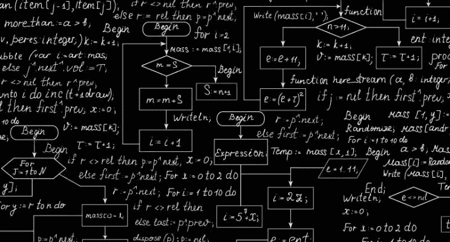

机器学习算法概述([来源](https://www.linkedin.com/pulse/machine-learning-algorithms-concise-technical-overview-matthew-mayo)

> "机器智能是人类需要创造的最后一项发明."尼克·博斯特罗姆。

如果你可以回顾几年前人工智能的状态，并与它目前的状态进行比较，你会震惊地发现它是如何随着时间呈指数级增长的。

它已经扩展到各种领域，如 **ML** 、**专家系统**、 **NLP** 等等。

虽然人工智能背后的想法是建立更智能的系统，可以自己思考和执行，但它们仍然需要训练。

人工智能的 ML 领域正是为了这个目的而创建的，引入了几种算法，**允许更平滑的数据处理和决策制定。**

# 什么是机器学习算法？

> ML 算法是任何模型背后的大脑，允许机器学习，让它们变得更聪明。

这些算法的工作方式是，为它们提供一批初始数据，随着时间的推移，随着算法精度的提高，更多的数据被引入到混合数据中。

这种将算法定期暴露给新数据和经验的过程提高了机器的整体效率。

ML 算法对于与**分类、预测建模和数据分析相关的各种任务至关重要。**

> "机器学习的一项突破相当于十个微软."
> - **比尔·盖茨**

# 机器学习算法的类型

在这一节中，我们将集中讨论现有的各种类型的最大似然算法。ML 算法的三个主要范例是:

● **监督学习**

顾名思义，监督算法通过定义一组输入数据和预期结果来工作。通过对训练数据迭代地执行函数，并让用户参与引入控制参数，模型得到改进。当发现其映射和预测是正确的时，该算法被认为是成功的。

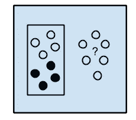

监督学习([来源](https://machinelearningmastery.com/a-tour-of-machine-learning-algorithms/))

● **无监督学习**

虽然监督算法对用户标记的数据进行输出预测，但这些训练机器明确地对未标记的数据进行训练，几乎没有用户参与。

算法留给数据进行分类和分组，以识别一些隐藏或未发现的模式，通常用作监督学习的初步步骤。

无监督学习([来源](https://blog.statsbot.co/machine-learning-algorithms-183cc73197c))

● **强化学习**

强化学习算法旨在探索和利用之间找到一个完美的平衡，而不需要标记数据或用户干预。

这些算法通过选择一个动作并观察其结果来工作，在此基础上，它学习结果的最优程度。这个过程反复重复，直到算法进化并选择正确的策略。

# 顶级机器学习算法

在熟悉了几种类型的 ML 算法之后，请继续阅读一些流行的算法。

## **1。线性回归**

[线性回归](https://machinelearningmastery.com/linear-regression-for-machine-learning/)是一种受监督的 ML 算法，有助于找到一组点的合适的近似线性拟合。

从本质上讲，线性回归是一种确定两个变量之间关系的线性方法**，其中一个值是因变量，另一个值是独立的。**

**这背后的想法是理解一个变量的变化如何影响另一个变量，从而产生积极或消极的关系。**

**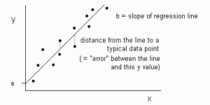**

**线性回归表示为 y = a+bx(s[source](http://bhagyeshvikani.blogspot.ca/2015/10/linear-regression.html)形式的直线**

**这条线被称为回归线，用线性方程 Y= a *X + b 表示。**

**在这个等式中:**

*   **y-因变量**
*   **a-斜率**
*   **X —独立变量**
*   **b —截距**

**该算法适用于预测输出连续且斜率恒定的情况，例如:**

*   **估计销售额**
*   **评估风险**
*   **天气数据分析**
*   **预测分析**
*   **客户调查结果分析**
*   **优化产品价格**

****有用链接:****

*   **[线性模型](https://scikit-learn.org/stable/modules/linear_model.html)**
*   **[岭回归](https://www.youtube.com/watch?v=5asL5Eq2x0A)**
*   **[拉索回归](https://www.youtube.com/watch?v=jbwSCwoT51M)**

## **2.**逻辑回归****

**[逻辑回归](/logistic-regression-detailed-overview-46c4da4303bc)算法常用于**二元分类问题**中，这些情况下的事件通常会产生两个值中的一个，通过或失败，真或假。**

**它最适合需要预测因变量属于两类响应之一的概率的情况。**

**这种算法的常见用例是识别给定的笔迹是否与有问题的人匹配，未来几个月石油价格会上涨吗。**

**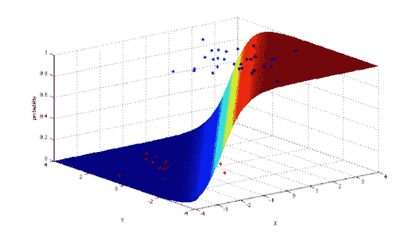**

**逻辑回归算法([来源](https://www.kdnuggets.com/2016/08/10-algorithms-machine-learning-engineers.html)**

**一般来说，回归可用于现实应用中，例如:**

*   **资信评分**
*   **癌症检测**
*   **地理图像处理**
*   **手写识别**
*   **图像分割和分类**
*   **衡量营销活动的成功率**
*   **预测某种产品的收入**
*   **某一天会有地震吗？**

****有用链接:****

*   **[sklearn.linear_model。物流回收](http://scikit-learn.org/stable/modules/generated/sklearn.linear_model.LogisticRegression.html)**
*   **[逻辑回归|分类](https://www.youtube.com/watch?v=-la3q9d7AKQ)**

## **3.**决策树****

> **[决策树算法](/decision-trees-in-machine-learning-641b9c4e8052)属于监督 ML，用于解决回归和分类问题。目的是使用决策树从观察到处理每一层的结果。**

**处理决策树是一种自上而下的方法，从训练数据中选择最合适的属性作为根，并对每个分支重复该过程。决策树通常用于:**

*   **构建知识管理平台**
*   **选择要旅行的航班**
*   **预测酒店入住高峰期**
*   **建议顾客买什么车**
*   **预测和识别不同领域的可能性**

**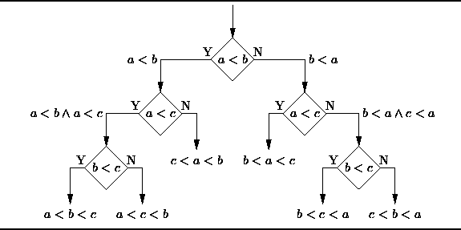**

**决策树算法([来源](https://www.kdnuggets.com/2016/08/10-algorithms-machine-learning-engineers.html))**

****有用链接:****

*   **[sk learn . ensemble . randomforestclassifier](http://scikit-learn.org/stable/modules/generated/sklearn.ensemble.RandomForestClassifier.html)**
*   **[sk learn . ensemble . gradientboostingclassifier](http://scikit-learn.org/stable/modules/generated/sklearn.ensemble.GradientBoostingClassifier.html)**
*   **[XGBoost 文档](https://xgboost.readthedocs.io/en/latest/)**
*   **[https://catboost.yandex/](https://catboost.yandex/)**
*   **[理解随机森林:从理论到实践](https://arxiv.org/abs/1407.7502)**
*   **[Python 中的实用 XGBoost](https://parrotprediction.teachable.com/p/practical-xgboost-in-python)**

## **4.Apriori 机器学习算法**

> **它是几个在线平台上流行的名为“你可能也会喜欢”的推荐系统背后的算法。**

**它通过在数据集中搜索公共项目集，然后在这些项目集上建立关联来运行。**

**它通常用于从关系数据库中进行项目集挖掘和关联规则学习。**

**该算法背后的思想是尽可能将相关项目扩展到更大的集合，以创建更有用的关联。**

**这种算法的应用包括突出市场中的购买趋势。**

**此外，它更容易实现，并可用于大型数据集。**

## **5.**朴素贝叶斯****

> **[朴素贝叶斯](https://www.analyticsvidhya.com/blog/2017/09/naive-bayes-explained/)分类器属于**高效**监督 ML 算法，是**最简单的** **贝叶斯网络模型**之一。**

**它的工作原理是对数据应用**贝叶斯定理**，并假设每对要素之间的条件独立性，给定类变量的值。**

**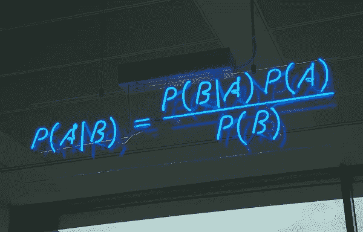**

**朴素贝叶斯([来源](https://www.kdnuggets.com/2016/08/10-algorithms-machine-learning-engineers.html))**

**更简单地说，假设事件 B 已经发生，它有助于找到事件 A 发生的概率。朴素贝叶斯最适合—**

*   **过滤垃圾邮件**
*   **推荐系统如[网飞](/how-data-science-is-boosting-netflix-785a1cba7e45)**
*   **对一篇关于技术、政治或体育的新闻文章进行分类**
*   **社交媒体上的情感分析**
*   **面部识别软件**

## **6.**人工神经网络****

**模仿人类大脑的[人工神经网络](https://vinodsblog.com/2018/12/31/how-neural-network-algorithms-works-an-overview/)充当了一个巨大的神经元迷宫，或者简单地说，是相互移动信息的节点。**

**这些相互连接的节点通过边缘将数据即时传递给其他节点，以便快速处理，促进更顺畅的学习。**

**人工神经网络通过例子来学习，而不是用一套特定的规则来编程。能够模拟非线性过程，它们可以在以下领域实施——**

*   **模式识别**
*   **网络安全**
*   **数据挖掘技术**
*   **检测患者体内的各种癌症**

****

**人工神经网络([来源](https://laptrinhx.com/titanic-prediction-with-artificial-neural-network-in-r-3087367370/)**

## **7.**K-均值聚类****

**[k 均值聚类](/understanding-k-means-clustering-in-machine-learning-6a6e67336aa1)是一种**迭代无监督学习算法**，将 n 个观察值划分为 k 个聚类，其中每个观察值属于最近的聚类均值。**

**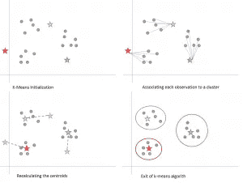**

**K 均值算法的步骤(s [源](https://hub.packtpub.com/clustering-and-other-unsupervised-learning-methods/)**

**更简单地说，这种算法根据数据点的相似性来聚集数据点的集合。它的应用范围从聚类相似和相关的网络搜索结果，在[编程语言](/top-programming-languages-for-ai-engineers-in-2020-33a9f16a80b0)和库如 [**Python**](/python-libraries-for-natural-language-processing-be0e5a35dd64) 、 **SciPy** 、 **Sci-Kit Learn** 和**数据挖掘**中。**

****K 均值聚类的实际应用—****

1.  **识别假新闻**
2.  **垃圾邮件检测和过滤**
3.  **将书籍或电影按流派分类**
4.  **城市规划中的热门交通路线**

****有用链接:****

*   **[sklearn.cluster.KMeans](http://scikit-learn.org/stable/modules/generated/sklearn.cluster.KMeans.html)**
*   **[集群上的视频](https://www.youtube.com/watch?v=hDmNF9JG3lo)**
*   **[K 均值聚类简介](https://www.datascience.com/blog/k-means-clustering)**

## **8.**支持向量机****

**[支持向量机](/support-vector-machine-introduction-to-machine-learning-algorithms-934a444fca47)被归类为监督机器学习算法，主要用于分类和回归分析。**

**该算法的工作原理是建立模型，将新的示例和数据分配到一个类别，这些类别很容易通过间隙相互区分。**

**在维数大于样本数的情况下，SVM 非常有效，并且非常节省内存。**

**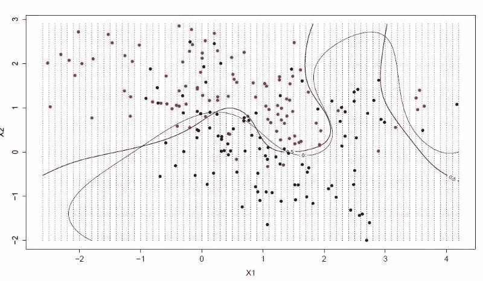**

**高效支持向量机算法([来源](https://builtin.com/data-science/tour-top-10-algorithms-machine-learning-newbies))**

**SVM 应用程序可以在以下位置找到:**

*   **人脸检测**
*   **图像分类**
*   **文本和超文本分类**
*   **手写识别**
*   **用于治疗的药物发现**
*   **生物信息学——蛋白质、基因、生物学或癌症分类。**

****有用链接:****

*   **[sklearn.svm.SVC](http://scikit-learn.org/stable/modules/generated/sklearn.svm.SVC.html)**
*   **[支持向量机](https://www.youtube.com/watch?v=eHsErlPJWUU)**
*   **[sklearn.linear_model。SGD 分类器](http://scikit-learn.org/stable/modules/generated/sklearn.linear_model.SGDClassifier.html)**

## **9.**K-最近邻****

**[K-最近邻](https://en.wikipedia.org/wiki/K-nearest_neighbors_algorithm)是一种监督 ML 算法**，用于回归和分类问题**。**

**该算法通常用于模式识别，首先使用距离函数存储和识别数据中所有输入之间的距离，选择最接近查询的 k 个指定输入并输出:**

*   **最常用的标签(用于分类)**
*   **k 个最近邻的平均值(用于回归)**

**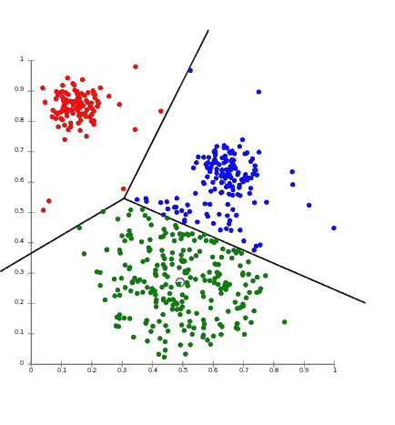**

**k-最近邻([来源](/top-10-algorithms-for-machine-learning-beginners-149374935f3c))**

****该算法的实际应用包括—****

*   **指纹检测**
*   **信用评级**
*   **预测股票市场**
*   **分析洗钱**
*   **银行破产**
*   **货币汇率**

## **10.降维算法**

**[降维算法](https://www.geeksforgeeks.org/dimensionality-reduction/)通过使用两种主要方法之一，即特征选择或特征提取，减少数据集中的维度空间或随机变量的数量。**

**这些通常用于预处理数据集，并删除冗余特征，使算法更容易训练模型。**

**这些算法也带来了一些好处，例如:**

*   **低存储要求**
*   **需要更少的计算能力**
*   **精确度提高**
*   **降低噪音**

**一些众所周知的降维算法是:**

*   **主成分分析**
*   **线性判别分析**
*   **局部线性嵌入**
*   **多维标度**

## **11.**主成分分析****

**[主成分分析](/a-one-stop-shop-for-principal-component-analysis-5582fb7e0a9c)是 ML 的一种无监督算法，主要**用于通过使用特征消除或特征提取来降低特征空间**的维度。**

**它还被用作**探索性数据分析和构建预测模型**的工具。需要标准化数据时，PCA 可以帮助:**

*   **图像处理**
*   **电影推荐系统**
*   **计算数据协方差矩阵**
*   **对协方差矩阵执行特征值分解**
*   **优化多个通信信道中的功率分配**

**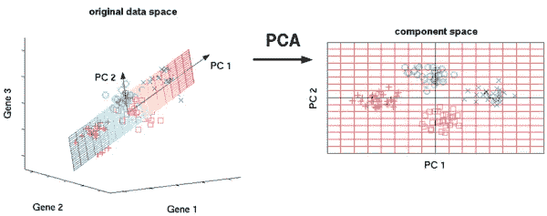**

**主成分分析([来源](https://www.kdnuggets.com/2016/08/10-algorithms-machine-learning-engineers.html)**

**PCA 旨在减少数据集中的冗余，在不影响准确性的情况下简化数据。它通常部署在图像处理和风险管理领域。**

****有用链接:****

*   **[scipy.linalg.svd](https://docs.scipy.org/doc/scipy/reference/generated/scipy.linalg.svd.html)**
*   **[sk learn . decomposition . PCA](http://scikit-learn.org/stable/modules/generated/sklearn.decomposition.PCA.html)**
*   **[主成分分析教程](https://arxiv.org/pdf/1404.1100.pdf)**

## **12.随机森林**

**[随机森林](/understanding-random-forest-58381e0602d2)使用各种算法**通过实现决策树来解决分类、回归和类似问题**。**

**它的工作方式是，用随机的数据集创建一堆决策树，并在其上重复训练一个模型，以获得近乎精确的结果。**

**最后，来自这些决策树的所有结果被组合起来，以确定最适合的结果，该结果最常出现在输出中。**

**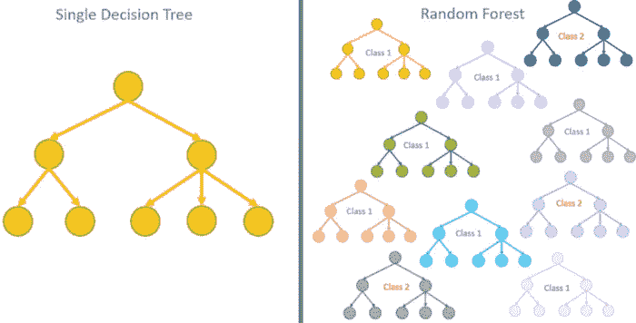**

**随机森林([来源](/top-10-algorithms-for-machine-learning-beginners-149374935f3c))**

****随机森林应用可在—** 中找到**

1.  **银行账户、信用卡欺诈检测**
2.  **检测和预测药物的药物敏感性**
3.  **通过分析病人的医疗记录来确定他们的疾病**
4.  **预测购买特定股票时的估计损失或利润**

## **13.**梯度增强& AdaBoost****

**Boosting 是集成 ML 算法将弱学习者转换为强学习者的技术。当数据丰富时，需要 Boosting 算法，我们寻求减少监督学习中的偏差和方差。下面是两种流行的提升算法。**

*   ****梯度增强****

**[梯度推进算法](/understanding-gradient-boosting-machines-9be756fe76ab)用于分类和回归问题，通常以迭代方式建立预测模型，如决策树。它通过对强学习者的错误进行训练来改进弱学习者，从而产生总体上准确的学习者。**

*   ****AdaBoost****

**[自适应增强](/understanding-adaboost-2f94f22d5bfe)的简称，AdaBoost 在弱学习者失败时改进模型。它通过修改附加到样本中实例的权重来更集中于困难的实例，然后，来自弱学习器的输出被组合以形成加权和，并被认为是最终的增强输出。**

# **结论**

**ML 算法对于数据科学家来说至关重要，因为它们在现实世界中的应用越来越多。有了上面提到的各种算法，你就能找到一个最能解决你问题的算法。这些算法虽然是监督和非监督的混合，但可以处理各种任务，并能够与其他算法同步工作。**

# **其他来源—**

**我希望这篇文章对你有用！如果您有兴趣了解更多信息，以下是附加资源:—**

** [## 面向所有人的顶级谷歌人工智能工具

### 使用谷歌人工智能中心将想法变为现实

towardsdatascience.com](/top-google-ai-tools-for-everyone-60346ab7e08)  [## 通俗易懂的机器学习算法，第 1 部分

### (即如何向你奶奶解释机器学习算法)

towardsdatascience.com](/machine-learning-algorithms-in-laymans-terms-part-1-d0368d769a7b)  [## 如果你在处理机器学习算法，你需要这些备忘单。

### 当我两年前开始学习机器学习(ML)时，我有许多关于使用哪些算法、如何使用的问题

medium.com](https://medium.com/free-code-camp/you-need-these-cheat-sheets-if-youre-tackling-machine-learning-algorithms-45da5743888e)  [## 何时使用不同的机器学习算法:简单指南

### 如果你从事机器学习的时间够长，你就会知道有一个“没有免费午餐”的原则——没有…

medium.com](https://medium.com/free-code-camp/when-to-use-different-machine-learning-algorithms-a-simple-guide-ba615b19fb3b)  [## 支持向量机——机器学习算法简介

### 从零开始的 SVM 模式

towardsdatascience.com](/support-vector-machine-introduction-to-machine-learning-algorithms-934a444fca47) 

> **关于作者**
> 
> **克莱尔 D** 。是[**Digitalogy**](https://www.digitalogy.co/)**—**的内容制作者和营销人员，这是一个技术采购和定制匹配市场，根据全球各地的特定需求，将人们与预先筛选的&顶尖开发人员和设计师联系起来。在[**Linkedin**](https://www.linkedin.com/company/digitalogy)[**Twitter**](https://twitter.com/DigitalogyCorp)[**insta gram**](https://www.instagram.com/digitalogycorp)上连接 **Digitalogy** 。**