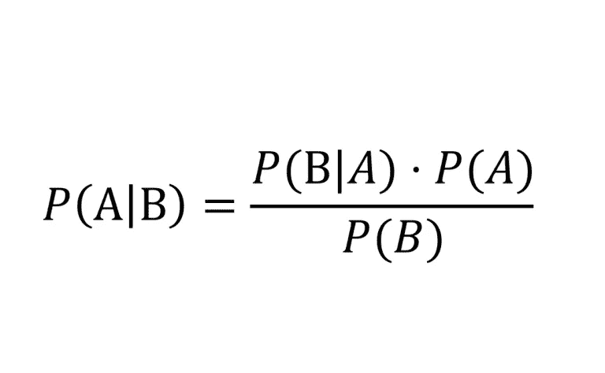

# 最流行的机器学习算法之旅

> 原文：<https://towardsdatascience.com/a-tour-of-the-most-popular-machine-learning-algorithms-b57d50c2eb51?source=collection_archive---------31----------------------->

## 对机器学习的组成、学习风格和算法的全方位快速概述

阿道夫·费利克斯在 [Unsplash](https://unsplash.com?utm_source=medium&utm_medium=referral) 上拍摄的照片

M 机器学习可以说是目前计算机科学领域最热门、讨论最多的话题，但是你如何跟踪似乎从无到有的不同算法的无尽级联呢？

从个人经验来看，当算法的名字被抛来抛去的时候，你可能会觉得非常难以理解，你只需要知道它们是什么以及它们是如何工作的。如果你在同一条船上，你就来对地方了！

在本文中，我们将对最流行的机器学习算法进行一次高层次的浏览，以便了解该领域的真实范围。首先，我们将研究算法的学习风格，然后是算法本身及其功能。最后，你应该对机器学习涵盖的所有算法以及它们之间的相互关系有一个坚实的认识。让我们开始吧！

# **学习风格**

在机器学习中，传统的做法是根据算法的学习风格对其进行分类。一般来说，学习风格只是一种花哨的方式，用来说明你有什么数据可以用来训练你的算法。我们来看一些！

## 1.**监督学习**

在监督学习中，输入数据被称为**训练数据**，并且具有**已知标签**/结果。输入的一个例子可以是动物的图片，标签可以是它的名字(例如，大象、猫等。).另一个例子可以是电子邮件作为输入，以及它们是否是垃圾邮件作为标签。

然后通过对输入数据进行迭代**训练**来学习一个模型，其中它不断地进行预测，并且当那些预测是错误的时候**自我校正**。这里有一个更简单的思考方式。

照片由 [Jovana Askrabic](https://unsplash.com/@jovana0909?utm_source=medium&utm_medium=referral) 在 [Unsplash](https://unsplash.com?utm_source=medium&utm_medium=referral) 拍摄

每当我想到机器学习，我都喜欢想到**婴儿**。想象一下，教一个婴儿什么是猫，它偶尔会指着一只狗大叫“猫”任何理智的父母都会纠正孩子，并告诉婴儿这个动物实际上是一只狗；同样，经过**的反复试验**，婴儿最终会很好地了解其中的区别。

这正是监督学习的工作方式；电脑是婴儿。当它看到一张猫的照片，并说“狗”，你作为父母告诉它，这实际上是一只猫。经过上千次告诉电脑或孩子什么是猫或不是猫，机器/孩子最终将能够很好地预测标签。

这个训练/校正过程一直进行到模型在数据上达到**期望的精度水平**。

## 2.**无监督学习**

与监督学习不同，非监督学习**没有标签**——只有输入数据。

通过**推断输入中存在的相似性**和其他结构来学习模型。

帕特里克·福尔在 [Unsplash](https://unsplash.com?utm_source=medium&utm_medium=referral) 上拍摄的照片

作为对我们之前类比的赞美，想象一下在一个婴儿面前倾倒一吨不同的 M & Ms 巧克力豆。有可能孩子会根据颜色和形状有效地将巧克力块分类(假设里面有花生巧克力豆:)，而不会被明确告知它们属于哪一类。

这是 ML 工程师在无监督学习中努力做的事情。我们希望将大量数据转储到计算机中，并根据各个数据点之间存在的相似性和差异性对其进行有效的分组。

## 3.**半监督学习**

顾名思义，半监督学习的输入数据混合了有标签和无标签的例子。

里克·梅森在 [Unsplash](https://unsplash.com?utm_source=medium&utm_medium=referral) 上拍摄的照片

在半监督学习中，我们希望机器能够**做出预测** **，同时学习结构**来组织手头的数据。

这种类型的学习不太常见，但仍然是一个非常酷的领域，在这个领域正在进行大量的研究。然而，当使用 ML 进行商业决策时，由于可靠性和准确性，您通常会看到团队和个人使用无监督和有监督的学习方法，而不是半监督的方法。

# **机器学习算法概述**

现在我们对学习风格有了一个坚实的了解，让我们来看看最流行的算法本身。

当你通读它们的时候，我强烈建议你思考可以用这些方法解决的问题，以及问题所属的学习风格；这样做不仅会激励你，还会让算法坚持下去。

## **回归算法**

回归算法关注的是输入和输出之间关系的建模；这是**迭代**通过使用预测中的误差度量来改进(回想一下猫宝宝的例子)。

Tatiana Rodriguez 在 [Unsplash](https://unsplash.com?utm_source=medium&utm_medium=referral) 上拍摄的照片

最流行的回归算法包括:

*   [线性回归](/linear-regression-made-easy-702e5dc01f03)
*   逻辑回归
*   逐步回归
*   普通最小二乘回归(OLSR)
*   *多元自适应回归样条(MARS)*
*   *局部估计散点图平滑(黄土)*

## **基于实例的算法**

基于实例的算法涉及**将新实例与已经存储在内存中的实例进行比较**。正如该过程所示，这种算法的另一个名字是基于记忆的学习。

图片来自[推特:](https://unsplash.com/@jankolar?utm_source=medium&utm_medium=referral) [Unsplash](https://unsplash.com?utm_source=medium&utm_medium=referral) 上的@jankolario

这些算法通常依赖于建立示例数据的数据库。然后**比较**提交给数据库内数据的新输入数据，并使用**相似性度量**，以便找到最佳匹配并做出预测。当编程和实现这些算法时，重点放在存储实例的**表示**以及用于确定关系的**相似性度量**上。

最流行的基于实例的算法包括:

*   k-最近邻
*   支持向量机(SVM)
*   学习矢量量化(LVQ)
*   自组织映射(SOM)
*   局部加权学习

## **正则化算法**

尽管正则化算法在本文中自成一类，但它们主要是与其他算法一起使用的。在高层次上，正则化基于模型的复杂性来惩罚模型；这反过来导致了更简单的模型，也证明了更好的一般化模型。

照片由[蒂莫·沃尔茨](https://unsplash.com/@magict1911?utm_source=medium&utm_medium=referral)在 [Unsplash](https://unsplash.com?utm_source=medium&utm_medium=referral) 上拍摄

举个例子，想象一下被问到“*你会怎么把一个数 x 翻倍？*”。你可能会想到用 2 ( `x * 2`)乘以数字`x`，但是你也可以通过做`((4x + 8)/4 — 2) * 2`来使数字翻倍。显然，第二种方法更复杂，也不是理想的方法；正则化不利于这种复杂性，并导致模型偏向简单性，例如将数字乘以 2。

最流行的正则化算法包括:

*   弹性网(L1)
*   岭回归(L2)
*   最小绝对收缩和选择算子(LASSO)
*   最小角度回归

## **决策树算法**

决策树方法关注的是基于数据中的值构建“决策”模型。

“决策树”的“树”部分来自于这样一个事实，即**决策在树结构中向下分叉**，直到做出决策/预测。

照片由[扎克·赖纳](https://unsplash.com/@_zachreiner_?utm_source=medium&utm_medium=referral)在 [Unsplash](https://unsplash.com?utm_source=medium&utm_medium=referral) 上拍摄

我最喜欢的解释决策树的方法是将算法与 20 个问题进行比较。在 20 个问题中，猜测的人问一系列是或否的问题，最终落在另一个人的脑海中(应用程序 [**Akinator**](https://en.akinator.com/) 是这一概念的另一个例子)。类似地，计算机询问关于输入的某些特征的“问题”,以遍历树并最终做出决定。

最流行的决策树算法包括:

*   迭代二分法 3 (ID3)
*   分类和回归树
*   C4.5 和 C5.0
*   卡方自动交互检测(CHAID)
*   决策树桩
*   M5
*   条件决策树

## **贝叶斯算法**

贝叶斯算法关注于将**贝叶斯定理**明确应用于回归和分类等问题。如果你不熟悉贝叶斯定理，这里是:

简而言之，它计算给定事件 **B** 的情况下，事件 **A** 的概率。例如，“*假设是阴天，下雨的概率有多大？*”将表示为 P( **雨** | **阴**)。同样，它将通过使用下雨时天气多云的概率(P(多云|下雨))乘以一般下雨的概率(P(下雨))并除以天气多云的概率(P(多云))来计算。

最流行的贝叶斯算法包括:

*   朴素贝叶斯
*   高斯朴素贝叶斯
*   多项式朴素贝叶斯
*   平均单相依估计量(AODE)
*   贝叶斯信念网络(BNN)
*   贝叶斯网络

## **聚类算法**

顾名思义，聚类算法关注的是**将相似数据点聚类在一起**。采取的所有方法(即分级、基于质心等。)使用数据中的**固有结构**以便最好地**将点**组织成具有**最大相似度**的组。

照片由[帕特里克·福尔](https://unsplash.com/@patrickian4)在 [Unsplash](https://unsplash.com?utm_source=medium&utm_medium=referral) 拍摄

还记得我们很久以前提到的 M&Ms 类比吗？想象一下，把一袋彩色 M & Ms 巧克力豆倒在一个人面前，告诉他们“分组”。他们很可能会用颜色、形状等将巧克力块很好地组合在一起。

类似地，计算机查看输入的数据点之间的相似性，并根据最大相似性将它们分组。

最流行的聚类算法包括:

*   k 均值
*   k-中间值
*   期望最大化
*   分层聚类

## **降维算法**

降维，顾名思义，就是**对输入数据的特征**进行降维的过程。例如，如果我们的每个数据条目有 100 列特征，我们可以将列减少到 20 列。

由[马库斯·斯皮斯克](https://unsplash.com/@markusspiske?utm_source=medium&utm_medium=referral)在 [Unsplash](https://unsplash.com?utm_source=medium&utm_medium=referral) 上拍摄的照片

但是你可能会问，为什么不用所有的列呢？这是因为**维度的诅咒** ( *哦，阴森森的* …对不起，这远没有听起来那么酷)。

没有太多的细节，维度的诅咒基本上说明了数据有太多的维度**会导致过于**复杂的模型**，这些模型不能**很好地概括**；换句话说，该模型冒着**过度拟合**我们的训练数据的风险，并导致**在真实世界数据上表现不佳**。**

**最流行的降维算法包括:**

*   **主成分分析**
*   **主成分回归**
*   **偏最小二乘回归(PLSR)**
*   **线性判别分析(LDA)**
*   **混合判别分析**

## ****集成算法****

**集成算法涉及**组合多个较弱的独立训练模型及其预测**，以便产生最终的、更准确的预测。**

****

**亚历山大·安德鲁斯在 [Unsplash](https://unsplash.com?utm_source=medium&utm_medium=referral) 拍摄的照片**

**正如亚里士多德所说，“整体大于部分之和”。“谁想到哲学会适用于 ML，嗯？**

**一般来说，这是一类非常强大的算法和技术，在机器学习社区中经常使用。**

**最流行的集合方法包括:**

*   **助推**
*   **引导聚合(Bagging)**
*   **adaboost 算法**
*   **随机森林**
*   **加权平均(混合)**
*   **堆叠概化(堆叠)**
*   **梯度增压机(GBM)**

## ****神经网络算法****

**神经网络是由我们的生物大脑和神经连接**激发**的模型(强调**激发**，而不是**模仿**……@ elon musk)。虽然它们超级浮华，看起来闪闪发光，但神经网络实际上已经存在几十年了！**

****

**照片由[安特·哈默斯特](https://unsplash.com/@ante_kante?utm_source=medium&utm_medium=referral)在 [Unsplash](https://unsplash.com?utm_source=medium&utm_medium=referral) 上拍摄**

**一般来说，神经网络可以被归入**模式匹配**保护伞之下，其中它被用于**回归**和**分类**。正如我们将在接下来的章节中看到的，神经网络具有非常强大的现代计算能力，并且已经进入了他们自己的领域，称为**深度学习**。**

**然而，将这部分称为神经网络“算法”是不正确的，因为神经网络是一个**非常大的子领域**，由数百种不同的算法和满足特定方面和问题(即计算机视觉、语言处理、分类等)的变体组成。).**

**构成神经网络的基础和最流行的算法包括:**

*   **感知器**
*   **多层感知器(MLP)**
*   **反向传播**
*   **梯度下降(随机)**
*   **Hopfield 网络**

## ****深度学习算法****

**深度学习是神经网络的现代转世**，它利用了当前的**“廉价”计算**。****

**总的来说，深度学习努力使用同样**大的数据集**的标签数据(图像、文本、视频、音频等)来创建**大得多的**和**更健壮的**神经网络。).**

****

**[Robina Weermeijer](https://unsplash.com/@averey?utm_source=medium&utm_medium=referral) 在 [Unsplash](https://unsplash.com?utm_source=medium&utm_medium=referral) 上拍摄的照片**

**深度学习最流行的基本算法和结构包括:**

*   **卷积神经网络(CNN)**
*   **递归神经网络**
*   **长短期记忆网络**
*   **堆叠式自动编码器**
*   **深度信仰网络(DBN)**

# ****其他 ML 算法****

****

**安妮·斯普拉特在 [Unsplash](https://unsplash.com?utm_source=medium&utm_medium=referral) 上拍摄的照片**

**尽管我们在这篇文章中所涉及的内容看起来相当广泛，但我很遗憾/很高兴地说，我们仅仅触及了的皮毛！例如，我没有涉及任何与 ML 子领域相关的算法，如自然语言处理、推荐系统、强化学习、图形模型等。这个列表还在继续，但希望这能激起你足够的好奇心，让你冒险去发现当今这个领域中正在实现的所有非常酷的算法。**

**为了对我们正在浏览的所有机器学习算法有所了解，看看这个[维基百科页面](https://en.wikipedia.org/wiki/List_of_machine_learning_algorithms)。**

**但是不要烦恼！这个维基页面相当广泛，了解我在本文中提到的算法应该会给你足够多的强大基础，以开始你在机器学习方面的新职业:)。**

# ****结论****

****

**在 [Unsplash](https://unsplash.com?utm_source=medium&utm_medium=referral) 上[杰尼斯·奥普里格](https://unsplash.com/@capturethemoment?utm_source=medium&utm_medium=referral)的照片**

**现在，为了总结我们在一起的时间，让我们看看我们都复习了些什么。我们从学习机器学习中的三种核心学习风格开始；你能记住他们吗？(如果没有，是时候重读了！)**

**然后，我们花了文章的大部分时间来研究不同类别的机器学习算法，并在每个类别中提到最流行的算法。**

**如果你有一个没有提到的算法，并且你想解释/把它放在列出的类别中，那么**把它放在回复**中让所有读者看到；毕竟，我们是在一起学习:)**

**在接下来的文章中，我们将更深入地研究这些特定的算法，以及我们如何从头开始制作它们；一定要拍一个跟拍，这样你就知道他们什么时候出来了！但是现在，我希望你喜欢这次旅行，并且学到一些新的东西。**

**编辑:[解说系列](/linear-regression-made-easy-702e5dc01f03)第一部出来了！绝对零经验学习[线性回归和梯度下降](/linear-regression-made-easy-702e5dc01f03)！**