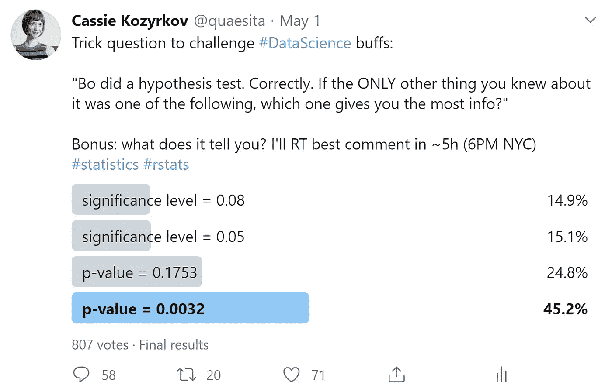

# 给数据科学爱好者的一个难题

> 原文：<https://towardsdatascience.com/a-trick-question-for-data-science-buffs-f44e21866a75?source=collection_archive---------9----------------------->

## 试试你的手在一个多项选择的统计推理难题！

关于恶作剧问题，我最喜欢的是吹毛求疵(你的*和我的*)是公平的游戏。当一个问题警告你这是一个陷阱问题时，请仔细阅读。

最初发布在[的推特](https://twitter.com/quaesita/status/1256261730755317767)上，现在再次让你尝试:

***”博做了一个假设检验。没错。如果你对它的唯一了解是以下之一，哪一个给你的信息最多？”***

***A)显著性水平= 0.08
B)显著性水平= 0.05
C) p 值= 0.1753
D) p 值= 0.0032***

现在，让我们来揭晓观众的答案:

你知道我第二喜欢的恶作剧问题是什么吗？当它运行良好时，最不受欢迎的答案就是正确的答案！是的，伙计们——答案是 a。正确答案是只获得 15%选票的答案。

> 获胜者是… A。

阅读推特上的评论让我很想岔开话题，谈论一下[邓宁-克鲁格效应](https://bit.ly/dunningkrugereffectwiki)，但我会克制自己。我们来分析一下这个问题。

为了帮助你浏览讨论，**我们可以推断的线索将用阿拉伯数字 1、2、3、4、…** 和*加粗，我们不知道的事情用罗马数字 I、ii、iii、…* 加粗

# 这个问题告诉你什么

每个 A-D 只有在特定的决策框架下才有意义，所以:

**1。博使用的框架来自** [**的统计**](http://bit.ly/quaesita_statistics) **。**

> ”博做了一个假设检验。正确。”

**2。计算没有错误。**

**3。所使用的测试适合于数据和假设。**

**4。测试对决策是有效的。**

每个人可能都会同意，如果计算出错，薄熙来犯了一个错误，但哪个“正确”的化身经得起最极端的挑剔？超越良好的技术执行，进入决策有效性的领域。这是你的第一个盒子外的线索。这个假设检验不仅仅是数学上的正确。

> 博的假设检验在数学上是* *和** 决策——理论上是正确的。

# 这个问题没有告诉你什么

其中，*用哪个代词来表示 Bo* 。我在评论中看到了很多假设，所以当你向下滚动看到真正的 Bo 的照片时，你可能会感到惊讶。

更确切地说，这里有一些你无法从措辞中回答的问题:

Bo 是决策者还是统计学家，还是两者兼而有之？
ii)有多少名事实上的决策者？

为了使事情变得简单(对我来说也不那么罗嗦)，我们将假设这个场景有一个决策者(Bo ),他碰巧也是统计学家。你要知道，这种假设在现实生活中经常会给你带来麻烦。专业[数据科学](http://bit.ly/quaesita_datasci)中的许多工作上的痛苦来自围绕[决策授权](http://bit.ly/quaesita_dsleaders)、[决策者无能](http://bit.ly/quaesita_genie)的问题，以及涉及多个利益相关者的复杂性。

不过，如果你想对它吹毛求疵，可以把下面的“ *Bo* ”替换成“*决策者*”，除非我们讨论的是计算。

这个决定是关于什么的？

尽管新手通常很难发现潜在的决策，但经典假设检验在哲学上植根于决策。(看我的文章《 [*千万不要从一个假设*](http://bit.ly/quaesita_damnedlies) 》来更好的理解框架。)

在你说“*我只是在做一些科学研究*”或“*我只是想知道* [*我的证据有多强*](http://bit.ly/quaesita_pointofstats)*”之前，花点时间找出真正的决策者(例如你向其提交科学研究的科学杂志的编辑)，他们有明确的[默认行动](http://bit.ly/quaesita_damnedlies)(例如不发表)和预定义的决策标准(例如 alpha 设置为当你只为自己做数据工作时，想想*你为什么要做*以及根据你所看到的会有什么变化。如果你有明确的答案，你也会看到决定。如果你真的不做决策，那么你想要的[数据科学子领域](http://bit.ly/quaesita_datasci)是[分析](http://bit.ly/quaesita_versus)，而不是[统计](http://bit.ly/quaesita_statistics)。分析可能使用假设检验方程，但实际上并不检验假设。(就像用手术刀不代表你在做手术。)*

*什么是零假设和决策标准？测试假设是什么？*

*绝对没有提供关于这些的信息，这自然意味着选项 C 和 D 都是垃圾。你可能会惊讶地发现一个关于 p 值的严酷事实:*

> *如果你不知道假设检验设置的所有细节，p 值是没有用的。*

*提供的两个 p 值对你来说都一样没用。(不知道什么是 p 值的可以在这里学习基础[。)](http://bit.ly/quaesita_puppiesm)*

> *这两个 C & D 都是故意转移话题，意在给那些错误地把 p 值当成表面价值的人敲响警钟。*

*那些转移注意力的东西是故意给你的，是为了提醒你，普通大众并没有意识到 p 值本身并不能提供很多信息。让我们深入了解人们不正确的两件主要事情(！)相信他们从那些 p 值中得到。首先:*

**VI)Bo 使用了多少数据？**

*p 值告诉你[样本大小](http://bit.ly/quaesita_vocab)是一个神话。有许多途径可以达到低 p 值，包括方便的或明显违反的假设。如果你对测试唯一了解的是它的 p 值，那么你对测试一无所知。*

> *如果你对测试的唯一了解是它的 p 值，那么你对测试一无所知。*

*为了说明这一点，我故意以一种反常的方式生成选项 C 和 D 的 p 值。我仅使用两个数据点来生成 *p 值= 0.0032* ，然后我再添加一个数据点来得到 *p 值= 0.1753。*就好像我预料到人们会犯这种非常常见的统计思维错误。耶，恶作剧问题！*

> *不，低 p 值并不意味着大量数据。*

*其次:*

*从测试中我们可以得出什么统计结论？*

*伙计们，你们一直在评论的“我们”是谁？*

*评论中反复出现的一个主题是暗指一个虚构的“我们”在学习一些东西。好像我们都在一起做决策。退后，没人邀请“我们”——波在这里负责。*

> *伙计们，这个“我们”是谁？这里由波负责！*

*统计假设检验是在不确定情况下做出合理决策的工具。你选择设置，输入一些数据，然后得到一个建议的动作。如果其他人喜欢使用不同的——但也是有效的——假设或设置，他们可能会得到不同的结果。两者都将是正确的。*

> *“我们”在试图把自己的观点强加给那些不想要的人之前，应该三思。*

*唯一有可能学到东西的实体是决策者，然而许多评论似乎没有意识到这一点。那种认为“我们”都应该参与——并从——T2 的每一个决策中学习的想法很奇怪。这不切实际，效率低下，而且对自由造成了不必要的冲击。“我们”不会选择我下一次咖啡的口味。*

# *选项 A 还是 B？*

*既然我们知道 Bo 的假设检验对决策有效*，下面是一些必须为真的附加项:**

***5。假设以正确的顺序建立，从默认动作开始。***

*(详见我的文章 [*千万不要从一个假设开始*](http://bit.ly/quaesita_damnedlies) 。)*

***6。对** [**显著性水平**](http://bit.ly/quaesita_statistics) **被设置在石头前的任何** [**数据**](http://bit.ly/quaesita_hist) **或** [**p 值**](http://bit.ly/quaesita_puppies) **进行检查。***

*没有一个自尊的决策理论家会宽恕对[确认偏差](http://bit.ly/quaesita_inspired)敞开大门的决策方法，所以从那个角度来看，测试也必须以*正确的*方式进行。*

> *如果你允许自己在球落地后移动球门柱，那你就做错了。重要级别必须提前设置！*

*如果你允许自己在球落地后移动球门柱，那你就做错了。这意味着无论重要性级别是什么，Bo 在项目的早期就致力于它。*

***7。** [**显著性水平**](http://bit.ly/quaesita_statistics) **的 0.05 是默认的示教值，所以在统计软件中经常是默认设置。***

*老师们通常喜欢掩盖令人分心的细节，以便专注于他们试图引入的新概念。默认值有助于减轻认知负担，因此要求学生假设显著性水平= 0.05，除非另有说明。有一天，我可能会写下为什么是 5%而不是其他数字的迷人而武断的历史(这个故事涉及一个留着大胡子的名人、一本雄心勃勃的教科书、版权法和农业)。*

***8。经典假设检验框架的美妙之处在于它让你控制决策质量和犯错误的风险。***

*大多数人没有意识到的是，统计假设检验是一个个性化的决策框架，给你三个拨号盘。你设置其中的任意两个，第三个会自动就位，然后你输入数据，得到一个建议的动作作为输出。这里有三个刻度盘:*

*   *显著性水平*
*   *最小功率曲线*
*   *最大样本量预算*

*所有这些都是平衡的。较低的显著性和较高的功效分别指对第一类和第二类错误的更好控制。(我已经在我的文章《 [*为匆匆忙忙的人统计*](http://bit.ly/quaesita_statistics) *中为你定义了所有这些行话术语)。你可以要求一个程序使这两种错误都变得不太可能…但是要付出代价:更多的数据。所需的样本大小预算拨号可能会设置自己过高的数字。太贵了？提高你的重要性等级或降低你的能量需求。**

> *如果你已经来到 p 值和置信区间的土地，你最好是在这里为控制质量和风险的某种方式。*

*你选择决策质量的能力几乎是经典统计推断的要点。你不选择[贝叶斯方法](http://bit.ly/quaesita_statistics)(不使用 p 值、显著性或置信区间)的原因是你*想要*控制出错的风险。如果你不在乎这个，去贝叶斯。*

*现在让我告诉你当我看着大多数人用经典统计推断做什么时我看到了什么。*

**

*我看到一个强大的框架，有三个表盘。一个([样本量](http://bit.ly/quaesita_vocab))通常是耸耸肩设定的，这意味着你最终会陷入两个糟糕的极端之一:为数据支付过多费用或浪费你的整个项目。一个通常被忽略([功效](http://bit.ly/quaesita_statistics)，一个([显著性水平](http://bit.ly/quaesita_statistics))被设置为 0.05，因为这是人们从学校记住的。我无法面对手掌。说到没抓住重点！*

> *我无法面对手掌。说到没抓住重点！*

*为了正确使用该框架，决策者每次都应该仔细考虑显著性水平。*

*他们应该如何设置？如果人们表现出足够的兴趣，我会单独写一篇文章。与此同时，重要的是你要明白，无论是谁负责做决策，都应该选择决策设置。*

> *无论你选择什么…都要深思熟虑地选择。*

*当我负责时，我使用了高于 0.1753 和低于 0.0032 的显著性水平。我也用过 0.05 和 0.08…还有一大堆其他的。这总是取决于利害关系和决策的质量。*

> *决策者认为合适的显著性水平是允许的。*

*当他们说 Bo“几乎肯定”会拒绝/不拒绝具有那些选项 D & C p 值的零假设时，评论在两个方面是错误的首先，你对决策或决策者打算做出的决策的质量一无所知，所以不要太确定。其次，“几乎肯定”是一个来自测量理论的技术术语，你几乎肯定*错误地使用了这个术语，可能是因为你不知道你的统计教授在讲课时开了一个私人玩笑。更好的表达你的意思的方式是，决策者使用“常规”设置会得出某些结论，这让我想到…**

*Bo 会在乎惯例吗？*

*这个很棘手。如果 Bo 有完全的权力做决定，那么没有；Bo 不应该对惯例不屑一顾，而应该使用 Bo 认为合适的任何决策工具。总有不止一种合理的方法来做决策。但是，既然不知道 Bo *是不是*的决策者，这里就真的不能做假设了。当决策监管者代表社会行事时(就像政府批准新药的过程一样)，传统规定了他们的大部分决策标准，他们*确实*必须遵循惯例，因为他们不能每次都要求社会直接参与。如果决策者完全参与决策，那么遵循惯例通常是懒惰的表现。(诚然，[有时候懒惰是高效的。](http://bit.ly/quaesita_di))*

*当你看到选项 B(显著性水平= 0.05)时，你不知道决策者是否深思熟虑地选择了它，他们是否因为所有的旅鼠都选择它，或者是否有人懒得调整软件设置。这比选项 A 提供的信息少，它至少告诉你测试的显著性水平几乎肯定是故意设置的。*

# *标新立异还是不怀好意？*

*许多评论把他们自己引入了关于惯例的话题。遵循惯例只有在特定情况下才是明智的。*

> *如果你在假设检验中做了什么坏事，你就没有正确地检验一个假设。*

*选项 A ( *显著性水平= 0.08* )会告诉你决策设置是非传统的，但假设非传统的选择在某种程度上是偷偷摸摸的，这是无知的。(事实上，那些认为这意味着 Bo 不怀好意(例如“alpha-hacking”)的人错过了“正确地”这个词的所有含义以及上面的线索#6 。如果你在假设检验中做了什么坏事，你就没有正确地检验一个假设。)*

*事实上，像 0.08 这样的非常规选择更有可能表明 Bo 是一位了解数据预算、功率和重要性之间权衡的专家。但是我们不能确定。*

**

# *摘要*

*下面是问题中每个选项实际告诉我们的内容:*

***A)显著性水平是故意设置的。有人在选择它之前至少考虑了一下，因为它不同于默认设置。**
B)显著性水平恰好与示教和软件默认设置相同。经过深思熟虑，它可能被设置为 5%，也可能没有。不多。不多。*

*这就是为什么赢家是选项 a。*

**

*见见激发这个谜题的老板(在右边)。她是统计学家、决策者、数据科学家，也是加拿大的大坏蛋。也是我大学最好的朋友。*

# *为什么答案不是关于效果大小*

*对于那些思考“效果尺寸”的人来说，有一个小小的附言:*

***9。*【检验一个假设】*与*不是一回事，“使用假设检验的数学为***[***EDA***](http://bit.ly/quaesita_damnedlies)***”所以*效果大小*不应该进入讨论范围。****

**采取行动的适当效应大小应该已经包含在 Bo 表述零假设的方式中。**

# **仍然不明白为什么 C & D 是不正确的？**

**如果你知道*关于决策者的决策设置和假设的一切*(你不知道！)，你可以推断出零假设世界不太可能产生至少像 Bo 观察到的那样极端的数据。**

**如果你知道显著性水平和 p 值(你不知道！)，您可以推断决策者是否发现数据令人惊讶，足以改变他们的想法，并放弃他们的默认操作。**

**当你发现别人的 p 值“足够低”时，你真正学到的只是“决策者被某件事惊到了。”**

> **如果您没有关于测试的假设和假设的信息，一个 p 值和另一个 p 值一样没有用。**

**不幸的是，你不知道什么是“足够低”，所以你甚至不知道博是否被[惊讶地付诸行动](http://bit.ly/quaesita_damnedlies)。如果没有所有这些信息，一个 p 值和另一个 p 值一样没用。这两个 C & D 都是故意转移话题，意在给那些错误地把 p 值当成表面价值的人敲响警钟。(解释见我的文章 [*为什么 p 值像针一样？*](http://bit.ly/quaesita_needles) )**

# **不要做一只旅鼠**

**统计假设检验最好的一点是，它给你一种方法来控制你的第一类和第二类错误概率，根据你的数据预算来平衡它们。(见我的文章 [*为赶时间的人统计*](http://bit.ly/quaesita_statistics) 如果需要复习。)**

**如果你不仔细考虑你对犯这一框架中最糟糕的错误——I 型错误——的风险容忍度，那么你就错过了整个练习的关键部分。每次选择 5%的显著性水平都没有意义——这相当于扔掉了你能控制的最重要的刻度盘。**

# **感谢阅读！喜欢作者？**

**如果你想说谢谢，我欣赏分享和[转发](https://twitter.com/quaesita/status/1257392379012755458)。如果你渴望阅读更多我的作品，这篇文章中的大部分链接会带你去我的其他思考。不能选择？试试这个:**

** [## 为什么 p 值像针一样？分享它们很危险！

### 有一场关于 p 值的战争…而且双方都是错的！

towardsdatascience.com](/why-are-p-values-like-needles-its-dangerous-to-share-them-b94c11be537) 

# 人工智能课程怎么样？

如果你在这里玩得开心，并且你正在寻找一个为初学者和专家设计的有趣的应用人工智能课程，这里有一个我为你制作的娱乐课程:

在这里欣赏整个课程播放列表:【bit.ly/machinefriend 

# 与凯西·科兹尔科夫联系

让我们做朋友吧！你可以在[推特](https://twitter.com/quaesita)、 [YouTube](https://www.youtube.com/channel/UCbOX--VOebPe-MMRkatFRxw) 和 [LinkedIn](https://www.linkedin.com/in/kozyrkov/) 上找到我。有兴趣让我在你的活动上发言吗？使用[表格](http://bit.ly/makecassietalk)取得联系。**