# 一个棘手的问题

> 原文：<https://towardsdatascience.com/a-tricky-tableau-question-6e8fe6e8371b?source=collection_archive---------44----------------------->

## 更好地理解画面以避免挫败感

micha Parzuchowski 在 [Unsplash](https://unsplash.com/s/photos/jenga-kid?utm_source=unsplash&utm_medium=referral&utm_content=creditCopyText) 上的照片

作为一名自由职业者，我已经用 [Airtasker](https://www.airtasker.com/) 设置了一些提醒，这样如果有任何新的与仪表板相关的演出发布，我就会收到通知。Airtasker 有点像“逐底竞赛”,人们(包括我自己)发布相对简单的任务，他们只想以最少的钱完成这些任务。

我以这种方式参加演出，他们带来了更大更好的东西，所以这并不全是坏事。如果没有别的，这是让你自己出去的好机会(尽管你必须小心那些要求你完成 20 美元作业的可疑大学生)。

Tableau 辅导是我做过多次的事情(私下和通过 AirTasker)。我想我也可以分享一些我遇到的常见问题。所以这可能会变成一篇博文**系列** …

**这篇博文**是关于一个 Airtasker 的演出，它提出了一个我似乎已经多次(以某种形式)遇到的 Tableau 问题。这是一个直击要害的问题，为什么许多人觉得画面非常令人沮丧。

海报上有两张图片来说明她的问题。

# 我的回应

我最终没有被分配到这个工作(drats！)，但这里是我想要传达的整洁版本。

为了让我们开始，我可以使用 R(参见这里的要点)快速生成虚拟数据[，包含每月预算和每日实际金额，以模拟他们的数据。](https://gist.github.com/Tadge-Analytics/58a49896a5648175f95b3b61af67f653)

请随意下载生成的 Excel 文件，点击[这里](https://www.dropbox.com/s/8ji31cxqpxouygk/example%20data.xlsx?dl=1)(如果您愿意跟随)。

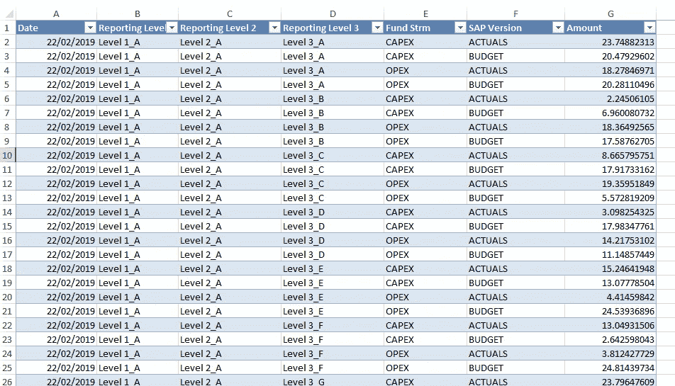

我们可以把这个放到桌子上，然后稍微布置一下。

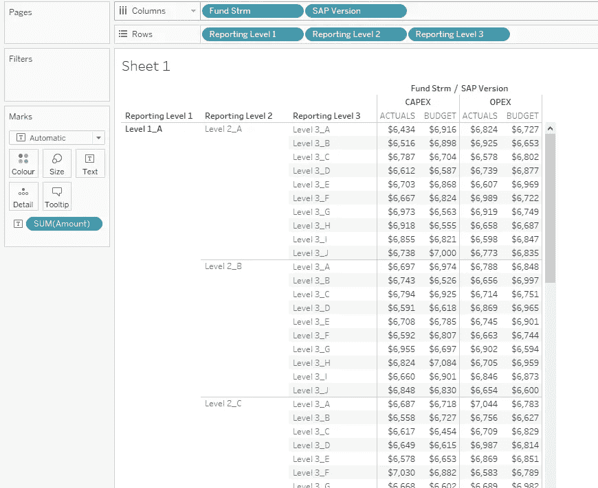

在他们的照片中，他们有一些与上面不同的东西。他们并不仅仅使用*金额*，而是有几个计算字段显示几个特定时间段的金额:

*   当前月份
*   本年度
*   当前年度累计(财政)
*   当前年度(YTG)(财政)

这是我如何创造这些。

第一步是创建一个新的列，该列正好是一直向下重复的当前日期。

> *我认为计算字段是添加到数据源表中的*新列*——除非您正在处理 LOD 计算——在这种情况下，它更像是一个连接的聚合表——但 LOD 是一个完全不同的话题。*

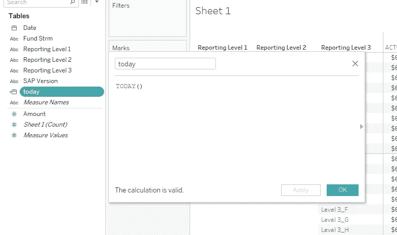

然后，我们创建一系列布尔(真/假)列，这些列将表明每一行中的日期是否满足我们的四个时间段条件中的任何一个。

使用 datetrunc()函数，当前月份和年份就足够简单了。

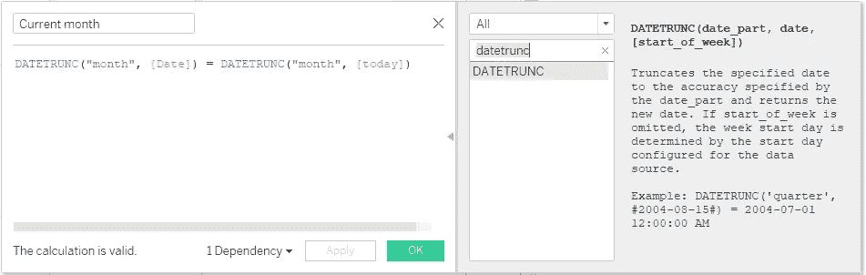

但是**财政年度**需要更多的策略。

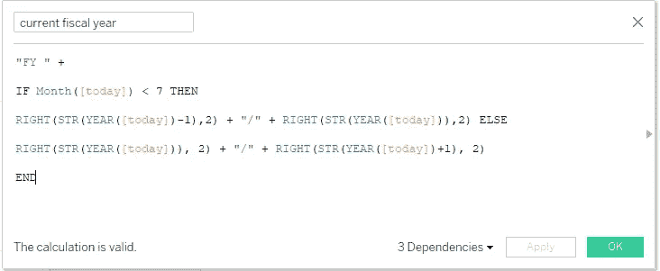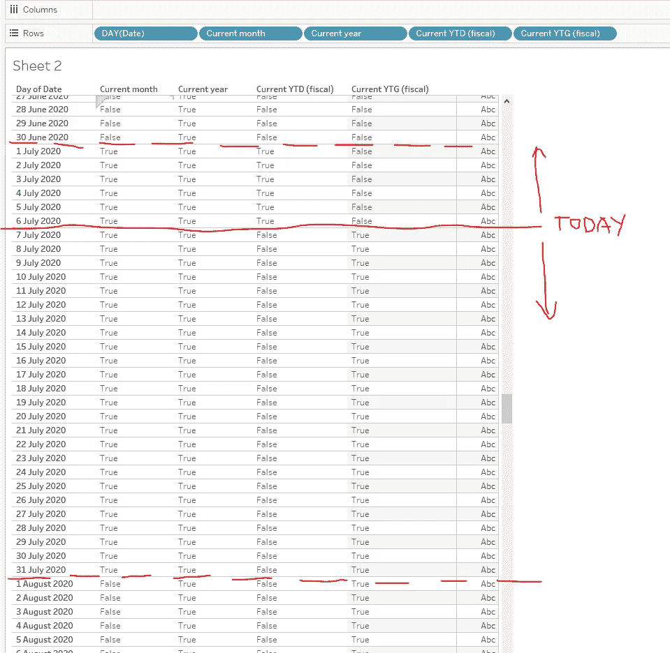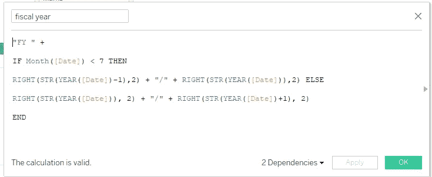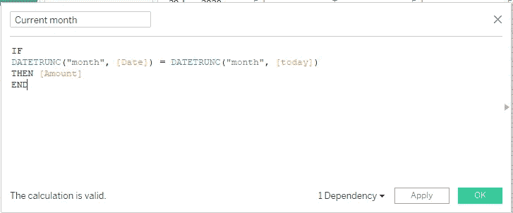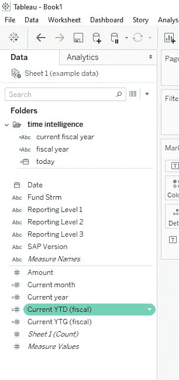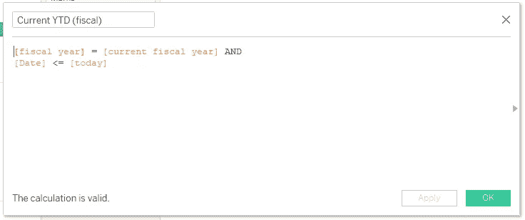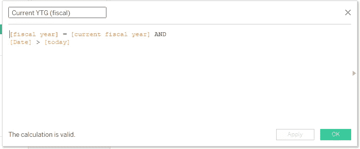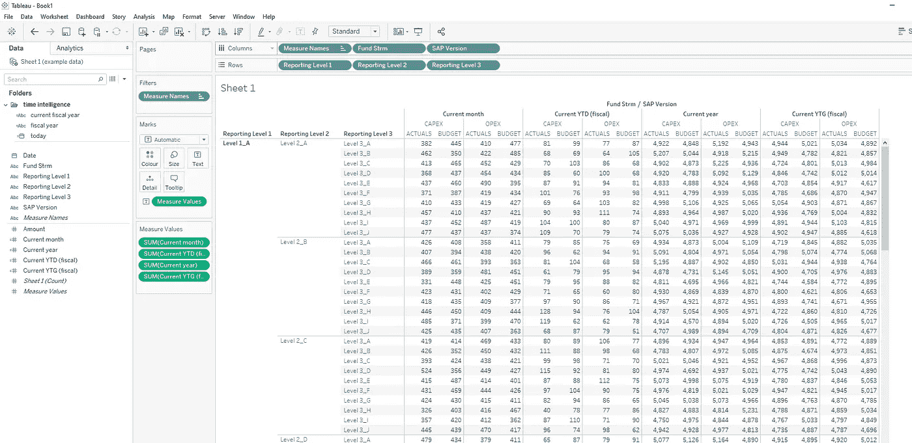

不错！用一个表仔细检查这些布尔值也是一个好主意，如下所示:

似乎一切都好。

我们的下一步是利用这些布尔列来*只包含金额列值，如果它们的条件满足*。我们可以简单地做到这一点，通过添加一个 IF 公式到每一个。

然后将每个选项拖到 Measures 部分。

亲爱的。

我们现在可以把它们都拖到我们的 viz 上，我们得到了一些看起来非常接近海报图片的东西。

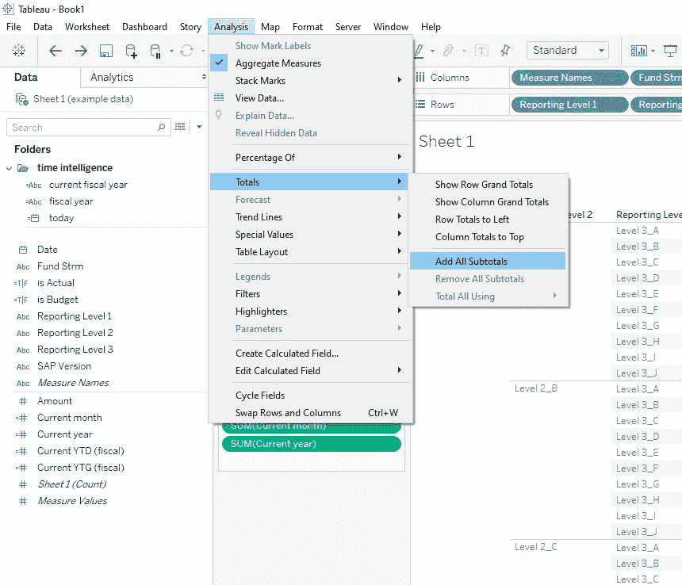

# 寻找解决方案

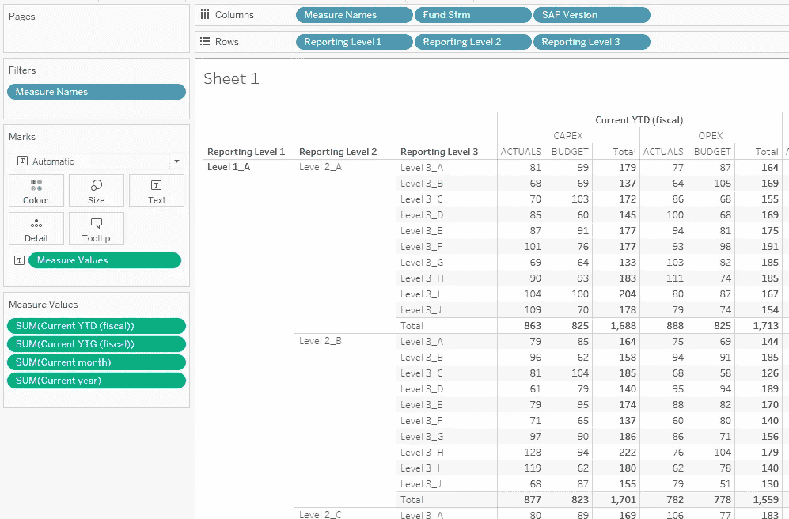

根据原图，她的要求有两部分:
1。添加一个差异列
2。从“未来一年(YTG)”部分删除“实际值”和“差异”。

> *这正是这种看似简单的事情，在 Tableau 中很难实现，这促使人们重新使用 Excel，在那里他们可以轻松地添加或隐藏列。*

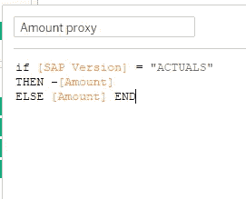

弄清楚“Tableau 方式”需要很好地理解 Tableau 是如何“思考”的

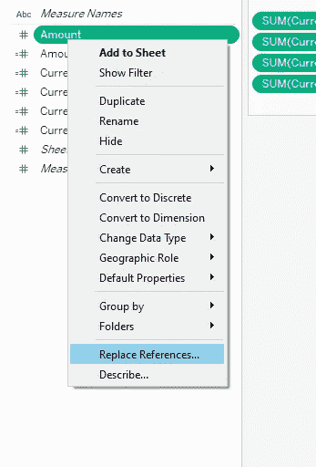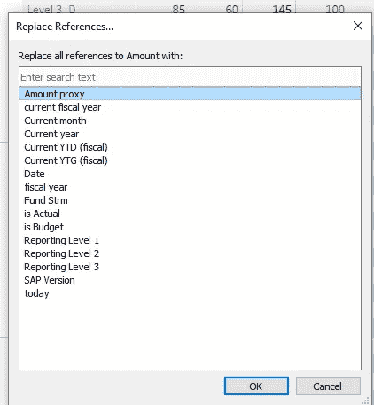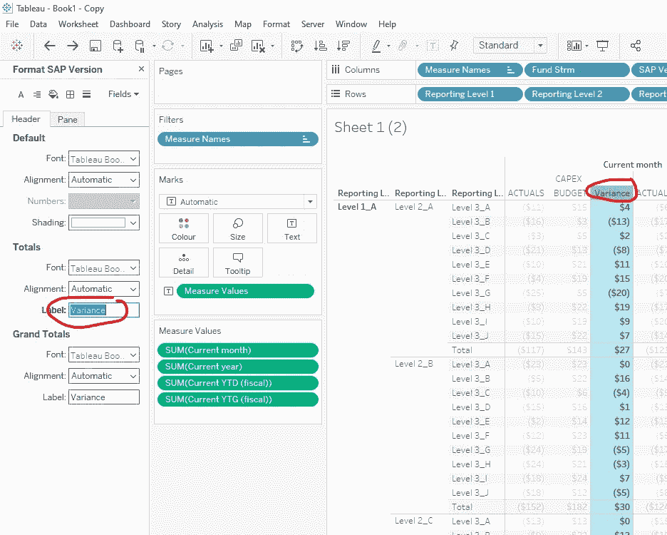

# 快速取胜的解决方案

(看起来)最简单的解决方案是向表中添加小计。

太棒了。

如您所见，新的 total 列只是 Actuals 和 Budget 列的相加。

为了得到方差，我们必须创建一个“代理”金额列，其中实际值为负。

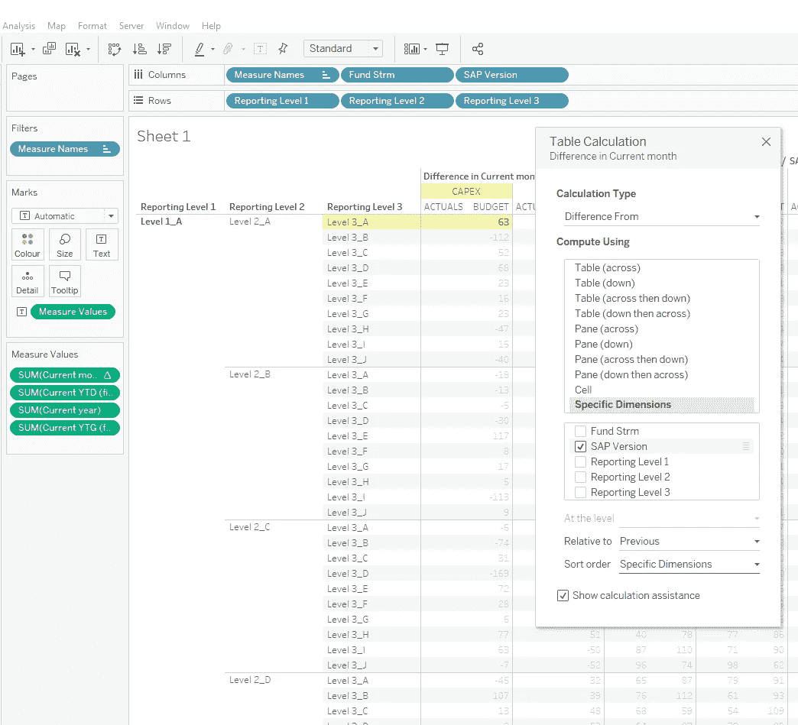

然后，我们将执行“替换引用”,这样，我们新创建的所有特定于时间的公式都链接回代理，而不是原始的 Amount 列。

这没问题。格式栏还允许我们将标题标签从“总计”更改为“差异”。

但是我们对这个新的差异列的控制非常有限。

除了格式化它的颜色和排列，我们没有什么可以改变它。如果我们想把它显示成一个百分比，我们就不能这样做。

这种解决方案只会真正满足最随和的客户。

另一个诱人的方法是右键单击我们的每个测量药丸，然后选择“快速表格计算”和“差异”…

这*将*我们的列从两列(实际&预算)变为一列(差额)。在这种情况下，很容易在意识到它不会给我们带来工作解决方案之前，在这个领域浪费几个小时。

# 令人沮丧的画面

我们可能会认输，继续手动聚合我们的数据，在预处理步骤中(可能使用 SQL 创建视图，甚至是计划的 Tableau 准备流程)，将方差值附加到我们聚合的原始数据中。

这是一个使用 Tableau Prep 的快速视频。

> 这种事情只应该是最后的手段。

创建一大堆*单一用途的数据源*是一个坏习惯。尤其是刚开始的时候。

有时这是不可避免的，它们的创建既快又简单。但是一直这样做可能会阻止你获得所有不同的提示和技巧，这些提示和技巧允许你想要的功能从原始数据源产生*。*

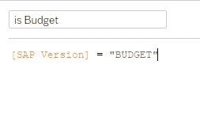

此外，这一过程的时间安排可能会成为你的一个障碍。如果我们正在处理一个数据库源，那么就有可能用这种正确的形式创建一个数据视图。但是，如果我们在没有一些中间位置(我们可以在那里建立这样一个视图)的情况下工作在一个直播服务*上，那么我们将会在设置它的过程中做更多的跑腿工作。*

诚然，如果报告只是每月更新一次，那么在常规流程中增加一个准备流程可能没什么大不了的。

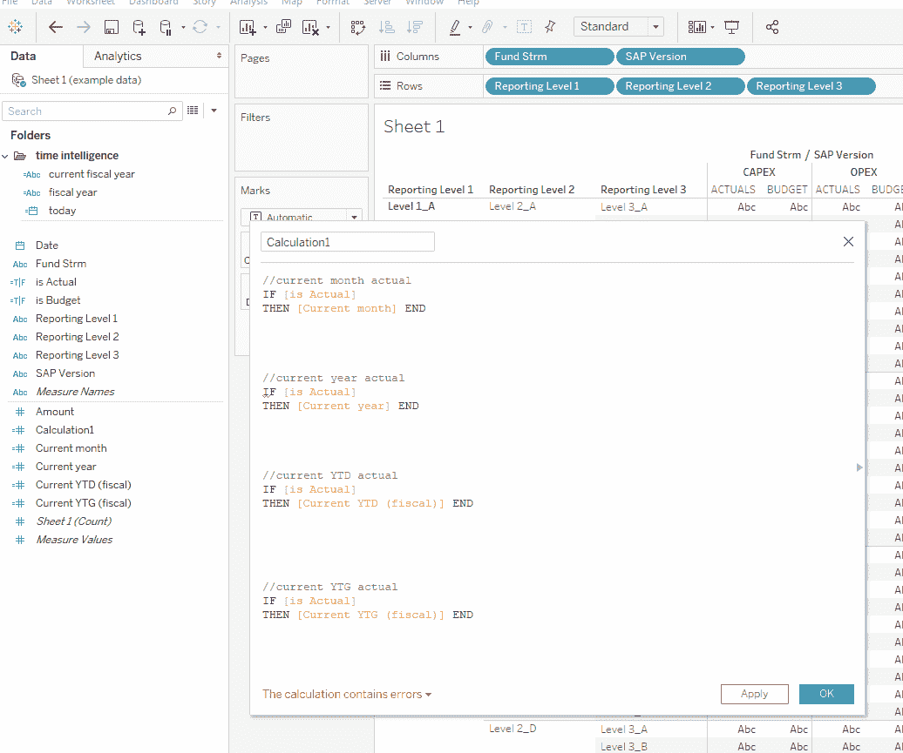

# 真正的解决方案

有一种方法可以非常接近我们客户的要求，在原始数据集之外进行操作。

我们要做的是为我们四个时间段的每个*创建三个新的(实际、预算和差异)度量。*

*不得不制定所有这些(12 项措施)听起来很令人头痛…但是我将向你展示一个漂亮的捷径。*

*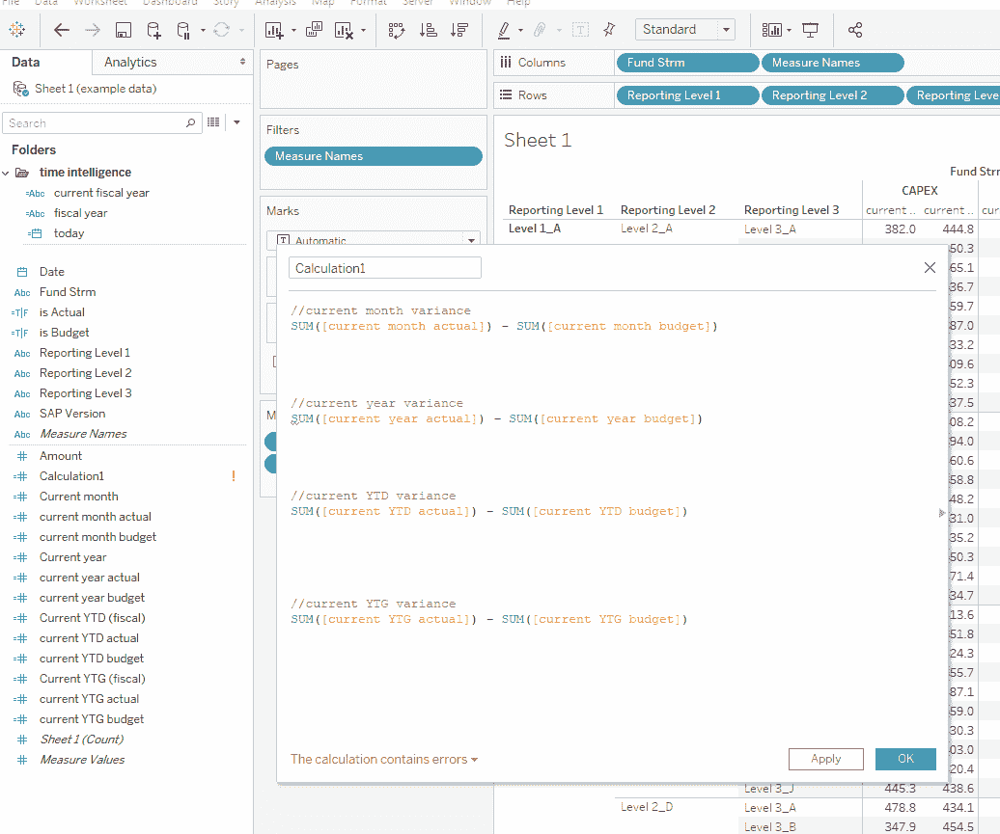*

*首先，我们创建两个辅助列。*

*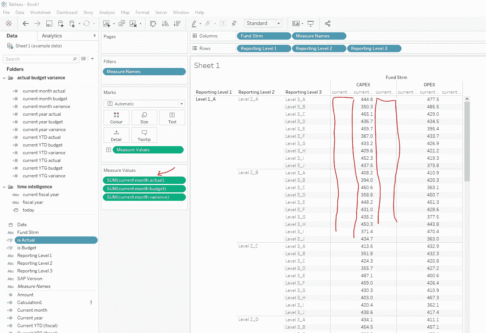*

*制作多个计算字段的诀窍是鲜为人知的*拖放方法*。*

*首先，创建新字段的名称*作为注释*。相应地修改每个公式。然后将每个部分(包括注释/标题)拖到 measures 窗格上。*

*哒哒！该注释成为度量的名称。很惊讶，对吧？*

*创建方差计算字段略有不同。请记住，从 Tableau 看到的内容来看，没有任何一行我们会看到**预算和实际**金额值。*

*这由 SAP 版本列决定。任何特定的行都是**T21、“实际”或“预算”。因此，使用[当月实际]—[当月预算]作为公式将**而不是**为我们工作。***

*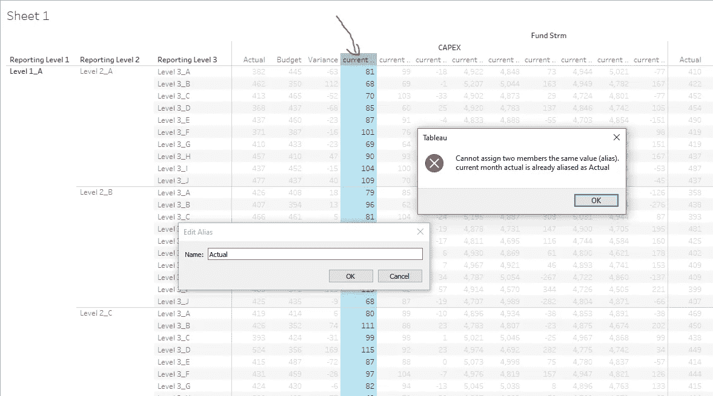*

*相反，公式需要是一个集合，依赖于观想的情境。我们需要使用 SUM([当月实际])—SUM([当月预算])。*

*为了整洁，我把所有这些新的计算结果放在一个文件夹里。让我们来看看它们。*

*哦不！在这一点上，我意识到“是实际的”栏不起作用！*

**

*SAP 版本有“实际的 **S** ”而不是“实际的”。幸运的是，我只需要更新“is Actual”列，而不是我们刚刚创建的每一个“… actual”计算字段。唷！尽可能减少重复代码是一个很好的教训。*

*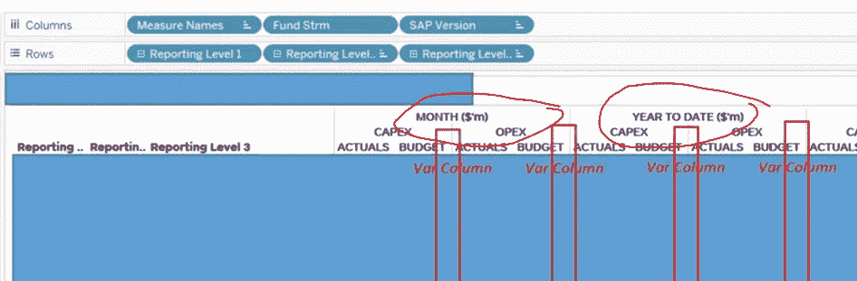*

*好吧。回到正轨。*

*将所有这些计算过的场都加入到 viz 中，我们面临着一系列新的挑战。*

*对于每个新度量，我想将标题别名从“当前月实际值”更改为“实际值”，但我只能这样做一次，因为它不能有重复的别名。*

*作为回应，我不得不在随后的别名上添加尾随空格，例如“Acutals”。我还将这些标题格式化为左对齐，并且从不“换行”(这样它们看起来都一样)。*

*诚然，这是一个相当小的问题。*

*使用所有这 12 个新计算的度量，我们现在可以根据需要灵活地修改差异列(例如，我们可以将其更改为预算的百分比)。我们还可以删除“未来一年的实际和差异”部分。*

*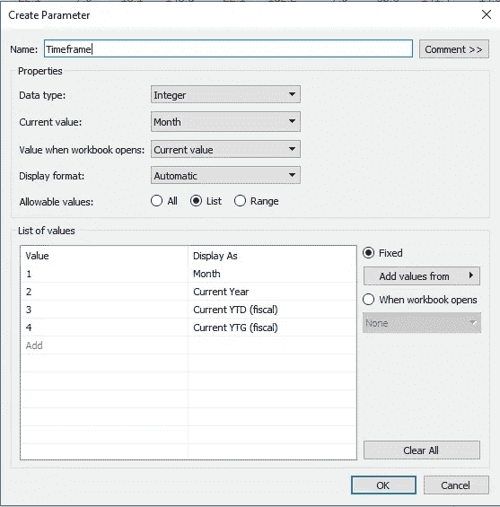*

*然而，作为一个信息丰富的表格，这是非常乏味的，它缺少了客户请求的一个关键部分。*

***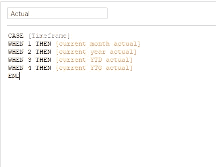**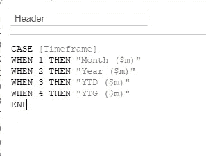**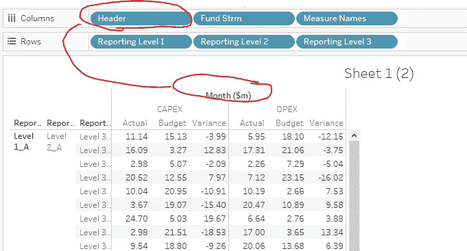*

*我们不能将“月($m)”、年初至今($m)”标题添加到显示“资本支出 OPEX”的上方(我们的源表中没有允许这样做的列)。我们目前的设置只是有一大堆数字，没有明确的时间框架之间的区别。*

*我们可以用这些新的方法制作任何数量的酷图表，但是假设我们的客户是一个真正的坚持者，要么让表格看起来像她想要的那样，要么明确地知道她想要的根本不可能。*

*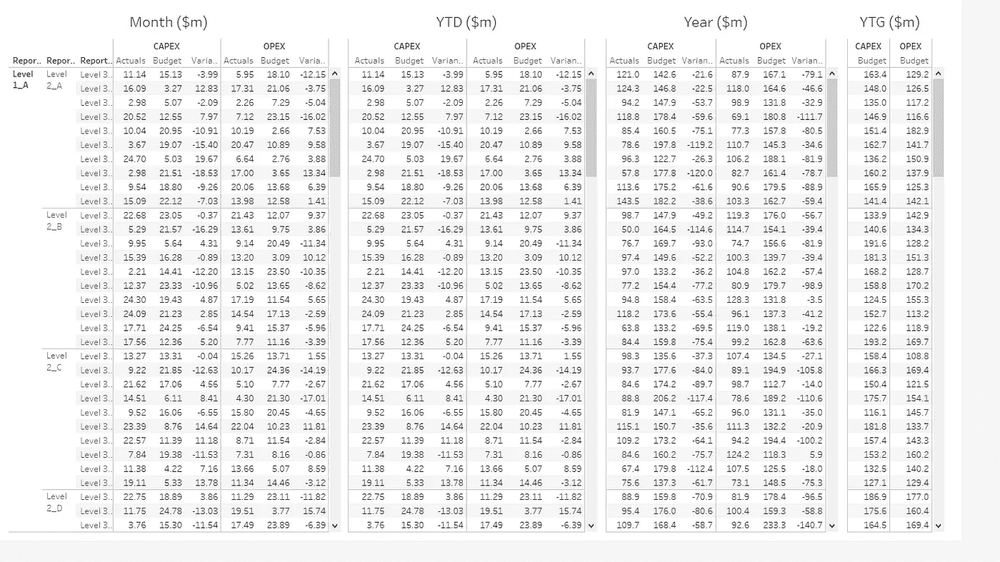*

> **在所有这些艰苦的工作之后，我们会承认失败吗？**

*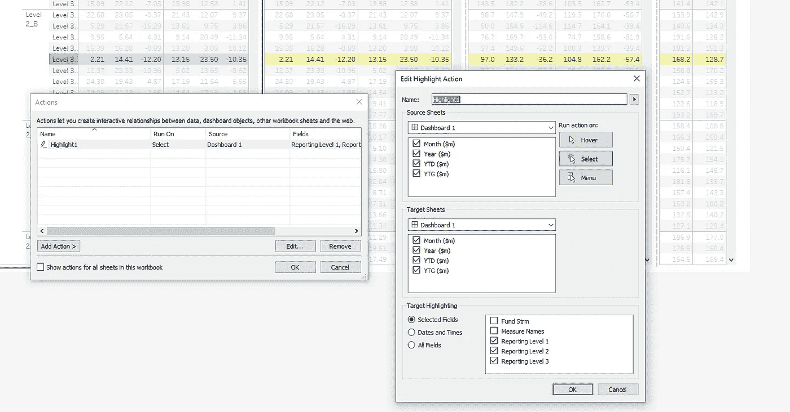*

# *选项 2*

*和我们的委托人谈谈。尝试说服她一个你知道如何做的替代解决方案。*

*也许他们不需要在一个表中显示每个时间段。我们可以创建一个参数，只显示*选择的*时间范围，一次一个。*

*然后使用参数选择器驱动显示的数量。*

*一个小标题公式，会给我们需要的标题。*

*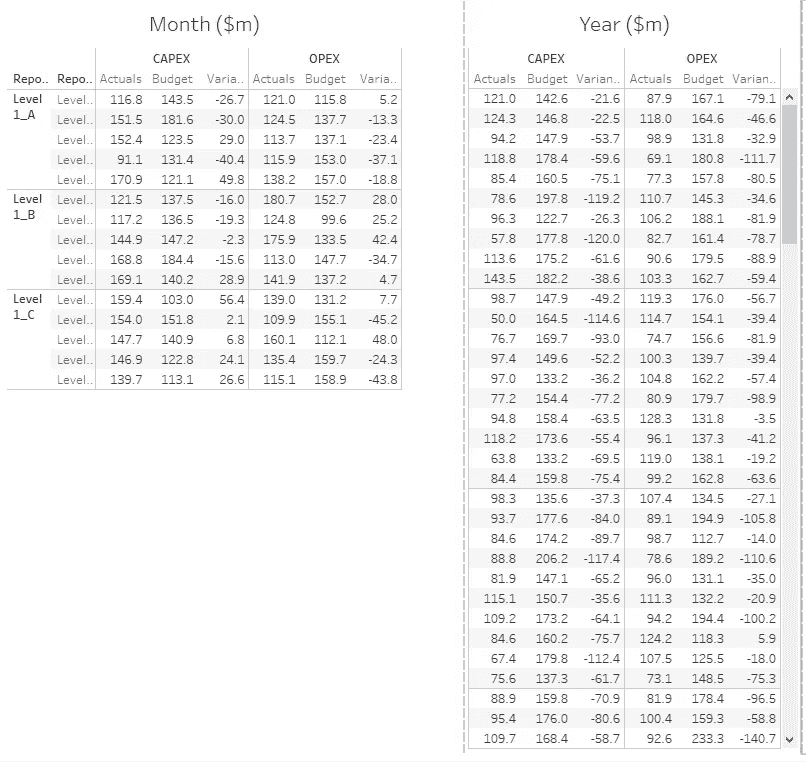*

# *选项 3*

*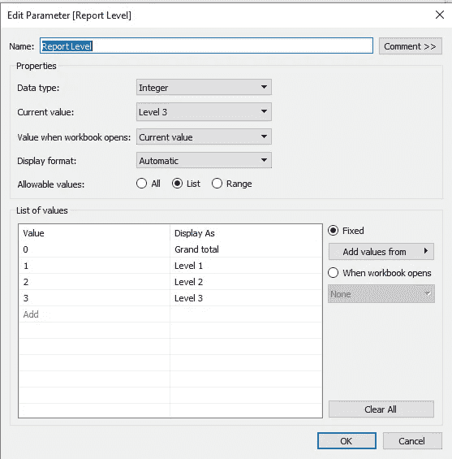*

*如果他们绝对*必须*把它们都放在一个页面上，有一个解决方案。*

*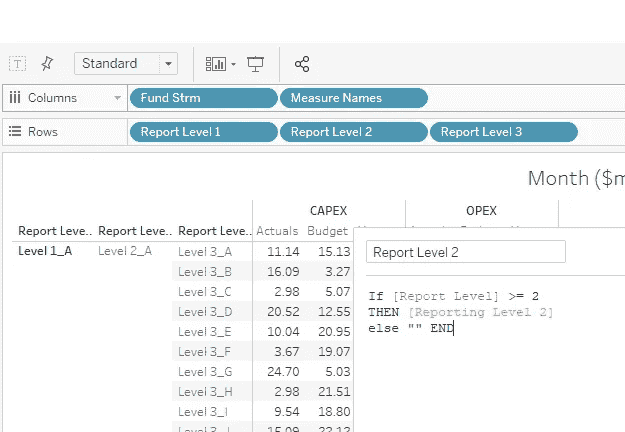*

*我们可以通过制作一个包含一系列表格的仪表板来实现这一点，这些表格只包含每个时间段的度量。*

*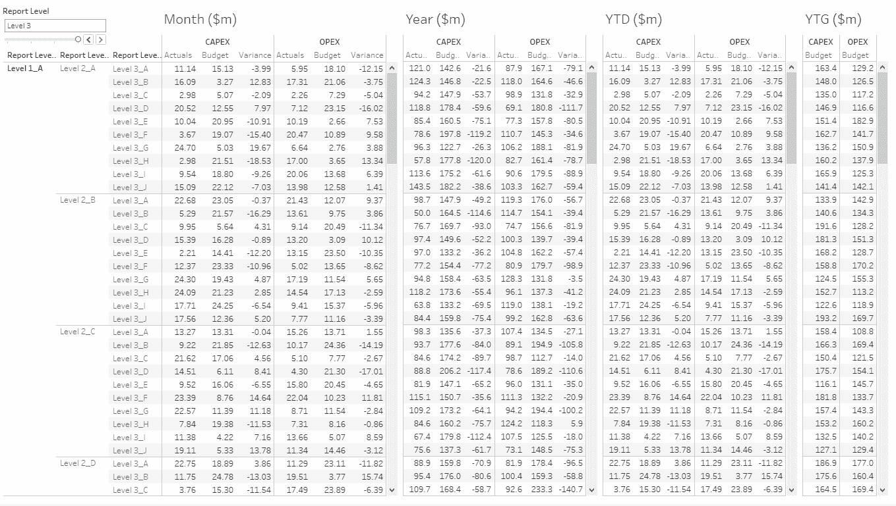*

*我们还将添加一个突出显示操作，这样在一个表中突出显示的行也会在其他 3 个表中突出显示。确保一切都正确排列。*

*如果实际数据有许多类别，我们还必须处理这些滚动条，因为它们不会以同步的方式滚动。有一个黑客，可用于这一点，解释得很好，在下面的视频。*

*这允许我们通过一个中心参数来限制每张表上显示的行数。但是你最终会得到一个水平滚动条，这有点烦人。可能有其他方法来改善滚动体验。*

 *[## Tableau 公共

### 编辑描述

public.tableau.com](https://public.tableau.com/profile/klaus.schulte#!/vizhome/SynchronizedScrollingacrosssheetsinTableau2019_2/SynchronizedScrollingacrosssheets)* 

*这个演示展示了参数的使用。但我认为也好不到哪里去。*

# *上下合计*

*我们可能向客户展示的最后一个技巧是根据报告级别扩展和收缩表格。不幸的是，在我们的仪表板中，层次结构不能跨多个工作表工作。*

*最简单的解决方案(复制自[这段 Youtube 视频](https://youtu.be/tpYUfR6wkC4))是添加一个报告级别参数。*

*然后用计算字段替换实际报告级别，该字段将根据参数设置显示级别(或为空)。*

*这使我们能够根据不同的报告级别向上或向下(跨所有工作表)汇总。*

*也可能有“集合行动”演习，以进行调查。启用“单击展开”功能。但对我来说，参数滑块似乎令人满意。*

# *所以你有它。*

*看来我们终于找到了(理论上)能够满足客户最初要求的东西。您可以从 Tableau public 下载 Tableau 工作簿。*

*[https://public . tableau . com/views/Book1 _ 15941833680570/dashboard 1？:language = en&:display _ count = y&:origin = viz _ share _ link](https://public.tableau.com/views/Book1_15941833680570/Dashboard1?:language=en&:display_count=y&:origin=viz_share_link)*

*在这个过程中，我们也向她展示了 Tableau 的一系列方面，其中许多方面她可能从未见过。*

*现在有很多地方可以这样做，比如可视化，理解起来不需要太多的认知负荷。*

**原载于 2020 年 7 月 8 日 https://tadge-analytics.com.au***。***