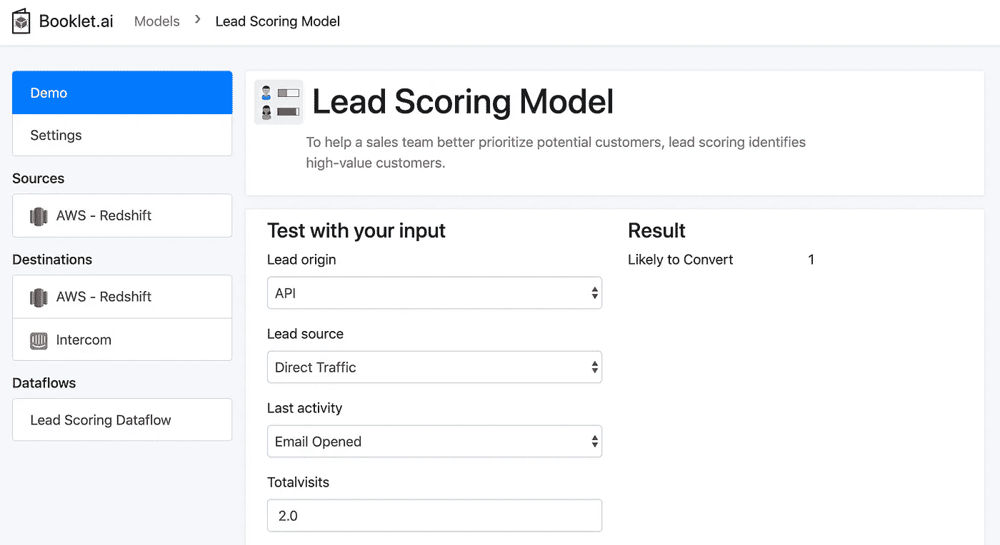
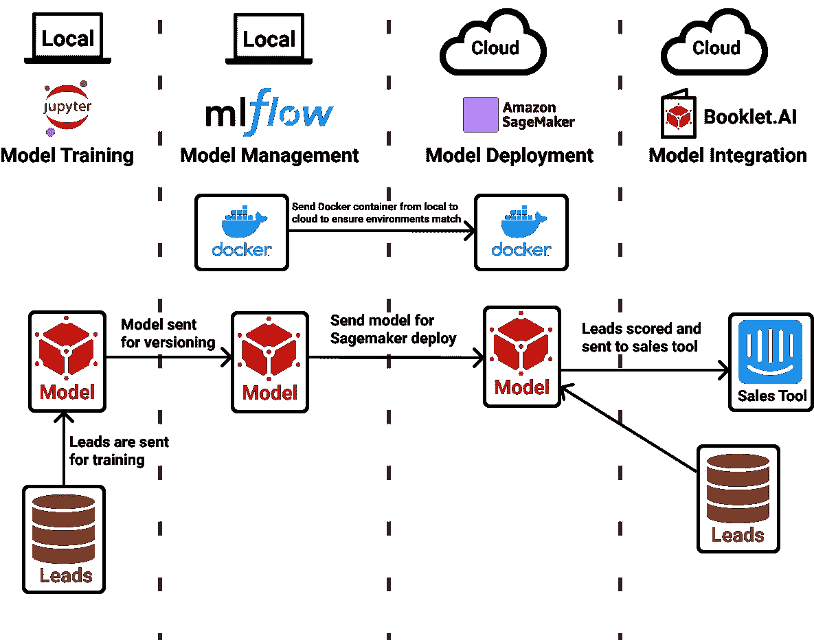
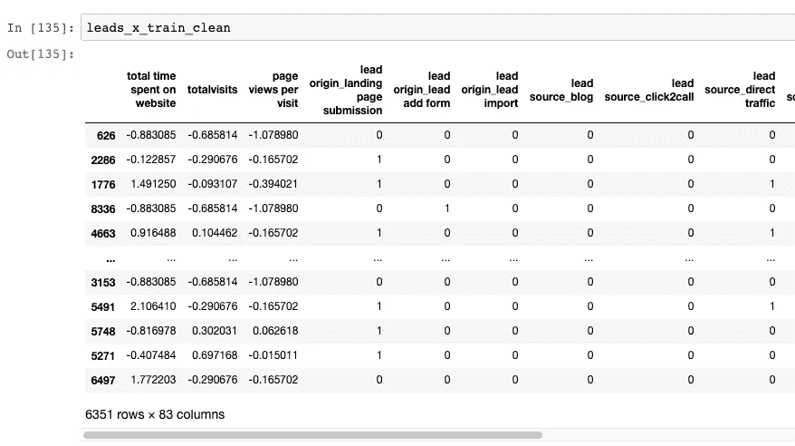
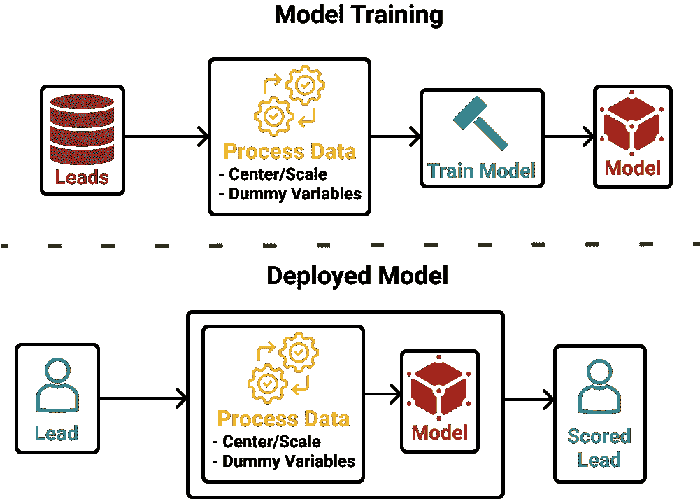
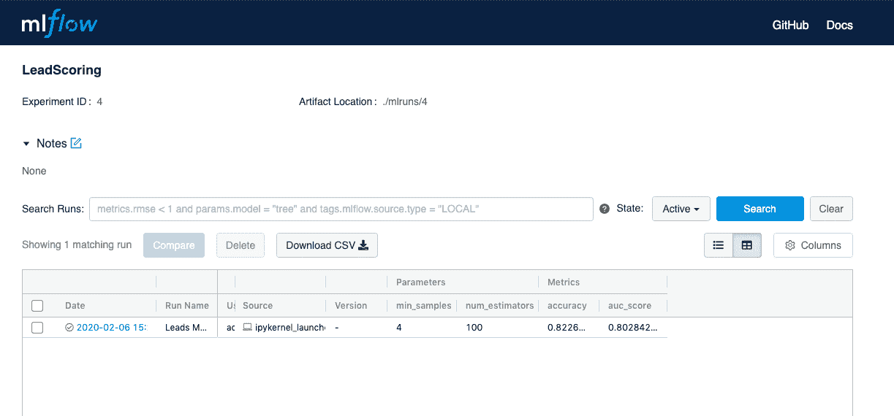
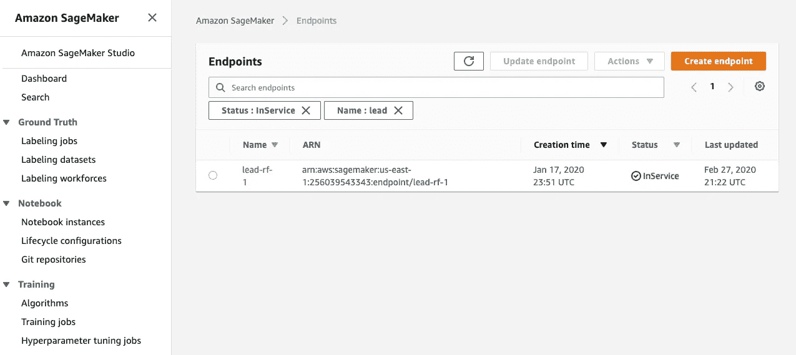
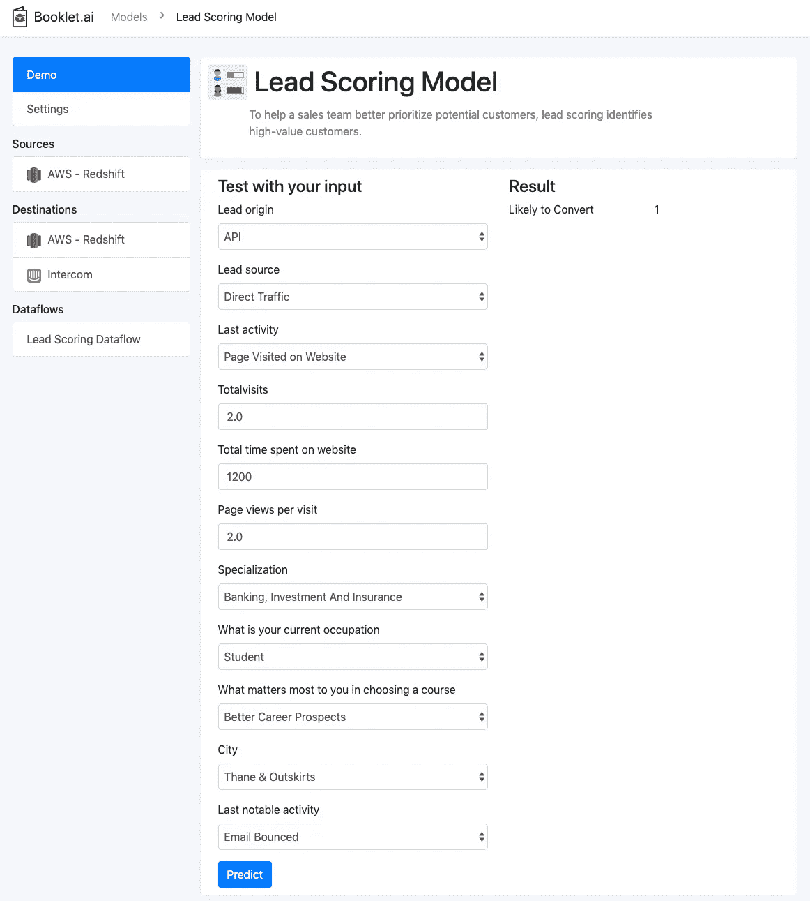
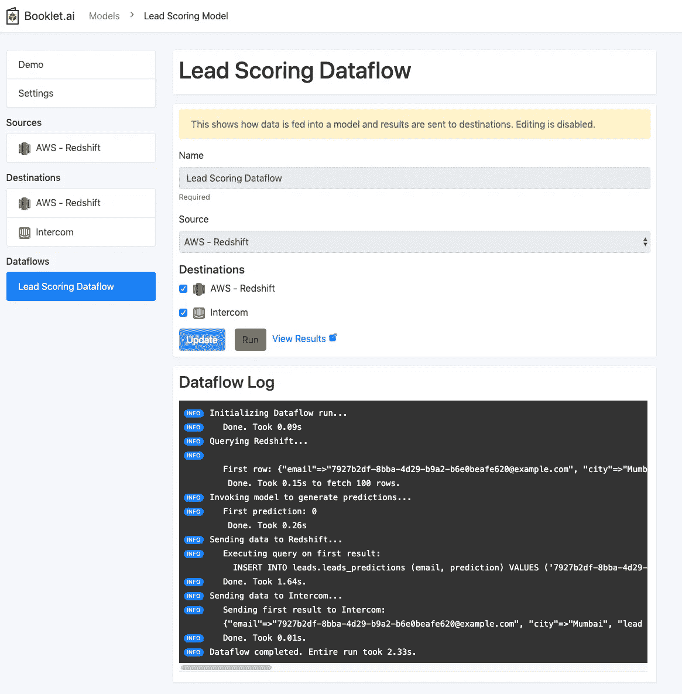
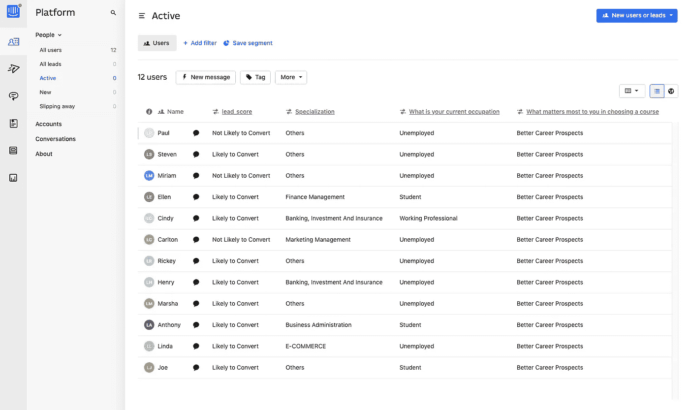

# 真实的端到端 ML 示例:销售线索评分

> 原文：<https://towardsdatascience.com/a-true-end-to-end-ml-example-lead-scoring-f5b52e9a3c80?source=collection_archive---------4----------------------->

## [实践教程](https://towardsdatascience.com/tagged/hands-on-tutorials)

## 从机器学习的想法到用 MLflow、AWS Sagemaker、 [Booklet.ai](https://booklet.ai/) 实现的解决方案

# 介绍

卖东西可能是一项艰苦的工作。一个企业可能有许多潜在客户，但这些客户中的大多数最终不会变成实际的付费客户。销售团队必须整理一长串潜在客户的名单，并想出如何打发他们的时间。这就是领先得分的由来。这是一个系统，它分析每个新线索的属性与该线索实际成为客户的机会的关系，并使用该分析对所有潜在客户进行评分和排名。有了新的排名，销售团队就可以优先安排他们的时间，只将时间花在极有可能成为付费客户的销售线索上。

*酷，听起来棒极了！我该怎么做？*

嗯，很高兴你问了！在本帖中，我们将介绍一个定制的销售线索评分模型的完整端到端实现。这包括提取数据、构建模型、部署模型，最后将这些结果直接推送到最重要的地方——销售团队使用的工具。



[测试 Booklet.ai 中的模型](https://app.booklet.ai/model/lead-scoring)

**如果你想测试出这个模型而不经历整个流程，我们在**[**booklet . ai**](https://booklet.ai/)**上有一个** [**全功能的线索评分模型**](https://app.booklet.ai/model/lead-scoring) **。**我们已经将所有代码以 [Jupyter 笔记本的形式发布在 GitHub](https://github.com/BookletAI/lead-scoring-demo) 上。

# 先决条件

这将是一个技术教程，需要一点编码和数据科学的理解才能通过。为了从中获得最大收益，您至少应该接触一些:

*   Python(我们将一直呆在 Jupyter 笔记本中)
*   机器学习(我们将使用随机森林模型)
*   命令行(是的，它可能很吓人，但我们只是使用一些简单的命令)
*   AWS(我们可以牵着你的手度过这一关！)

此外，您应该安装一些东西，以确保您可以快速浏览教程:

通过 awscli 访问的 AWS 用户名(我们将在下面介绍！)

带有几个包的某种 Python 3:

*   熊猫`pip install pandas`
*   MLflow `pip install mlflow`
*   SKlearn `pip install scikit-learn`
*   Docker(非常快速和容易地安装[这里](https://hub.docker.com/editions/community/docker-ce-desktop-mac/)

# 在我们开始之前…

我们将在很短的时间内接触到很多工具和想法。在我们开始之前，重要的是后退一步了解这里发生了什么。我们将使用一些工具:

*   [Jupyter 笔记本](https://jupyter.org/):数据科学家的必备品。允许您以笔记本的形式运行 python 脚本，并在线获得结果。
*   [MLflow](https://mlflow.org/) :开源的模型管理系统。
*   [Sagemaker](https://aws.amazon.com/sagemaker/) :来自 AWS 的全栈机器学习平台。
*   [Booklet.ai](https://booklet.ai/) :模型测试与集成系统。
*   [对讲机](https://www.intercom.com/):客户服务和销售团队常用的管理客户关系的客户信息平台。

下图概述了这些不同工具的使用方法:



过程概述，作者的工作。利用来自[名词项目](https://thenounproject.com/)的图像

在最高级别，我们将使用 Jupyter 笔记本来提取销售线索数据并训练模型。接下来，我们将把模型发送到 MLflow 来跟踪模型版本。然后，我们将把 docker 容器和模型发送到 AWS Sagemaker 来部署模型。最后，我们将使用小册子将模型投入使用，并开始将销售线索分数输入内部通信系统。

既然我们已经解决了这个问题，那就让我们开始吧！

# 训练模型

# 关于数据

首先，我们需要访问关于我们的线索的数据。该数据应包含两种类型的信息:

(一)响应变量:是否导致转化为付费客户

(B)特征:有助于我们了解响应变量的每个线索的详细信息

在本练习中，我们将使用来自 Kaggle 的示例[销售线索数据集](https://www.kaggle.com/ashydv/lead-scoring-logistic-regression/output)。该数据集为一家名为 X Education 的销售在线课程的公司提供了大量模拟销售线索。我们有各种各样的功能，为每一个线索，以及是否有线索转化为付费客户。感谢 [Ashish](https://www.kaggle.com/ashydv) 提供这个数据集以及对 Kaggle 的精彩分析。

# 导入和清理数据

要导入这些数据，只需将`leads_cleaned`数据集读入 Pandas。如果您从数据库中读取这些数据，请用`pd.read_sql_query`代替。

接下来，我们想挑选出几个对我们很重要的列。为此，我们将创建适合不同类别的列列表:数字、分类和响应变量。这将使加工和清洁处理更容易。

在这里，我们可以创建将用于培训的培训/测试数据集:

现在我们有了一个测试数据集，让我们继续为数值变量创建一个缩放器。重要的是只在训练数据集上运行，这样我们就不会“泄露”任何关于测试集的信息。

现在，我们需要对模型进行一些调整，为建模做准备。我们已经创建了一个函数来执行一些事情:

*   选择我们定义为重要的列
*   使用安装的缩放器来居中和缩放数字列
*   将分类变量转换为一次性编码变量
*   确保训练数据集中的所有列也在输出的、已处理的数据集中(这一点很重要，以便创建所有级别的哑变量，即使我们导入的数据集没有每个单独的级别。)

下面是我们将它们放在一起并通过预处理函数运行训练和测试数据集时的样子:



# 训练模型

这给我们带来了激动人心的部分！让我们使用我们新清理和分割的数据集来训练一个随机森林模型，该模型预测某人转变为 X Education 的付费客户的机会。首先，让我们定义几个标准超参数并初始化 SKLearn 模型:

从这里，我们可以快速计算测试集中的一些准确性指标，以查看模型的表现。

在我们坚持的测试集中，我们有 82%的准确率和 80%的 AUC 分数！不算太寒酸。肯定有改进的空间，但是为了本教程，让我们继续这个模型。

# MLflow:管理模型

## 什么是 MLflow？

在我们开始设置之前，让我们快速地聊一下 MLflow。官方说法是，MLflow 是“机器学习生命周期的开源平台。”Databricks 开发了这个开源项目，以帮助机器学习构建者更轻松地管理和部署机器学习模型。让我们来分解一下:

**管理模型:**在构建 ML 模型时，您可能会经历多次迭代并测试各种模型类型。跟踪关于那些测试的元数据以及模型对象本身是很重要的。如果你在 100 次尝试中的第二次发现了一个很棒的模型，并想回去使用它，该怎么办？MLflow 已经覆盖了你！

**部署模型:**为了使模型可访问，您需要部署模型。这意味着将您的模型作为 API 端点来托管，这样就可以很容易地以标准的方式引用您的模型并对其进行评分。为您部署模型的工具有一长串。MLflow 实际上不是这些工具之一。相反，MLflow 允许将您的托管模型轻松部署到各种不同的工具。它可以在你的本地机器上，微软 Azure，或者 AWS Sagemaker。我们将在本教程中使用 Sagemaker。

## 设置 MLflow

MLflow 跟踪服务器是一个很好的 UI 和 API，它包含了重要的特性。在我们可以使用 MLflow 开始管理和部署模型之前，我们将需要设置它。

确保您安装了 MLflow 软件包(如果没有，请查看先决条件！).从那里，在您的终端中运行以下命令:

```
mlflow ui
```

在这之后，您应该会看到闪亮的新 UI 在 [http://localhost:5000/](http://localhost:5000/) 上运行

如果您在进行此设置时遇到问题，请查看 MLflow 跟踪服务器文档[此处](https://www.mlflow.org/docs/latest/tracking.html#mlflow-tracking-servers)。此外，如果你不想在自己的机器上安装跟踪服务器，Databricks 还提供了一个免费的托管版本[。](https://www.mlflow.org/docs/latest/quickstart.html#logging-to-a-remote-tracking-server)

一旦您运行了跟踪服务器，让我们将 Python 指向我们的跟踪服务器并设置一个实验。实验是 MLflow 跟踪服务器内部的模型集合。

## 用处理包装我们的模型

如果您正在处理一个没有与您的数据相关联的预处理的模型，那么记录模型是相当简单的。在我们的例子中，我们实际上需要在模型本身的旁边设置这个预处理逻辑。这将允许销售线索按原样发送到我们的模型，模型将处理数据准备。展示这一点的快速视频:



数据处理流程，作者工作。利用来自[名词项目](https://thenounproject.com/)的图像

为此，我们将利用 MLflow 的`pyfunc`模型类型(更多信息[这里](https://www.mlflow.org/docs/latest/models.html#python-function-python-function))，它允许我们将模型和预处理逻辑打包到一个不错的 Python 类中。我们需要向这个类发送两个不同的输入:对象(即数字列列表或随机森林模型本身)和逻辑(即我们创建的预处理函数)。这两个实体都将在类中使用。

现在，让我们设置类。首先，检查代码，然后我们将讨论不同的部分:

该类基于 MLflow 的`pyfunc`类领导 Model by。这将允许我们将这个模型推入 MLflow 并最终实现 Sagemaker。

接下来，我们在 **__init__** 中设置我们需要的所有对象。这包含了对象和逻辑功能。

最后，我们设置预测函数:

*   首先，我们接受 model_input(这是在部署后发送给被部署对象的数据帧),并确保所有的列名都是小写的。
*   接下来，我们将这个数据帧发送到我们之前创建并用于模型训练的预处理函数中。这一次，我们将响应列留空，因为我们不需要它们来进行部署！
*   然后，我们引用原始训练数据集的列名，并用 0 填充任何缺少的列。这一点很重要，因为当我们在部署后将数据集发送到模型时，我们将有一些热编码变量级别没有计算。
*   最后，我们将这个漂亮、干净的数据集发送到我们的随机森林模型进行预测。

既然我们已经准备好了所有的逻辑和对象放入一个类中，我们可以将这个模型登录到 MLflow 中了！

## 将模型记录到 MLflow

在我们打包所有东西并记录模型之前，我们需要设置 Anaconda 环境，当模型在 Sagemaker 上运行时将会用到这个环境。关于 Anaconda 的更多信息，[这里有一个详细的概述](/get-your-computer-ready-for-machine-learning-how-what-and-why-you-should-use-anaconda-miniconda-d213444f36d6)。

现在，我们开始在 MLflow 中运行。在运行过程中，我们记录我们的超参数、准确性指标，最后是模型本身！

如果您转到我们之前检查过的 MLflow UI，您将看到新创建的模型以及我们刚刚定义的所有指标和参数。呜哇呜！



MLflow 中的日志模型

# Sagemaker:部署模型

## 什么是 Sagemaker？

Sagemaker 是亚马逊网络服务(AWS)创建的一套工具，用于支持机器学习的开发和部署。Sagemaker 中有大量可用的工具(太多了，无法在此列出)，我们将专门使用他们的模型部署工具。在他们的 GitHub repo [这里](https://github.com/awslabs/amazon-sagemaker-examples)有一些伟大的 Sagemaker 例子。

## 设置 Sagemaker

首先，你需要得到许可。AWS 权限从来都不简单，但是我们会尽量保持简单！您需要设置两个不同的设置:您自己的用户和 Sagemaker 的角色。

第一个是用户帐户，这样您就可以在将模型发送到 Sagemaker 时访问 AWS。为此，您需要转到身份和访问管理(IAM)控制台，并设置一个具有管理员权限的用户帐户。如果您的安全团队进行反击，“Sagemaker 完全访问”应该也可以工作！在设置流程的最后，您将获得一个 AWS 访问密钥 ID 和一个 AWS 秘密访问密钥。一定要保存好这些！第一次之后就无法访问了。现在，到你的终端键入`aws configure`。这将提示您输入刚刚收集的 AWS 密钥。完成设置后，您就可以从终端和 Python 访问 AWS 了！[这里](https://docs.aws.amazon.com/sagemaker/latest/dg/gs-account-user.html)是来自 AWS 的更多细节。

第二个是 Sagemaker 的角色(本质上是 AWS 内服务的用户帐户)。要设置这一点，请访问 IAM 的角色部分。您需要将这个角色分配给 Sagemaker，然后选择名为“SagemakerFullAccess”的策略。在这个过程的最后，你会得到这个角色的 ARN 奖！部署时我们需要这个，所以把它放在手边。更多细节来自 AWS [这里](https://docs.aws.amazon.com/sagemaker/latest/dg/access-policy-aws-managed-policies.html)。

最后，我们需要将一个 MLflow docker 容器推入 AWS。假设您正确设置了上面的权限并安装了 docker(参见 docker 设置的先决条件一节)，您将希望在您的终端中运行以下命令:

```
mlflow sagemaker build-and-push-container
```

这将把一个 docker 容器推入 AWS，该容器将在部署期间使用。

## 部署到 Sagemaker

现在我们已经设置好了一切，是时候将我们的模型推送给 Sagemaker 了！

部署功能通常需要 5 到 10 分钟才能完成，并且在完成之前会经常使用此功能检查状态。一旦部署完成，您将能够在 Sagemaker UI 中找到一个正在运行的模型！



Sagemaker 中部署的模型

# 小册子:整合模型

恭喜，您的模型现在已经部署好了！我们的下一个目标是让这个模型对销售团队有所帮助。为此，我们希望使用部署的模型为新的销售线索创建线索得分，并将这些结果发送给销售团队使用的工具。我们现在需要创建一个系统，定期引入新的销售线索，将每个线索的信息发送到我们部署的模型，然后将这些模型结果发送到 Intercom，销售团队的工具。

有一些定制的方法来设置它:

*   我们可以设置一个定制的 Python 脚本，定期在我们的数据仓库中收集新的 Intercom 用户数据，使用 [Sagemaker Python SDK](https://github.com/aws/sagemaker-python-sdk) 将数据发送到我们部署的端点，然后使用它们的 [API](https://developers.intercom.com/intercom-api-reference/reference) 将结果发送回 Intercom。
*   我们可以利用 Sagemaker 的批量转换功能(很好的例子[这里](https://github.com/awslabs/amazon-sagemaker-examples/blob/master/sagemaker_batch_transform/introduction_to_batch_transform/batch_transform_pca_dbscan_movie_clusters.ipynb))来对一批内部通信用户进行评分。所有数据都在 S3 开始和结束批量转换，因此我们需要将数据拉入 S3 进行评分，然后将数据从 S3 推送到 Intercom，以提供给销售团队

**我们知道必须有一种更有效的方式将模型结果推入最有用的工具中，所以我们构建了**[**booklet . ai**](https://booklet.ai/)**来简化这些步骤。**

## 什么是小册子？

[Booklet](https://booklet.ai/) 为您的每个机器学习端点添加 web 测试界面和数据集成，无需更改代码。使用 Booklet，您可以快速尝试模型测试用例，以确保结果如预期那样执行，并将这些结果发送给最重要的工具。对于销售线索评分模型，我们可以将结果发送回我们的数据仓库(本例中为 Redshift)或销售团队的工具(Intercom)。

## 测试模型

使用 Booklet，我们快速设置了一个[演示来测试销售线索评分模型](https://app.booklet.ai/model/lead-scoring)。这连接到我们到目前为止在本教程中创建的端点。您可以尝试不同的输入，并查看模型如何对每个理论线索进行分类。要自己开发一个网络应用程序，你可以[免费注册小册子](https://app.booklet.ai/signup)，查看[入门文档](https://booklet.ai/docs/getting_started/)。



[测试 Booklet.ai 中的模型](https://app.booklet.ai/model/lead-scoring)

## 连接模型

一旦您对测试的模型输出感到满意，您就可以开始将这些结果发送到输出最有用的系统。我们已经在 Redshift 中设置了我们的[源](https://app.booklet.ai/source/redshifts/2/edit)，它将数据导入模型。我们还设置了一个红移[目的地](https://app.booklet.ai/destinations/2/edit)和一个对讲机[目的地](https://app.booklet.ai/destinations/3/edit)，结果将被发送到那里。要开始一个示例数据流，它从数据源提取数据，用模型对数据进行评分，并将结果发送到两个目的地，您可以在这里尝试一个数据流。



[在 Booklet.ai 中运行数据流](https://app.booklet.ai/model/lead-scoring)

## 让你的模型更有影响力

Tada！现在，我们通过将结果直接发送到 Intercom，使我们的销售线索评分模型更具影响力。为了让销售团队成员了解这一点，您可以看到每个示例线索现在都有一个自定义属性，列出了他们是否有可能转化:



[对讲机](https://www.intercom.com/)平台内的销售线索评分示例

有了每个潜在销售线索的这些标签，销售团队成员可以开始优先安排他们的时间，并选择他们将首先联系的人。这将有望为您的企业带来更高的效率和更多的销售额！有许多方法可以衡量这些结果的成功，但我们将在另一个时间访问它！

# 结束语

如果你已经走了这么远，谢谢你！你已经成功导航了一个完整的端到端机器学习项目。从创意开始到商业影响，以及中间的所有步骤。如果你有任何想法，问题，或遇到问题，请在下面留言。

非常感谢 [Ashish](https://www.kaggle.com/ashydv) 提供的数据集， [Bing](https://www.linkedin.com/in/liangbing/) 提供的有益评论，以及 [Kyle](https://towardsdatascience.com/@kylegallatin) 提供的[牛逼博客](/deploying-models-to-production-with-mlflow-and-amazon-sagemaker-d21f67909198)供 MLflow 和 Sagemaker 参考。


照片由[克洛伊·莱斯](https://unsplash.com/@tsunamiholmes?utm_source=medium&utm_medium=referral)在 [Unsplash](https://unsplash.com?utm_source=medium&utm_medium=referral) 上拍摄