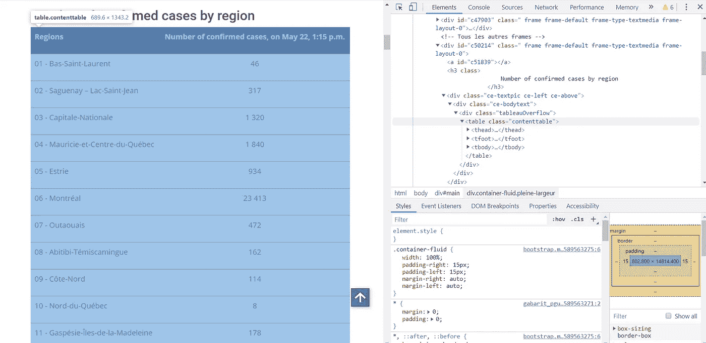
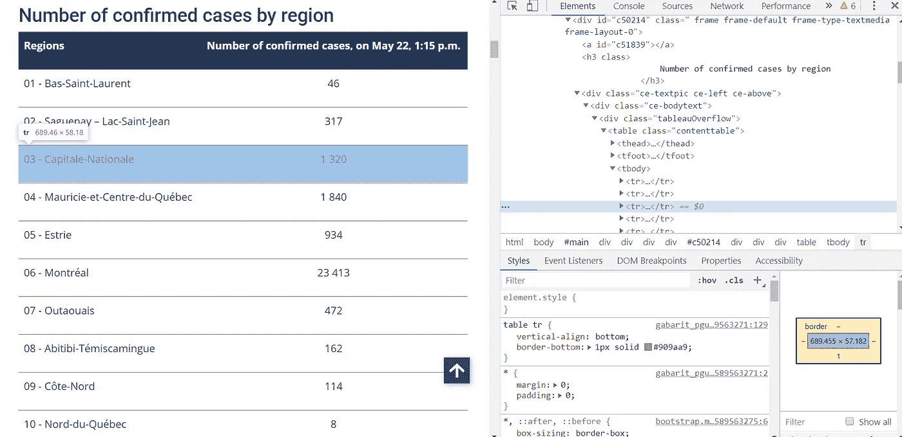
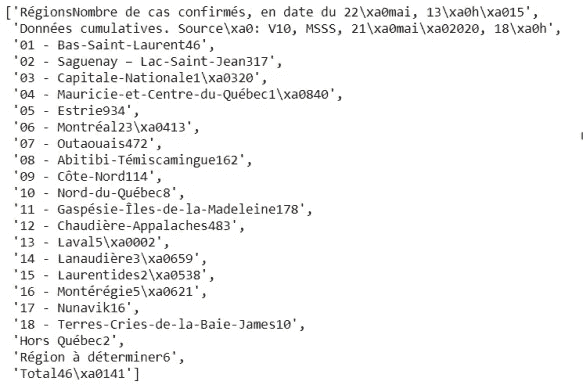
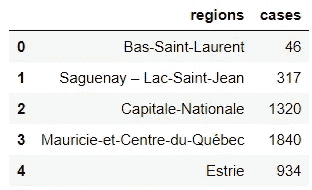

# 一个 Kaggle 不会教你的教程:网页抓取，数据清理等等

> 原文：<https://towardsdatascience.com/a-tutorial-of-what-kaggle-wont-teach-you-web-scraping-data-cleaning-and-more-16d402a206e8?source=collection_archive---------24----------------------->

## 因为数据科学不仅仅是 EDA 和培训模型


[来源](https://unsplash.com/photos/HpWwEURimK8)

Kaggle 太棒了。你可以从一个伟大的社区中学到很多东西。你可以与世界上最优秀的数据科学家竞争和比较，这一切都是免费的。然而，Kaggle 并不完美。它不会告诉您在导入 CSV 文件和训练模型之前会发生什么。

本教程的目的是填补“真实”项目和 Kaggle 之间的空白。

## **定义问题**

任何项目(无论是哪个领域)的第一步都是定义问题。你的问题是什么，你想回答什么？问题可能来自你的老板，但是能够创造值得回答的问题不会伤害你。Kaggle 一般会给你定义问题(特别是在比赛中)

对于本教程，假设的问题将是:是什么决定了加拿大魁北克省(我来自那里)每个地区的冠状病毒病例数。

## 网页抓取和数据清理

一旦有了想要回答的问题，就需要数据来回答。Kaggle 为您提供了完美的 CSV 文件，其中包含您的因变量和所有您需要做出伟大预测的预测器。显然，实际情况通常不是这样。

回到手头的问题，首先需要的是魁北克省每个地区的病例数，即因变量。当然，这不是我在电脑上某个地方存储在 CSV 文件中的数据，所以我不得不继续从这个网站上收集数据:[https://www . Quebec . ca/en/health/health-issues/a-z/2019-coronavirus/situation-coronavirus-in-Quebec/](https://www.quebec.ca/en/health/health-issues/a-z/2019-coronavirus/situation-coronavirus-in-quebec/)。下面是我如何使用 Python 一步一步完成的。

导入库之后，首先要做的是使用请求库提取 URL 的内容:

```
**# Import libraries** from bs4 import BeautifulSoup
import requests
import pandas as pd
import re
from re import findall**#Get URL and extract content** url = requests.get('[https://www.quebec.ca/sante/problemes-de-sante/a-z/coronavirus-2019/situation-coronavirus-quebec/'](https://www.quebec.ca/sante/problemes-de-sante/a-z/coronavirus-2019/situation-coronavirus-quebec/'))c = url.content
```

一旦完成，我们就可以使用 BeautifulSoup 创建一个 soup 对象，beautiful soup 是用于从 HTML 文件中提取数据的终极 Python 库。这个美丽的物体是我们将继续工作的对象。

```
**# Create a soup object** soup = BeautifulSoup(c, 'html.parser')
```

现在，我们必须定义我们想要从我们指定的 URL 中得到什么。通过检查页面(右击，检查)，我们可以看到网站的结构。在那里，通过 Ctrl+shift+C，您可以浏览页面，并轻松识别哪个代码块与网站的哪个部分相关。

在下面，我们看到“contenttable”表包含了我们想要收集的信息，即魁北克每个地区冠状病毒病例的数量。



使用 BeautifulSoup 中的 find 函数，我们可以找到表并导入数据。

```
my_table = soup.find('table', attrs = {'class': 'contenttable'})
```

之后，我们看到所有我们想要的信息都存储在一个标签中，它定义了 HTML 表中的一行。



通过使用 find_all 和 get_text 函数，我们可以从我们识别的表中的所有标签中提取所有文本。

```
data=[]
for link in my_table.find_all('tr'):
    data.append(link.get_text())data
```



结果是一个包含所有数据的列表。我们离我们想要的已经很近了，但还不到那个程度。这里有一堆我们不需要的东西。列表中的一些元素是无用的，在每个元素中，都有一些我们不想要的字符/数字。这就是能够清理数据派上用场的地方，这是 Kaggle 不会教你的另一件事。首先，我将删除列表的前两个和后三个元素，因为这里不需要它们。

```
del data[0:2]
del data[18:21]
```

现在，如果我们仔细观察，我们会发现列表中的每个相关元素都有一个模式。它总是这样:“一个数字-地区+案例”。我们可以对 re 库使用正则表达式，以便只保留 region+cases 部分，去掉其余部分。下面是对列表中的所有元素执行此操作的循环。

```
real_data=[]
for i in range(0,18):
    pattern = re.compile('[0-9][0-9] - (.*)')
    result = pattern.findall(data[i])
    real_data.append(result)
```

让我们仔细看看下面的代码:'[0–9][0–9]—(。*)'.这意味着我们正在寻找一个包含 00 到 99 之间的任意数字的模式，一个“-”，最后是我们想要保留的部分(。*).findall 函数将在每个元素中寻找这种模式，并返回我们想要保留的部分。

现在，我们想把这一地区从病例中分离出来。为此，我们只需要两个命令:一个只保存字符，另一个只保存数字。下面的代码就是这样做的，并用输出创建两个列表。

```
**#Creating the separate lists** regions=[]
cases=[]
for i in range(0,18):
    strings = ''.join([i for i in real_data[i] if not i.isdigit()])
    no_numbers = ''.join([i for i in strings if not i.isdigit()])
    no_letters = ''.join(filter(lambda x: x.isdigit(), strings))
    regions.append(no_numbers)
    cases.append(no_letters)
```

然后，最后，我们可以创建一个以列表为列的数据框架。

```
**#Dataframe**
df=pd.DataFrame()
df['regions'] = regions
df['cases'] = casesdf.head()
```



数据帧的头部

我们有因变量，但我们现在需要预测。

## 预测器创建

在 Kaggle 上，你将总是被提供你必须用来提出你的预测的预测者。在现实生活中，不仅数据不会给你，而且你也不一定知道哪些预测是有用的。

回到我们的问题，我们需要弄清楚什么样的变量可以帮助预测每个地区的冠状病毒病例数。有些是显而易见的(人口，测试次数等。)但有时候，你需要跳出框框思考。也许城市中国际机场的存在有助于预测病例数？也许一个地区的教育水平也能说明一些问题？找到哪些预测因素会对你定义的问题产生影响是任何项目的一个重要部分，Kaggle 在这方面不会真正帮助你。

对于本教程，我保持简单，按地区刮人口。

```
**#Get URL and extract content**
url2 = requests.get('[https://www.stat.gouv.qc.ca/statistiques/population-demographie/structure/ra-totaux.htm'](https://www.stat.gouv.qc.ca/statistiques/population-demographie/structure/ra-totaux.htm'))c2 = url2.content**#Create soup object** soup2 = BeautifulSoup(c2, 'html.parser')**#From table, get only text** my_table2 = soup2.find(id='contenu_table')data2=[]
for link in my_table2.find_all('td'):
    data2.append(link.get_text())**#Only keep elements we need in the list** population = data2[39:232:12]**#Add missing region** population.append(str(17141))**#Add population to the dataframe** df['population'] = population
```

当我定义 population 时，我使用了“data2[39:232:12]”，因为所需的信息出现在 data2 列表的第 12 个元素中，从第 39 个元素开始。另一个清理数据的酷招！另外，一个地区的人口，Terre-kress de la Baie-James，没有列在我搜集的网站上，所以我手动将其添加到人口列表中，正如你在上面看到的。

当然，在实践中，需要更多的预测器。对于本教程，我将到此为止。

Kaggle 很牛逼。你应该尽可能多的花时间在这上面。然而，它不会教会你成为最好的数据科学家所需要知道的一切。

非常感谢你的阅读！