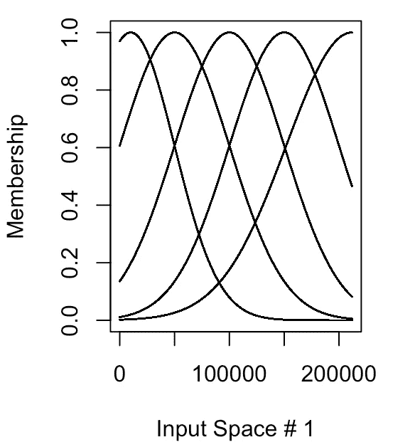
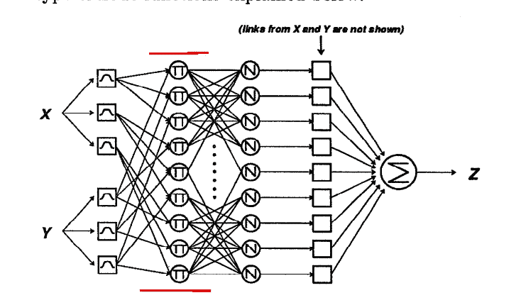
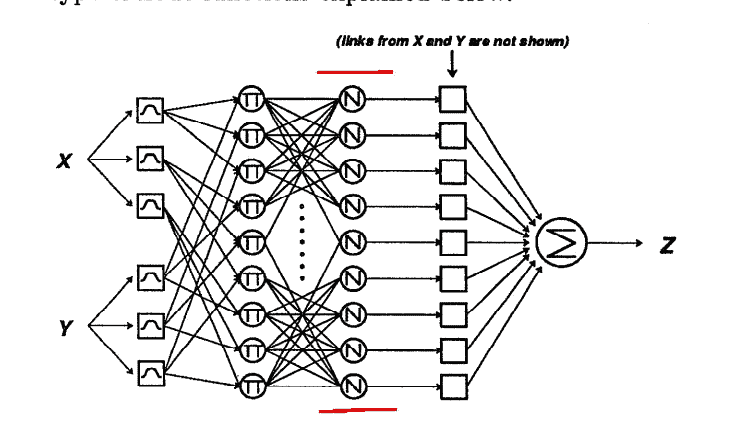
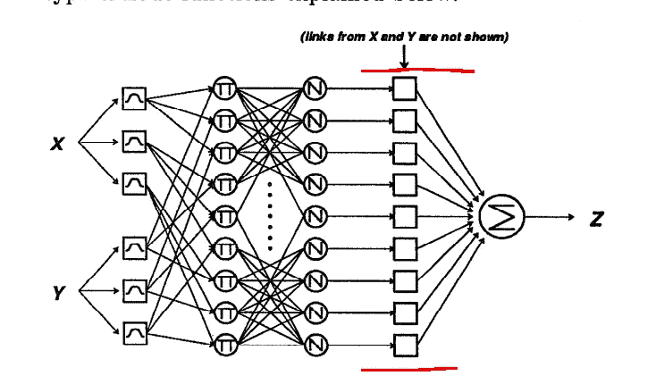
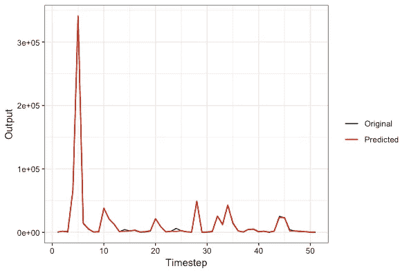

# 人工神经模糊推理系统教程

> 原文：<https://towardsdatascience.com/a-tutorial-on-artificial-neuro-fuzzy-inference-systems-in-r-19987bfd8ccd?source=collection_archive---------10----------------------->

图片来源:谷歌图片。一个简单的模糊逻辑模型表示！

如今，计算方法并不短缺。几乎每一个与数据相关的问题都有一个最适合在知识发现中获得最大收益的方法。在实践中，回归、聚类、神经网络、深度学习和贝叶斯方法都常用于创建可靠而精确的模型。然而，我观察到一种在工程社区之外被广泛忽视的模型类型，并且工作得很好，就是模糊逻辑。模糊逻辑最初是由洛特菲·扎德[1]提出的，它的工作原理是将预测值分配给模糊成员，而不是其他建模方法使用的固体二元结果。因此，模糊逻辑模型可以将该值归类为“中度温暖”，这可能适合更大范围的人群，而不是指定值“78”并自动将其归类为炎热。此外，构建伟大模型的一个重要方面，特征工程，在模糊逻辑中被处理到极致，因为用户必须建立论域(数据集内的值的范围，例如 0 到 200)和许多模糊规则，这些规则覆盖给定数据集中变量组合的所有可能情况。这允许对模型进行各种类型的调整，以提高性能，同时降低计算成本。简而言之，模糊逻辑使用数学预测能力和人类主观性的组合来创建可能的最佳模型。虽然由于人的交互性成分，这不会被认为是“机器学习”，但是模糊逻辑的扩展限制了人的主观性，并且向模糊逻辑模式添加了人工神经网络预测能力。这种方法被称为自适应神经模糊推理系统(ANFIS ),在工业领域的应用还不如在学术领域多。这篇文章将涉及 ANFIS 的一些能力，以及为什么许多从业者认为它优于神经网络。

ANFIS 开发于 20 世纪 90 年代[2，3]，允许将模糊推理和神经网络应用于同一数据集。ANFIS 模型由五层或五个步骤组成，它们执行算法的模糊逻辑部分和神经网络部分的每个阶段。这里我使用 ANFIS 包中的 R 和美国的太阳能产值来制作我的例子。

**第一步:计算隶属函数**

隶属函数是某个值具有的“相似性”或“隶属度”的指标。这些通常用一系列数值的正弦曲线来表示(图 1)。因此，如果您要估计给定年份的能源消耗，您需要将这些值从最小到最大(可能有较低和较高的分位数以及平均值)分成五个不同的类别，偏差值会导致这些值之间存在一定程度的差异和相似性。

图片来源:作者。该图显示了每个值分段的模糊隶属度。

**第二步:模糊规则的触发强度**

在步骤 1 中被“模糊化”的值现在被传输到节点层，并乘以自动生成的模糊规则的强度(图 2) [3]。可以认为这是根据自动生成的规则和提供给该规则的数据计算“权重”。

照片来源:张，1991 年[2]。显示了 ANFIS 算法的第二步。

**第三步:归一化射击强度计算**

第三步获取第二步的输出，并将前一个节点的触发强度值与所有触发强度的总和进行比较(图 2)[2，3]。为了简化这种描述，考虑将单个节点的输出规则的强度与其他节点及其底层规则的强度进行比较的算法。如果某个节点的强度更大，那么它可能是数据集的“最佳”规则配置，并优先用于下一步。

引自张，1991 [2]。显示了 ANFIS 算法的第三步。

**第四步:将前提(自变量)和结果(因变量)结合起来**

第四步是将加权值与训练数据集中的原始输入相结合，根据结果数据计算输出(图 2)[2，3]。

引自张，1991 [2]。显示了 ANFIS 算法的第三步。

**第五步:预测&最终输出**

最后一步是监督所有输入信号总和的计算，并将它们应用于测试数据集，以产生预测值。这一步还包括数据的去模糊化过程和转换回有意义的值(图 3)。

图片来源:作者。显示了 2017 年各州太阳能发电总量的预测。

如您所见，生成的输出与原始数据非常相似。我们的模型的均方误差约为 12 %, R2 为 0 . 91，这非常好，尤其是因为我使用了如此有限的训练数据集。虽然 ANFIS 肯定不是倒数第二个建模技术，但它在从适度复杂的数据集预测值方面显示出相当大的准确性。该模型的一个限制是以必要的存储器形式的高计算成本。当我尝试运行一个有 8 个独立变量的模型时，我总是耗尽内存，直到我转移到另一台有 64GB 内存的计算机上。这是由每个变量的 5 层方法引起的，这扩展了需求。值的范围也会导致计算时间增加。尽管有这些缺点，仍然可以利用 ANFIS 的能力来改进预测，并与其他模型及其输出进行比较。

**一些提示:**

如果你试图将这个模型应用于你自己的数据集，确保你正确地计算了话语的范围。如果您的值没有涵盖数据集中存在的所有值，您将无法成功定型该模型。此外，如果您的 sigma(偏差)没有与其他模糊成员准确地收敛，您也将很难运行模型并获得准确的预测。如果您有一个大数据集(10GB 或更大),明智的做法是在 Apache Hadoop 中计算这些描述性统计数据，然后将它们应用到 ANFIS 中。

**参考文献**

[1]扎德，洛杉矶(1988 年)。模糊逻辑。计算机，21(4)，83–93。

[2]张智成(1991)。 [*模糊建模采用广义神经网络和卡尔曼滤波算法*](http://www.aaai.org/Papers/AAAI/1991/AAAI91-119.pdf) (PDF)。第九届全国人工智能会议论文集，美国加利福尼亚州阿纳海姆，7 月 14-19 日。 **2** 。第 762-767 页。

[3] Jang，J.-S.R. (1993 年)。[“anf is:基于自适应网络的模糊推理系统”](https://semanticscholar.org/paper/17cf6cf3c51b7cbc6b9ff5a0d1624e3c9928a951)。IEEE 系统、人和控制论汇刊。**23**(3):665–685。[doi](https://en.wikipedia.org/wiki/Digital_object_identifier):[10.1109/21.256541](https://doi.org/10.1109%2F21.256541)。