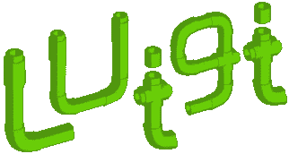

# Spotify 管道 Luigi 教程

> 原文：<https://towardsdatascience.com/a-tutorial-on-luigi-spotifys-pipeline-5c694fb4113e?source=collection_archive---------5----------------------->

> Luigi 是一个 Python (2.7、3.6、3.7 测试版)包，可以帮助您构建批处理作业的复杂管道。它处理依赖关系解析、工作流管理、可视化、处理故障、命令行集成等等。

*   介绍
*   利弊
*   管道结构:
    。任务
    。目标
    。因素
*   积木
*   执行它


照片由[迈克·本纳](https://unsplash.com/@mbenna?utm_source=unsplash&utm_medium=referral&utm_content=creditCopyText)在 [Unsplash](https://unsplash.com/s/photos/pipeline?utm_source=unsplash&utm_medium=referral&utm_content=creditCopyText) 拍摄

# 介绍

我和 Luigi 的经历始于几年前，当时公司 pipeline 的唯一负责人离开了，我得到了一个巨大的遗留代码库。

当时，我对管道没有任何了解，尤其是 Luigi，所以我开始寻找教程并完整阅读官方文档。

没发现特别有用；当然，它在事实上是正确的，但它不是一个教程。当时，也没有很多关于它的课程或博客。

因此，这篇文章是我填补这一空白的尝试。我收集了我所学到的东西，希望能在你使用 Luigi 包的第一步中对你有所帮助



# 利弊

在深入研究代码之前，让我们看看这个包的优点和缺点。

Luigi pipeline 库已经被 Spotify 设计出来，现在还在使用。多年来，它已经被其他公司采用，特别是像 Deliveroo。但是，确切地说，因为它是为 Spotify 量身定制的，它可能不适合解决你的需求，我建议你仔细考虑这个系统是否能为你工作。

## 优点:

*   是 Python！因此，首先，您已经知道如何在其中编码，另外，您可以将您想要自动化的流程(您的原始代码)与管道基础设施(因此，Luigi)相结合
*   它的“向后”结构允许它从失败的任务中恢复，而无需重新运行整个流水线。
*   直接与 Amazon ECS 一起工作的 AWS 批处理包装器。
*   显示任务状态和管道图形表示的 GUI。

## 缺点:

*   很难测试。
*   它有一个中央调度程序，使得并行化任务变得困难。
*   需要保持简单，或者更好的线性(尽量保持< 1k 任务)。过多的分支和分叉会极大地降低运行时间。
*   没有触发器。因此，当所需的文件就位时，管道不会启动，但是您需要设置一个 cronjob 来检查它们并使管道启动

如果你已经决定开始使用 Luigi，运行

```
pip install luigi
```

让我们开始看看它是如何工作的


马丁·亚当斯在 [Unsplash](https://unsplash.com/s/photos/martin-adams-1094929-unsplash-1038x576?utm_source=unsplash&utm_medium=referral&utm_content=creditCopyText) 上的照片

# 管道结构

Luigi 中的管道结构就像许多管道系统中的一个，类似于一个图形。它包含**节点、**节点和**边**节点，前者处理信息，后者连接节点，将信息传递到下一个节点。

该流程通常遵循*线性流程*，其中第一个节点被视为开始节点，这是第一个被执行的节点，接着是第二个，然后是第三个，直到结束节点完成工作流。类似这样的东西:

```
Start -> Node A -> Node B -> Node C -> End
```

相反，在 Luigi，这个过程是相反的！

程序从最后一个任务开始，它检查它是否可以被执行或者它是否需要任何东西。

如果是这种情况，它会向上移动到管道，直到找到满足所有要求的节点，只有在这时，它才开始运行已经访问过的节点。就像下面这样:

```
Start -> Node C -> Node B -> Node A -> Node B -> Node C -> End
```

这种方法初看起来似乎违反直觉，但它实际上有助于避免在出现故障或错误后重新运行已经执行的节点。

让我们设想第一次运行我们的管道，在第一次运行中，节点 B 失败了:

```
Start -> Node C-> Node B -> Node A (Done) -> Node B (Error) -X-> Node C -> End
```

在我们手动修复了节点 B 中的错误之后，管道可以再次运行，但是在这种情况下，它不会考虑节点 A

```
Start -> Node C-> Node B -> Node C-> Node.
```

完全避免运行它。

# 积木

如前所述，Luigi 包就像一个图形一样工作。Luigi 中的节点称为任务，边称为目标

## 任务()

任务是 Luigi 的基本组成部分，也是实际工作发生的地方。

要创建任务，您必须创建一个类并继承 luigi.Task 类。

在新类中，包含至少一个或所有以下方法:

*   需要()
*   运行()
*   输出()
*   目标

## 需要()

方法 requires()是执行的第一个方法(如果存在)。

它包含在当前任务之前已经执行的所有实例。最常见的情况是，该方法调用工作流上方的另一个 Luigi 任务，允许代码向后移动到管道的开头。

如果我们之前看到了目标是将任务连接到下一个任务所需要的，那么()是将任务连接到前一个任务的。

目标将代码移动到末尾，需要移动到开头。

只有当一个方法要求被满足时，任务才能执行第二个方法运行:

## 运行()

在这个方法中包含了任务必须执行的动作。它可以是任何东西，调用另一个方法，运行一个脚本，等等。

Luigi 中与前两个模型相关的任务示例如下:

```
class MakeTaskA(luigi.Task):
    def requires(self):
        return MakeTaskB() def run(self):
        return luigi.LocalTarget(DoSomething())
```

## 输出()

顾名思义，方法 output()返回一个或多个目标对象。但是，建议任何任务在输出中只返回一个目标。

例子

Luigi [文档](https://luigi.readthedocs.io/en/stable/tasks.html)中有一个很好的例子:

在这个例子中，

*   第一个任务是 CountLetters()，它需要 GenerateWords()类，所以它移到那里
*   GenerateWords()没有要求，所以它调用它的 run()方法并创建一个名为“words.txt”的文件
*   轮到输出了()。该方法查找文件 word.txt，并以 LocalTarget 类对象的形式将其返回给 CountLetters 类
*   CountLetters()现在可以执行 run()。它从 self.input()中获取所需的内容
*   之后，它执行 output()

Task.input()是 Task.requires()的包装器，它返回相应的目标对象，而不是任务对象。

## 目标

目标是连接一个任务和下一个任务的边。

这些通常表示为一个文件。事实上，我们在前面的例子中已经看到了一个。文件“hello.txt”是一个目标。

当且仅当任务的每个输出目标都存在时，才可以认为任务已经完成。它们可以是简单的空文件，一个 S3 或任何东西。


由[昆滕·德格拉夫](https://unsplash.com/@quinten149?utm_source=unsplash&utm_medium=referral&utm_content=creditCopyText)在 [Unsplash](https://unsplash.com/s/photos/pipeline?utm_source=unsplash&utm_medium=referral&utm_content=creditCopyText) 上拍摄的照片

# 因素

我们在示例中看到的最后一个重要元素是参数，但我们还没有考虑到。

参数在 Luigi 中，相当于为每个任务创建一个构造函数。这些是类的实例变量。对于每组参数，只创建一个实例。

就我个人而言，这让我想起了在 Java 或 C++中，你必须声明变量的时候，我知道它们不是一回事，但这有助于理解它的用法。

您可以用以下方式声明参数:

```
class MakeSomething(luigi.Task):
    string = luigi.Parameter(default='hello world!')
```

现在，我们有了一个带有参数属性“hello world！”的类字符串。

您可以在任务之间来回传递参数。

# 参数类型

除了上面看到的，还有不同的参数子类:

有几个:DateParameter，DateIntervalParameter，IntParameter，FloatParameter 等。

这些提供了序列化和读取的方法，你可以自己做。但是，您没有义务指定参数的类型。

您可以简单地使用基类参数。使用 DateParameter 这样的子类的原因是 Luigi 需要为命令行交互执行转换。

这就是它如何知道如何将命令行上提供的字符串转换为相应的类型(即 datetime.date 而不是 string)。

# 从命令行

要执行代码，请从命令行键入以下内容:

```
python -m luigi — module file_name TaskName — local-schedule
```

我希望这篇文章能帮助你迈出与 Luigi 交往的第一步