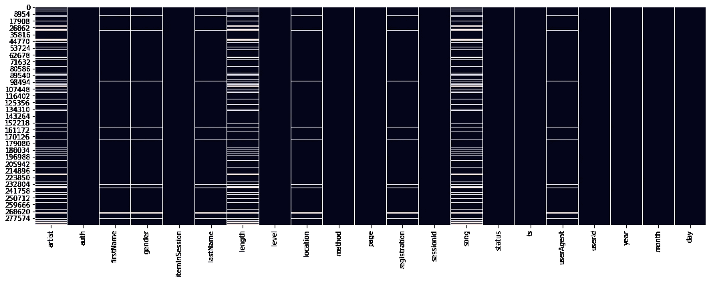
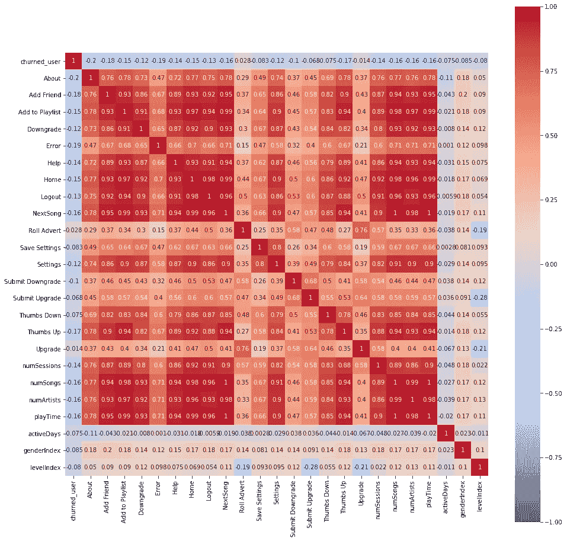
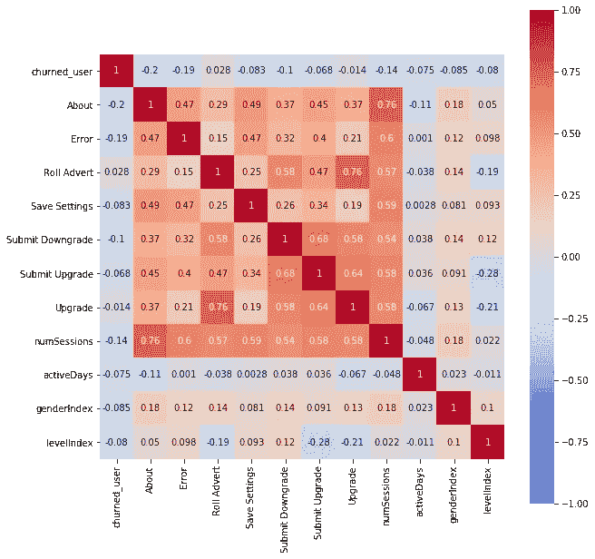
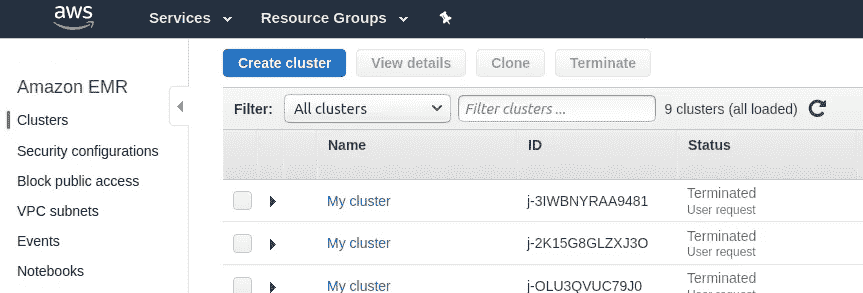
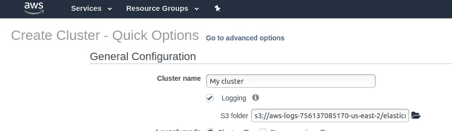
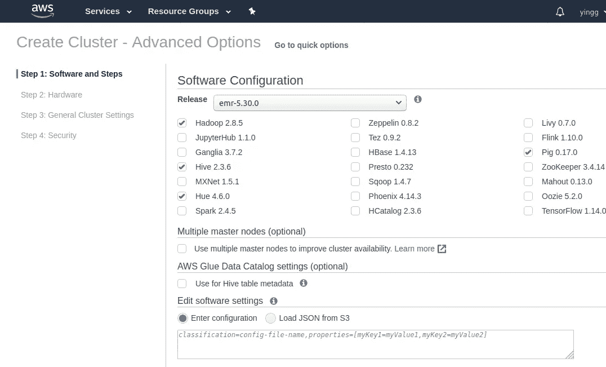
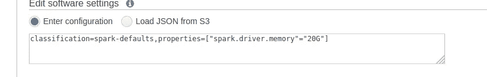

# 使用 Spark 实现大数据的教程:预测客户流失的示例

> 原文：<https://towardsdatascience.com/a-tutorial-using-spark-for-big-data-an-example-to-predict-customer-churn-9078ac9a1e85?source=collection_archive---------18----------------------->

Apache Spark 已经成为分析大型数据集最流行的工具。作为我的 Udacity 数据科学纳米学位的顶点项目，我将展示 Spark 在可扩展数据操作和机器学习中的使用。就上下文而言，我们使用虚构的音乐流媒体公司 Sparkify 的用户日志数据来预测哪些客户有流失的风险。

完整的数据集是 12GB。我们将首先分析一个迷你子集(128MB)并通过 python 接口 API py Spark 在本地模式下使用 Spark Dataframe、Spark SQL 和 Spark ML APIs 构建分类模型。然后，我们将在 AWS 上部署一个 Spark 集群，在全部 12GB 的数据上运行模型。此后，我们假设安装了 Spark 和 PySpark([安装 py Spark 的教程](https://www.sicara.ai/blog/2017-05-02-get-started-pyspark-jupyter-notebook-3-minutes))。

# 建立一个火花会议

在我们能够将 csv、json 或 xml 数据读入 Spark 数据帧之前，需要建立一个 Spark 会话。Spark 会话是 Spark 2.0 中 Spark 应用程序的统一入口点。注意，在 Spark 2.0 之前，需要各种 Spark 上下文来与 Spark 的不同功能进行交互([关于这个](https://medium.com/@achilleus/spark-session-10d0d66d1d24)的一篇很好的文章)。

```
# Set up a SparkSession
from pyspark.sql import SparkSession
spark = SparkSession.builder.appName("capstone").getOrCreate()
```

# 数据集

```
# Load data and show basic data shape
path = "mini_sparkify_event_data.json"
df = spark.read.json(path)
```

既然 mini Sparkify 用户日志数据集是 Spark dataframe 格式的，我们可以做一些初步的探索来熟悉这些数据。Spark dataframe 和 Spark SQL 模块具有如下方法:select()、filter()、where()、groupBy()、sort()、dropDuplicates()、count()、avg()、max()、min()。它们也有窗口功能，对基本分析很有用([见文档](https://spark.apache.org/docs/latest/api/python/index.html)了解语法)。总结数据:

1.  数据集有 286500 行和 18 列。
2.  时间跨度为 2018 年 9 月 30 日至 2018 年 12 月 2 日。
3.  它将用户在这段时间内做的每个事件记录为一行。
4.  列定义如下:

```
 -- artist (string): artist's name for a song
 -- auth (string): Logged Out | Cancelled | Guest | Logged In
 -- firstName (string): user's firstname
 -- gender (string): Female | Male
 -- itemInSession (long) : number of items in a session
 -- lastName (string): user's lastname
 -- length (double): a song's length in seconds
 -- level (string): paid | free
 -- location (string): city and state of the user
 -- method (string): HTTP method
 -- page (string): which page a user is on at an event
 -- registration (long): timestamp of user registration
 -- sessionId (long): the Id of the session a user is in at an event
 -- song (string): song name
 -- status(long): 307 | 404 | 200
 -- ts (long): timestamp ateach event
 -- userAgent (string) : 
 -- userId (string): user ID
```

5.其中一些列可能对预测不是很有用，例如 firstName、lastName、method 和 userAgent。分类特征需要编码，如性别和级别。一些数字特征对于工程聚合行为特征是有用的，例如 itemInSession、length、page visits 等。

6.阶层失衡；当我们分割训练测试数据时，我们需要考虑分层抽样。我们还应该考虑 f1 分数，而不是模型评估指标的准确性。

7.对于模型，我们将尝试逻辑回归、决策树、随机森林和梯度推进树。

有了这些初步的想法，让我们继续处理丢失的值。

# 处理缺失值

seaborn 热图是显示缺失值在数据集中的位置以及数据是否以某种系统方式缺失的好方法。

```
# Let's take a look at where the missing values are located.
plt.figure(figsize=(18,6))
sns.heatmap(df.toPandas().isnull(),cbar=False)
```



**注意(1):** 从热图中，我们可以看到在相同的行中缺少名字、姓氏、性别、位置、用户代理和注册。我们可以推断这些丢失的值来自未注册的用户。通常，未注册的用户没有用户 ID。我们将进一步探讨这一点。

```
df.select(‘userid’).filter(‘registration is null’).show(3)
```

原来，userId 列实际上有缺失值，但它们被编码为空，而不是编码为“NaN”。这种空值的数量与注册中丢失的行数相匹配。由于这些记录甚至没有 userId 信息，我们将继续删除它们。

**注(2):** 同样，艺术家、长度和歌曲也是同一行的缺失数据。这些记录没有与歌曲相关的信息。我们将探究用户在这些行的哪些页面上。

```
print(df_pd[df_pd.artist.isnull()][‘page’].value_counts())
print(df_pd[df_pd.artist.isnull()==False][‘page’].value_counts())Thumbs Up                    12551
Home                         10082
Add to Playlist               6526
Add Friend                    4277
Roll Advert                   3933
Logout                        3226
Thumbs Down                   2546
Downgrade                     2055
Settings                      1514
Help                          1454
Upgrade                        499
About                          495
Save Settings                  310
Error                          252
Submit Upgrade                 159
Submit Downgrade                63
Cancel                          52
Cancellation Confirmation       52
Name: page, dtype: int64NextSong    228108
Name: page, dtype: int64
```

# 特征工程和 EDA

基于直觉和领域知识，我们决定暂时不在第一轮建模中包含 firstName、lastName、method 和 userAgent 列，因为这些变量可能不会影响我们的预测。我们还决定暂时不包括艺术家、地点、歌曲和状态。这留给我们以下几列:

```
 -- gender (string): Female | Male
 -- itemInSession (long) : number of items in a session
 -- length (double): a song's length in seconds
 -- level (string): paid | free
 -- page (string): which page a user is on at an event
 -- registration (long): timestamp of user registration
 -- sessionId (long): the Id of the session a user is in at an event
 -- ts (long): timestamp ateach event
 -- userId (string): user ID
```

1) **定义被搅动的用户**:我们可以看到大约有 1:3 的阶级不平衡。

```
flag_cancellation = udf(lambda x : 1 if x=="Cancellation Confirmation" else 0, IntegerType())
df = df.withColumn("churn",flag_cancellation("page"))# Create the cross-sectional data that we’ll use in analysis and modelling
w1 = Window.partitionBy(‘userId’)df_user = df.select(‘userId’,’churn’,’gender’,’level’) \
 .withColumn(‘churned_user’,Fsum(‘churn’).over(w1)) \
 .dropDuplicates([‘userId’]).drop(‘churn’)df_user.groupby(‘churned_user’).count().show()+------------+-----+
|churned_user|count|
+------------+-----+
|           0|  173|
|           1|   52|
+------------+-----+
```

2) **分类特征**:对于分类特征，我们需要先进行标签编码(简单的把每个值转换成一个数字)。根据机器学习模型，我们可能需要进一步将这些数字编码为虚拟变量(例如，一次性编码)。

在 Spark 中，StringIndexer 执行标签编码部分:

```
indexer = StringIndexer(inputCol="gender",outputCol="genderIndex")
df_user = indexer.fit(df_user).transform(df_user)
indexer = StringIndexer(inputCol="level",outputCol="levelIndex")
df_user = indexer.fit(df_user).transform(df_user)
df_user.show(3)+------+------+-----+------------+-----------+----------+
|userId|gender|level|churned_user|genderIndex|levelIndex|
+------+------+-----+------------+-----------+----------+
|100010|     F| free|           0|        1.0|       0.0|
|200002|     M| free|           0|        0.0|       0.0|
|   125|     M| free|           1|        0.0|       0.0|
+------+------+-----+------------+-----------+----------+
only showing top 3 rows
```

我们来看看性别和级别与流失有什么关系。通过查看简单的统计数据，似乎男性用户比女性用户更容易流失，付费用户比免费用户更容易流失。

```
df_user.groupby(‘genderIndex’).avg(‘churned_user’).show()+-----------+-------------------+
|genderIndex|  avg(churned_user)|
+-----------+-------------------+
|        0.0| 0.2644628099173554|
|        1.0|0.19230769230769232|
+-----------+-------------------+df_user.groupby('churned_user').avg('levelIndex').show()+------------+-------------------+
|churned_user|    avg(levelIndex)|
+------------+-------------------+
|           0|0.23121387283236994|
|           1|0.15384615384615385|
+------------+-------------------+
```

由于我们将利用逻辑回归和 SVM 分类器，我们需要将标签编码转换为虚拟变量。OneHotEncoderEstimator()完成这一部分:

```
encoder = OneHotEncoderEstimator(inputCols=[“genderIndex”, “levelIndex”], outputCols=[“genderVector”, “levelVector”])
model = encoder.fit(df_user)
df_user = model.transform(df_user)
df_user.select('genderVector','levelVector').show(3)+------+-------------+-------------+
|userId| genderVector|  levelVector|
+------+-------------+-------------+
|100010|    (1,[],[])|(1,[0],[1.0])|
|200002|(1,[0],[1.0])|(1,[0],[1.0])|
|   125|(1,[0],[1.0])|(1,[0],[1.0])|
+------+-------------+-------------+
only showing top 3 rows
```

OneHotEncoderEstimator()的输出列与 sklearn 的输出不同。它给出的是稀疏向量格式，而不是二进制值，如上面的代码片段所示。

3) **一般活动聚集:**基于 sessionId、歌曲、艺术家、长度和注册的列，我们生成聚集的特征，包括:

*   *numSessions* (用户在此期间拥有的会话数)
*   *numSongs* (用户收听的不同歌曲的数量)
*   *数字艺术家*(用户收听的不同艺术家的数量)
*   *播放时间*(播放歌曲的总时间，以秒为单位)
*   *活动天数*(用户注册后的天数)

4) **页面访问聚集**:基于页面列，我们生成聚集的页面访问行为特征，计算用户在该期间访问每种类型页面的次数。

```
w2 = Window.partitionBy('userId','page')
columns = [str(row.page) for row in df.select('page')\
           .dropDuplicates().sort('page').collect()]
df_pageVisits = df.select('userId','page')\
    .withColumn('pageVisits',count('userId').over(w2))\
    .groupby('userId')\
    .pivot('page',columns)\
    .mean('pageVisits')
df_pageVisits = df_pageVisits.na.fill(0).drop(['Cancel','Cancellation Confirmation'],axis=1)
```

5) **检查多重共线性:**基于树的模型不会受到多重共线性的影响，但是，由于我们也测试线性模型(逻辑回归和 svm)，我们将继续移除高度相关的特征。



所有功能的关联热图



移除高度相关要素后的相关性热图

6) **向量组装和特征缩放:**在 Spark 中，机器学习模型要求特征为向量类型。VectorAssembler()方法将所有功能列转换为一个向量，如下面的代码片段所示。

```
# Vector Assembler
cols = df_inuse.drop('userID','churned_user').columns
assembler=VectorAssembler(inputCols=cols,outputCol='feature_vector')
df_inuse=assembler.transform(df_inuse).select('userId','churned_user','feature_vector')df_inuse.take(1)[Row(userId='100010', churned_user=0, feature_vector=SparseVector(13, {0: 1.0, 2: 52.0, 6: 2.0, 7: 7.0, 8: 11.4259, 9: 1.0, 12: 1.0}))]
```

缩放后的数据如下所示:

```
df_inuse_scaled.take(1)[Row(userId='100010', label=0, feature_vector=SparseVector(13, {0: 1.0, 2: 52.0, 6: 2.0, 7: 7.0, 8: 11.4259, 9: 1.0, 12: 1.0}), features=SparseVector(13, {0: 0.3205, 2: 2.413, 6: 0.7817, 7: 0.4779, 8: 0.3488, 9: 2.0013, 12: 2.4356}))]
```

7) **将数据分成训练集和测试集:**

```
ratio = 0.8
train = df_inuse_scaled.sampleBy(‘churned_user’,fractions={0:ratio,1:ratio}, seed = 42)
test = df_inuse_scaled.subtract(train)
```

# 型号选择

我们将比较五种基线模型:逻辑回归、线性 SVM 分类器、决策树、随机森林和梯度推进树分类器。

```
# initiate the models
lr = LogisticRegression()
svc = LinearSVC()
dtc = DecisionTreeClassifier()
rfc = RandomForestClassifier()
gbt = GBTClassifier()
```

ParaGridBuilder()类可用于构建超参数网格进行搜索。然而，因为这里的目的是展示 Spark 的 ML 方法，所以我们不会在这里对模型进行深入调优。

```
# this line will keep the default hyper-parameters of a model
paramGrid = ParamGridBuilder().build()# to search over more parameters, we can use the ,,addGrid() method, for example:paramGrid = ParamGridBuilder()\
    .addGrid(lr.regParam, [0.1, 0.01]) \
    .addGrid(lr.fitIntercept, [False, True])\
    .addGrid(lr.elasticNetParam, [0.0, 0.5, 1.0])\
    .build()
```

我们将定义一个评估函数来运行所有五个分类模型，并输出它们的交叉验证平均指标(f1)。

```
def evaluate(model_name,train,test):
  evaluator = MulticlassClassificationEvaluator(metricName=’f1')
  paramGrid = ParamGridBuilder().build()
  crossval = CrossValidator(estimator=model_name,\
  evaluator=evaluator, \
  estimatorParamMaps=paramGrid,\
  numFolds=3)
  cvModel = crossval.fit(train)
  cvModel_metrics = cvModel.avgMetrics
  transformed_data = cvModel.transform(test)
  test_metrics = evaluator.evaluate(transformed_data)
  return (cvModel_metrics, test_metrics)
```

最后，五个基线模型的性能如下面的代码片段所示。正如我们所见，所有车型的 f1 成绩都不令人满意。我们当然需要更好的调整来为这些模型搜索优化的超参数！

然而，如果我们要从这些基线模型中选择，交叉验证模型的 f1 分数应该是标准。在这种情况下，LinearSVC 模型将是首选模型。(注意测试分数比训练数据上的分数差，表示过拟合)。

```
model_names = [lr,svc,dtc,rfc,gbt]for model in model_names:
  a = evaluate(model,train,test)
  print(model,a)LogisticRegression ([0.6705811320138374], 0.6320191158900836)
LinearSVC ([0.6765153189823112], 0.6320191158900836)
DecisionTreeClassifier ([0.6382104034150818], 0.684376432033105)
RandomForestClassifier ([0.666026954511646], 0.6682863679086347)
GBTClassifier([0.6525712756381464], 0.6576482830385015)
```

# 在云上部署(AWS)

为了在 AWS 上运行完整的 12GB 数据的模型，我们将使用基本相同的代码，除了 Pandas 完成的绘图部分被删除。不过有一点值得注意:按照 Spark 课程在 Nanodegree 课外材料中关于配置集群的说明，我能够运行代码；但是，该会话会在一段时间后变为非活动状态。这可能是由于火花驱动程序内存不足。因此，我们需要使用高级选项来配置集群，并增加驱动程序内存。



步骤 1:在 EMR 控制台中，创建新的集群



步骤 2:转到高级选项



步骤 3:在框中，输入所需的配置



# 结论

这个项目提供了一个学习使用 Spark 和 AWS 操作大型数据集的绝佳机会，Spark 和 AWS 是数据科学领域需求最高的技能之一。

就主题而言，预测客户流失是数据科学家和分析师在任何面向客户的业务中面临的一个具有挑战性的常见问题。这里完成的分析和建模是为了突出一个使用 Spark 的机器学习项目的过程。模型性能当然还有很大的提升空间:

1)聚集的行为特征是简单的总和和平均值。加权平均值可以用来强调最近的行为。还可以包括分集测量。需要更精细的超参数调谐。

2)由于数据集是纵向的，我们可以潜在地使用生存模型或时间序列模型。这里有一些关于这些策略的文章，用于[对客户流失](/survival-analysis-in-python-a-model-for-customer-churn-e737c5242822)建模。