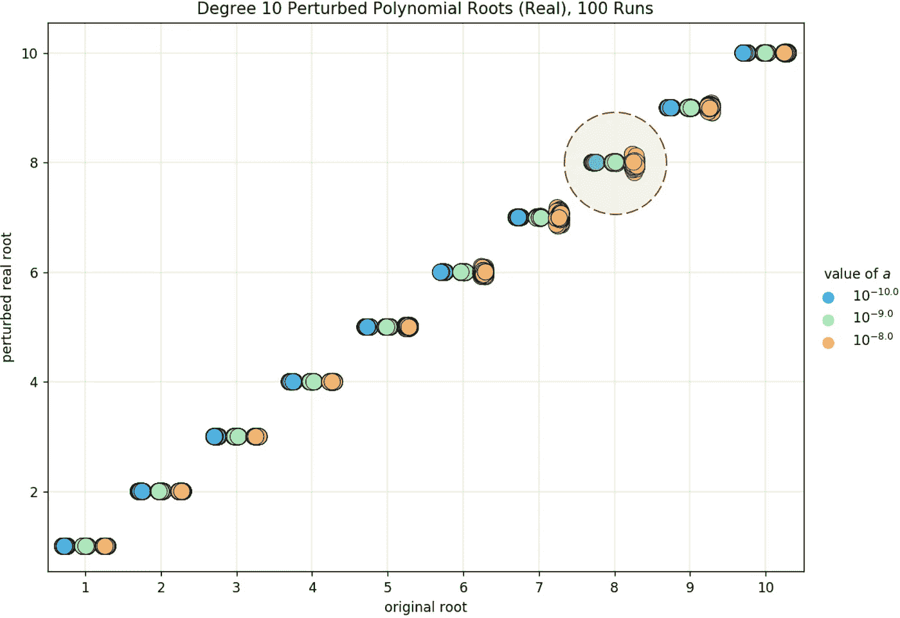

# 阴阳魔界:真实和想象的平面在哪里融合？

> 原文：<https://towardsdatascience.com/a-twilight-zone-where-do-the-real-and-imaginary-planes-blend-25501f9bf37c?source=collection_archive---------27----------------------->

## 摄动多项式的数值分析

图片由[博文](https://unsplash.com/@bowenchin)上的 [Unsplash](https://unsplash.com/photos/uSaUiPr4Bfw)

问一个多项式的求根问题是否*良态*，这是数值分析中很自然的问题。也就是说，我们希望多项式系数的微小变化会导致其根值的微小变化。有趣的是，事实往往并非如此。

*威尔金森多项式*是数学家詹姆斯·威尔金森(James Wilkinson)在 1963 年使用的一种特殊的多项式，用来说明这样一种思想，即根的位置可能对多项式系数的扰动非常敏感，即使它具有分离良好的零点。他后来将这一发现对个人的影响描述为:

> “就我自己而言，我认为这是我作为数值分析师职业生涯中最痛苦的经历。”

威尔金森多项式经常被用来说明计算矩阵特征值的常用技术的不可取性，该技术涉及导出矩阵特征多项式的系数，然后求解其根。应该注意的是，使用系数作为中间步骤可能引入极端的病态，即使原始问题是条件良好的。

# 扰动多项式

让我们观察一下，当我们随机扰动一个类似威尔金森的多项式的系数时，它的根会发生什么变化。我们考虑多项式

其度为 10，根为 1，2，3，4，5，6，7，8，9，10。扩张，我们得到

其中 *C* = { *cᵢ* }，其中 *i* 的范围从 0 到 9，包括 0 和 9，是非前导项的系数集合。我们随机扰动 *p* ( *x* )的系数，用 *cᵢ* ⋅ (1 + *aεᵢ* 代替每个元素 *cᵢ* ∈ *C* ，其中每个 *εᵢ* 是均值为 0、方差为 1 的正态分布随机变量， *a* 是某个小的整体比例因子。如果我们插入每个 *cᵢ* ，我们得到扰动多项式是

下面， *p* ( *x* )以蓝色绘制，而 *p* ( *x* )的随机扰动版本以粉红色给出。我们观察到扰动后实根的数量减少了，根的位置也改变了，正如蓝点和粉色星星的位置不同所证明的那样。

根的值随着小的系数扰动而显著变化，实根的数量也是如此。

接下来，我们研究在多个小值的 *a* 上 *p* ( *x* )的根发生了什么，证实了根确实对应用于系数的扰动高度敏感。

# 根分布

我们试图弄清楚是否存在一个明显的点，在这个点上实根开始转变为复根。

## 真实的

对于每个 *a* 的单次运行，我们观察到 *p* ( *x* )的扰动版本的实根在各种 *a* 值上的分布。

多项式扰动形式的实根分布

出于可见性的目的，上面的点被随机水平避开，最左边的 *a* 值表示没有扰动。我们看到随着 *a* 的增加，一些实根改变位置甚至丢失，也就是变成了复根。这就引出了一个问题:

> 有没有一个 *a* 的特定值，在这个值上几乎可以确定会出现复根？我们如何描述到那时为止真实根的分布？

让我们称*为*值，在该值处，原本都是实数的 *p* ( *x* )的根开始以某种概率切换到严格复平面*pᵣ****临界点*** *a* *。这个 *pᵣ* ，由下面几节描述的计算实验提供信息，设置得有些随意，但是成功地捕捉到了问题的一些相关特征。

## 复杂的

这里我们展示了 100 个不同扰动版本的 *p* ( *x* )的根的图，对应于 10 个不同的 *a* 值中的每一个。如前所述，对于更大的 *a* 值，我们看到越来越多的根进入复平面。

多重比例因子上的扰动多项式根

只有较大的 *a* 值似乎说明了虚方向上的扩展。这些观察激发了在 *a* 的多个值上与 *p* ( *x* )的根相比较的扰动实根分布的探索。

# *临界比例因子*

我们放大两个特定的 *a* 值，一个低于临界点，一个大于临界点 *a* *。这些图描绘了八个不同的扰动多项式的根。

多重扰动下根分布的突变

达到临界点后，根的分布似乎会发生突然的变化。让我们尝试将这个关键的*定义为*。

## 定义

下图描绘了基于用于扰动 *p* ( *x* )的 *a* 的值的复根出现的概率。对于每个 *a* 值，我们扰动 *p* ( *x* ) 1000 次，其中成功表示一个或多个复杂根的存在。绘制的概率通过将成功总数除以 1000 来计算。

比例因子的临界值，即复数根出现的概率为 0.25 的点

概率 *pᵣ* = 0.25 由金色虚线表示。临界点 *a* *出现在粉色曲线和黄金线的交点。

## 趋势

下面，我们使用上一节中建立的 *a* *的定义，绘制了在多个多项式次数上达到的临界点。在 *n* 的程度上，我们指的是从(*x*–1)到(*x*–*n*)的单项式的乘积。

不同次数多项式的临界点

我们发现多项式次数和 *a* *值之间存在有趣的指数递减关系。逻辑上， *a* *对于根多的多项式减少。在下一节中，为了试图理解在一个比临界点低一毫的 *a* 值处， *p* ( *x* )的实根的扩散会发生什么。

# 根的伸展

这里，我们为 *a* 的一个特定小值绘制了 *p* ( *x* )的八个不同扰动版本的根。

在扰动强到足以把一些根吹到复平面之前实根的状态

我们想要量化相对于原始根值的真实根的变化范围。下面，我们展示了在小于 *a* *的多个小 *a* 值上 *p* ( *x* )的 100 次扰动的实根分布。水平轴显示原始根值，而垂直轴显示扰动的根值。

多个比例因子在数百个多项式扰动上的实根扩散

我们观察到扰动根最大扩展出现在 *p* ( *x* )的第八个根处。这可以通过与最接近 *a* *的 *a* 值相关联的橙色点如何在第八个根处沿垂直方向变化最大以及在其前后变化较小来看出。

# 结论

所展示的实验激发了对为什么这种扰动多项式的根的分布是这样的更深入的分析研究。

如果你想了解更多，请在本文的[中找到额外的微扰实验。这里的代码是](https://drive.google.com/file/d/1GZ9-v5dkXFeCXxL_6xInKaguqcx7CZvk/view?usp=sharing)。在其中，我们导出了量化 *p* ( *x* )的根扩散的表达式，并且还使用判别式来寻找二次(*x*-1)(*x*-2)和三次(*x*-1)(*x*-2)(*x*-3)的临界点。