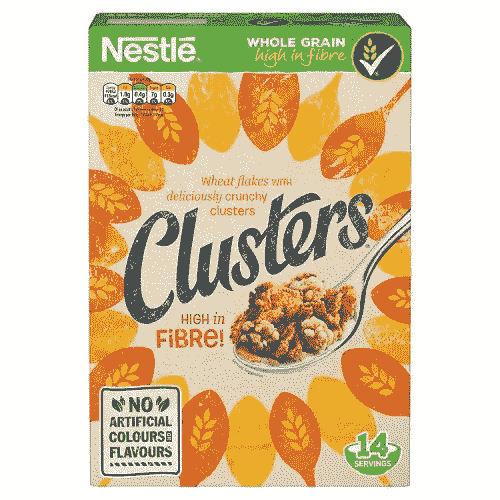
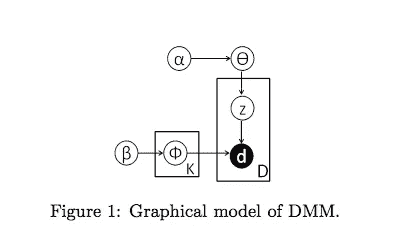
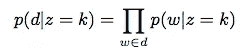

# 短文本聚类的独特方法(算法理论)

> 原文：<https://towardsdatascience.com/a-unique-approach-to-short-text-clustering-part-1-algorithmic-theory-4d4fad0882e1?source=collection_archive---------13----------------------->

*短文本聚类中的高维数挑战和使用 GSDMM 对抗稀疏性。*

高纤维(呃)？！当然了。

# 问题是

最近我一直在读安·兰德的《阿特拉斯耸耸肩》(我知道……回到高中英语文学时代，那时我本来应该读它，但没有读)。安·兰德有很多东西，但简短肯定不是其中之一。在不少于 1000 页的篇幅里，兰德精心构思了这部杰作中的场景和人物。好像我必须知道窗外树叶下面的颜色，因为里尔登喜欢啜饮轻微掺水的威士忌。我花了太多时间阅读文章片段、新闻摘要和听优雅概括的播客，以至于我忘记了如何真正融入作者的大脑。在过去的 1000 页中，我对安·兰德的写作风格了如指掌，我甚至可以复制它。这让我想到我的大脑如何为这位作者构建了一个非常优秀的自然语言处理器，因为我向它提供了大量的数据。但是我看文章，文字，推文等等。尽管理解不同，但考虑到随着时间的推移对材料的吸收，我仍然能够得出一些结论。我对短文材料的理解与安·兰德长篇大论的独白有何不同？我的大脑处理许多小片段和一篇长文章的方式有什么不同吗？

鉴于许多机器学习模型是建立在我们大脑如何处理信息的假设基础上的，我认为在我们处理新问题时考虑这些问题是有用的。短文本聚类传统上是一个难题，原因如下:

1.  [TF-IDF](https://en.wikipedia.org/wiki/Tf%E2%80%93idf) 意义不大，因为与文章相比，句子中的字数较少。如果一个句子中所有的词频都是 1(因为这个句子很短，没有重复的词)，那么我获得了什么价值？
2.  对高维数据使用向量空间会导致稀疏。这导致高计算和内存存储。
3.  问题 1 和 2 的结果是，确定用于分离文本的聚类的数量越来越具有挑战性，因此我们失去了将数据解释成主题的能力。

# 什么是 GSDMM？

GSD mm(Gibbs Sampling Dirichlet Multinomial Mixture)是几年前由尹建华和王建勇在一篇论文中提出的短文本聚类模型。该模型声称解决了短文本聚类的稀疏性问题，同时还显示了像 LDA 这样的词主题。GSDMM 本质上是一种改进的 LDA(潜在狄利克雷分配),它假设一个文档(例如 tweet 或 text)包含一个主题。这与 LDA 不同，LDA 假设一个文档可以有多个主题。正如我在前面的 TF-IDF 陷阱中提到的，由于稀疏性，在一个文档中权衡多个主题对于短文本文档来说不是一个好方法。

使用称为“电影组方法”的类比来描述 GSDMM 的基本原理。想象一下，一群学生(文档)，他们都有一个喜欢的电影(词)的列表。学生们被随机分配到 K 桌。在一位教授的指导下，学生们必须在脑海中为两个目标洗牌:1)找一张有更多学生的桌子 2)选择一张你对电影感兴趣的桌子。冲洗并重复，直到达到集群数量不变的稳定水平。

在这里[可以找到对 LDA 和 GSDMM 之间差异的直观描述](/short-text-topic-modeling-70e50a57c883)，而在这里可以找到对 LDA 更深入的分析[。在这篇文章中，我将重点讨论尹和王论文中描述的 GSDMM 模型的参数和推导。](/light-on-math-machine-learning-intuitive-guide-to-latent-dirichlet-allocation-437c81220158)

# 狄利克雷多项式混合物

对于该模型的第一部分，理解什么是**狄利克雷分布**是很重要的。[狄利克雷分布](https://en.wikipedia.org/wiki/Dirichlet_distribution)本质上是多维度(文档)上的[贝塔分布](https://en.wikipedia.org/wiki/Beta_distribution)。贝塔分布是简单的概率分布，其表示文档加入聚类的先验状态可能性以及该文档与该聚类的相似性。两个参数(下面描述的α和β)控制β分布的形状。

## 数字万用表的组件

转自尹和王的论文

让我们来看看构成该模型的关键参数:

如上所述，α是一个影响我们概率分布形状的参数。更重要的是，alpha 是从文档被分组到一个簇中的概率中得出的。在电影例子中，这是学生选择桌子的概率。

**贝塔:**贝塔是我们分布的另一个形状参数。Beta 来自一个文档中的单词与另一个文档中的单词的相似性。与电影组相关，beta 是学生加入有相似电影选择的桌子的概率。例如，如果 beta 为 0，学生将只连接有共同电影的表。这可能不是最佳策略。也许两个同学都喜欢惊悚电影，但是他们没有列出相同的电影。我们仍然希望学生们最终加入同一批惊悚片爱好者。

**phi** :使用 k 个聚类(混合)，phi 是聚类在单词上的多项式分布，使得 p(w|z = k) = phi，其中 w =单词，z =聚类标签

**theta:** 同样，theta 是考虑了 alpha 的多项式分布，所以 p(d|z=k) = theta 其中 d = document。

这些参数的最终结果是文档(d)是由假设 Dirichlet 先验的聚类(k)生成的概率。

转自尹和王的论文

此外，重要的是要指出，论文假设**对称**狄利克雷先验。这意味着相同的阿尔法和贝塔在开始时被假定。Alpha 表示相同的群集同等重要，而 beta 表示相同的单词同等重要。Yin 和 Wang 指出，在该算法的未来迭代中，betas 不应该具有对称的先验，而是更流行的词应该具有较低的重要性。如果一个单词出现在每个文档中，它就不是一个非常有价值的信号(再次参见 TF-IDF 的缺陷)。

# 吉布斯采样

Gibbs 抽样描述了基于条件分布遍历和重新分配聚类的方法。与[朴素贝叶斯分类器](https://en.wikipedia.org/wiki/Naive_Bayes_classifier)的工作方式相同，基于最高条件概率将文档分配到聚类中。

# 其他短文本算法

我关注 GSDMM 是因为我通过一个个人项目对它了解最多(见下一篇文章)。短文本聚类还有其他方法，但我注意到 DMM 是其中许多方法的基本原则(GPU-DMM 和 GPU-PDMM 添加单词嵌入)，因此我相信理解这些参数和基本构建块将有助于开发更复杂的模型。

# 参考

原论文由尹和王[此处](/short-text-topic-modeling-70e50a57c883)

这篇[文章](/short-text-topic-modeling-70e50a57c883)很好地总结了 GSDMM 与 LDA 和应用的关系。

我没有深入研究吉布斯采样。LDA 和 Gibbs 的另一篇好文章是