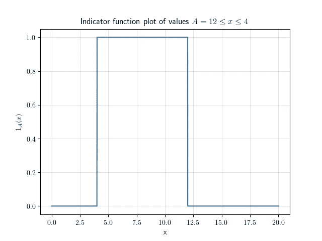
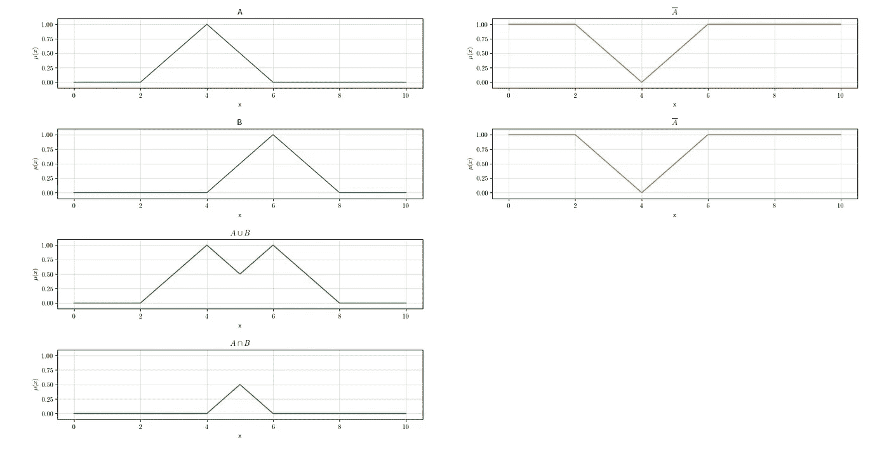
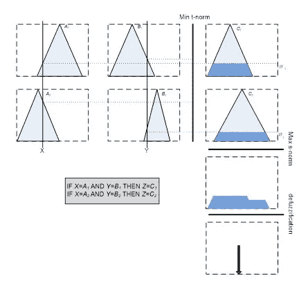
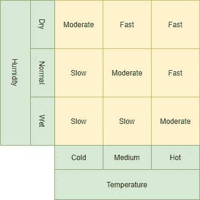
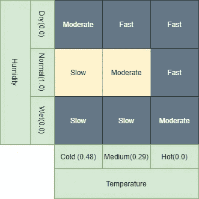
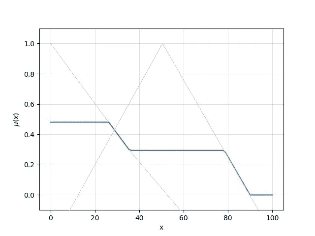

# 模糊逻辑和模糊系统的简要介绍

> 原文：<https://towardsdatascience.com/a-very-brief-introduction-to-fuzzy-logic-and-fuzzy-systems-d68d14b3a3b8?source=collection_archive---------4----------------------->

## “随着复杂性的增加，精确的陈述失去了意义，有意义的陈述也失去了精确性”――卢特菲·扎德


# 介绍

许多任务对人类来说很简单，但对机器来说却是一个持续的挑战。这种系统的例子包括在杂乱的环境中行走、提升易碎的物体或停车。人类处理模糊和不精确数据的能力让我们很容易完成这些任务。因此，如果我们的目标是复制人类操作员的控制行为，我们必须能够模拟操作员的活动，而不是设备本身的活动。我们的模型必须能够处理模糊的信息。

基于模糊逻辑的系统恰恰做到了这一点；它们在特别复杂的系统中表现出色，已经成功用于从语音和手写识别到地铁列车速度控制的许多应用中。

本文着重于模糊集和系统的基本思想。

# 清晰的集合和逻辑

经典逻辑基于清晰集合，其中一组不同的对象被认为是一个集合。例如，白色和红色本身都是独立的物体，但是可以用符号{red，white}将它们视为一个集合。按照惯例，清晰集合被指定为大写字母，因此上述示例可以描述为:

**F = {红白}**

清晰子集可以从更广泛的集合中定义，其中集合的元素根据某种条件属于该子集。例如，集合 A 可以被定义为大于或等于 4 且小于或等于 12 的数的集合。可以使用以下符号来描述该语句:

**A ={i | i 是一个整数，4 < = i < = 12}**

如果我们引入集合的特征或指示函数的概念，则上述子集的图形表示是可能的，也就是说，在这种情况下，在整数集合上定义的函数，我们称之为 X，它指示 X 中子集 A 中元素的成员资格。这是通过将值 1 赋给 A 中的 X 元素，将值 0 赋给不在 A 中的 X 元素来实现的。因此，在我们的示例中，该集合的指示函数是:


这可以用图形显示如下:



图一。

两个集合的交集是包含两个集合共有的所有元素的集合。两个集合的并集是包含任一集合中所有元素的集合。集合 A 的否定是包含所有不在 A 中的元素的集合。


# 模糊集

模糊集是由洛特菲·扎德(1921–2017)在 1965 年引入的。

与清晰集合不同，模糊集合允许部分属于一个集合，该集合由隶属度定义，表示为，可以取从 0(元素根本不属于该集合)到 1(元素完全属于该集合)的任何值。

很明显，如果我们除去除了 0 和 1 之外的所有隶属值，模糊集将会崩溃为上一节所描述的清晰集。

集合的隶属函数是集合元素和它们的隶属度之间的关系。下图说明了如何将隶属函数应用于温度。


在上面的例子中，模糊集描述了发动机的温度范围，从很冷到很热。值是集合中成员的数量。例如，人们可以注意到，在 80 度的温度下，发动机可以被描述为**热**0.8 倍，而**非常热**0.2 倍。

在上一节中，讨论了清晰集合的并集、交集和非运算符，因为它们提供了一种表达对推理至关重要的合取和析取(和/或)的方式。

计算两个模糊集合的并集的最常见方法是对集合应用最大值运算符。确实存在其他方法，包括在两个集合上使用乘积运算符。类似地，计算两个模糊集合的交集的最常见方法是对集合应用最小运算符。模糊集的补集是通过从 1 中减去集隶属函数来计算的。



一个重要的观察结果是，一个元素在一个集合和该集合的补集中都有一定的隶属度。因此，作为一个例子，元素 x 既可以在 A 中，也可以在“非 A”中。

# 模糊推理系统

模糊系统是一个模糊专家知识库，可以用模糊的术语而不是精确的布尔逻辑推理数据。专家知识是模糊隶属函数和一组模糊规则的集合，称为规则库，具有以下形式:

```
**IF** (conditions are fulfilled) **THEN** (consequences are inferred)
```

模糊系统的基本配置如下所示:


一个典型的模糊系统可以分为四个主要部分，即模糊化器、知识库、推理机和解模糊器；

**模糊化器**将一个真实的清晰输入映射到一个模糊函数，从而确定输入对一个模糊概念的“隶属度”。在许多控制器中，输入变量的值被映射到相应论域的值的范围。输入模糊集的范围和分辨率以及它们对模糊化过程的影响被认为是影响控制器整体性能的因素。

**知识库**包括应用领域的知识和伴随的控制目标。它可以分成一个数据库，该数据库包含用于在控制器中表达语言控制规则的**定义**，以及一个描述该领域专家所掌握的知识的**规则库**。直觉上，知识库是模糊控制器的核心元素，因为它将包含完成其执行任务所需的所有信息。各种研究人员已经应用技术来微调模糊控制器的知识库，许多人使用其他人工智能学科，如遗传算法或神经网络。

**推理机**提供控制器的决策逻辑。它利用模糊蕴涵和模糊推理规则来推导模糊控制动作。在许多方面，它可以被看作是对人类决策的模仿。

**去模糊化**过程将模糊控制值转换成清晰的量，即，它将单个点链接到模糊集，假定该点属于模糊集的支持。有许多去模糊化技术，最著名的是区域中心或重心。


其他去模糊化方法包括最大值优先和最大值平均。

几个推理模型使用模糊集来推理给定输入的系统输出。最流行的方法之一是由 Abe Mamdani 教授设计的，他使用模糊集来控制蒸汽机。另一个流行的模型是由 Tomohiro Takagi 教授和 Michio Sugeno 教授开发的。

在 Mamdani 推理中，模糊规则的前提和结果是模糊集。这种推理是基于广义假言，即模糊规则的结果的真实程度就是前件的真实程度。如果有一个以上的先行子句，则使用 min t-norm 运算符连接各个隶属度。如果模糊系统包含几个规则，它们的输出使用最大 s-范数算子组合。去模糊化是必要的，以便随后的动作可以用一个明确的值来表示。该过程的图示如下所示。



在 Takagi-Sugeno 推理模型中，结果是将清晰的输入值映射到规则清晰的输出的函数。因此，模糊规则的形式如下:

```
**IF** x IS X **and** y IS Y **THEN** z=f(x,y)
```

其中 f 通常是 X 和 y 中的线性函数。与 Mamdani 模糊系统相反，规则不是使用最大值算子来组合的，而是通过找到加权平均值来组合的，其中给定规则的权重是其前提的隶属度。因此，Takagi-Sugeno 系统不需要任何去模糊化。

# 模糊系统的设计

在本节中，我们将构建并执行一个简单的示例系统，以可视化模糊推理系统的设计和执行。这里考虑的假设系统根据环境的温度和湿度控制风扇的速度。因此，我们的系统由两个输入(温度和湿度)和一个输出(风扇转速)组成。


我们系统设计的第一步是定义模糊集来描述输入和输出变量。为简单起见，每个变量将由三个模糊集来表征，即:

```
Temperature: Cold, Medium, Hot
Humidity: Dry, Normal, Wet
Fan Speed: Slow, Moderate, Fast
```

下图显示了我们系统的输入和输出变量及其各自集合的图形表示。


可以注意到，三角形集合被用来描述这个系统的大多数集合；然而,“正常”湿度是用一个梯形集来指定的。模糊集反映了用户设计系统的知识，因此它们可以采取各种各样的形状。

注意，输出也是用模糊集描述的；因此，正在考虑的系统是一个 Mamdani 型系统，它使用模糊规则将与系统输入相关的模糊集链接到与系统输出相关的模糊集。

共有九条规则用于描述操作风扇所需的知识:

```
If Temperature is Cold and Humidity is Dry Then Fan Speed is Slow
If Temperature is Medium and Humidity is Dry Then Fan Speed is Slow
If Temperature is Cold and Humidity is Normal Then Fan Speed is SlowIf Temperature is Hot and Humidity is Dry Then Fan Speed is Moderate
If Temperature is Medium and Humidity is Normal Then Fan Speed is Moderate
If Temperature is Cold and Humidity is Wet Then Fan Speed is ModerateIf Temperature is Hot and Humidity is Normal Then Fan Speed is Fast
If Temperature is Hot and Humidity is Wet Then Fan Speed is Fast
If Temperature is Medium and Humidity is Wet Then Fan Speed is Fast
```

如果我们使用一个组合的模糊规则库，这些规则可以被可视化，这是一个网格，其中输入模糊集占据边缘，因此网格中的每个单元定义一个规则。下图显示了该系统的规则库。



当一个输入组合输入到系统时，会发生以下步骤，例如，假设温度为 18 度，湿度为 60%:

*   确定每组输入变量的隶属度。因此我们可以说 18 度的温度是

```
0.48 Cold
0.29 Medium
0.00 Hot
```

60%的湿度是

```
0.0 Wet
1.0 Normal
0.0 Dry
```

*   使用这种输入组合，两个规则以高于零的程度被触发，这可以在下面更新的模糊规则库中看到:



因此，我们的模糊输出将由激活度为 0.48 的慢速和激活度为 0.29 的中速组成。两个规则或系统模糊输出的综合效果如下所示:



使用重心去模糊化最终去模糊化输出集合，并且获得 36.814 的清晰值来驱动风扇。

# 结论

本文简要介绍了模糊集和模糊推理。它展示了如何使用语言术语来表示人类知识来实现对系统的控制。在下一篇文章中，将使用 python 从头开始构建一个模糊推理系统。