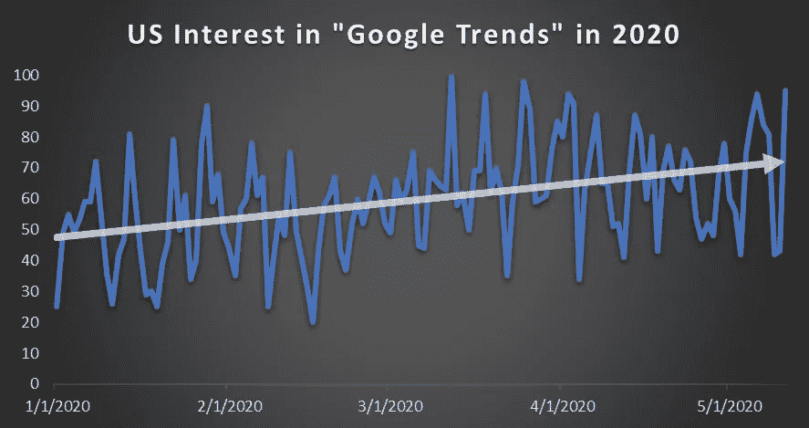
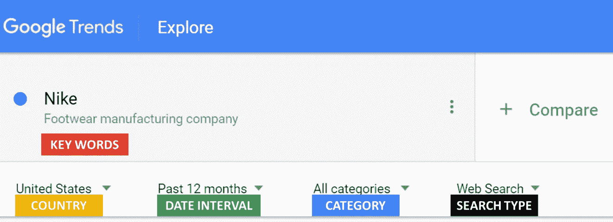
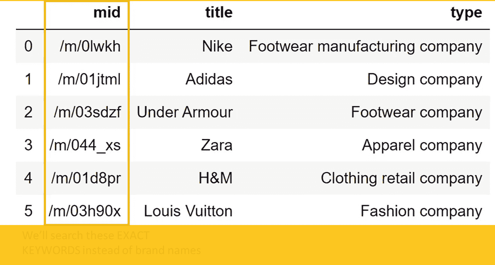
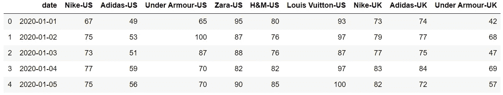
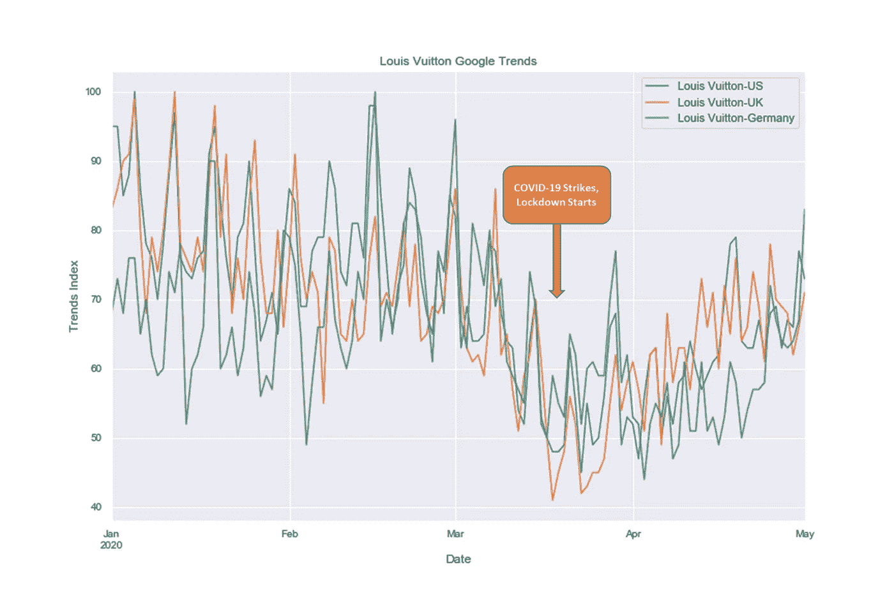

# 一个非常精确和快速的自动获取谷歌趋势数据的方法

> 原文：<https://towardsdatascience.com/a-very-precise-fast-way-to-pull-google-trends-data-automatically-4c3c431960aa?source=collection_archive---------9----------------------->


图片来源:Unsplash 的 Alex Blajan。

*一个一站式脚本，使用 Pytrends 通过精确的关键字自动拉动 Google trends*

新冠肺炎为“谷歌趋势”在美国的使用提供了便利(见下图)。毕竟，它是一个免费的公开可用的工具，提供跨谷歌搜索引擎的实际搜索请求。越来越多的公司利用谷歌趋势来了解类别趋势、消费者热门搜索查询、竞争对手在“黑天鹅”疫情事件中的表现。



每个 Google Trends 请求包含 5 个独特的参数:

*   **关键词:**你的关键词在这里。您可以使用下拉框下的提示来选择正确的关键字。
*   **国家:**拥有国际足迹的公司可以使用这个功能来获取各国的趋势。
*   **日期区间:**选择趋势的时间范围。请注意，google 趋势数据是基于位置和时间进行标准化的。因此，不同的时间范围会产生不同的结果。
*   **类别:**表示您更喜欢搜索关键字的类别。
*   **搜索类型:**选择搜索源，即谷歌搜索、图片搜索、新闻搜索、谷歌购物和 YouTube 搜索。



**挑战:**

大规模收集谷歌趋势数据面临两大挑战。

***1。单个关键字手动拉动是费时的。***

虽然 Google Trends 提供了“比较”功能来比较关键词，但缺点是它根据输入的最流行的术语将结果从 0 到 100 进行缩放。不太受欢迎的关键字会很快失去敏感性，如果你把它与一个受欢迎的。比如你拿“耐克”品牌和“至尊”品牌对比，基本上会得到一条“至尊”的平线。在这种情况下，当报告“最高”搜索增长趋势时，你会犯很大的错误。因此，建议分别单独拉动“耐克”趋势和“至尊”趋势。

直到你有太多的关键词需要提取，你还是有时间的。例如，当比较 50 个服装和鞋类品牌时，您需要下载 50 个 excels 并将它们组合在一起。

**②*。当前可用的自动化 python 方法不查询精确的关键字，这意味着它们不准确。***

使用 python 有许多可用的[方法](/google-trends-api-for-python-a84bc25db88f)来获取谷歌趋势数据。然而，他们都没有建立自动代码，可以把**精确的** **关键词**。单词通常有多种含义，这并不罕见。例如，“巴塔哥尼亚”可以是一家服装公司，也可以是南美的一个地区。简单地搜索“巴塔哥尼亚”会给我们含糊不清的结果，因为它包含两个搜索词。我们需要确保搜索到正确的关键词。


**目标:**

我们的目标是提供一个解决方案，精确地、单独地、自动地提取多个关键字的 google 趋势数据。

具体来说，我们将提取三个国家(美国、英国、德国)的六个服装/鞋类品牌(耐克、阿迪达斯、安德玛、Zara、H&M、路易威登)的谷歌趋势数据。使用 Python，有四个步骤可以实现这一点:

*   第一步:安装`pytrends` API
*   第二步:获取准确的关键词
*   第三步:按照国家的关键词提取谷歌趋势数据
*   第四步:可视化谷歌趋势


# 步骤 1:安装 pytrends API

首先，我们需要安装名为“pytrends”的软件包，该软件包旨在使用 python 拉取 google trends。只需从您的终端执行以下代码。你可以在这里找到 pytrends API [的完整文档。](https://pypi.org/project/pytrends/)

```
pip install pytrends
```

然后我们将导入必要的包。

```
import pandas as pd
import pytrends
from pytrends.request import TrendReq
pytrend = TrendReq()
```

# 第二步:获取准确的关键词

如前所述，我们需要精确的关键词以避免歧义。Pytrends 提供了一个名为`pytrend.suggestions`的函数，可以为一个关键字返回几个建议。通常，第一个建议是最受欢迎的。“mid”列包含我们想要搜索的确切关键字。

```
KEYWORDS=['Nike','Adidas','Under Armour','Zara','H&M','Louis Vuitton'] 
KEYWORDS_CODES=[pytrend.suggestions(keyword=i)[0] for i in KEYWORDS] 
df_CODES= pd.DataFrame(KEYWORDS_CODES)
df_CODES
```



# 第三步:通过关键词获取谷歌趋势数据

接下来，我们将设置这 5 个参数。

```
EXACT_KEYWORDS=df_CODES['mid'].to_list()
DATE_INTERVAL='2020-01-01 2020-05-01'
COUNTRY=["US","GB","DE"] #Use [this link](https://en.wikipedia.org/wiki/List_of_ISO_3166_country_codes) for iso country code
CATEGORY=0 # Use [this link](https://github.com/pat310/google-trends-api/wiki/Google-Trends-Categories) to select categories
SEARCH_TYPE='' #default is 'web searches',others include 'images','news','youtube','froogle' (google shopping)
```

然后，我们将编写代码，使用上述参数通过国家的精确关键字提取 google trends 数据。

```
Individual_EXACT_KEYWORD = list(zip(*[iter(EXACT_KEYWORDS)]*1))
Individual_EXACT_KEYWORD = [list(x) for x in Individual_EXACT_KEYWORD]
dicti = {}
i = 1
for Country in COUNTRY:
    for keyword in Individual_EXACT_KEYWORD:
        pytrend.build_payload(kw_list=keyword, 
                              timeframe = DATE_INTERVAL, 
                              geo = Country, 
                              cat=CATEGORY,
                              gprop=SEARCH_TYPE) 
        dicti[i] = pytrend.interest_over_time()
        i+=1
df_trends = pd.concat(dicti, axis=1)
```

我们会做一些清理工作，将这些关键词改回易读的品牌名称。

```
df_trends.columns = df_trends.columns.droplevel(0) #drop outside header
df_trends = df_trends.drop('isPartial', axis = 1) #drop "isPartial"
df_trends.reset_index(level=0,inplace=True) #reset_index
df_trends.columns=['date','Nike-US','Adidas-US','Under Armour-US','Zara-US','H&M-US','Louis Vuitton-US','Nike-UK','Adidas-UK','Under Armour-UK','Zara-UK','H&M-UK','Louis Vuitton-UK',
'Nike-Germany','Adidas-Germany','Under Armour-Germany','Zara-Germany','H&M-Germany','Louis Vuitton-Germany'] #change column names
```



# 第四步:可视化谷歌趋势

一眨眼的功夫，我们就得到了谷歌趋势数据。最后，让我们可视化路易威登跨国家的谷歌趋势。正如我们所见，路易威登显然受到了新冠肺炎的沉重打击，就像许多其他品牌和行业一样。

```
import seaborn as sns
sns.set(color_codes=True)
dx = df_trends.plot(figsize = (12,8),x="date", y=['Louis Vuitton-US','Louis Vuitton-UK','Louis Vuitton-Germany'], kind="line", title = "Louis Vuitton Google Trends")
dx.set_xlabel('Date')
dx.set_ylabel('Trends Index')
dx.tick_params(axis='both', which='both', labelsize=10)
```



## 摘要

随着各公司密切关注新冠肺炎期间消费者行为的变化，谷歌趋势工具的使用出现激增。为了帮助实现这一点，我们构建了一个轻量级应用程序来精确、自动地提取 Google 趋势数据。

最后，保持积极，感谢阅读！