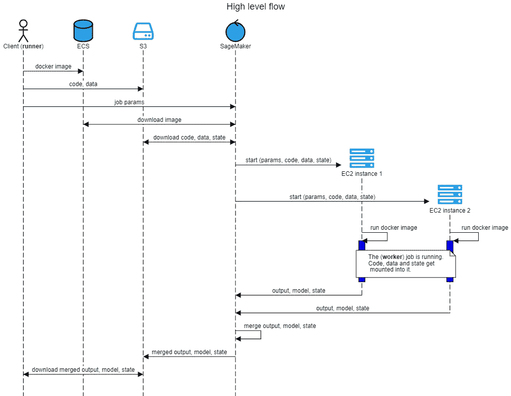
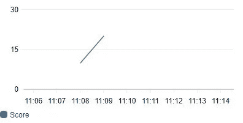

# 云处理现在更简单，更便宜！

> 原文：<https://towardsdatascience.com/a-very-simple-and-cheap-way-to-run-your-processing-job-on-the-cloud-c76af579f9e9?source=collection_archive---------37----------------------->

## 在云上运行/分发您的* **现有*** 处理/训练代码的一种*非常简单*且*便宜*的方式


作者图片

这发生在我身上，我相信也发生在你和许多从事中小型项目的数据科学家身上:

您已经在自己的训练管道(预处理->训练->测试)上投入了很多，使用不同的参数在本地尝试了几次，看起来很棒。但是……你意识到你需要更多的 RAM/CPU/GPU/GPU 内存或者所有这些加在一起才能充分利用它吗？

它的发生有很多原因——

*   您的本地设置花费了太多时间来进行培训
*   您需要更大的批处理大小，并且它不适合您的本地 GPU 内存
*   你想要[调整超参数](https://en.wikipedia.org/wiki/Hyperparameter_optimization)，所以需要很多训练
*   您希望将一些预处理步骤移到培训期间完成，例如，为了节省磁盘空间/加载时间，而 CPU / RAM 无法完成
*   …

因此，*，*理论上，你已经拥有了你需要的一切，但是你只需要在一个更好的硬件上运行它……这在今天应该不是问题，不是吗？

# 现有解决方案

确实有很多解决方案，这里有一些相关的技术/平台/解决方案:

## **通用**

1.  [Apache Airflow](https://airflow.apache.org/) —“以编程方式创作、安排和监控工作流的平台”
2.  [雷](https://ray.io/)——“快速简单的分布式计算”

## **云提供商 AI 解决方案**

1.  [kube flow](https://www.kubeflow.org/)——“kubernetes 的机器学习工具包”( [pipelines](https://www.kubeflow.org/docs/pipelines/overview/pipelines-overview/) )
2.  [GCP 人工智能平台](https://cloud.google.com/ai-platform/)——“一个平台来构建、部署和管理机器学习模型”([训练](https://cloud.google.com/ai-platform/training/docs/overview)、[管道](https://cloud.google.com/ai-platform/pipelines/docs)、[分布式 PyTorch](https://cloud.google.com/ai-platform/training/docs/distributed-pytorch) 、分布式 [TensorFlow](https://cloud.google.com/ai-platform/training/docs/distributed-training-details) )
3.  [Azure 机器学习](https://azure.microsoft.com/en-us/services/machine-learning/)——“企业级机器学习服务，更快地构建和部署模型”([培训](https://docs.microsoft.com/en-us/azure/machine-learning/how-to-set-up-training-targets))
4.  [AWS Sagemaker](https://aws.amazon.com/sagemaker/) —“面向每一个开发者和数据科学家的机器学习”([培训](https://docs.aws.amazon.com/sagemaker/latest/dg/how-it-works-training.html)、[分布式 PyTorch](https://sagemaker.readthedocs.io/en/stable/frameworks/pytorch/using_pytorch.html#distributed-pytorch-training) 、[分布式 TensorFlow](https://sagemaker.readthedocs.io/en/stable/frameworks/tensorflow/using_tf.html#distributed-training) )

## 分布式培训框架

1.  [rays GD](https://medium.com/distributed-computing-with-ray/faster-and-cheaper-pytorch-with-raysgd-a5a44d4fd220)——“分布式深度学习的轻量级库”，构建在 Ray 之上
2.  [Horovod](https://github.com/horovod/horovod)——“分布式深度学习训练框架”

## 张量流

1.  [TensorFlow 分布式培训文档](https://www.tensorflow.org/guide/distributed_training)
2.  [TensorFlow 自己的 GCP 分布式 GCP 培训教程](https://www.tensorflow.org/guide/keras/training_keras_models_on_cloud)
3.  [TensorFlow 培训(TFJob)](https://www.kubeflow.org/docs/components/training/tftraining/) 针对 Kubernetes(kube flow 的一部分)

## **PyTorch**

1.  [PyTorch 分发的培训文件](https://pytorch.org/tutorials/beginner/dist_overview.html)
2.  [PyTorch 自己的 AWS 分布式培训教程](https://pytorch.org/tutorials/beginner/aws_distributed_training_tutorial.html)
3.  [Kubernetes 的火炬控制器](https://github.com/pytorch/elastic/tree/master/kubernetes)
4.  [在 CPU 或 GPU 上运行分布式 PyTorch 培训(使用 Kubeflow 管道)](https://aihub.cloud.google.com/u/0/p/products%2F59f96517-9a20-4d4d-916c-ff2d2affda6d)

…

所有现有解决方案的优缺点的比较值得一提(甚至是一系列)，我肯定我忘了提到许多其他的:)

但是，我找不到一个可以让你运行我现有代码的工具，只需要很少或者不需要额外的编码，很便宜，也不需要很多之前的特定平台知识。我也只是想尝试拥有自己的开源项目，包括文档和完全自动化的测试和发布管道:)
这就是我想出[*simple-sagemaker*](https://github.com/shiftan/simple_sagemaker)和这篇文章*的原因。*

# 很简单-Sagemaker 来拯救

[*Simple——sagemaker*](https://github.com/shiftan/simple_sagemaker)允许您将现有的代码原封不动地放在云上运行，不需要或只需要很少的代码修改。

这篇文章的剩余部分展示了如何使用这个库进行通用处理。后续文章将展示如何将其用于更高级的案例，如 PyTorch 分布式培训等。

更全面的文档和例子可以在 [github 项目](https://github.com/shiftan/simple_sagemaker)上找到，还有一些[更多例子](https://github.com/shiftan/simple_sagemaker/tree/master/examples)，包括这篇文章中所有例子的[源代码。](https://github.com/shiftan/simple_sagemaker/tree/master/examples/medium/intro)

## 要求

1.  Python 3.6 以上版本
2.  为 boto3 配置的 AWS 帐户+区域和凭证，如 [Boto3 文档](https://boto3.amazonaws.com/v1/documentation/api/latest/guide/credentials.html)中所述

## 装置

```
pip install simple-sagemaker
```

## 运行 shell 命令

现在，要让 shell 命令`cat /proc/cpuinfo && nvidia-smi`在单个`ml.p3.2xlarge`****实例**上运行，只需运行下面的`ssm`命令(关于`ssm` CLI 的文档在下面的[中给出):](https://github.com/shiftan/simple_sagemaker/tree/develop#cli)**

```
ssm shell -p ssm-ex -t ex1 -o ./out1 --it ml.p3.2xlarge --cmd_line "cat /proc/cpuinfo && nvidia-smi"
```

**一旦任务完成(几分钟)，输出日志就会下载到`./out1`:**

**正如您可能猜到的那样，使用这个命令行，您会得到:**

1.  **选择一个用于运行代码的[预构建映像](https://github.com/aws/deep-learning-containers/blob/master/available_images.md)(默认为 Sagemaker 的 PyTorch 框架映像)。**
2.  **一个 IAM 角色(默认名称为`SageMakerIAMRole_ssm-ex`)和[amazonseagemakerfullaccess](https://docs.aws.amazon.com/sagemaker/latest/dg/sagemaker-roles.html#sagemaker-roles-amazonsagemakerfullaccess-policy)策略被自动创建用于运行任务。**
3.  **一个`ml.p3.2xlarge` **spot** 实例为你启动，你只需为你使用它的时间付费！
    注意:这比执行时间稍长，因为它包括启动(如下载图像、代码、输入)和关闭(保存输出)等时间。**
4.  **在实例上执行 shell 命令。**
5.  **shell 命令 exist 代码为 0，因此它被认为已成功完成。**
6.  **输出日志保存到 CloudWatch，然后从 CloudWatch 下载到`./out1` 文件夹。**

**很酷的第一名，不是吗？**

## **分发 Python 代码**

**同样，在**上运行下面的`ssm_ex2.py`两个***ml . p 3.2x large****spot*实例**:**

**只需运行下面的`ssm`命令:**

```
ssm run -p ssm-ex -t ex2 -e ssm_ex2.py -o ./out2 --it ml.p3.2xlarge --ic 2
```

**输出被保存到`./out2`:**

**您可能已经猜到了，这里您还会得到以下内容:**

1.  **本地 python 脚本被复制到 S3 上的一个专用路径(`[Bucket name]/[Project name]/[Task name]/[Job Name]/source/sourcedir.tar.gz`)(更多细节[在这里](https://github.com/shiftan/simple_sagemaker#data-maintenance-on-s3))。**
2.  **两个 spot 实例用 S3 桶中的代码启动。**

**很酷的#2，不是吗？**

# **高水位流量**

**这是一个代表高层次流程的图表:**

****

# **一个功能全面的高级示例**

**现在是一个高级的和完全(嗯，几乎:)特色的版本，但实现起来很简单。注意:当我们定制图像时，需要 docker 引擎。**

**该示例由两部分组成，每一部分都展示了一些特性。此外，这两个部分是“链式”的，这意味着第一个部分的输出是第二个部分的输入。**

**为了举例说明大多数功能，使用了以下目录结构:**

```
.
|-- code
|   |-- internal_dependency
|   |   `-- lib2.py
|   |-- requirements.txt
|   `-- ssm_ex3_worker.py
|-- data
|   |-- sample_data1.txt
|   `-- sample_data2.txt
`-- external_dependency
    `-- lib1.py
```

1.  ****代码** —源代码文件夹**

*   **internal_dependency —源代码文件夹中的依赖项**
*   **requirements.txt — pip 需求文件列出了在运行 worker
    `transformers==3.0.2`之前需要安装的包**

**2.**数据** —输入数据文件**

**3.**外部依赖** —附加代码依赖**

**我们将使用 to 任务，首先得到两个输入通道**

## **第一项任务**

**该任务获得两个输入通道:**

1.  ***数据*通道——分布在两个实例之间的`./data`上的本地路径(由于`ShardedByS3Key`)**
2.  **人物频道——S3 的一条公共道路**

**演示了以下内容:**

1.  **命名项目(`-p`)和任务(`-t`)。**
2.  **使用本地数据文件夹作为输入，它分布在实例中(`— i`、`ShardedByS3Key`)。该文件夹首先被同步到 S3 上专用于该特定任务的目录中(根据项目/任务名称)，然后被提供给工人。如果你再次运行相同的任务，就不需要上传整个数据集，只需要再次同步即可。**
3.  **使用公共 s3 存储桶作为附加输入(`--is`)。角色会自动添加到所使用的 IAM 策略中，以允许该访问。**
4.  **构建一个定制的 docker 映像(`--df`、`--repo_name`、`-- aws_repo_name`)，以使`pandas` 和`sklearn`库对工人可用。基本映像是自动获取的(PyTorch 框架是默认的)，映像在本地构建，然后上传到 ECR 供正在运行的实例使用。**
5.  **超参数任务类型。任何额外的参数都被认为是超参数。在`--`(后面跟一个空格)之后的任何内容都按原样传递给执行的脚本命令行。**
6.  **启动两个实例(`--ic`)。**
7.  **`--force_running` —确保我们再次运行任务(作为本例的一部分)。**
8.  **使用按需实例(`--no_spot`)。**
9.  **`requirements.txt`的用法——因为它是源代码文件夹(`-e`)的一部分，所以在运行 worker 之前会自动安装。**
10.  **`internal_dependecty`文件夹作为源代码文件夹的一部分被复制。**

**很酷的 3 号，不是吗？**

**工人代码:**

**工人可以通过使用`WorkerConfig`对象或环境变量来访问其配置。例如:**

*   **`worker_config.channel_data` —输入数据**
*   **`worker_config.channel_persons` —来自公共 s3 桶的数据**
*   **`worker_config.instance_state` —实例状态，在相同任务的执行之间维护**

**在这种情况下，工作进程将输入通道数据中的文件“处理”到模型输出文件夹中，并将附加文件写入输出数据文件夹。**

**完整的配置文件可以在[这里](https://github.com/shiftan/simple_sagemaker/tree/develop#worker-environment)找到。**

## **第二项任务**

**第二个任务也获得两个输入通道:**

1.  ***ex3_1_model* 通道—第一个任务的模型输出**
2.  ***ex3_1_state* 通道—第一个任务的状态**

**演示了以下附加功能:**

1.  **链接—使用第 1 部分的输出(`— iit`)作为该部分的输入。模型输出和凝视都被采用。**
2.  **使用附加的本地代码依赖项(`-d`)。**
3.  **使用 TensorFlow 框架作为预建图像(`-f`)。**
4.  **标记作业(`-- tag`)。**
5.  **定义一个 Sagemaker 度量(`-- md`)。**

**很酷的 4 号，不是吗？**

**代码可以使用`worker_config.ex3_1_state`和`worker_config.ex3_1_state`访问其输入数据通道。**

**此外，分数日志由上面的`ssm`命令中的`"Score=(.*?);"`正则表达式捕获，然后可以在 [AWS 控制台](https://console.aws.amazon.com/sagemaker/)上查看度量图:**

****

## **完整的代码**

**我们可以把这两个 worker 放在一个文件中，使用`task_type`超参数来区分这两种类型的执行:**

# **结论**

**我希望我成功地传达了简单的信息，并说服您下次需要更强大的硬件来处理脚本时，尝试一下[s*imple-sagemaker*](https://github.com/shiftan/simple_sagemaker)*。上面的例子，以及总结你所得到的“非常酷”的观点，不言自明:)。***

***让我知道你是否喜欢它，在下面鼓掌/看 github 项目。***