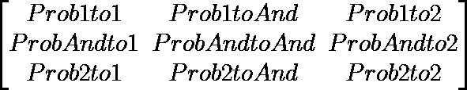
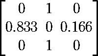
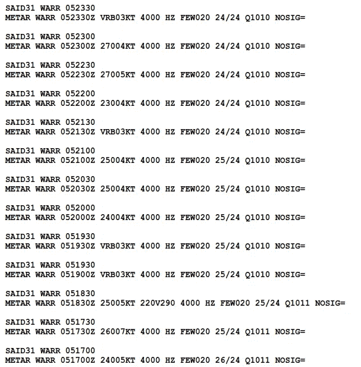

# 一种非常简单的利用马尔可夫模型查找表进行天气预报的方法

> 原文：<https://towardsdatascience.com/a-very-simple-method-of-weather-forecast-using-markov-model-lookup-table-f9238e110938?source=collection_archive---------22----------------------->

奥斯曼·拉纳在 [Unsplash](https://unsplash.com?utm_source=medium&utm_medium=referral) 上拍摄的照片

天气是一个非常复杂的事件。即使你只是想预测降雨事件，这也是相当困难的。但是你知道，有一句名言是这样说的

> 历史会重演

基于此，我们将尝试使用马尔可夫模型来预测天气。但是，第一件事是，我们必须理解马尔可夫模型的概念。

# 马尔可夫模型

什么是马尔可夫模型？这是一个非常简单的概念。根据维基百科，马尔可夫模型是

> 在[概率论](https://en.wikipedia.org/wiki/Probability_theory)中，**马尔可夫模型**是一种[随机模型](https://en.wikipedia.org/wiki/Stochastic_model)，用于[建模](https://en.wikipedia.org/wiki/Mathematical_model)随机变化系统。假设未来状态只取决于当前状态，而不取决于之前发生的事件(即假设[马尔可夫性质](https://en.wikipedia.org/wiki/Markov_property))。

我们必须注意的词是

> 未来状态仅取决于当前状态

你如何达到目前的状态并不重要，**重要的只是我们目前的状态**。这个很简单。为了说清楚，我们举个例子

> 1 和 1 和 1 和 1 和 1 和 2 和 1

在上面的字符串中，有 3 个唯一的字符，即“1”、“and”和“2”(为了简单起见，我们忽略空格(" ")也是一个字符的事实)，这意味着我们有 3 种状态。为了确定如何从一个状态改变到另一个状态，**马尔可夫模型有一个马尔可夫转移矩阵**。**这是一个矩阵，它将某一种情况的概率映射到另一种状态，包括它本身**。对于这种情况，矩阵的一般形式如下

我想你们都明白上面矩阵中的符号。反正 Prob 是概率的简称。现在我们如何在转移矩阵中确定这样的概率呢？**我们从观测数据中抽样获得**。让我们在示例字符串中映射所有改变状态的事件及其频率。

首先，这里所有的变化状态事件

> 1 和 1 和 1 和 1 和 1 和 2 和 1
> 
> [1-> and][and-> 1][1-> and][and-> 1][1-> and][and-> 1][and-> 1][1-> and][and-> 1][and-> 1][1-> and][and-> 2][and-> 2][and-> 1]

所以我们得到了

> “1”更改为“和”(5/5 = 100%)
> 
> “与”变为“1”(6 个中的 5 个= 83.33%)
> 
> “和”更改为“2”(6 个中的 1 个= 16.66%)
> 
> “2”更改为“和”(第 1 个，共 1 个= 100%)

由此，我们得到了转移矩阵

有了这个矩阵，我们就知道了这样一个事实:如果我们当前的状态是“1”，那么下一个状态或下一个单词一定是“and”，从“and”到“1”的概率很大(83%)，到“2”的概率很小(17%)。从“2”开始，它将在“和”中结束。哦，供你参考**有几种马尔可夫模型**。**这种假设系统完全可观测且自治的马尔可夫模型称为马尔可夫链。**

# 使用马尔可夫模型预测天气

现在我们明白了什么是马尔可夫模型。我们知道引语(“历史重演”)和马尔可夫模型之间的关系。实际上，做天气预报的方法之一叫做**模拟法**。它是关于**检查与我们当前状态相同的过去状态，并在这个状态**之后根据过去发生的事情预测天气。因此，使用马尔可夫模型来应用模拟方法预测天气是完美的。

是时候继续我们的实验细节了。在马尔可夫模型的典型示例中，该示例总是关于天气预测，但是具有诸如“晴天”、“多云”和“雨天”的简单状态。在真实的天气报告或预测中并不是那样简单。真实报告或预测除了天气之外，还定义了当前或未来时间的温度、湿度、能见度和风。

在这个实验中，**我们将把温度、湿度、能见度、风和天气的每一种独特组合视为一种状态**。为了**避免组合的无限可能性**，我们对除天气以外的所有参数进行分组和舍入(除天气以外的所有参数都是实数，范围 0 到 1 之间有无限个实数)。分组和舍入的细节我们将在后面讨论。即使我们已经在做这个东西，参数的总可能组合将超过一千个。这就是为什么我们将构建**一个查找表**来映射数据集中所有现有的状态。

当我们发现一个新的唯一状态时，我们将对当前状态中所有参数的组合进行编码，并将其注册到当前状态及其未来状态的表中。当我们再次发现那个状态是当前状态时，它当时的未来状态将与那个当前状态的其他未来状态一起被附加到那个状态的未来状态的列表中。

当我们想用这个表来预测未来的天气时，首先**将我们当前的天气参数**的状态**编码成一个关键字在我们的表**中进行搜索。当我们发现相同的编码状态时，**看看它未来状态的列表。挑选最频繁的编码状态并解码**就这样。你得到了**天气预报**基于使用马尔可夫模型的模拟方法。很简单。如果你没有从表中找到我们当前的状态，这意味着**我们无法预测这个状态**。这就是为什么我们需要**最小化可能的状态，需要一个大的数据集**来最小化当我们想要预测天气时找到一个新的唯一状态的可能性。

我们将用于构建转移矩阵的数据集是元数据。METAR 是一个字母数字代码，包含某个区域每 1 小时或半小时的天气状况和其他参数。

元数据的例子

为了这个实验，我已经解码了一些从 2012 年 1 月 1 日到 2020 年 5 月 31 日的 JSON 格式的 METAR 数据。你可以在这里下载[。这个 JSON 数据包含从这些 METAR 代码中提取的风速和风向、能见度、温度、露点和天气。在这个实验中，我使用 MongoDB 和 pymongo。](https://drive.google.com/file/d/1erQ5MnED3fKNsl8B6wXcSSoa_Hb9DQwH/view?usp=sharing)

第一步，让我们建立转移矩阵或查找表。我们使用 2012 年 1 月 1 日至 2019 年 12 月 31 日的数据来构建该表。这是脚本

在这个实验中，我们将一天分为 4 个时段，即上午时段(当地时间上午 6 点-12 点)、下午时段(当地时间上午 12 点-下午 6 点)、晚上时段(下午 6 点-12 点)和午夜时段(当地时间下午 12 点-第二天早上 6 点)。我们的数据集的时间分辨率是半小时。因此，我们需要**汇总每一节**中的每一个参数值。对于除天气以外的所有参数，我们对每个部分的参数值进行平均。平均之后，是分组和四舍五入。对于天气，我们选择在该部分的时间段内发生的最重要的天气。

使用 GMT 或 UTC 作为时间指示器的 METAR 数据。我们所在地的当地时间是 GMT+7，所以我们需要调整从数据库获取数据的方式(请看上面代码中的第 77 行)。

之前我说过，我们将在后面讨论舍入和分组参数值。现在，是时候了。**对于风速**，我们将其分为 5 组:

*   < 5 knot wind (encoded it as “<5KT”)
*   5–10 knot wind (encoded it as “5–10KT”)
*   10–15 knot wind (encoded it as “10–15KT”)
*   15–20 knot wind (encoded it as “<15–20KT”)
*   20–25 knot wind (encoded it as “<20–25KT”)
*   > 25 节风(编码为" > 25KT ")

**对于风向**，我们将其分组为 8 个方向

*   < 45° (encoded as “Northeast”)
*   45–90° (encoded as “East”)
*   90–135° (encoded as “Southeast”)
*   135–180° (encoded as “South”)
*   180–225° (encoded as “Southwest”)
*   225–270° (encoded as “West”)
*   270–315° (encoded as “Northwest”)
*   315–360° (encoded as “North”)

Yeah, recently I realized that my classification of wind direction is not quite right. But it doesn't matter because we just want to group the wind direction so it will not generate too much unique state.

**对于能见度**，我们将该值四舍五入为第一千个值，并以同样的方式编码，能见度值>为 1000 米。对于 500–100，我们将其视为 500 米(编码为“500”)，最后对于所有能见度< 500 米，我们将其视为 0 米(编码为“0”)。特别为能见度，它有 2 个槽状态，即最低能见度和最高能见度。

**对于温度**，我们将其四舍五入为整数(编码与此相同)。

**对于相对湿度(RH)** ，有点特殊，因为我们数据库里没有 RH 数据。我们从温度和露点预测它的值。之后，我们在什一税中对值进行舍入(编码与此相同)。

**对于天气**，我们选择该部分时间段内最重要的天气。天气的重要程度定义如下:

上面的天气代码被编码以使其更短。比如小雨编码为-RA，雨编码为 RA，雷雨编码为 TS。下降越多，天气越重要。天气编码与此天气代码相同。当没有显著的天气时，我们将其编码为“NOSIG”。

在我们对所有参数进行编码后，我们**将它们连接起来，并用“|”字符**分隔。这就是我们如何对单个状态进行编码。

我们得到查找表后，就该尝试用这个表来预测天气了。我们将使用 2020 年 1 月 1 日至 2020 年 5 月 31 日的数据。这是脚本

这将生成一个 CSV 格式的新文件 result.dat。第一列是当前状态，第二列是下一个状态(真值)，第三列是下一个状态的预测。

下面是我从上面的代码生成的 result.dat。

哇，有这么多“未知”的预测。“未知”意味着状态太新，所以我们**无法预测它**。但是，**有些预测结果接近实际状态**，不尽相同。看起来我们的表格需要更多的数据。当我在这么多“未知”的情况下得到这个结果时，我得出结论，我需要更多的数据至少 30 年的数据(这是气象学或气候学中看到某个地区天气正常模式的标准)。

这是模拟方法的应用，使用马尔可夫模型预测天气。下一次，也许我会尝试使用稳定指数数据，或者低层和高层大气的温度和相对湿度，这是一个非常决定性的参数，经常被预报员用来预测天气。

## 更新

你可以在这里访问完整代码[。](https://github.com/genomexyz/prob_weather/tree/master)

参考资料:

https://en.wikipedia.org/wiki/Markov_model[号](https://en.wikipedia.org/wiki/Markov_model)于 2020 年 6 月 3 日进入

http://aviation.bmkg.go.id/web/于 2020 年 6 月 6 日进入

[http://ww 2010 . Atmos . uiuc . edu/(Gh)/guides/mtr/fcst/mth/oth . rxml](http://ww2010.atmos.uiuc.edu/(Gh)/guides/mtr/fcst/mth/oth.rxml)2020 年 6 月 6 日访问