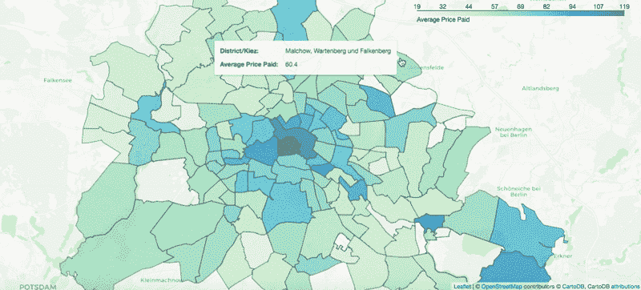

# 柏林 Airbnb 托管的可视化数据驱动研究

> 原文：<https://towardsdatascience.com/a-visual-data-driven-look-at-airbnb-hosting-in-berlin-729eccd8bf9d?source=collection_archive---------44----------------------->

## 哪些社区最物有所值？有多少主机将 Airbnb 作为主要收入来源？我用数据通过可视化和预测技术来回答这些问题。

由[凯瑟琳·埃德格雷](https://medium.com/u/f9d984e808d4?source=post_page-----729eccd8bf9d--------------------------------)拍摄的照片

在最好的情况下，Airbnb 可以以合理的价格成为体验一座城市的绝佳方式。然而，正如经常出现的好事过多的情况一样，Airbnb 也可能对某些城市产生不利影响。为了应对因 Airbnb 的成功而导致的租金价格上涨，柏林市在 2018 年颁布了一项新法律，要求某些短期出租整个物业的主机必须获得许可。

利用 Airbnb 目前关于柏林房源和评论的数据——从 Airbnb 内部的[获得——我决定自己更仔细地观察柏林的 Airbnb 景观。我想从商业的角度而不是客人的角度来调查，在新法律生效后，柏林实际上在经营什么样的房产和房东。此外，我自己在柏林断断续续住了 7 年，我也想看看使用 Airbnb 数据作为位置推荐工具的潜力，并看看结果如何与我自己的经验相吻合。关于这座城市最好、最便宜或最受欢迎的住宿地点，这些数据能告诉我们什么？](http://insideairbnb.com/index.html)

我决定专门关注这**三个问题:**

1.  柏林有多少比例的 Airbnb 主机可能将主机服务作为主要收入来源(或者是业务)？
2.  柏林各个社区的 Airbnb 价格有什么不同，哪些社区最划算？
3.  我们能否预测一个列表的位置评级，以及哪些社区对这些评级有最大的影响？

由于这些问题不一定激发单一的、明确的答案，除了应用分类技术寻找答案之外，我决定选择使用 Plotly 和 follow 地图的交互式可视化。

# 柏林有多少比例的 Airbnb 主机可能将主机服务作为主要收入来源？

以我的经验来看，Airbnb 不仅用于柏林的短期旅游租赁，也用于长期合租，供租户搬走一段时间。有些房东只是在夏天有一个免费房间的人，而其他人已经决定购买多套公寓，以从托管中获得稳定的收入。我想知道这个崩溃到底是什么样子的。

我首先检查了柏林目前有共同主机的列表。特别是，我查看了有多少列表是来自各自主机的唯一的列表，以及来自同一主机的许多列表中的一个。

左侧显示的饼图显示了使用 Airbnb 只是为了出租房间或公寓的房东与使用 Airbnb 作为商业工具(即出租许多房间或公寓)的房东的房源百分比。我们看到**超过 10%** 的广告房源拥有至少 4 个房源的主机。

然而，当我们从主机总数的角度来看同样的细分时，如下图所示，拥有 3 个以上列表的主机的实际百分比仅为 **1.63%** 。柏林 Airbnb 上的大多数房东似乎只是把 Airbnb 作为出租自己房间或公寓的一种方式。

然而，1.63%的主机所拥有的大量列表(平均 7.5 个列表)反映在 10%的列表属于那一小部分主机的事实中。

这就引出了一个问题——我们如何区分那些只是偶尔出租房屋的房东和那些出租房屋做生意的房东？为了对选择什么样的阈值有一个概念，我们看一个主机的列表在一年中可用的平均天数，按主机有多少个列表细分。

从上图中可以看出，可用性的最大提升发生在拥有 3 个清单的主机和拥有 4 个清单的主机之间。对于只有一个房源的房东来说，一年中平均只有 49 天的空房率意味着这些房子很可能**不是作为主要收入来源**出租的。相比之下，那些拥有 4 个或更多房源的房东一年的平均可用时间超过 178 天(超过半年)，这意味着所有者不可能在一年的大部分时间里住在这些房产中，而是可能将 Airbnb 作为主要收入来源的商业工具。

无法准确确定主机必须将其归入业务类别的列表数量的确切阈值，但从上述结果中，我们可以得出结论，拥有 4 个或更多列表的主机可能会将 Airbnb 作为主要收入来源或至少是副业。我们还可以得出这样的结论:柏林的**绝大多数** ( > 90%)的主机都在把 Airbnb 作为一个产生第二收入来源的工具，这符合 2018 年制定的规定。

# 柏林各个社区的 Airbnb 价格有什么不同，哪些社区最划算？

使用[叶子](https://python-visualization.github.io/folium/)创建

上面的地图显示了柏林每个街区的 Airbnb 房源的平均价格(未填写的部分没有足够的数据)。显然，柏林市中心的平均价格略高，尤其是政府区 *(Regierungsviertel)* 以及亚历山大广场。

我们可能还想直接比较较大区域的社区价格。为了做到这一点，我们接下来看看每个地区的价格分布。

注意:只包括至少有一个评论的列表

上面的箱线图显示了柏林每个区的标价的中值、四分位数范围(值的第 25 至 75 个百分点)和异常值(以单个点的形式)。很明显，所有地区都倾向于 30 到 100 之间的较低值。似乎 T2 的 Mitte 和 T4 的 Friedrichshain-Kreuzberg 都拥有最昂贵的房产。米特也是住宿成本最高的地区，平均价格为每晚 83 美元，而赖尼克肯多夫是最便宜的，平均价格为每晚 46 美元。

那么，住在哪里呢？嗯，我们不仅要考虑价格。Airbnb 的评级系统对各种因素进行细分。除了对酒店的总体评级，数据集还包含对以下方面的评级:*位置、清洁度、准确性、沟通、价值和入住。*为了更好地了解城市不同地区的性价比，我们还想加入位置评分。下图在 y 轴上显示了每个地区的平均价格，而该地区的平均位置评级则由条形的颜色表示。

从图表中，我们或多或少可以看出哪些地区在价格*和*价值方面是最优的。考虑到价格和价值，Friedrichshain-Kreuzberg、Charlottenburg-Wilmersdorf 和 Tempelhof-schneberg 是最理想的地方，因为它们的价格相对较低，但位置评级极高。

这些都是相当大的区域。我们可能还想更深入地了解哪些特定社区特别适合(或不适合)居住。为了做到这一点，我还将尝试预测位置评级，以了解各种社区/较小的地区和其他因素对评级的影响。

# 我们能否预测一个列表的位置评级，以及哪些社区对这些评级有最大的影响？

为了预测柏林的上市地点评级，我首先查看了这些评级是如何分布的。我发现收视率主要偏向高收视率，如下图所示。

结果显示，大约 70%的被评级房产的地理位置被评为 10/10，另外 30%的被评为低于 10。由于这些评级的性质，我选择简单地预测一处房产位置的评级是等于 10 还是小于 10。

通过建立一个旨在确定一个物业的位置是否值得 10/10 评级的分类器，我能够看到哪些基于位置的变量在这个预测中最有用。为了量化一个变量在预测位置评级中的重要性，我们看看模型中使用的系数，或*效应大小。*

注意:效果大小单位是标准化的，与原始单位无关

从上面的图中，我们可以看到，某些街区或区对位置评级有着显著的影响。特别是，我们可以做出一些有用的推论:

*   位于 Prenzlauerberg Südwest(西南)或 Helmholtzplatz 的列表会导致明显更高的位置评级。相比之下，Osloer Straß、Parkviertel 和 central Wedding 的房源位置评分要低得多，这表明它可能真的不是最好的住宿地点。
*   平房和别墅的列表与更好的评级相关联，这可能与它们位于城市中特别好的地段这一事实有关。
*   从物业位置到最近的地铁站或火车站的距离与位置评级呈负相关，这意味着交通不便的房源在位置方面不太理想(如我们所料)。

# 外卖食品

在这篇文章中，我们利用现有的数据来了解柏林什么样的人在使用 Airbnb(企业与个人，自住物业与出租物业)。我们还研究了柏林的个别地区和较小的社区，比较了每个地区的房源价格，以及某些社区对预测房源位置评级的影响。

特别是，我们发现:

1.  拥有 **4** **或更多房源**的房东可能会将 Airbnb 托管视为一项业务，因为这些房源在一年的大半时间里都是可用的。拥有 4 个或更多列表的主机仅占数据中主机的 1.63%，但它们的列表占总列表的 10%以上。似乎有一些企业或主机使用 Airbnb 作为商业工具，但大多数只是在一年内短期出租他们的公寓/房间。
2.  不出所料，**最昂贵的房产位于更中心的位置**，Mitte 提供最高的平均挂牌价格。Reinickendorf 和 Lichtenberg 是住宿最便宜的地区，中间价格都是每晚 40 美元，但就其地理位置而言，这两个地区的排名并不高。
3.  数据集中许多基于位置的变量确实对一个列表的位置评级有显著影响。Prenzlauerberg Südwest 和 Helmholtzplatz 似乎是特别好的住宿地点(根据我自己的经验，我同意这一点)，因为它们会导致良好的位置评级。相反，Osloer Straß和 central Wedding 可能不是最好的入住地点。

在这篇文章中，我们回顾了从柏林 Airbnb 数据中提取的一些有用的见解，这些见解使我们能够更好地了解托管人口统计以及该市各区和社区之间的差异。地理洞察可以用来提供关于在哪里住宿或购买物业用于租赁的建议，而主机分析可以证明有助于更深入地了解 Airbnb 的实际使用情况。

如果你想阅读更多关于我的分析或这篇文章的代码，可以点击[这里的](https://github.com/katherineedgley/Airbnb-Berlin-Analysis)链接。