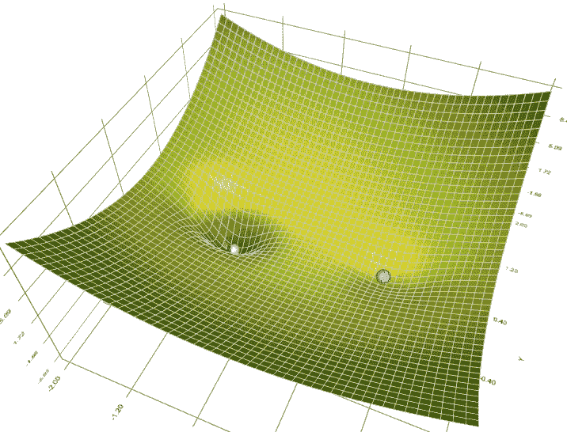
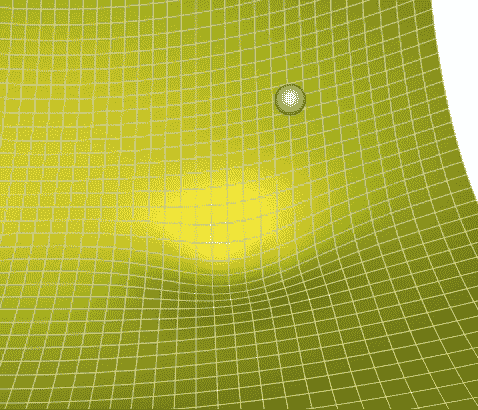
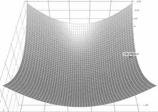
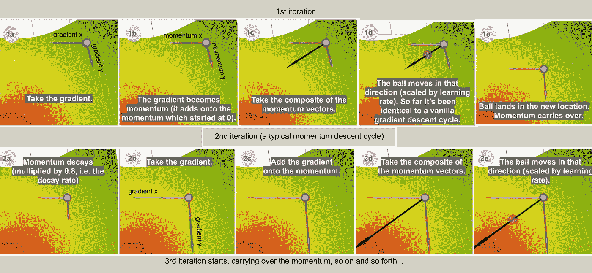
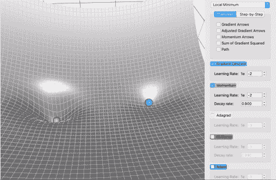
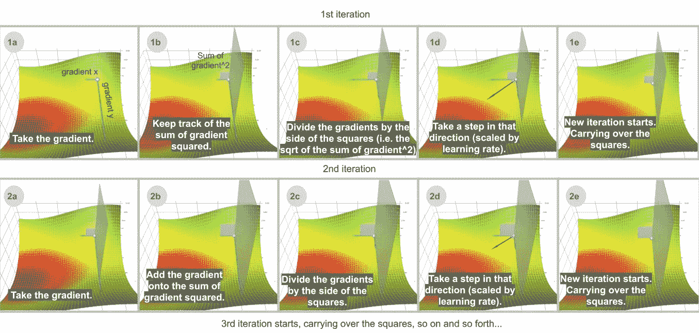
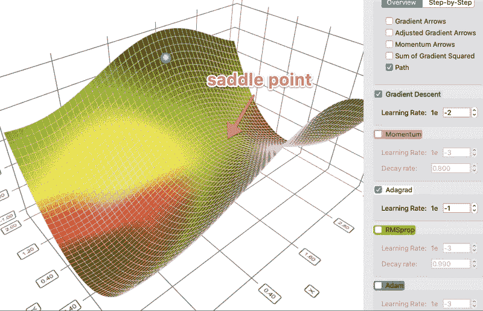
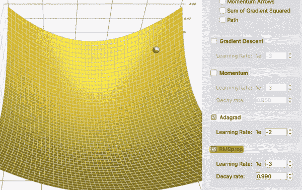
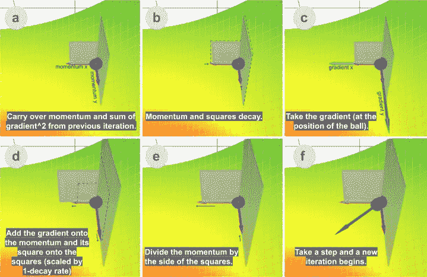

# 梯度下降法的直观解释(Momentum，AdaGrad，RMSProp，Adam)

> 原文：<https://towardsdatascience.com/a-visual-explanation-of-gradient-descent-methods-momentum-adagrad-rmsprop-adam-f898b102325c?source=collection_archive---------3----------------------->

表面上 5 种梯度下降方法的动画:梯度下降(青色)，动量(洋红色)，AdaGrad(白色)，RMSProp(绿色)，Adam(蓝色)。左井是全局最小值；右井是局部最小值。

有无数的资源解释梯度下降，在这篇文章中，我想直观地向你展示这些方法是如何工作的。借助[我建立的梯度下降可视化工具](https://github.com/lilipads/gradient_descent_viz)，希望我可以给你一些独特的见解，或者至少，许多 gif。

我假设基本熟悉梯度下降为什么以及如何用于机器学习(如果没有，我推荐这个由 3Blue1Brown 制作的[视频](https://www.youtube.com/watch?v=IHZwWFHWa-w))。我在这里的重点是比较和对比这些方法。如果你已经熟悉所有的方法，你可以滚动到底部观看几个有趣的“赛马”。

# **香草渐变下降**

让我们快速复习一下。在机器学习的背景下，梯度下降的目标通常是最小化机器学习问题的损失函数。一个好的算法能够快速可靠地找到最小值(也就是说，它不会陷入局部最小值、鞍点或平坦区域，而是去寻找全局最小值)。

基本的梯度下降算法遵循梯度的相反方向指向较低区域的思想。所以它迭代地在梯度的相反方向上采取步骤。对于每个参数θ，它执行以下操作:

*增量= -学习率*梯度*

*θ+=δ*

*Theta* 是您想要优化的某个参数(例如，神经网络中神经元到神经元连接的权重，线性回归中某个特征的系数等)。在一个 ML 优化设置中可能有数千个这样的*θ。 *Delta* 是算法中每次迭代后*θ*的变化量；希望随着每一次这样的改变，*θ*逐渐接近最佳值。*

梯度下降算法的分步说明。

由于人类的感知仅限于三维，在我所有的可视化中，想象我们只有两个参数(或*θs*)要优化，它们由图中的 x 和 y 维表示。表面是损失函数。我们想找到曲面最低点的(x，y)组合。这个问题对我们来说微不足道，因为我们可以看到整个表面。但是球(下降算法)没有；它一次只能走一步，探索周围的环境，类似于在黑暗中只带着手电筒行走。

普通梯度下降是普通的，因为它只是在梯度上操作。下面的方法对渐变做了一些额外的处理，这样会更快更好。

# 动力

decay_rate = 1.0 时的动量下降(无衰减)。

动量梯度下降算法(或简称动量算法)借用了物理学的思想。想象在一个无摩擦的碗中滚下一个球。而不是停在底部，它积累的动量推动它前进，球不停地来回滚动。

我们可以将动量的概念应用到我们的普通梯度下降算法中。在每一步中，除了常规渐变之外，它还增加了前一步的运动。在数学上，它通常表示为:

*delta =-learning _ rate * gradient+****previous _ delta * decay _ rate***(eq。1)

*θ+=δ*(等式。2)

我发现，如果我稍微修改一下这个等式，并跟踪梯度的(衰减)累积和，会更直观。这也将使我们稍后介绍 Adam 算法时事情变得更容易。

*梯度总和=梯度+先前梯度总和*衰减率*(等式。3)

*delta =-学习率*梯度总和*(等式。4)

*θ+=δ*(等式。5)

(我所做的是分解出-learning_rate。要看到数学上的等价性，你可以在 eq 中用-learning_rate * sum_of_gradient 代替 delta。1 获取情商。3.)

动量下降的逐步说明。在 [app](https://github.com/lilipads/gradient_descent_viz) 中观看现场动画。在这篇文章的其余部分，我在可视化中草率地使用了渐变 x 和渐变 y；现实中因为是 gradient * *descent*，所以实际上是梯度的负数。*

让我们考虑两个极端情况，以便更好地理解这个衰减率参数。如果衰减率为 0，那么它与(香草)梯度下降完全相同。如果衰减率是 1(并且假设学习率合理地小)，那么它就像我们在开始提到的无摩擦碗类比一样无休止地来回摇摆；你不会想那样的。通常，衰减率选择在 0.8-0.9 左右，这就像一个表面有一点摩擦，所以它最终会减速并停止。

具有全局最小值(左井)和局部最小值(右井)的表面上的动量(洋红色)与梯度下降(青色)

那么，动量法在哪些方面优于香草梯度下降法？在左侧的对比中，您可以看到两个优势:

1.  动量只是移动得更快(因为它积累了所有的动量)
2.  动量有机会逃离局部最小值(因为动量可能会将其推出局部最小值)。同样，正如我们将在后面看到的，它也能更好地通过高原地区。

# 阿达格拉德

不是像动量一样跟踪梯度的总和，而是 **Ada** 感受性 **Grad** ient 算法，或简称为 AdaGrad，跟踪梯度*平方*的总和，并使用它来适应不同方向的梯度。这些方程通常用张量表示。为了简化这里的语言，我将避免使用张量。对于每个维度:

*sum _ of _ gradient _ squared = previous _ sum _ of _ gradient _ squared+梯度*

*δ=-learning _ rate * gradient****/sqrt(sum _ of _ gradient _ squared)***

*θ+=δ*

阿达格拉德血统的一步一步的插图。在 [app](https://github.com/lilipads/gradient_descent_viz) 中观看现场动画。

在 ML 优化中，有些特征非常稀疏。稀疏特征的平均梯度通常很小，因此这些特征的训练速度要慢得多。解决这个问题的一个方法是为每个特征设置不同的学习速率，但是这很快就会变得混乱。

AdaGrad 使用这种思想来解决这个问题:您已经更新的特性越多，将来更新的就越少，这样就给了其他特性(例如稀疏特性)赶上来的机会。用视觉上的话来说，你更新了这个特征多少，就是说你在这个维度上移动了多少，这个概念是用梯度平方的累积和来捕捉的。请注意，在上面的逐步网格图中，如果没有重缩放调整(1b)，球将主要垂直向下移动；通过调节(1d)，它会沿对角线移动。

有鞍点地形上的阿达格拉德(白色)与梯度下降(青色)。AdaGrad 的学习率被设置为高于梯度下降的学习率，但是不管学习率如何，AdaGrad 的路径更直这一点在很大程度上保持不变。

这个特性允许 AdaGrad(以及其他类似的基于梯度平方的方法，如 RMSProp 和 Adam)更好地避开鞍点。阿达格拉德将走一条直路，而梯度下降(或相关的，动量)采取的方法是“让我先滑下陡坡，然后*也许*再担心更慢的方向”。有时，普通梯度下降可能会在两个方向的梯度都为 0 的鞍点处停止，并在那里完全满足。

# RMSProp

然而，AdaGrad 的问题是它慢得令人难以置信。这是因为*的梯度平方和*只会增长而不会收缩。RMSProp(用于**R**oot**M**ean**S**quare**Prop**agation)通过添加一个衰减因子来解决这个问题。

*sum _ of _ gradient _ squared = previous _ sum _ of _ gradient _ squared***** decay _ rate****+渐变*****(1-decay _ rate)***

*delta =-learning _ rate * gradient/sqrt(sum _ of _ gradient _ squared)*

*θ+=δ*

更准确地说，梯度平方的和实际上是*衰减的*梯度平方的和。衰变率表明只有最近的梯度才重要，而很久以前的梯度基本上被遗忘了。顺便提一下,“衰变率”这个术语有点用词不当。与我们在动量中看到的衰变率不同，除了衰变，这里的衰变率还有一个标度效应:它将整项按(1 - decay_rate)的因子按比例缩小。换句话说，如果 decay_rate 设置为 0.99，除了衰减之外，梯度平方之和将是 sqrt(1 - 0.99) = 0.1，即 AdaGrad 的 sqrt(1-0.99)= 0.1，因此对于相同的学习速率，步长大约大 10 倍。

RMSProp(绿色)vs AdaGrad(白色)。第一次运行只显示球；第二次运行还显示了由正方形表示的梯度平方和。

为了查看衰减的效果，在这个头对头的比较中，AdaGrad white)最初跟上 RMSProp (green)，正如预期的那样，调整了学习率和衰减率。但是阿达格拉德的*梯度平方和*积累得如此之快，以至于它们很快就变得巨大无比(动画中方块的大小证明了这一点)。他们付出了沉重的代价，最终阿达格拉德几乎停止移动。另一方面，由于衰减率，RMSProp 一直将方块保持在可管理的大小之下。这使得 RMSProp 比 AdaGrad 更快。

# 圣经》和《古兰经》传统中）亚当（人类第一人的名字

最后但同样重要的是，Adam(Adam 的缩写)充分利用了动量和 RMSProp 的优点。根据经验，Adam 工作得很好，因此近年来，它通常是深度学习问题的首选。

让我们来看看它是如何工作的:

*sum _ of _ gradient = previous _ sum _ of _ gradient * beta 1+gradient *(1-beta 1)*【动量】

*sum _ of _ gradient _ squared = previous _ sum _ of _ gradient _ squared * beta 2+gradient *(1-beta 2)*【rms prop】

*delta =-学习率*梯度总和/ sqrt(梯度平方总和)*

*θ+=δ*

β1 是一阶矩的衰减率，梯度和(也称为动量)，通常设置为 0.9。β2 是二阶矩的衰减率，梯度平方和，通常设置为 0.999。

亚当后裔的一步一步的插图。在 [app](https://github.com/lilipads/gradient_descent_viz) 中观看现场动画。

Adam 从动量获得速度，从 RMSProp 获得适应不同方向梯度的能力。两者的结合使其功能强大。

# 结束语

现在我们已经讨论了所有的方法，我们来看几个我们到目前为止讨论过的所有下降方法的比赛！(不可避免地会对参数进行挑选。尝到甜头的最好方法就是自己在身边玩。)

在这个地形中，有两座小山挡住了通往全局最小值的路。亚当是唯一一个能够找到全局最小值的人。无论以哪种方式调整参数，至少从这个起始位置开始，其他方法都无法达到这个位置。这意味着单独的动量或自适应梯度都不能做到这一点。这实际上是两者的结合:首先，动量使亚当超越了所有其他球停止的局部最小值；然后，梯度平方和的调整将它拉向侧面，因为这是探索较少的方向，导致它的最终胜利。

这是另一场比赛。在这种地形中，全局最小值周围有一个平坦区域(高原)。通过一些参数调整，Momentum 和 Adam(由于其动量分量)可以到达中心，而其他方法则不能。

综上所述，梯度下降是一类旨在通过遵循梯度来寻找函数上的极小点的算法。普通梯度下降只是跟随梯度(按学习率缩放)。改进梯度下降的两个常用工具是梯度之和(一阶矩)和梯度平方之和(二阶矩)。动量法使用具有衰减率的一阶矩来获得速度。AdaGrad 使用无衰减的二阶矩来处理稀疏特征。RMSProp 使用具有衰减率的二阶矩从 AdaGrad 加速。Adam 同时使用一阶矩和二阶矩，通常是最佳选择。还有其他一些梯度下降算法，如内斯特罗夫加速梯度，阿达德尔塔等。，不在本文讨论范围之内。

最后，我将留给你们这个没有衰减的动量下降。它的路径组成了一个有趣的图案。我看不出它有什么实际用途，但在这里提出来只是为了好玩。【编辑:关于没有实际用途我收回我的话。在 https://en.wikipedia.org/wiki/Lissajous_curve 阅读更多关于这条曲线的信息。]

玩玩[这个可视化工具](https://github.com/lilipads/gradient_descent_viz)，它被用来生成这篇文章中所有的可视化，看看你会发现什么！

**参考文献及相关链接:**

[1][http://www . cs . Toronto . edu/~ tij men/CSC 321/slides/lecture _ slides _ le C6 . pdf](http://www.cs.toronto.edu/~tijmen/csc321/slides/lecture_slides_lec6.pdf)

[https://ruder.io/optimizing-gradient-descent](https://ruder.io/optimizing-gradient-descent/index.html#adagrad)

[3][https://bl . ocks . org/EmilienDupont/AAF 429 be 5705 b 219 aaaf 8d 691 e 27 ca 87](https://bl.ocks.org/EmilienDupont/aaf429be5705b219aaaf8d691e27ca87)