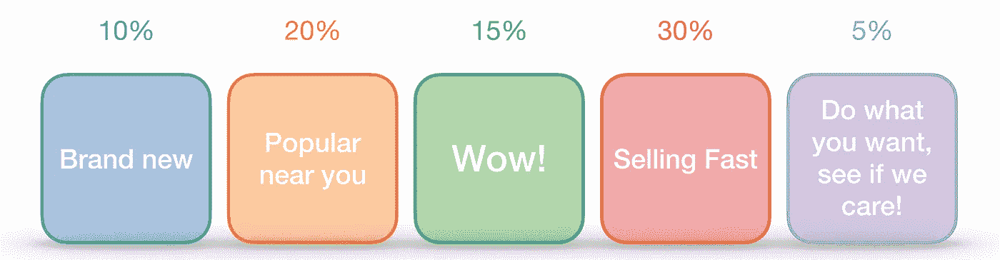
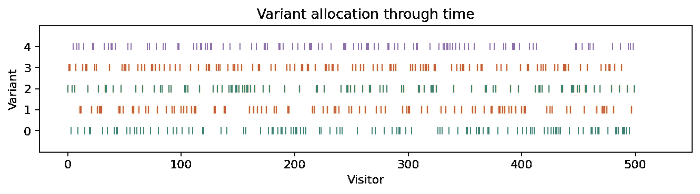
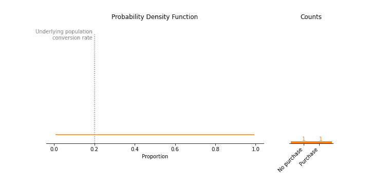
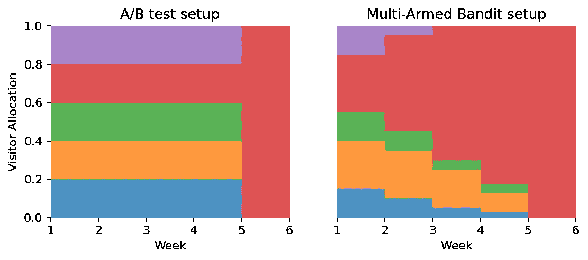
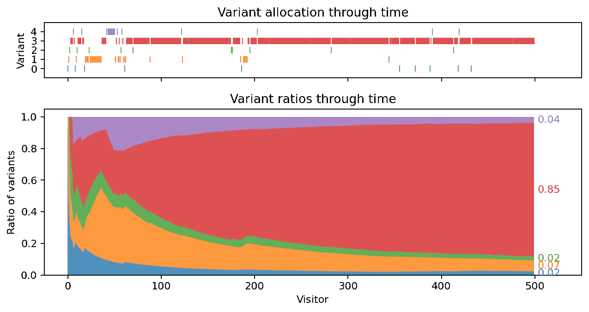
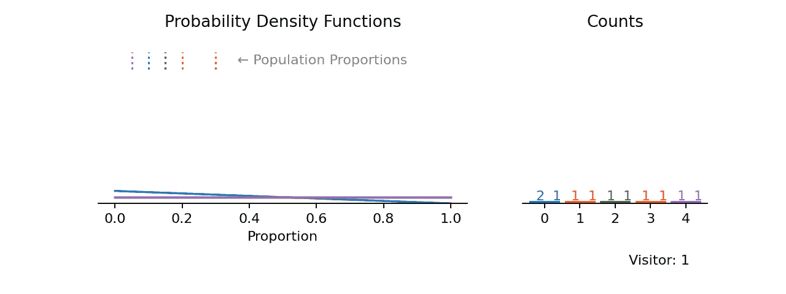
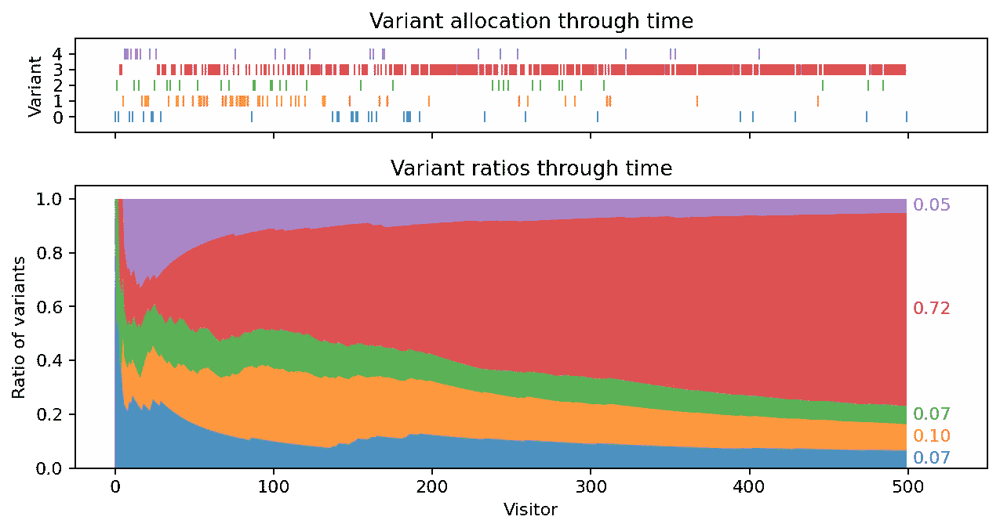
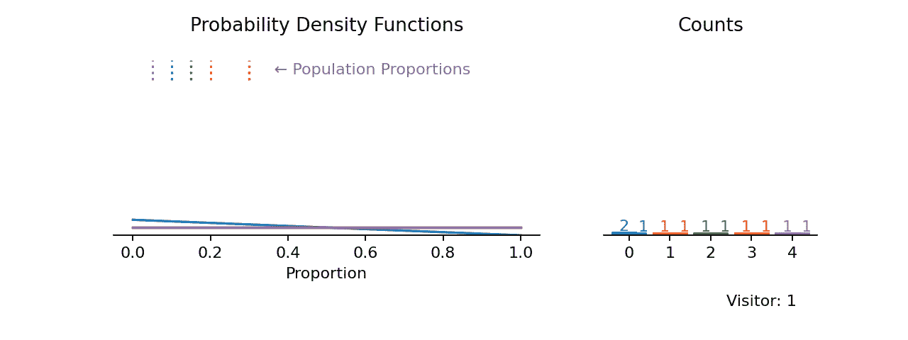
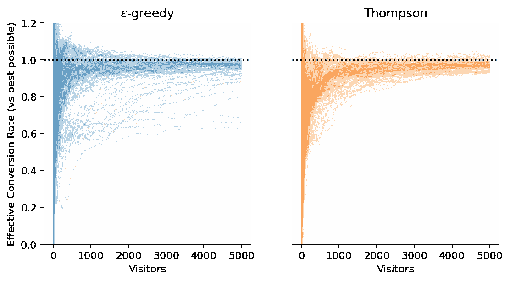

# 多臂强盗实验的可视化探索

> 原文：<https://towardsdatascience.com/a-visual-exploration-of-multi-armed-bandit-experiments-278f1f15c4f1?source=collection_archive---------39----------------------->

## 或者—“鱼与熊掌，不可兼得”

在营销数据科学部门工作有一个不变的事实:在实验和开发之间做出选择从来都不容易。当你想推出限时优惠时，尤其如此，因为你事先对不同版本的优惠效果知之甚少。

如果有时间，您可以运行一个多变量测试(A/B/C/…测试)来确定哪一个是最好的版本，但是到那时，从该知识中获益可能已经太晚了。

一个多臂土匪(原谅我改编自[这里](https://www.google.com/url?sa=i&url=https%3A%2F%2Fwww.amazon.com%2FLego-Minifigures-Series-6-Bandit%2Fdp%2FB006X73DGC&psig=AOvVaw3KYBg5lw0-FmCLQ8p1e1Kj&ust=1594117070106000&source=images&cd=vfe&ved=0CAIQjRxqFwoTCPipuv-yuOoCFQAAAAAdAAAAABAD)

有没有一种方法，我们可以创建一个报价的多个版本，但随着报价的运行，更倾向于表现最好的版本，向越来越少的人显示表现较差的版本？是啊！

进入多臂土匪(见上图)。Multi-Armed Bandit 方法的美妙之处在于，无论您有多长时间来运行测试，您都可以确保您正在做出长期的最佳决策，同时尽可能快地将表现不佳的变体的影响最小化。

我 magine 我们想运行一个在线报价，我们的报价有 5 种变化，如下所示。每一个都有一个内在转换率——看到优惠后继续购买的客户比例——但实际上我们不会提前知道这些转换率(如果我们知道，我们只会直接运行表现最好的一个！).

我们认为我们的广告有 5 种变体，每一种都有内在的，但未知的转换率。

这里设置的传统 A/B(/C/D/E)测试会在实验期间将我们网站的访问者随机分配到其中一个变量中。我们可以像这样想象这些随机分配，其中每个破折号是分配给该变量的访问者。我们可以看到，在整个测试过程中，它们都是随机分配的。

每个访问者被随机分配到一个变体

随着每个变量中访问者数量的增加，我们可以更好地了解该变量的潜在转换率(因为样本量的增加降低了总体均值估计的标准误差)。我们将在下面看到这个。

让我们暂时关注一个单一的变体。每个访问该网站的人都可以选择购买或不购买。访问的人越多，我们的样本量就越大，我们对该变量的转化率的估计就越好，这使得最终的概率密度函数在我们的估计值周围变得更窄。

随着我们对人口取样越多，我们对人口转换率的估计就越准确。

上图中，我们使用 beta 分布来估计购买和不购买的人口转换。

B 对多臂土匪的 ack。随着我们继续向访问者提供我们的服务变体，我们开始得到哪个变体表现更好的估计。我们可以用这个估计来调整我们的游客变量分配。有很多方法可以做到这一点，下面我将探讨两种。我们想要得到一个在概念上与此类似的分配:

多臂土匪和多变量测试之间分配差异的简化示例。

请注意，在多臂强盗的设置中，大部分的游客被分配到了表现最好的红色变种。这正是我们的目标。

## ε-贪婪

贪婪分配背后的想法是，最好的变体应该得到所有的访问者。等一下，如果我们开始给所有的访问者分配一个变体，我们就不再得到关于其他变体的任何信息，如果我们过早地开始给每个人分配一个次优变体会怎么样？

这就是ε(ε)的由来。一小部分时间，ε，我们仍然随机分配访客，只是为了检查我们没有出错。大多数情况下，1-ε，我们将访问者分配到当前表现最好的变体。

在每个新访客之后，计算每个变体的当前估计转化率，如果找到更好的变体，将开始分配大多数访客，直到找到一个*新的*最佳变体。

回到我们的 5 个变量，我们可以绘制我们的分配(如我们之前所做的)，以及我们的累积分配(占总数的百分比)。下面我们看到，在我们的贪婪分配发现红色变体是最好的之前，需要大约 50 个访问者，但是在提供结束时，大约 80%的访问者已经被分配到那个变体。这将给我们带来大约 28%的*总*转换率，而不是我们在整个过程中随机分配所能达到的 16%(这些是作为不同转换率的加权平均值计算的)。这将比我们的报价增加+75%的销售额！

ε-贪婪地将访问者分配给变体(ε = 5%)。分配可能会被“卡住”，就像这里前面所做的那样。

值得注意的是，贪婪分配可能会在一段时间内“卡住”分配给错误的变体，就像这里早期的橙色变体一样，直到ε随机分配为红色变体提供了足够的关于其他变体的信息。我解决这个问题的一个方法是从一个大的ε值开始，这样在开始时有更多的*探索*，随着时间的推移减少到 5%,以便*利用*更好的信息。如果你对此感兴趣，我在下面链接了我的分析。

与上面类似，当我们继续分配访问者时，我们可以通过绘制每个分配的转换率的估计来可视化分配的进展。每一个概率分布(在左边)只有在另一个访问者加入到那个变量中时才会得到改善。提醒各位访客:

*   95%的时间它们将被分配给具有当前最高样本均值(或“当前最佳猜测”)的变量。
*   5%的时间它们会被随机分配给一个变量。

前 500 个访问者的分配，以及我们对每个变体的转换率的估计随时间的分布。(每个变体有两个条形，实线表示购买的访问者，阴影表示不购买的访问者。)

需要注意的是，当使用ε-greedy 进行分配时，我们只关心样本均值，而不关心分布。我们很快会看到一个替代方案，它也明确地使用了分布范围。

鉴于贪婪地分配也有不好的一面，我们有没有办法完全避免它？而不是根据*分配*我们对转换率的估计*和*我们对每个估计的置信水平？是啊！其中一种方法，汤普森取样，是接下来要做的。

## 汤普森取样

利用前面的图来帮助解释，我们能不能想出一种抽样方法，既考虑到每个变量的概率分布的平均值*又考虑到我们在其中的不确定性*？

一种这样的方法被称为*汤普森采样。*它的工作原理是根据我们迄今为止对它们的了解来计算每个变量的β分布(这正是上面左图所示的内容)，但不是取每个分布的平均值来决定下一个分配(如在ε-greedy 中)，我们从每个分布中随机抽取*来这样做。*

这样，如果我们有很少的访问者被分配到某个变体，那么 beta 分布将会很宽，有机会从该分布中随机抽取一个高值，将会有更多的访问者被分配到该变体，随着时间的推移，我们将会增加我们的信心(并使 beta 分布变得更窄)。

类似地，如果我们有许多访问者被分配到某个变体，那么 beta 分布将会很窄，我们有信心从这个变体中得到高或低的转化率，我们知道是否过多或过少地分配访问者到这个分布中。

这样，我们完全避免了对贪婪算法的需求，贪婪算法可能会陷入次优变量！

和以前一样，我将展示汤普森采样的多臂土匪方法的分配和分布。

使用 Thompson 抽样，根据我们有信心的位置以及平均值最高的位置进行分配。

与ε-贪婪分配不同，我们对红色变体优于其他变体有更大的信心。

有趣的是，在这个模拟中，ε-greedy 在分配给正确变量的访问者数量方面优于 Thompson 采样(85%比 72%)，但是我们应该记住两个因素:

*   在更长的时间范围内，Thompson 采样往往会表现得更好，因为它不会继续在较差的变量上“浪费”5%(或ε)。
*   Thompson 采样将在多个实验中获得更一致的结果，因为它不会“卡住”分配给次优变量。

直观显示第二点的一种方法是绘制有效转换率(我们在上面介绍的变量之间的加权平均转换率)与最佳情况下的转换率(表现最佳的变量的转换率)的比值随时间的变化图。如果我们只是把每个人都分配到红色变量，那么这个值就是 1，对于随机分配，这个值就是 0.53(在这个特定的例子中)。

我们现在为 Thompson 和ε-greedy 的许多模拟绘制这个图。

5 个变量的ε贪婪和 Thompson 采样分配各 100 次模拟

我们可以看到，通过这组变量，ε-greedy 在大多数情况下确实比 Thompson 更快地趋向于高有效转换率*,但有时会陷入较低的有效转换率。另一方面，Thompson 采样分配具有更加一致的结果(所有模拟线遵循相似的路径)。如果变量具有彼此更接近的内在转换率，则ε-greedy 可能会在更高的时间比例上停留在次优变量上，而 Thompson 采样不会与此相冲突。*

上面的图表与一个叫做*后悔的概念密切相关。*这是你因为没有从一开始就把所有访客分配到最佳版本而遭受的损失，也是你的产出指标的单位(例如，“我失去了 50 个销售，因为我没有从一开始就运行红色版本”，我的*遗憾*将是 50)。上面我选择显示有效转换率，因为当你运行越来越长的测试时，这个值会缩放到 1，而不是像后悔那样继续增加。

在总结中，我们介绍了多支武装匪徒的概念，我们将优先级从*探索*(如在传统的 A/B 或多变量测试中)转移到*开发。*我们已经直观地探索了两种可能的单克隆抗体分配方法，ε-greedy 和 Thompson 采样。我们还看到，Thompson Sampling 使用我们对样本均值的最佳估计(对于我们感兴趣的度量)和我们对该估计的信心，来将访问者分配到不同的变量。通过这种方式，我们可以有信心在整个营销活动中获得良好的有效转化率。

与传统的多变量测试相比，缺点是我们失去了表现较差的变量的统计显著性，因为我们故意减少了分配给这些变量的访问者数量，从而减少了测试期间的样本量。

所以，下次你不得不开展一个限时活动，或者一个产品改变，重点是商业结果，而不是统计意义，为什么不考虑一个多臂强盗的方法呢？

 [## Paul Stubley -数据和决策科学家-在温哥华寻找下一个机会

### 我是一名经验丰富的数据科学家，在个人工作和管理团队方面都有卓有成效的工作经历

www.linkedin.com](https://www.linkedin.com/in/paul-stubley) 

如果你想联系我，你可以在 [*LinkedIn*](https://www.linkedin.com/in/paul-stubley) 上联系我。*如果你想看代码和分析(包括每个发行版背后的派生)，可以在*[*GitHub*](https://github.com/paul-stubley/portfolio/tree/master/multi_armed_bandit)*上查看。动画是用 Matplotlib 和 imagemagick 制作的。*