# 决策树的可视化指南

> 原文：<https://towardsdatascience.com/a-visual-guide-to-decision-trees-26606e456cbe?source=collection_archive---------34----------------------->

## 这是一个直观的可视化指南，介绍了用于预测美国各州投票模式的强大 ML 算法。

你有没有想过为什么某些州倾向于投票给共和党，而另一些州倾向于投票给民主党？有没有办法预测一个州在任何一年的投票结果？假设我们想要根据我们观察到的一些变量来预测一个状态是**【红色】**还是**【蓝色】**。为此，我们将使用决策树。

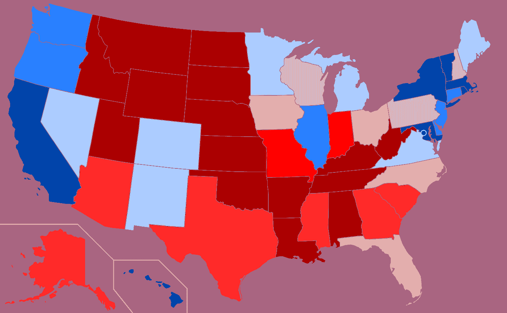

红蓝图，2016；图片来自[维基百科](https://en.wikipedia.org/wiki/Political_party_strength_in_U.S._states)

决策树是一种分类和回归监督学习模型，用于使用来自几个输入变量(x)的信息来预测目标变量(Y)的值。

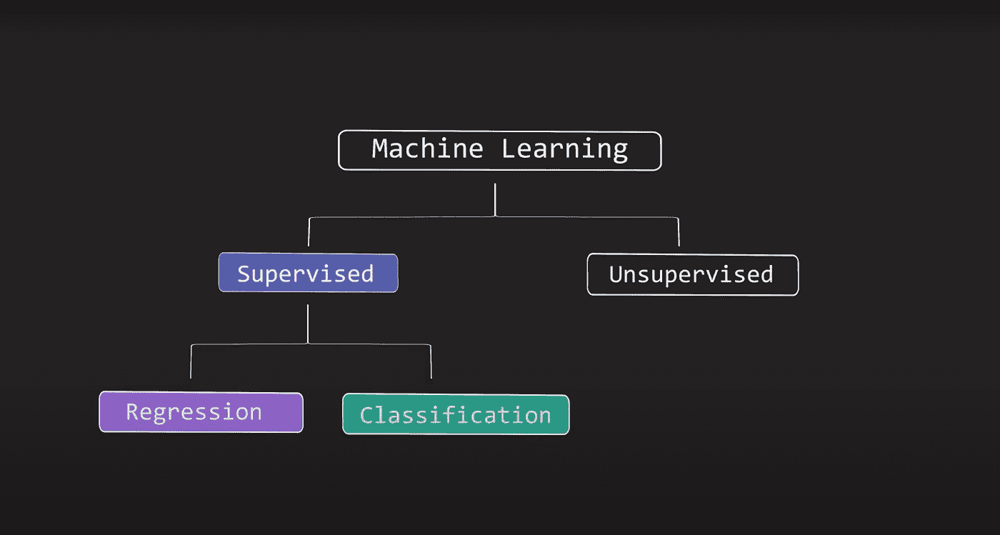

*作者图片*

顾名思义，该模型在视觉上表现为一个倒置的树状结构，随着树的增长，数据集被分成越来越小的子集。每个内部节点或决策节点都包含一个需要回答的关于特定 X 变量的简单“对或错”问题。在此基础上，树分裂成分支——一个分支代表真，另一个分支代表假。每个分支的末端都是另一个问题。这个递归过程继续进行，随着每个决策的做出，树变得越来越深，越来越宽，直到它在做出预测的叶节点处结束。

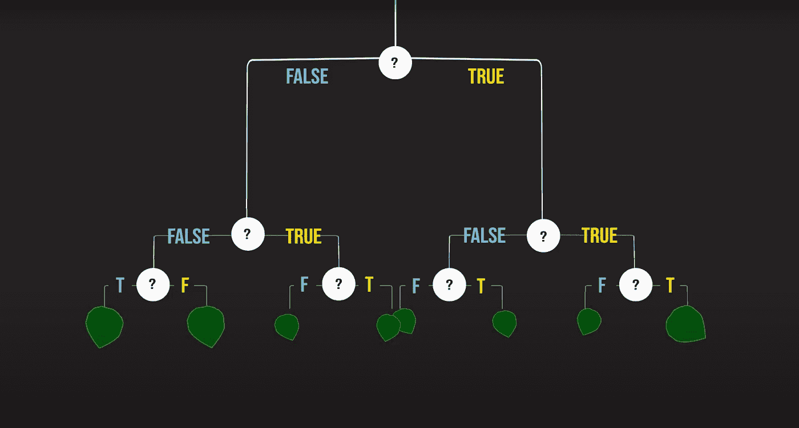

*作者图片*

让我们举一个数据集的例子。我们有 Y 变量——一个州是红色还是蓝色，我们有 3 个 X 变量:**教育*、收入**** 和**种族多样性***** 。现在，让我们尝试构建一个决策树来预测一个州的政治倾向，即基于这 3 个变量，它是红色还是蓝色。

*作者图片*

您可能想知道，当变量本质上是连续的或数字的，而不是简单的布尔值(真或假)时，决策树是如何进行拆分的。答案很简单。在引擎盖下，我们创建了多个变量来表示在不同的阈值下分割连续变量。这些划分通常是在该变量的不同十分位数或四分位数处进行的。在我们的例子中，让我们只使用每个变量的**中值**作为单个阈值。如果值小于中值，我们将把这些连续变量转换成二进制变量或布尔变量，如果值大于中值，我们将把值设置为假，将值设置为真。这些现在是布尔特征。

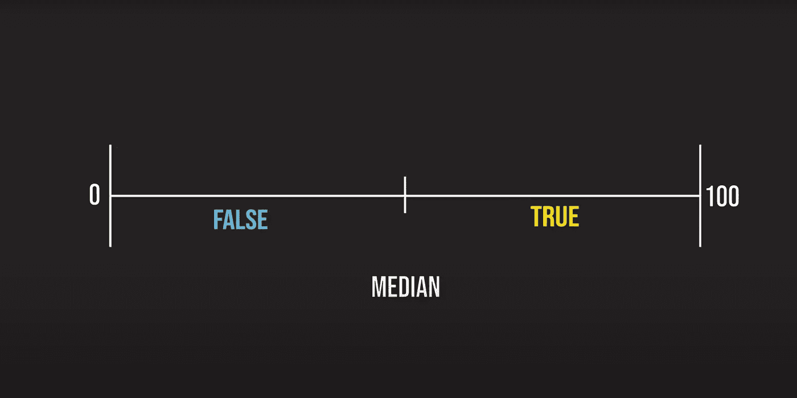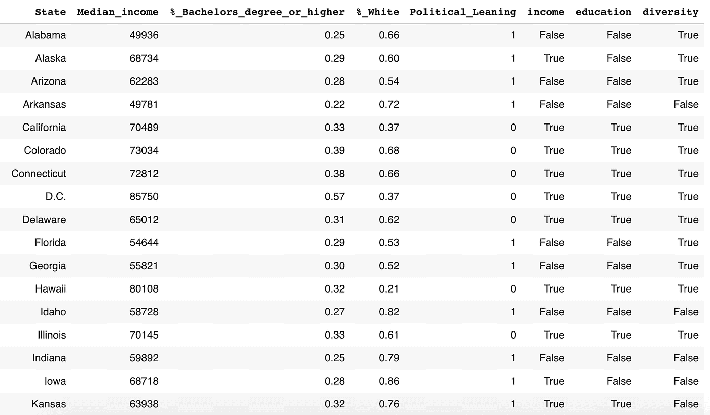

*作者提供的图片*

现在让我们开始创建决策树。为了创建第一个决策节点，我们必须选择一个变量进行分割。决策树使用一个叫做**信息增益**的标准来挑选合适的变量。信息增益是衡量我们在查看 x 后对 Y 了解多少的指标。例如，如果我们随机预测一个没有其他信息的州的政治倾向，则该州为红色的概率为。然而，如果我们知道关于那个状态的一些其他信息，我们可以更新我们关于那个概率的信念。

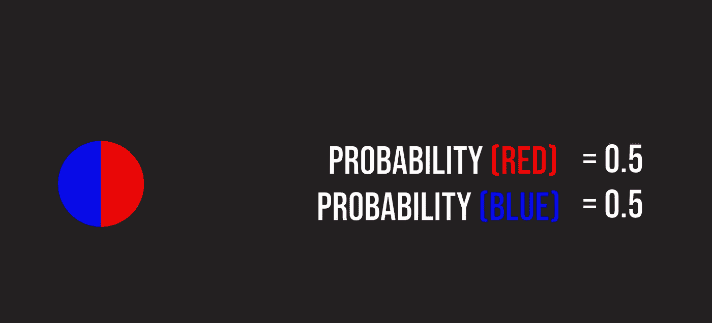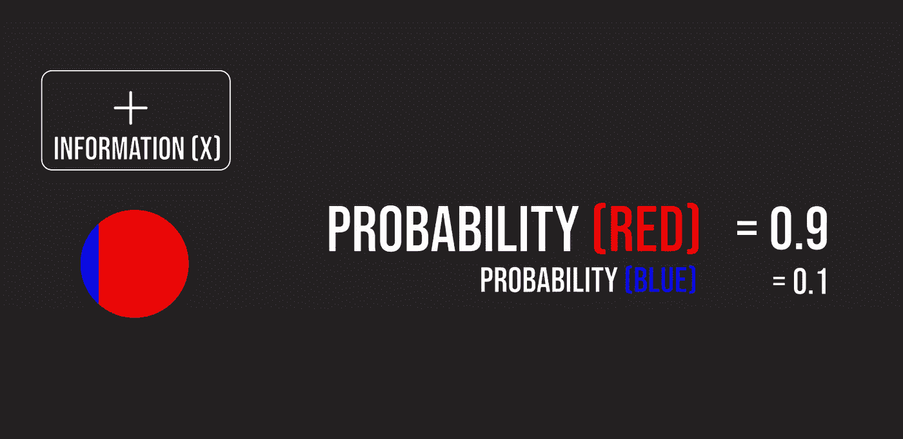

*作者图片*

让我们来看看，当我们在 3 个变量上一个接一个地分割树时，会发生什么。

当我们在教育上分裂时，我们看到真正的分支包含教育水平高于中位数的州，主要是蓝色州和一个红色州。错误的分支，或教育水平低于中间水平的州，大部分是红色州，少数是蓝色州。

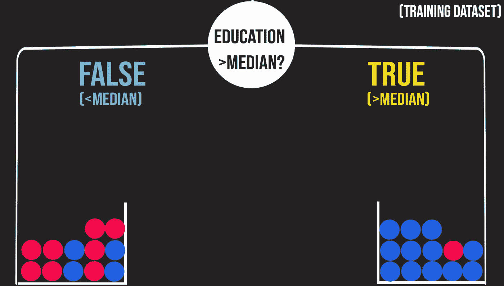

作者图片

当我们在种族多样性上分裂时，我们看到真正的分支包含了多样性高于中间值的州，大部分是蓝色的州。假分支，或者多样性低于中间值的州，有几乎相等数量的红州和蓝州。*这意味着知道一个州不是多元化的并不意味着有政治倾向。*

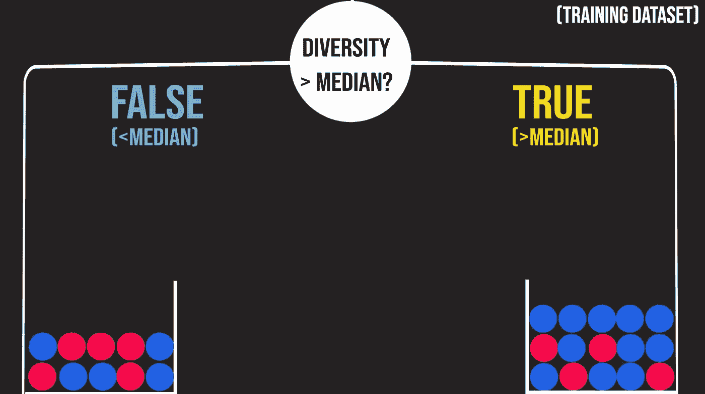

作者图片

最后，让我们看看当我们在收入上分裂时会发生什么。这里，真正的分支包含收入高于中间值的州，大部分是蓝色州。错误的分支，或者收入低于中间值的州，有几乎相等数量的红州和蓝州。这意味着知道一个州的收入低于中值也不能有意义地表明政治倾向。

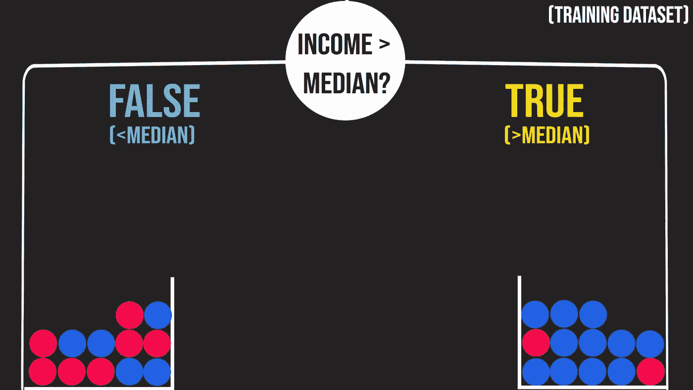

作者图片

在比较了要分割的每个可能的变量之后，决策树挑选出导致**最纯粹分支**的变量。在我们的例子中，教育上的分裂导致最纯的分支，因为真实分支只包含 1 个红色状态，而虚假分支包含的蓝色状态是红色状态的一半。从教育中获得的信息很多。种族多样性分裂将是最糟糕的选择。虽然真分支包含大部分蓝色状态，但假分支基本上是红蓝各半。知道国家缺乏多样性几乎不会给模型增加新的信息。从种族多样性中获得的信息非常少。

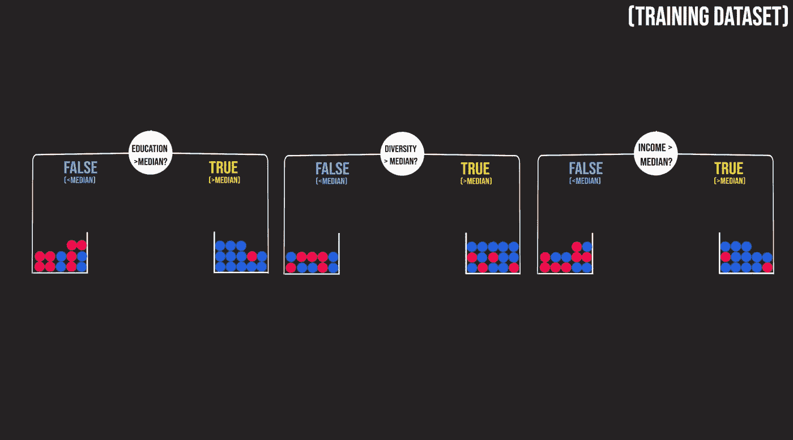

作者图片

在对教育进行了第一次拆分之后，我们现在来看看两个结果分支，并再次看看我们可以拆分哪些变量来进一步净化我们的分支。这样继续下去，直到我们到达纯分支或树的最大深度。我们最终的树在下面，它有大约 80%的准确率。考虑到我们只有 3 个变量，这太棒了。

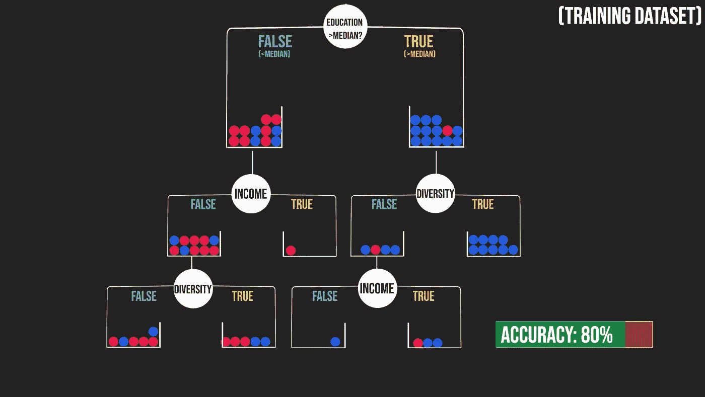

作者图片

你可能会问:*“为什么我们不简单地分割每个特征，并使树尽可能长，以得到一个完全符合数据的模型？”*

这不是一个坏主意**如果**你有一个数据集是你正在研究的人群的超级代表。然而，问题是您的模型可能会开始进行如此多的分割，以至于它会学习特定数据集的古怪之处，并且无法拟合附加数据或做出可靠的预测。这是一个如此常见的问题，它有一个名字:**过度拟合**。过度拟合是当模型容量过大时遇到的问题。因此，一般来说，我们通过限制分裂的数量来减少这些树的容量，即*限制树的深度。*

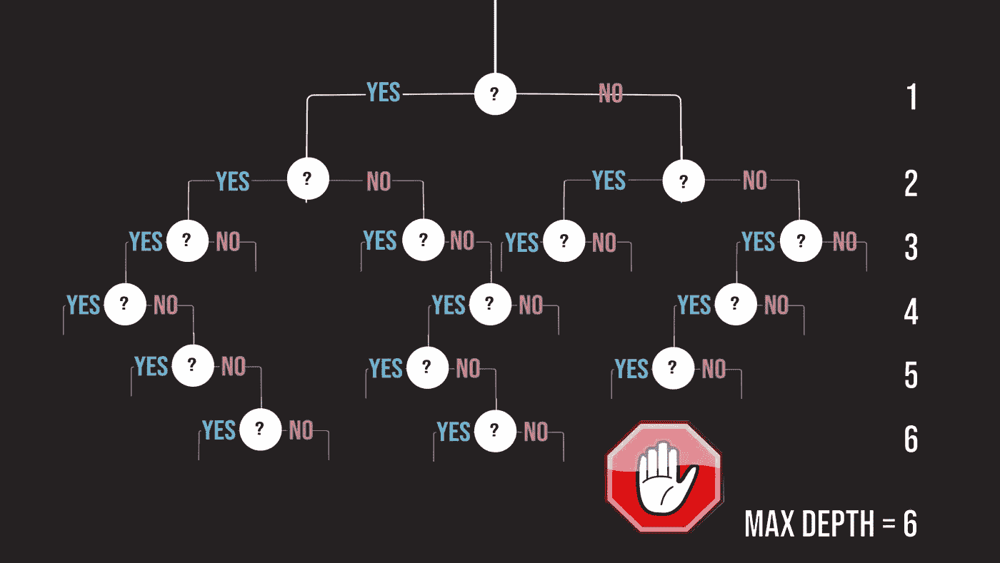

作者图片

决策树是目前世界上最常见的模型。它们简单高效的本质，以及它们组合成非常强大的模型的能力，如**随机森林**和**梯度增强树**，使它们成为许多开发人员的最爱。敬请期待未来了解这些。

## 要自己实现这个模型，请查看[这个链接](https://colab.research.google.com/drive/1Z1aiXravQxrUKJbk1ciTy0DZ_yhBopZS?usp=sharing)并使用左边的播放按钮运行每个单元格！

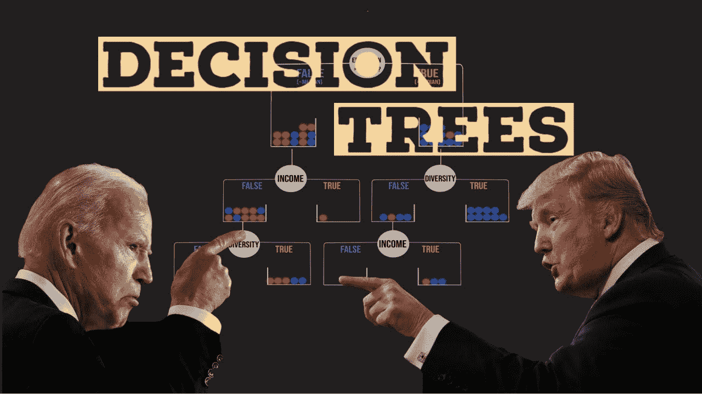

*各州家庭收入中位数([人口普查数据](https://www.census.gov/data/tables/time-series/demo/income-poverty/historical-income-households.html) )
** %本科或以上学历([2013-2017 年美国社区调查](http://ates_and_territories_by_educational_attainment))
* * * * %非白人人口([凯泽家庭基金会基于人口普查局 2008-2018 年美国社区调查](https://www.kff.org/other/state-indicator/distribution-by-raceethnicity/?currentTimeframe=0&sortModel=%7B%22colId%22:%22Location%22,%22sort%22:%22asc%22%7D))的估计