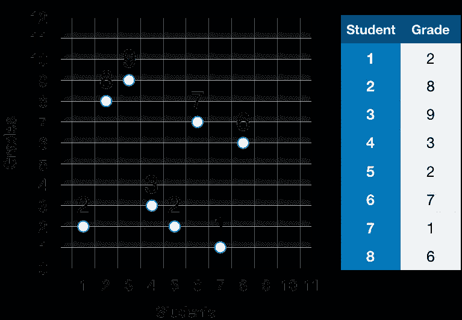
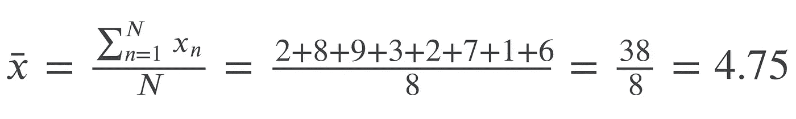
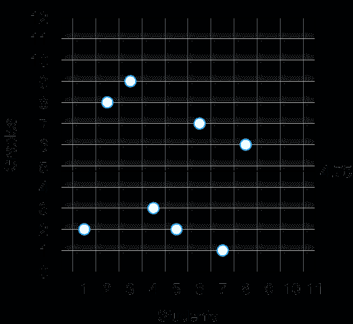
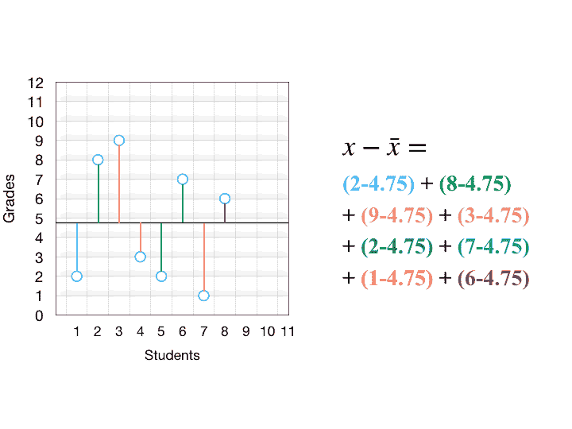
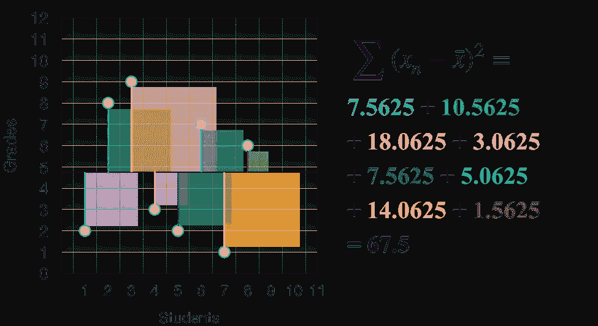
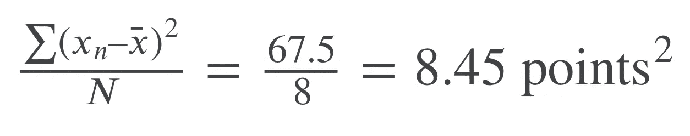
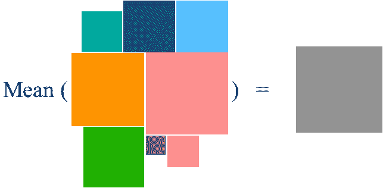
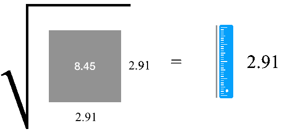
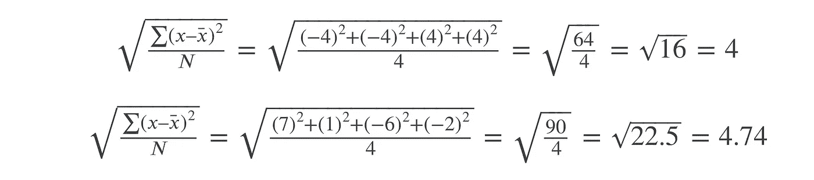

# 标准差的直观解释

> 原文：<https://towardsdatascience.com/a-visual-interpretation-of-the-standard-deviation-30f4676c291c?source=collection_archive---------4----------------------->

## 对于那些被告知“只要记住公式”或者不知道为什么要关心的人来说，这是一个可视化的指南。

统计学中最核心的概念之一是标准差的概念及其与所有其他统计量(如方差和均值)的关系。入门课程的学生被告知“只需记住公式”，但是，相信我，这不是解释一个概念的最佳方式。在这篇文章中，我将尝试对标准差提供一个直观的解释。

假设你有一个成绩列表，在这种情况下，这将是我们的现实世界的测量。我们希望将这些测量中的信息“压缩”成少数几个量，我们以后可以用它们来比较，比如说，不同年级或不同年份的成绩。由于我们有限的认知能力，我们不想一个一个地检查成绩，找出哪个班级的平均分数更高。你需要总结这些数字。这就是为什么我们有**描述性统计**。

有两种方法可以总结这些数字:量化它们的相似或不同之处。量化它们之间相似性的方法被正式称为“集中趋势的度量”。这些度量包括平均值、中间值和众数。量化它们之间差异的方法被称为“可变性测量”，包括方差和标准差。**标准差应该告诉我们一组数字相对于平均值是如何不同的**。

让我们举一个实际的例子。假设您收集了学生成绩的数据(为了简单起见，我们假设这些成绩是总体数据):

2,8,9,3,2,7,1,6

让我们首先在一个简单的散点图中绘制这些数字

现在我们有了散点图中的所有数字，计算变化的第一步是找到这些数字的中心:平均值。

视觉上，我们可以画一条线来表示平均成绩。

现在我们有了一条平均值线，下一步是计算每个点和平均值之间的距离，然后平方这个距离。请记住，我们的目标是计算这些数字相对于平均值的变化。我们可以简单地用数学或视觉来做这件事

正如你在这里看到的，“平方”实际上就是画一个正方形。这里有两点:我们不能只取所有差异的总和。由于一些差异是正的，一些是负的，求和将使负数抵消正数，最终以零结束(这没有任何意义)。为了解决这个问题，我们采用差异的平方(我将在最后解释为什么我们采用差异的平方，而不是其他任何度量，如绝对值)。

现在，我们计算这些平方差的和(或平方和):

通过计算**平方和**，我们有效地计算了这些等级的总可变性(即差异)。理解可变性与差异的关系是理解许多统计估计和推断测试的关键。67.5 的意思是，如果我们把所有这些方块堆成一个巨型方块，它的面积将等于 67.5 点 2，这里的点是指等级的单位。任何一组测量值的总可变性是一个正方形的面积。

# 方差

既然我们已经得到了总的可变性或大方块的面积，我们真正想要的是平均可变性。为了求平均值，我们只需用总面积除以平方数。

出于最实际的目的，您希望除以𝑁−1，而不是𝑁，因为您将尝试从样本而不是总体来估计该值。然而，这里我们假设我们有总人口。重点仍然是你想计算这些小方块的均方差。我们刚刚计算的是**方差**，这是平均可变性，或均方差。

# 标准偏差

为什么我们不能继续用方差作为分数可变性的指标呢？方差的唯一问题是我们不能将其与原始等级进行比较，因为方差是一个“平方”值，或者换句话说，它是一个面积而不是长度。它的单位是点数 2，这与我们的原始分数单位(点数)不同。那么我们应该怎么做才能摆脱广场呢？取平方根！

最后，**我们现在有了标准差**:方差的平方根，是 2.91 点

这是标准差的核心思想。这种基本的直觉应该更容易理解为什么在处理 z 分数、正态分布、标准误差和方差分析时使用标准差的单位是有意义的。此外，如果您只是用标准偏差公式中的拟合(预测)线 Y 替换平均值，那么您将处理基本的回归项，如[、均方误差](https://en.wikipedia.org/wiki/Mean_squared_error)(如果您没有使用平方根)、[、均方误差](https://en.wikipedia.org/wiki/Root-mean-square_deviation)(使用平方根，但现在是相对于拟合线)。此外，相关和回归公式都可以用不同量的平方和(或总变异面积)来表示。[分割平方和](https://en.wikipedia.org/wiki/Partition_of_sums_of_squares)是理解[广义线性模型](https://en.wikipedia.org/wiki/Explained_sum_of_squares)和[机器学习中的偏差-方差权衡](https://stats.stackexchange.com/questions/4284/intuitive-explanation-of-the-bias-variance-tradeoff)的关键概念。

简而言之:标准差无处不在。

# 绝对值的问题

你可能会想，为什么我们要求差的平方，而不是只取绝对值。没有什么真的阻止你使用差异的平均绝对值，而不是均方差。平均绝对值将给予所有差异相同的确切权重，而对差异求平方将给予离平均值较远的数字更大的权重。这可能是你想做的事情。然而，大多数数学理论都利用了平方差(原因超出了本文的范围，比如可微性)。

不过我还是用一个比较容易理解的反例来回答这个问题([来源](https://www.mathsisfun.com/data/standard-deviation.html))。假设我们有两组平均值相同的分数，𝑥1 和𝑥2:

通过查看这些分数，你可以很容易地发现𝑥1 比𝑥2.有更低的可变性和数字分布让我们继续计算两者的平均绝对差(知道它们的平均值是 6):

哎呀！那应该很糟糕。两组给出了完全相同的可变性值，尽管我们希望看到𝑥1 的值比𝑥2 稍低，因为数字的可变性更小。然而，如果我们使用平方差，我们会得到:

由于求差的平方，这显然给了我们所希望的:当数字越分散，标准差就越大。

*如最初出现在* [*我的博客*](http://falhazmi.com/blog/a-visual-interpretation-of-the-standard-deviation/) 。