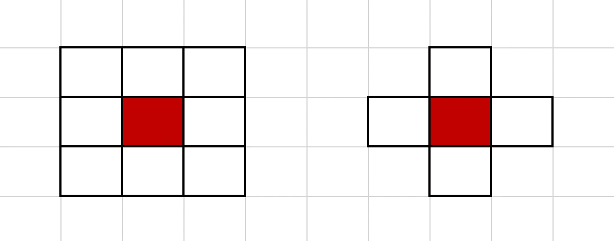
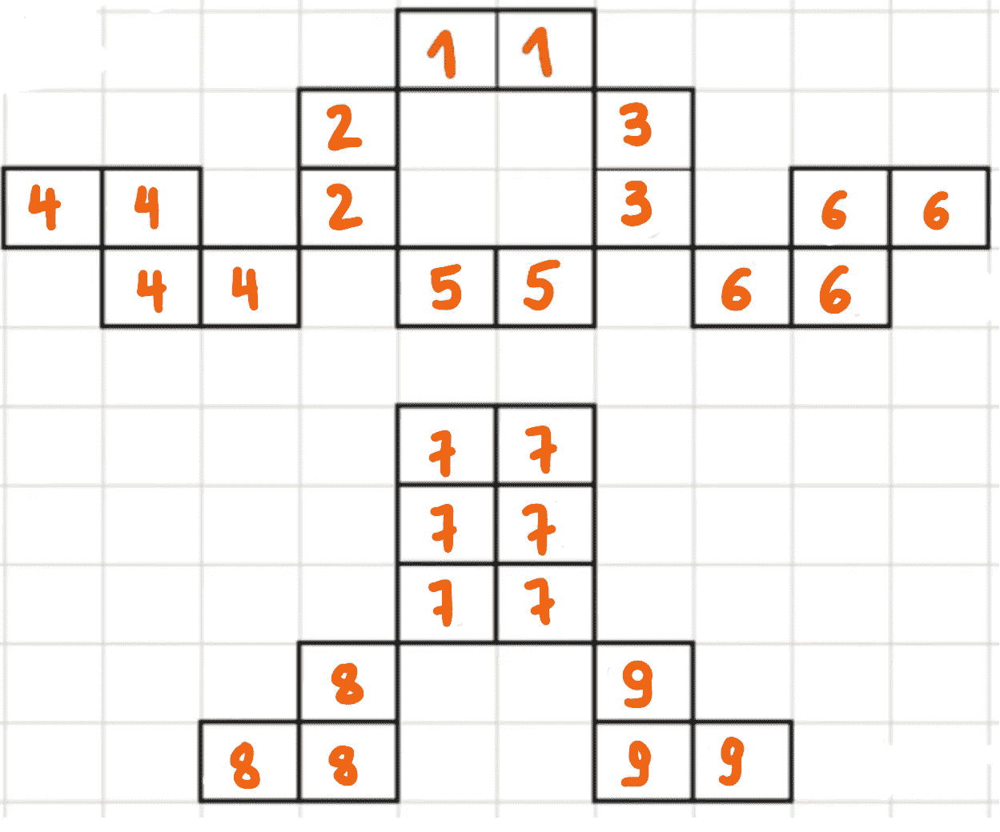
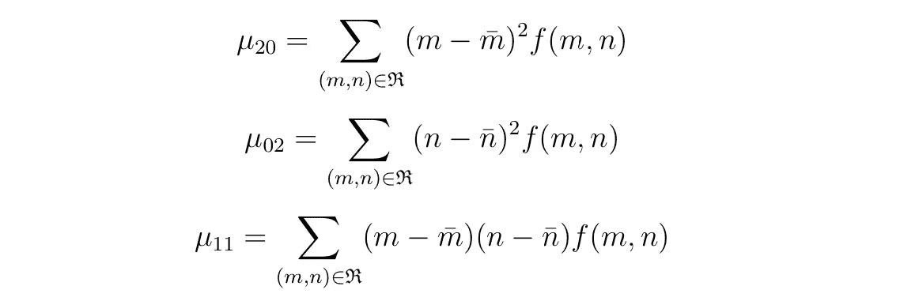
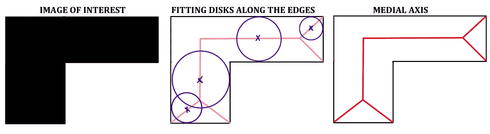

# 二值图像处理的可视化介绍(第一部分)

> 原文：<https://towardsdatascience.com/a-visual-introduction-to-binary-image-processing-part-1-d2fba9f102a4?source=collection_archive---------19----------------------->

## 通过简单直观的可视化理解图像处理的基本方面

伊恩·帕克在 [Unsplash](https://unsplash.com/s/photos/black-and-white?utm_source=unsplash&utm_medium=referral&utm_content=creditCopyText) 上拍摄的照片

# 目录:

*   什么是二进制图像？
*   **阈值处理**:从灰度图像到二值图像
*   **邻居**
*   **连通分量算法**
*   二值图像**矩**
*   **中轴**
*   **距离变换**

# 什么是二进制图像？

二进制图像是其像素只有**两个可能的亮度值**的图像。在数字上，这两个值对于黑色的**和白色的**通常是 0，或者是 1 或者是 255。

二进制图像在图像处理领域特别有用的主要原因是因为它们允许容易地将对象从背景中分离出来。分割过程允许将每个像素标记为“背景”或“对象”,并分配相应的黑白颜色。

# 阈值处理—如何生成二值图像

通过遵循信息提取过程，从灰度图像获得二值图像。**阈值处理**是这个阶段使用的主要技术。

> **阈值处理的主要目标是从背景中提取前景**

例如，这是一个二进制图像；)

第一步是绘制灰度图像强度的直方图**。选择阈值强度。低于该阈值的像素被标记为'**白色'**或 **1** 和高于该阈值的像素被标记为**黑色**或 **0** 。**

**在最好的情况下，通过**找到两个最高峰值**之间的局部最小值，将容易地识别出区分黑色和白色的阈值。但情况并非总是如此…**

**下面的 gif 显示了改变阈值**(红色箭头)**到直方图的不同位置如何改变生成的二进制图像。**

> **这是一个非常基本的表示，但我个人认为它足以描述阈值处理过程以及在正确位置设置阈值的重要性。**

# **邻居**

**在现阶段，引入邻居的概念可能是有益的。一个像素可以有 4 或 8 个邻居。我们称直接邻居为我们感兴趣的像素共享一条边的邻居。**

**这个定义听起来可能很明显，但是**在算法运行和标记像素值的方式上产生了巨大的差异**。**

****

**例如，**连通分量标记算法**可以利用 4 或 8 个邻居，产生完全不同的结果！以下示例使用了 4 个邻居。**

# **连接组件标签**

****

**作者**

****一旦我们成功地从前景中提取出背景，下一个合乎逻辑的步骤就是计算在我们的二值图像中可以找到的“物体”的数量。****

**例如，在我们左边的图像中，有 5 个对象。一个 4 岁的孩子可以回答这个问题。***电脑是怎么做到的？*****

**答案是**连通分量**标记技术。**

## **第一步:**

**用唯一的整数标记每个白色像素。我们从顶行到底行系统地对像素进行编号，沿着列增加整数值。**

**作者**

## **第二步:**

**现在，我们遍历每个像素。在每次迭代中，我们称当前像素为***【I】***。我们看一下我们的***‘I’***像素的 4 个直接邻居。如果邻居的指定整数值(在步骤 1 中)小于**‘I’，**的当前值，那么***‘I’*****将取最小邻居的整数值。例如，这就是第三行中像素‘5’和‘9’的情况。或者“17”值像素的群集可能是更好的例子。****

**这个步骤需要执行两次。 ***是的，两次。***向后传递**确保所有像素都被分配了可能的最小值。这将是连接成分标记技术的最后一步的基础。****

****

## **最后一步(简单的一步；)**

**步骤 2 的结果给出了当像素与作为其直接邻居的较小值像素共享一条边时具有相同整数值的像素。**

**每个具有唯一值的像素聚类对应于我们的二进制图像中的一个“对象”。**

**因此，最后一步只是通过增加整数值来重新标记这些对象。这个图像有 9 个对象。 ***注*** *:一个四岁的孩子可能回答不出这个问题。***

# ****二值图像时刻****

**在本节中，我们将介绍:**

*   **物体的质量**
*   **一阶矩**
*   **中心图像矩**

**既然我们已经在二进制图像中找到了对象，我们需要一种方法来表征它们。任何物体的**形状**、**伸长**、**旋转**、**位置**都可以用少量的值进行编码。这些被称为图像时刻。**

> ****二进制图像矩**提供了一种非常优雅的方式来描述二进制图像区域，其具有少量直观且极具描述性的值。**

## **感兴趣对象的质量**

**我们从定义物体的总质量开始。这相当于我们的对象中值为 1 的像素总数。**

**变量 ***m*** 和 ***n*** 对应于行和列， ***f(m，n)*** 对应于一个位置处的像素强度(在二进制中这显然将只有 0 或 1)。**

****

## **感兴趣对象的矩**

**我们可以计算单个感兴趣物体的不同阶矩。时刻的顺序将产生不同的感兴趣的信息。例如，**一阶矩**除以总质量(值为 1 的像素数)即为质心。而**二阶矩**例如是物体的转动惯量。**

**任意阶矩的一般方程如下:**

****

****阶**矩等于 ***p+q.*** 这些可以取任意值，对于一阶矩我们举例设定**

*   ****p=1** 和 **q=0** (p+q = 1+0 =一阶矩)**
*   ****或 p=0** 和 **q=1** (p+q = 0+1 =一阶矩)**

**一阶矩的结果公式示例如下:**

****

**用一阶矩除以物体的质量，就可以求出图形的质心。这给出了我们感兴趣的对象中的中间像素的位置。**

********

## **中心图像矩**

**这些特别有用，因为它们对于翻译是不变的。所有计算都是相对于感兴趣对象的质心进行的。**

> ****平移**在图像处理中，就是通过给 x 坐标和 y 坐标加上一个指定的值，在坐标空间中移动图像中的一个对象。例如，向下移动一个对象意味着给对象中每个像素的 y 坐标增加一个值。**

**当我们平移一个形状时，质心的坐标也被平移。因此，通过考虑质心来计算中心图像矩使得计算结果对于平移不变。**

****阶** **p+q** 的中心图像矩的一般方程为:**

****

**对于**二阶**的中心图像矩，存在三个 ***p+q*** 组合。由此产生的中心力矩方程如下所示:**

****

# **中轴提取**

**对象的中轴是在对象边界上有一个以上最近点的所有点的集合**。****

> **理解这一点的一个更容易和更直观的方法是查看所有接触两个或更多边界而没有越过任何边界的圆盘的中心所创建的线。**

****

**中轴对于**字符和物体识别**非常有用。我们图像中的每个感兴趣对象都有一个与其形状相关的唯一中轴。**

# **距离变换**

****距离变换**是一个通常只适用于二值图像的操作符。**变换**的结果是一个渐变颜色的图像，其形状与输入图像相同，除了“对象”区域内的点的强度被改变以显示从每个点到最近边界的**距离** **。****

> **我们本质上想要找到物体中离边界最远的点。**

**下面的视频介绍了这个距离是如何计算的。第一个“层”被涂成红色，然后这个**逐渐向内移动**到边界的距离为+1。最终的中心红色像素对应于距离边界**等距离**和距离边界最远的像素。**

# **非常感谢你的阅读！**

**如果您有任何关于如何改进的**问题**、**建议**或**想法**，请在下方留下评论！**

**如果你喜欢我的作品，你可以关注我这里的**中**T41。**

**这里我们来连线一下 **LinkedIn** [。](https://www.linkedin.com/in/alejandra-g-283595b8)**