# 深度学习中正则化的视觉直觉

> 原文：<https://towardsdatascience.com/a-visual-intuition-for-regularization-in-deep-learning-fe904987abbb?source=collection_archive---------24----------------------->

## 当我们应用正则化时，我们的模型会发生什么？

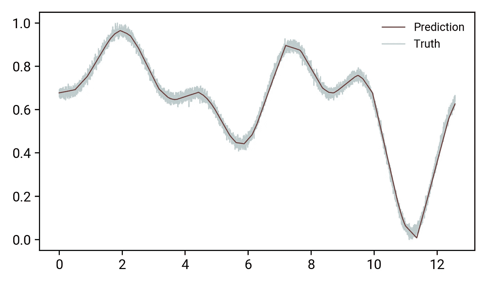

深度学习模型的优势和劣势——逼近任何函数的自由，以及逼近除了感兴趣的函数之外的任何其他函数的自由！

# 获得正则化的直觉

在机器学习中，正则化是一种用来对抗高方差的方法——换句话说，就是你的模型学习重现数据的问题，而不是关于你的问题的底层语义。以类似于人类学习的方式，这个想法是构建你的家庭作业问题来测试和构建知识，而不是简单的死记硬背:例如，学习乘法表*而不是学习如何乘*。

这种现象在通过神经网络进行学习的过程中尤其普遍——随着学习能力的提高，记忆的可能性也越来越大，这取决于我们从业者如何引导深度学习模型吸收我们的问题，而不是我们的数据。你们中的许多人在过去会遇到这些方法，并且可能会对不同的正则化方法如何影响结果有自己的直觉。对于那些不知道的人(甚至那些知道的人！)这篇文章为如何通过正则化来调整神经网络参数提供了直观的指导。将这些方面形象化是很重要的，因为很容易将许多概念视为理所当然；本文中的图表及其解释有望帮助您直观地了解随着正则化程度的提高，模型参数会发生什么变化。

在本文中，我将把 L2 和辍学作为正规化的标准形式。我不会讨论其他方法(比如收集更多的数据)可能如何改变你的模型的工作方式；那可能是另一个时间。

所有的图形和模型都是用标准的科学 Python 栈制作的:`numpy`、`matplotlib`、`scipy`、`sklearn`，神经网络模型是用 PyTorch 构建的。

# 开发复杂功能

深度学习的核心原则之一是深度神经网络作为通用函数近似的能力。你可能感兴趣的任何东西——疾病的传播、无人驾驶汽车、天文学——都可以被压缩*和*并由一个自学模型来表达，这种想法绝对令人惊叹！这是不管你感兴趣的问题实际上是否可以表达为某个解析函数 *f* 。当您通过训练来调节机器学习模型时，该模型采用参数 *θ* ，这允许该模型近似地学习 *f* *。

出于说明的目的，我们将查看一些相对简单的数据:理想情况下，一维数据足够复杂，以至于老派的曲线拟合令人痛苦，但又不至于难以抽象和理解。所以，我要创建一些任意复杂的函数，模拟周期信号，但加入一些古怪的东西。下面的函数实现了下面的等式:

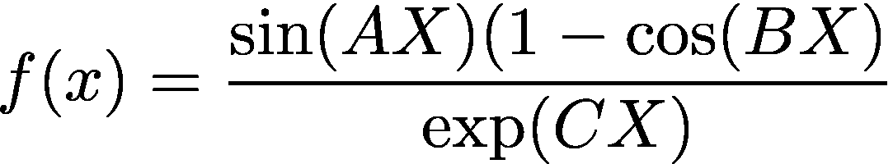

我们自己的“复杂”功能

其中 *A，B，C* 是从不同的高斯分布中采样的随机数。这些值中的每一个的效果是在非常相似的函数之间添加滞后，使得它们随机地加在一起以生成*非常*不同的 *f* 值。我们还将向数据中添加白(高斯)噪声，以模拟正在收集的数据的效果。

让我们设想一个随机生成的数据样本:在本文的其余部分，我们将通过一个小的神经网络来重现这条曲线。

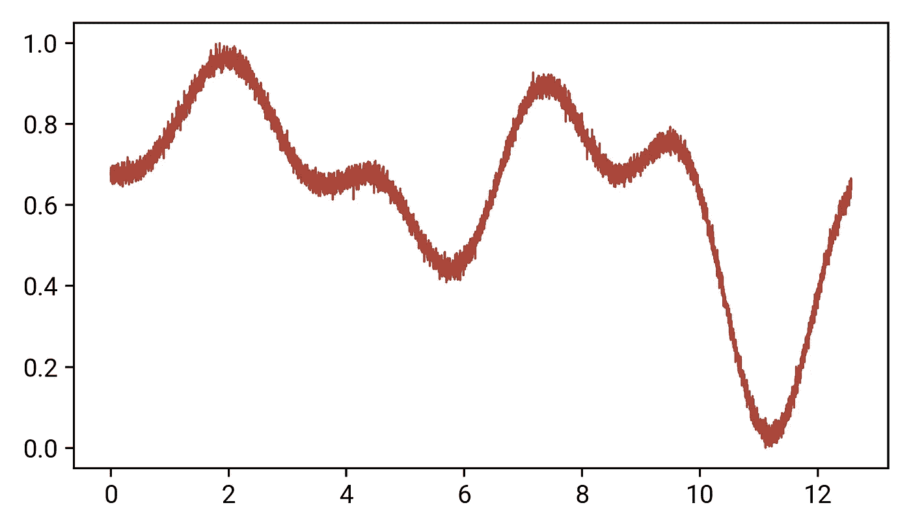

我们“复杂”功能的可视化。这对应于一个 X 和 Y 1D 数组，每个数组有 10，000 个元素长。

为了进行模型训练，我们将把它分成训练/验证集。为此，我将使用`sklearn.model_selection`中极其方便的`train_test_split`函数。让我们绘制训练集和验证集:

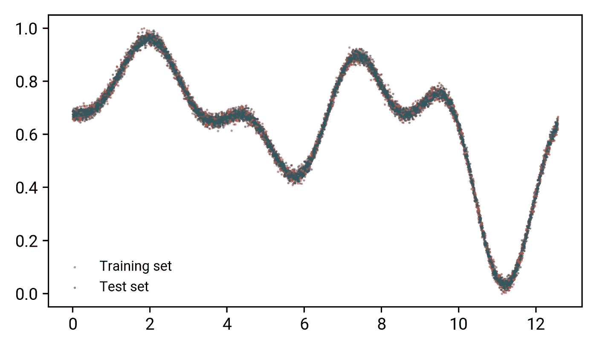

蓝色点对应测试，红色代表训练数据。

正如我们在图中看到的，两组数据在表示整体曲线方面做得相当好:如果我们去掉一个或另一个，我们可以收集到或多或少相同的数据所表示的图像。对于交叉验证来说，这是一个非常重要的方面！

# 开发我们的模型

现在我们有了一个数据集，我们需要一个相对简单的模型来尝试和重现它。为此，我们将处理一个四层神经网络，包括单个输入和输出值，有三个隐藏层，每个层有 64 个神经元宽。

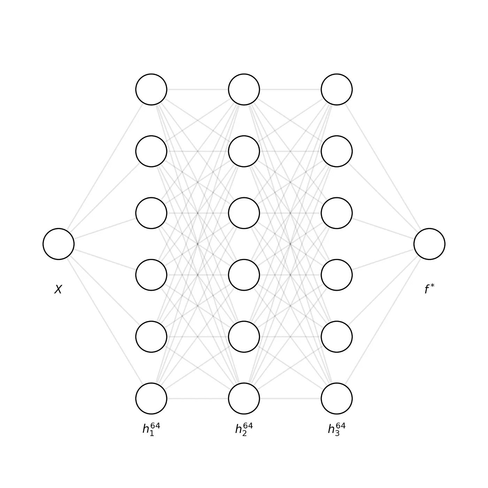

我们的神经网络模型的简化图:奇异值输入和输出，有三个隐藏层，每个 64 个神经元宽(没有画出所有的神经元！)

为了方便起见，每个隐藏层都有一个 LeakyReLU 激活，在输出上有 ReLU 激活。原则上，这些不应该有太大的关系，但在测试期间，有时模型在学习一些“复杂”的功能时有困难，特别是当使用像 tanh 和 sigmoid 这样的激活时，这很容易饱和。就本文而言，这个模型的细节并不重要:*重要的是，它是一个全连接的神经网络，具有学习逼近某个函数的能力。*

为了证明该模型有效，我使用均方误差(MSE)损失和 ADAM 优化器*执行了通常的训练/验证周期，没有任何形式的正则化*，并以这些结果结束:

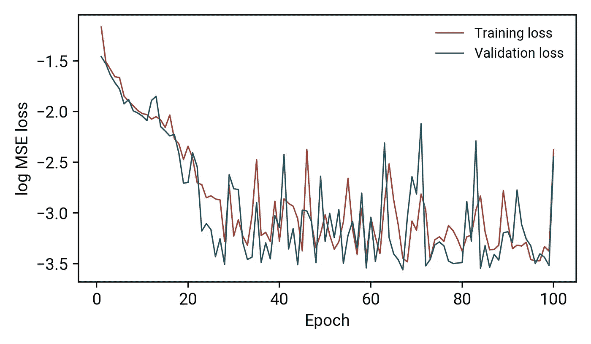

该模型的训练和验证工作良好:没有高方差或偏差的真实证据，并且两种损失在 100 个时期的过程中相对单调地减少。

当我们用这个模型来预测函数时:

我们的模型或多或少完美地得到了近似函数！

除了曲率快速变化的区域(接近 *x* =11)，模型很好地再现了我们的“复杂”函数！

现在，我可以听到你问:如果模型运行良好，为什么我要做任何正则化？为了这个演示的目的，我们的模型是否过度拟合并不重要:*我想要表达的是正则化如何影响一个模型*；在我们的例子中，它甚至可以有害地影响一个完美的工作模型。在某种意义上，你可以把这理解为一句警告:当你遇到过度拟合时，就去处理它，而不是在此之前。用 Donald Knuth 的名言来说，“过早优化是万恶之源”。

# 正则化如何影响您的参数

既然我们已经解决了所有的样板文件，我们就可以进入文章的核心部分了！我们的重点是尝试并发展一种直觉，从三个角度了解不同的正则化方法如何影响我们的简单模型:

1.  培训/验证损失会怎样？
2.  我们的模型性能会发生什么变化？
3.  实际参数会发生什么变化？

虽然前两点有些简单，但你们中的许多人可能不熟悉如何量化第三点。在这次演示中，我将使用核密度估计来测量参数值的分布/变化:对于那些熟悉 Tensorboard 的人来说，你会看到这些图；对于那些不熟悉的人，可以把这些图想象成复杂的直方图。目标是可视化我们的模型参数如何随正则化而变化，下图显示了训练前后 *θ* 分布的差异:

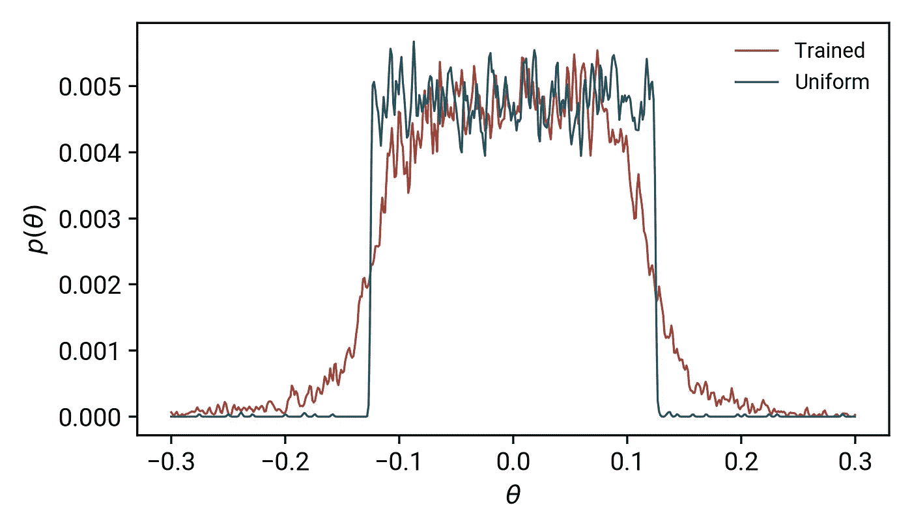

简单模型的模型参数的核密度估计值 *θ* 。

蓝色曲线被标为“均匀”，因为它代表了我们用均匀分布初始化的模型参数:你可以看到这基本上表现为一个礼帽函数，在中心具有相等的概率。这与经过训练的模型参数形成对比:在训练之后，模型需要非均匀的 *θ* 值，以便实际表达我们的函数。

## L2 正则化

最直接的正则化方法之一是所谓的 L2 正则化:L2 指的是使用参数矩阵的 L2 范数。根据线性代数，矩阵的范数由下式给出:

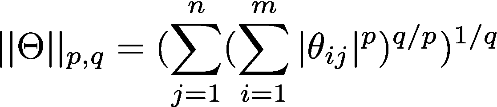

任意 Lpq 范数的一般表达式

在前神经网络机器学习中，参数更经常被表示为向量而不是矩阵/张量，这只是欧几里德范数。在深度学习中，我们更经常地处理矩阵/高维张量，欧几里德范数并没有很好地扩展(超越欧几里德几何)。L2 范数实际上是上述等式的特例，其中 *p* = *q* =2，并且被称为弗罗贝纽斯或希尔伯特-施密特范数，其推广到无限维度(即希尔伯特空间)。

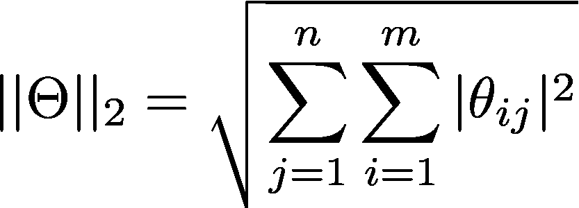

弗罗贝纽斯/希尔伯特-施密特(L2)范数。

在深度学习应用中，应用这种 L2 正则化的一般形式是在你的成本函数 *J* 的末尾附加一个“惩罚”因子:

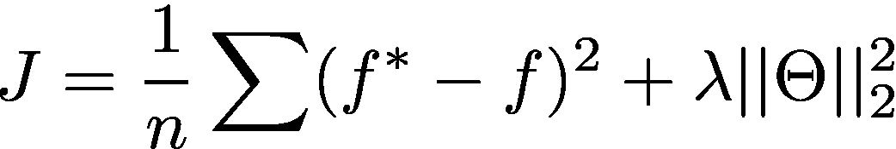

我们的成本函数:第一部分是预测值和实际值之间的均方误差差，右边的部分是我们的 L2 正则化项。

非常简单，这个等式将成本函数 J 定义为 MSE 损失，以及 L2 范数。L2 范数对成本的影响乘以这个因数λ；这在许多实施中被称为“重量衰减”超参数，通常在 0 和 1 之间。由于它控制正则化的数量，我们需要理解这对我们的模型有什么影响！

在一系列实验中，我们将重复与之前相同的训练/验证/可视化循环，但是使用λ的一系列值。第一，对我们的训练有什么影响？

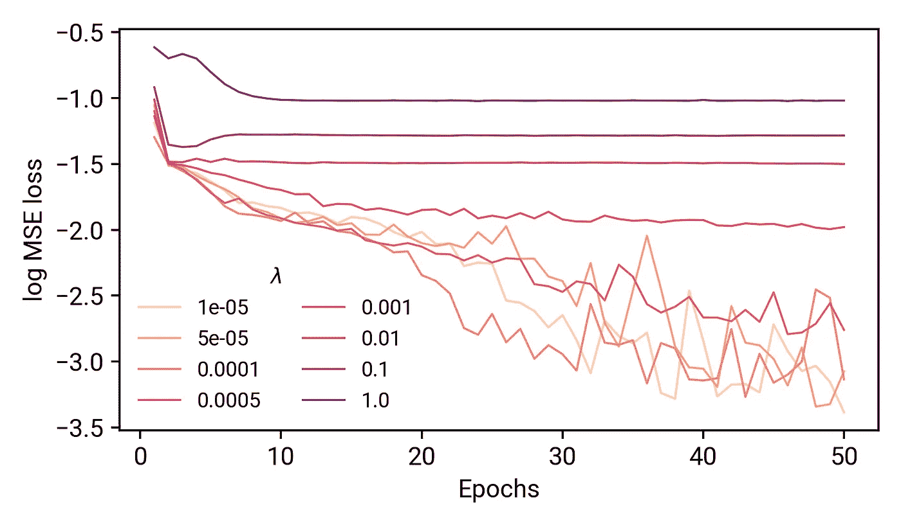

L2 正则化对模型训练的影响。

我们来分解一下上面的情节。较深的红色阴影对应于较大的λ值(尽管它不是线性贴图！)，将训练损失的痕迹显示为 MSE 损失的日志。记住，在我们的非正则化模型中，这些曲线单调递减。这里，当我们增加λ的值时，最终的训练误差显著增加，并且在早期损失的减少也不显著。当我们试图用这些模型来预测我们的功能时会发生什么？

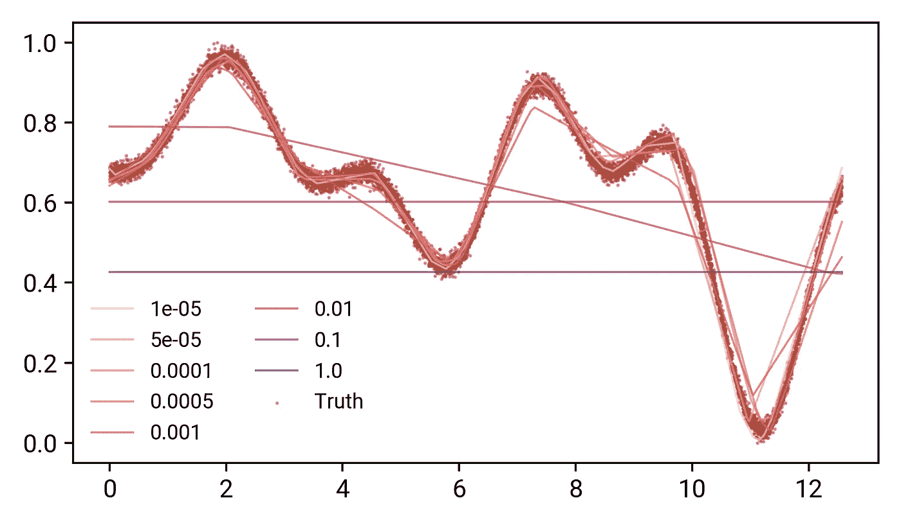

使用用指定的λ值训练的模型进行预测。

我们可以看到，在λ值很小的情况下，这个函数仍然可以表达得相当好。转折点出现在λ=0.01 附近，在这里，曲线的定性形状被复制，但不是实际的数据点。从λ>0.01 开始，*该模型只是预测整个数据集的平均值:就好像我们只是尝试进行线性回归一样。*如果我们根据我们的培训损失来解释这些，那么损失停止减少也就不足为奇了——用一条直线你只能做这么多！

参数的分布呢？

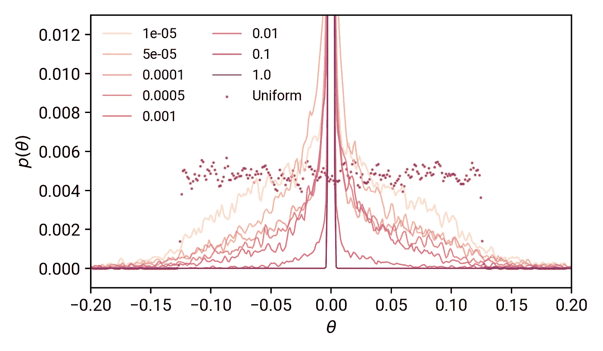

我们每个训练模型的参数分布，具有不同的λ值。分布的峰值被截断。

我们看到，当我们从低λ到高λ时，参数值的分布受到很大的阻碍。与均匀分布相比，参数值的分布越来越接近零，并且在λ=1.0 的情况下， *θ* 的分布看起来就像零处的狄拉克δ函数。由此，我们可以得出 *L2 正则化用于约束参数空间——迫使θ非常稀疏且接近于零。*

## 辍学怎么办？

另一种流行且经济有效的正规化方法是在你的模型中加入辍学者。这个想法是，随着每一个模型的通过，根据某种概率 *p* 通过将它们的权重设置为零来停用一些神经元。换句话说，我们对我们的参数应用了一个布尔掩码，每次数据经过不同的单元时都会被激活。这背后的基本原理是将模型学习分布在整个网络中，而不是特定的一个或两个层/神经元。

在我们的实验中，我们将在每个隐藏层之间包含丢失层，并将丢失概率从零调整到一。在前一个限制中，我们应该只有一个非正则化的模型，而在后一个限制中，我们应该有各自降低的学习能力*，因为每个隐藏层都被去激活*。

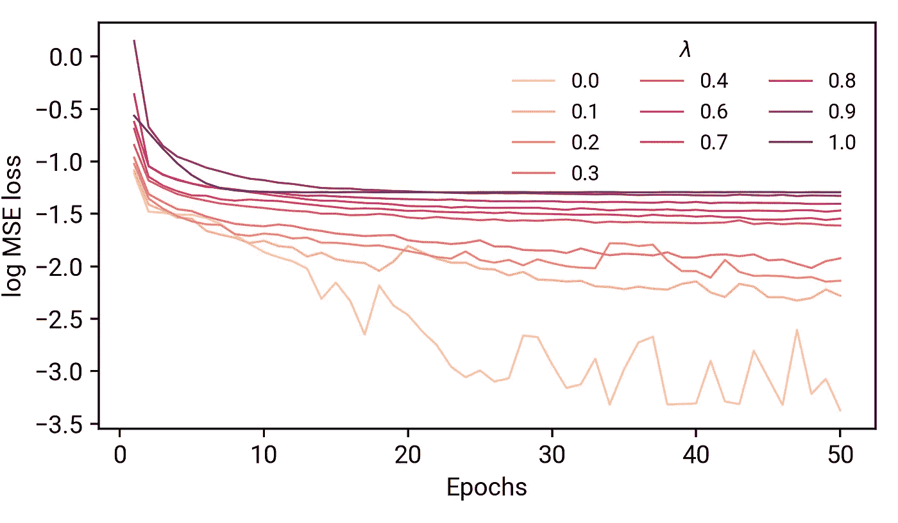

一系列退出概率的培训损失模型。

我们看到了与 L2 正则化非常相似的效果:总的来说，模型的学习能力降低了，并且随着丢失概率值的增大，最终的损失成比例地增大。

当我们试图用这些模型来预测我们的功能时:

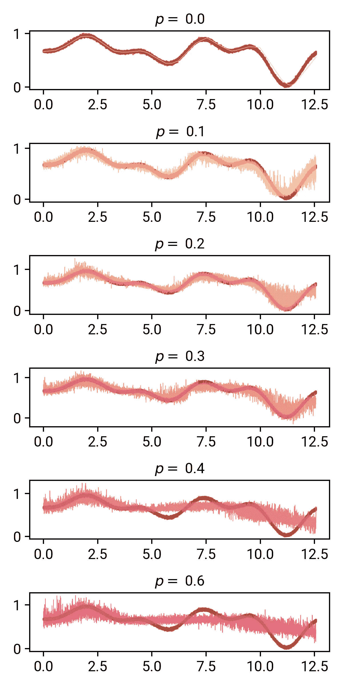

越往下看，我们辍学的可能性越大。从 *p* =0.1 开始，我们可以看到我们的模型开始对它的预测相当不稳定:最有趣的是，它似乎近似地跟踪我们的数据，包括噪声！

在 *p* =0.2 和 0.3 时，这在 *x* =11 附近更加明显——回想一下，我们的非正则化模型很难正确得到函数的这个区域。*我们看到，有遗漏的预测实际上使这个区域变得非常模糊，这几乎就像模型告诉我们它是不确定的！*(稍后会详细介绍)。

从 *p* =0.4 开始，模型的能力似乎受到了充分的限制，除了第一部分之外，它无法再现曲线的大部分。在 *p* =0.6 时，看起来预测几乎接近数据集平均值，这似乎也发生在 L2 正则化的大值上。

我们的模型参数呢？

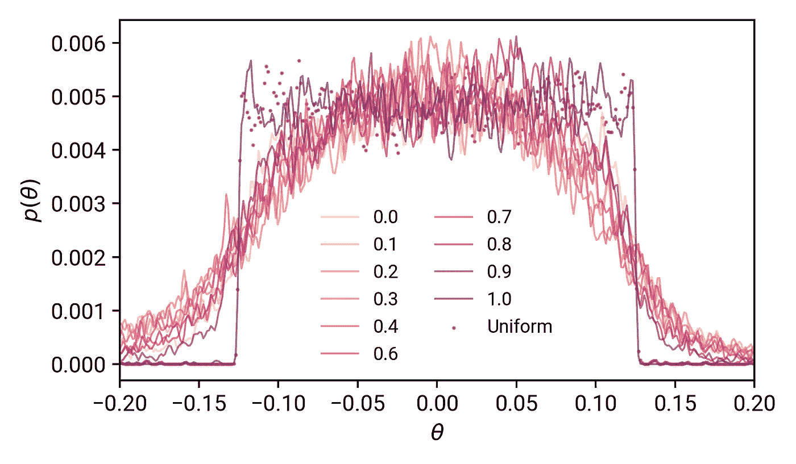

作为退出概率函数的模型参数分布。

与我们的 L2 常模结果比较:对于辍学者，我们的参数分布更广，这增加了我们模型的表达能力。除了 *p* =1.0 之外，即使有影响，退出概率的实际值也不会对参数的分布产生很大影响。在 *p* =1.0 时，我们的模型没有学到任何东西，只是类似于均匀分布。在降低的值 *p* 下，模型仍然可以设法学习，尽管速率降低。

# 带回家的信息

从我们简单的实验中，我希望你已经从我们探索的三个角度开发了这两种正则化方法如何影响神经网络模型的一些心智模型。

L2 正则化非常简单，只需调整一个超参数。当我们增加 L2 惩罚的权重时，参数空间的变化——因此模型容量——对于大值(0.01–1)下降得非常快。使用较小的值，您甚至可能看不到模型预测中的差异，尽管当您绘制出 *θ的分布时，这一点变得很明显。*

Dropouts 是一种更复杂的正则化方法，因为您现在必须处理另一层超参数复杂性( *p* 对于不同的层可以有不同的值)。尽管如此，取决于你如何看待它，这实际上可以提供模型表达的另一个维度:以模型不确定性的形式。我计划在另一篇博文中更多地介绍这一点(给我发消息鼓励我吧！).包含漏失的影响是 *θ* 的变化变得明显更大，并扩展到 *θ的不同可能值。*

在这两种方法中，我们已经看到正则化增加了最终的训练损失。这些人工形式的正则化(而不是获得更多的训练数据)的成本是，它们会降低您的模型的容量:*除非您确定您的模型需要正则化，否则您不希望包含这些内容*。然而，有了这个指南，你现在应该知道这两种形式是如何影响你的模型的了！

如果你感兴趣，你可以在 Binder 上运行一些代码。我不一定要运行`torch`模型(这会耗尽它们可怜的资源)，但是你可以用它来探索笔记本中的代码。

# 进一步阅读

[退学正规化](http://jmlr.org/papers/v15/srivastava14a.html)

[我的 github 回购与实验](https://github.com/laserkelvin/understanding-ml)

请留意更多这类文章！你可以通过推特、T2、LinkedIn 和媒体网络联系我！