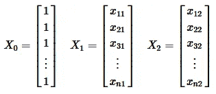
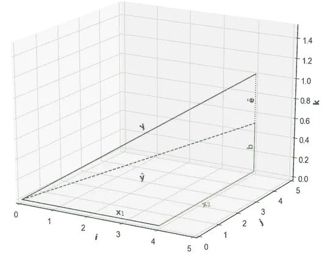
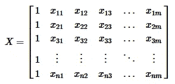
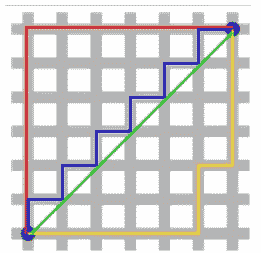

# 线性回归的直观入门

> 原文：<https://towardsdatascience.com/a-visual-primer-to-linear-regression-86adafa45e95?source=collection_archive---------33----------------------->

## 走向稳健估计

## …或者说，这意味着什么？

估计器ŷ穷尽了预测器 *x₁* 和 x₂的可用信息

# 介绍

线性回归，或最小二乘回归，是机器学习最简单的应用，也可以说是最重要的。许多人每天都在应用*方法*，却没有意识到。无论何时计算算术平均值，我们都有一个线性回归的特例——也就是说，响应变量的最佳预测值是响应本身的偏差(或平均值)!

> 最小二乘法的核心思想是最小化“误差”的平方和，即调整未知参数，使观测值和计算值之差的平方和最小化。

关于线性回归，已经有很多关于它的文章了，为什么还要再写一篇呢？我的目的不是“展示它是如何做到的”，而是说明线性回归是一个更基本概念的方便和实用的例子——**估计**——并为读者开发一种对机制的*直觉*。

# 基础知识

“线性模型”中的“线性”一词不是指模型的单个项，例如它们是否是平方的，或者有平方根，等等。许多人惊讶地发现，预测变量可以应用各种非线性变换，*和*经常被应用以创建有效的线性模型。相反，“线性”是指模型的整体行为:线性模型是预测变量的线性组合产生响应变量的预测。这意味着

是一个线性模型，其中 *x₁* 可能是(使用我们数据中的一些示例“测量”值):

# 游戏规则

我发现许多人都反对我们可以随心所欲地操纵变量。但是为什么我们首先接受预测变量的线性组合是进行预测的有效方法呢？最小二乘回归的唯一规则是残差的均值必须为零，不相关，并且是同方差的(这是一个有趣的词，表示残差的方差必须是常数)。我们可以做任何事情，而且事实上必须经常做很多事情，为了满足这三条规则！

为了推广，我们必须介绍一些线性代数。我们也可以用向量符号将我们的模型写成:

其中预测变量以列向量的形式给出:

在这种形式下，我们可以开始更好地理解本文顶部的几何表示的图像。显而易见，我们把预测看作是向量**的和，但是什么是***(***)的残差呢？是 ***X₁*** 和 ***X₂*** 不包含的所有信息的总和，并且与两者正交！这里我们有截距，或偏差项，开始发挥作用。当我们扩展到更高维度时,“截距”的概念实际上并没有太多的直观意义，因为我们无法在一个图上可视化所有变量。相反，这是我们为了“把我们的拇指放在秤上”而添加的一个偏差项，可以说，是为了使我们的预测比我们只使用预测变量时更准确。如果我们重新绘制包含偏差项的图，我们会得到如下结果:**

****

**添加偏差项以将残差的平均值设置为零**

**而且我们看到，偏置项， ***b*** ，降低了残差的大小。(注意:这并不完全准确，因为残差应该与*和 ***X₂*** 和***b****正交，但可惜我们仅限于三个空间维度)。当然，我们只查看对应于*和 ***X₂*** 的单个值的单个预测，而实际的线性模型会对*和***【x₂***的每个值进行预测。偏差项计算为将所有残差的平均值设置为零的值。******

# **推广回归方程**

**让我们进一步用回归方程来说明如何确定系数。首先，我们可以从用向量写模型转移到矩阵符号。我们先把***x₀******x₁***和 ***X₂*** 组合成一个矩阵:**

****

**然后简化我们的回归方程:**

****

**这里，由于我们已经讨论过残差是，我们添加了残差项，因为我们知道它们也必须包括在内，以获得响应变量的实际测量值。请记住，残差与所有预测变量*和*响应变量的预测正交，这意味着它们包含无法解释的偏差，这些偏差可能存在于我们没有观测到的其他预测变量中。**

****

**我们不去研究解的推导，但是如果我们求解方程的值*，我们得到:***

******

***如果你需要一些可视化矩阵乘法的帮助，我们有:***

******

# ***平均值是特殊的***

> ***在最简单的情况下，……即位置参数的估计，……这当然是通过样本均值来实现的。***

***现在，让我们考虑一个线性回归的特例，其中我们只有*——也就是说，我们只有一个单位列向量。这将先前的矩阵乘法减少到:****

******

***代入回归方程，我们得到:***

******

***希望你认识到这一点！它说的是，只有一个响应变量的线性模型的最佳预测值是响应变量本身的平均值！***

******

***为什么这很重要？这表明最小二乘回归所需的假设 ***也适用于平均值的计算。这些是:******

*   **残差具有均值为零的高斯分布*。*正如我们在上文中了解到的，当我们计算偏差项时，回归行为本身满足了这一点。**
*   **残差在所有预测值中具有恒定的方差(同方差)。**
*   **残差是独立同分布的。不存在时间序列数据中常见的相关性或自相关性。**

**因为我们只处理一个单一的响应变量，所以第二点和第三点可以看作是在谈论变量本身。如果我们的抽样很差，与其他范围相比，在特定范围的值中存在过度代表性，或者如果样本完全相关(即值相互依赖)，则平均值是变量的最佳估计值 ***而不是*** 。**

> **众所周知，如果真实分布稍微偏离假设的正态分布，样本均值可能会有灾难性的不良表现。**

**如果我们从平均值反向回到线性模型，我们也可以说最小二乘回归是 ***而不是*** 对于不满足我们规则的问题的最佳回归方法。**

# **那又怎样？**

**最小二乘回归并不总是有效，但我们可以尝试许多其他的机器学习技术，对吗？好吧，在我们把神经网络扔向一堵墙，看看有什么粘在一起之前，让我们考虑一下我们能对这个缺点做些什么。我不是统计学家，所以在我批评整个统计学领域的基础之前。)，让我引用一位在 1964 年调查过这个问题的统计学家的话:**

> **有趣的是回顾估计理论的起源，即高斯和他的最小二乘理论。高斯充分意识到，他假设基础正态分布和二次函数的主要原因是数学上的，即计算上的便利。在后来的时代，这一点经常被遗忘，部分原因是因为中心极限定理。但是，如果要说实话，中心极限定理最多能解释为什么实践中出现的很多分布都是近似正态的。重音在“大约”这个词上。**
> 
> **胡伯，P. J. 1964。位置参数的稳健估计。
> 数理统计年鉴 35(1):73–101。[https://doi.org/10.1214/aoms/1177703732](https://doi.org/10.1214/aoms/1177703732)**

**Huber 被认为是 ***稳健估计*** 研究领域的创造者之一，并且是贯穿本文的各种引文的来源。他的目标是创建最小二乘估计的替代估计，能够更好地处理异常值或其他偏离最小二乘估计规则的情况。正如他指出的，在所有其他选择中选择最小二乘法的主要动机之一是为了方便解析解。对于早于 20 世纪末的任何历史时期来说，这都是一个巨大的便利。然而现在，对于我们人类对时间的感知来说，解决回归问题的数值方法通常和解析解一样快。存在更好的评估者。**

# **后续步骤**

> **人们很自然会问，是否可以通过最小化另一个误差函数而不是它们的平方和来获得更高的鲁棒性。**

**让我们把估计量的概念简化为“距离的度量”。我们通常会想到欧几里德距离， *a + b + …* ，但这只是测量距离的无限方式之一。如果你在曼哈顿的城市网格上，这是一个几乎无用的测量来确定你和你试图到达的角落餐馆之间的距离。**

****

**到午餐的最短距离是多少？**

**绿线，欧几里德距离，是最短的…但也是不可能达到的。事实证明，红色、蓝色和黄色的线，也就是俗称的“出租车距离”，长度都是一样的。如果你想知道仅仅根据距离你应该如何到达某个地方，计算机不能为你计算出最短的路线。然而，这也意味着最短路线的解决方案是**健壮的**:如果发生了灾难性的错误(用 Huber 的话说),很容易找到替代路线。在下一篇文章中，我们将讨论这些替代方案，了解它们的特性，并在这样做时，扩展回归以处理比最小二乘法更复杂的情况。**

**这使我们更接近准确的**估计**的目标。**