# 什么是卷积神经网络？

> 原文：<https://towardsdatascience.com/a-visualization-of-the-basic-elements-of-a-convolutional-neural-network-75fea30cd78d?source=collection_archive---------33----------------------->

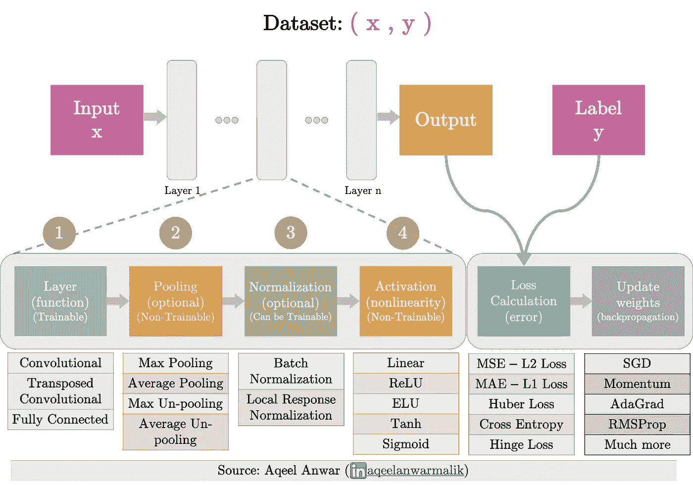

基本 CNN 的模板

## 卷积神经网络基本元素的可视化

可视化是理解丰富概念的一个很好的工具，特别是对于该领域的初学者。在本文中，我们将使用视觉辅助工具来浏览卷积神经网络的基本元素。本文首先为一个具有不同构件的基本 CNN 提供一个模板(可视化的)，然后讨论每个构件最常用的元素。

# 基本 CNN 模板:

一个基本的 CNN 由三种层组成。输入、隐藏和输出如下所示。数据通过输入层进入 CNN，并在到达输出层之前通过各种隐藏层。输出层是网络的预测。根据损失或误差，将网络的输出与实际标签进行比较。对于要学习的网络，计算该损失相对于可训练权重的偏导数，并且通过使用反向传播的各种方法之一来更新权重。

基本 CNN 的完整视觉模板可以在下面看到。

基本 CNN 的模板

# CNN 的隐藏层

网络中的隐藏层提供了转换数据的基本构件(输入层或先前隐藏层的输出)。大多数常用的隐藏层(不是全部)都遵循一个模式。它首先将一个函数应用到它的输入，然后转移到池化、规范化，最后在它可以作为输入提供给下一层之前应用激活。因此，每一层可以分解成以下 4 个子功能

1.  **层功能:**卷积或全连接层等基本变换功能。
2.  **池化:**用于改变特征图的空间大小，增加(上采样)或减少(最常见的)它。例如最大池化、平均池化和取消池化。
3.  **归一化:**该子函数将数据归一化，使其均值和单位方差为零。这有助于处理消失梯度、内部协变量移位等问题。[(更多信息)](/difference-between-local-response-normalization-and-batch-normalization-272308c034ac)。最常用的两种标准化技术是局部响应标准化和批量标准化。
4.  **激活:**应用非线性并限制输出过高或过低。

我们将逐一介绍每个子功能，解释它们最常见的例子。

> 还有更复杂的 CNN 架构，有各种其他层和相当复杂的架构。不是所有的 CNN 架构都遵循这个模板。

# 1.层功能

最常用的层函数是全连接、卷积和转置卷积(错误地称为解卷积)层。

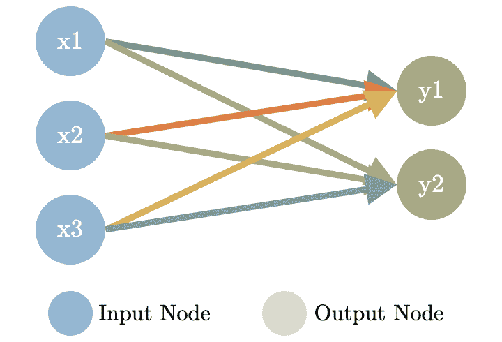

## a.完全连接的层:

这些层由输入和输出之间的线性函数组成。对于 *i* 输入节点和 *j* 输出节点，可训练权值为 wij 和 bj。左图说明了 3 个输入节点和 2 个输出节点之间的全连接层是如何工作的。

## b.卷积层:

这些图层应用于 2D(和 3D)输入要素地图。可训练权重是一个 2D(或 3D)核/过滤器，它在输入要素地图上移动，与输入要素地图的重叠区域生成点积。以下是用于定义卷积层的 3 个参数

*   **内核大小 K:** 滑动内核或过滤器的大小。
*   **步长 S:** 定义在执行点积生成输出像素之前内核滑动了多少
*   **填充 P:** 输入特征图周围插入的零的帧大小。

下面的 4 幅图直观地解释了大小为( ***i*** ) 5x5 的输入上的卷积层，其中内核大小( ***k*** )为 3x3，步长( ***s*** )和填充( ***p*** )

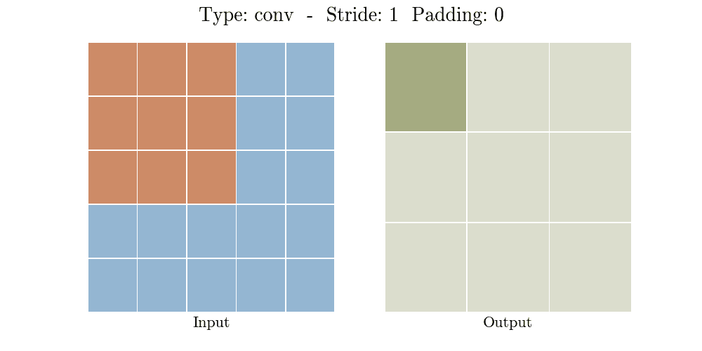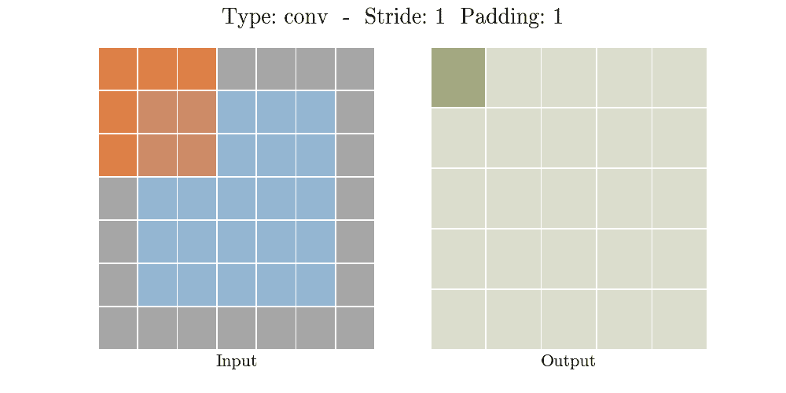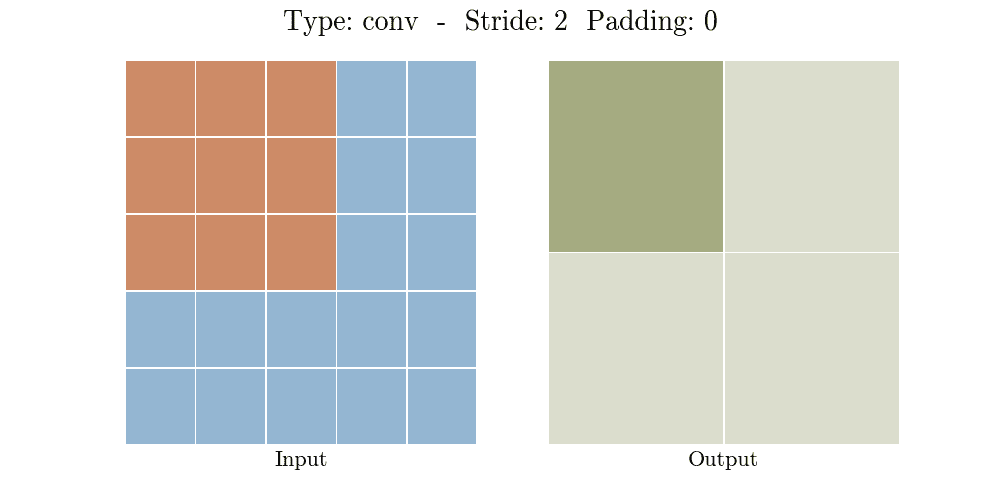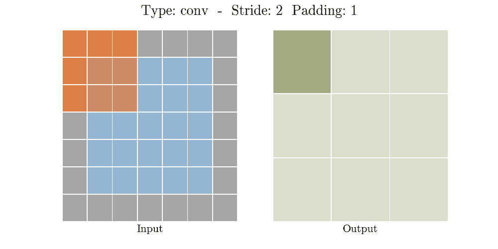

动画卷积层(来源:Aqeel Anwar)

步幅和填充与输入特征图一起控制输出特征图的大小。输出大小由下式给出

## c.转置卷积(反卷积)层:

通常用于增加输出特征图的大小(上采样)。转置卷积层背后的想法是撤消(不完全)卷积层。正如卷积层一样，它也是由步长和填充定义的。如果我们对输出应用所提供的步幅和填充，并应用所提供大小的卷积核，它将生成输入。

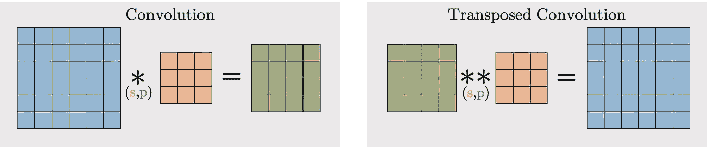

转置卷积层(来源:Aqeel Anwar)

要生成输出，需要执行两件事情

*   零插入( ***z*** ):在原始输入的行和列之间插入的零的数量
*   padding(***p’***):输入特征图周围插入的零的帧大小。

下面的 4 幅图直观地解释了在不同大小( ***i*** )的输入上的转置卷积层，对于 3x3 的内核大小( ***k*** )和不同步长( ***s*** )以及填充( ***p*** )而输出 ***(o)*** 固定为 5×5

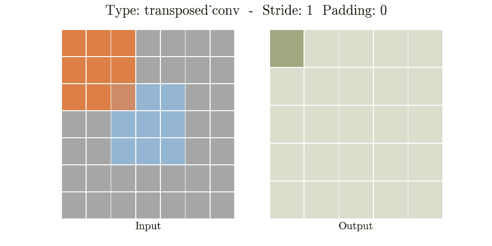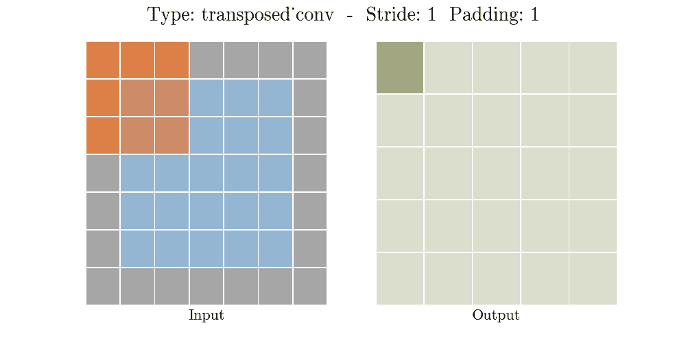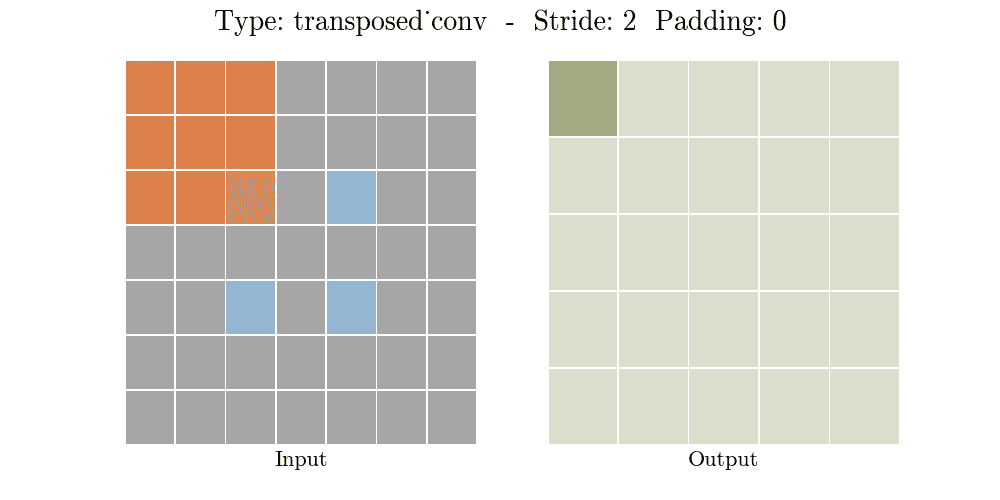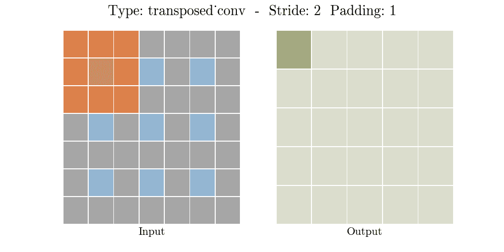

动画转置卷积层(来源:Aqeel Anwar)

关于转置卷积层的深入细节可以在下面找到

 [## 什么是转置卷积层？

### 通过动画 gif 和 python 代码解释。

towardsdatascience.com](/what-is-transposed-convolutional-layer-40e5e6e31c11) 

# 2.联营

最常用的池是最大、平均池和最大平均取消池。

## 最大/平均池:

基于选择由内核定义的感受域中的最大值/平均值，不可训练层用于**减小**输入层的空间大小。核以给定的步幅滑过输入特征图。对于每个位置，输入特征图中与核重叠的部分的最大值/平均值就是相应的输出像素。

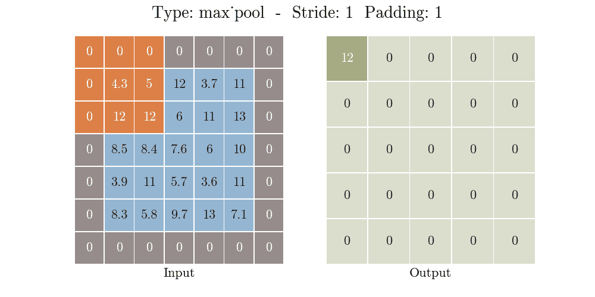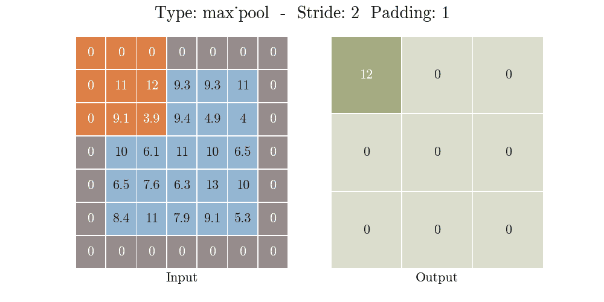

动画最大池层(来源:Aqeel Anwar)

## 取消轮询:

基于将输入像素放置在由内核定义的输出的感受域中的某个索引处，不可训练层用于**增加**输入层的空间大小。对于一个非池层，在网络的早期需要有一个相应的池层。来自相应池层的最大/平均值的索引被保存并在非池层中使用。在非池化图层中，每个输入像素被放置在输出中池化图层中出现最大值/平均值的索引处，而其他像素被设置为零

# 3.正常化

通常在激活函数之前使用归一化来限制无限制激活将输出图层值增加得过高。通常使用两种类型的标准化技术

## a.LRN 当地反应正常化:

LRN 是一个**不可训练层**，它在局部邻域内对特征图中的像素值进行平方归一化。基于邻域定义，有两种类型的 LRN:通道间和通道内，如下图所示。

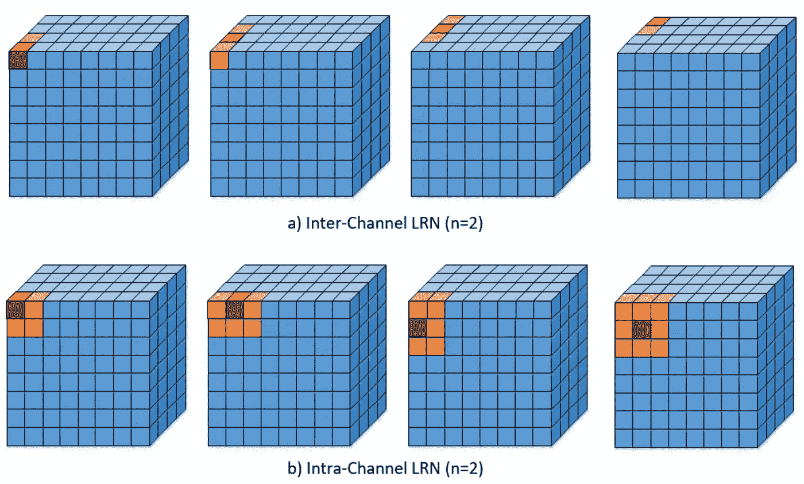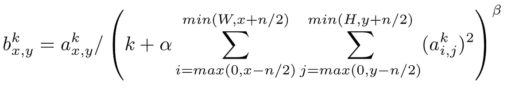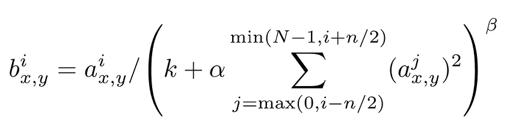

**左:**通道内 LRN … **右**:通道间 LRN

## b.批量标准化 BN:

另一方面，BN 是一种可训练的标准化数据的方法。在批量标准化中，隐藏神经元的输出在被馈送到激活函数之前以下面的方式被处理。

1.  将整批 *B* 标准化为零均值和单位方差

*   计算整个小批量产量的平均值: *u_B*
*   计算整个小批量产量的方差:s *igma_B*
*   通过减去平均值并除以方差来标准化小批量

2.引入两个可训练参数( *Gamma:* scale_variable 和 *Beta:* shift_variable)来缩放和移动标准化小批量输出

3.将该缩放和移位的标准化小批量馈送到激活功能。

下面是这两种标准化技术的总结

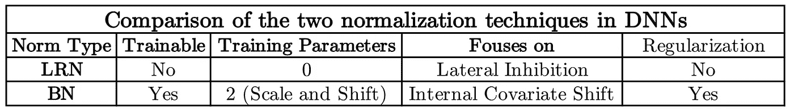

关于这些标准化技术的详细文章可以在 [**这里**](/difference-between-local-response-normalization-and-batch-normalization-272308c034ac) 找到

# 4.激活

激活函数的主要目的是引入非线性，因此 CNN 可以有效地映射输入和输出之间的非线性复映射。根据基本要求，可以使用多种激活功能。

*   **非参数/静态函数:**线性，ReLU
*   **参数函数:** ELU，双曲正切，sigmoid，Leaky ReLU
*   **有界函数:** tanh，sigmoid

下面的 gif 形象地解释了最常用的激活函数的本质。

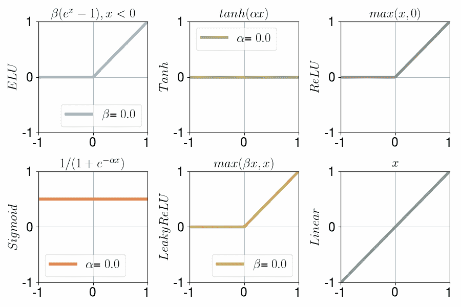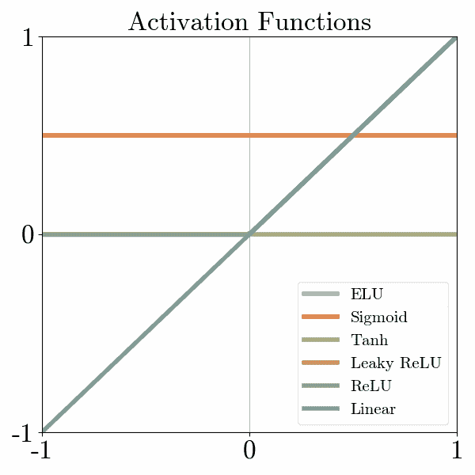

动画激活功能(来源:Aqeel Anwar)

最常用的激活函数是 ReLU。当涉及到更深的神经网络时，诸如 tanh 和 sigmoid 的有界激活函数遭受消失梯度的问题，并且通常被避免。

# 5.损失计算:

一旦定义了 CNN，就需要选择一个损失函数来量化 CNN 预测与实际标签的差距。然后，在梯度下降法中使用这种损失来训练网络变量。像激活函数一样，损失函数有多种选择。

## 回归损失函数

*   平均绝对误差:估计值和标签是实数
*   均方差:估计值和标签是实数
*   胡伯损失:估计值和标签是实数

## 分类损失函数

*   交叉熵:估计值和标签是概率(0，1)
*   铰链损耗:估计值和标签是实数

这些损失函数的细节可以在下图中看到

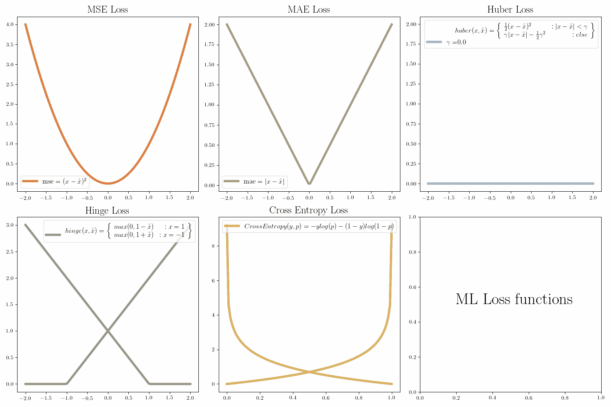

动画 ML 损失函数(来源:Aqeel Anwar)

# 6.反向传播

反向传播不是 CNN 的结构元素，而是我们通过在梯度变化(梯度下降)的相反方向上更新权重来学习潜在问题的方法。关于不同梯度下降算法的深入细节可以在[这里](https://ruder.io/optimizing-gradient-descent/index.html#gradientdescentoptimizationalgorithms)找到。

# 总结:

在这篇文章中，介绍了一个基本 CNN 的不同元素的动画可视化，这将有助于更好地理解它们的功能。

# 奖金:

可以在下面的链接中找到这个主题和机器学习中许多其他重要主题的紧凑备忘单

 [## 机器学习面试主题的备忘单

### ML 面试的视觉备忘单(www.cheatsheets.aqeel-anwar.com)

medium.com](https://medium.com/swlh/cheat-sheets-for-machine-learning-interview-topics-51c2bc2bab4f) 

如果这篇文章对你有帮助，欢迎鼓掌、分享和回复。如果你想了解更多关于机器学习和数据科学的知识，请关注我@[**Aqeel an war**](https://medium.com/u/a7cc4f201fb5?source=post_page-----75fea30cd78d--------------------------------)**或者在**[***LinkedIn***](https://www.linkedin.com/in/aqeelanwarmalik/)***上与我联系。***