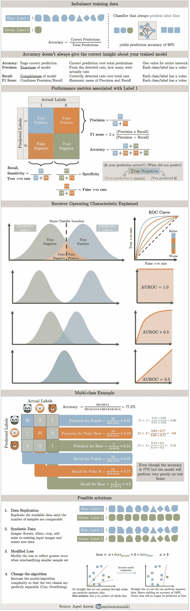

# 通过可视化备忘单浏览机器学习中的不平衡类

> 原文：<https://towardsdatascience.com/a-walk-through-imbalanced-classes-in-machine-learning-through-a-visual-cheat-sheet-974740b19094?source=collection_archive---------20----------------------->

## 什么是不平衡的训练数据，以及如何通过精确度、召回率和 f1 分数来解决它。

许多详细的文章解释了不平衡训练样本的问题以及如何应对它。在这篇文章中，我把对问题的理解总结成一张可视化的小抄。我经常发现它很有用，因为每当我不得不回到基本定义时(或者我有一个面试安排)，它就派上了用场。

下面的备忘单从为什么准确性并不总是给出与您的分类算法相关的正确见解的背景开始，然后继续定义其他有意义的性能指标。然后，备忘单提供了一个示例，展示了如何为一个三类分类问题计算这些指标。一旦通过适当的指标确定了问题，备忘单就会解释许多可能的解决方案来克服不平衡的训练数据问题。

# 奖金:

可以在下面的链接中找到这个主题和机器学习中许多其他重要主题的紧凑备忘单

 [## 机器学习面试主题的备忘单

### ML 面试的视觉备忘单(www.cheatsheets.aqeel-anwar.com)

medium.com](https://medium.com/swlh/cheat-sheets-for-machine-learning-interview-topics-51c2bc2bab4f) 

如果这篇文章对你有帮助，欢迎鼓掌、分享和回复。如果你想了解更多关于机器学习和数据科学的知识，请关注我@[**Aqeel an war**](https://medium.com/u/a7cc4f201fb5?source=post_page-----974740b19094--------------------------------)**或者在**[***LinkedIn***](https://www.linkedin.com/in/aqeelanwarmalik/)***上与我联系。***