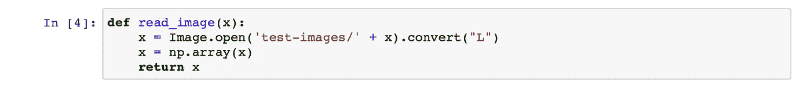
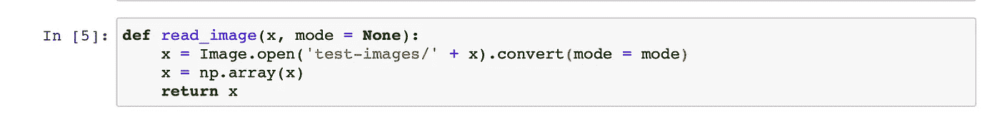
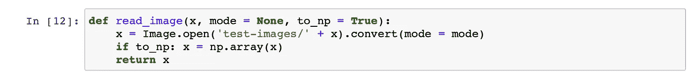
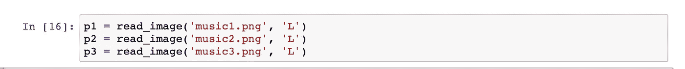
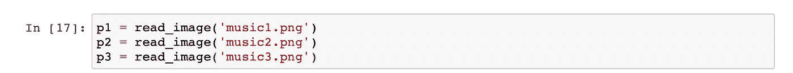
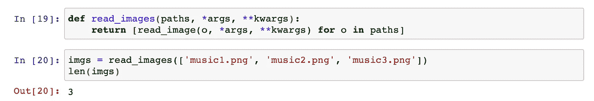
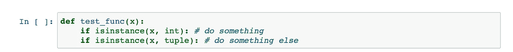

# 编写更好的函数的演练

> 原文：<https://towardsdatascience.com/a-walkthru-for-writing-better-functions-6cb37f2fa58c?source=collection_archive---------16----------------------->

## 从例子中学习如何编写更好的、可重用的函数

[来源](https://www.airfrance.us/US/en/common/travel-guide/scandinavia-and-its-stunning-viking-scenery.htm)

## 介绍

我看到很多初学者在编程时不使用函数。当我强迫他们写一个时，他们只是将一堆代码复制粘贴到一个函数中，然后称之为完成。

该函数将没有参数，没有各种数据结构的灵活性，也没有可重用性。变量将在函数内部声明。各种地方会用数字代替变量。也不会有类型检查，不会有测试来看它是否会崩溃。这样的例子不胜枚举。该功能将为他们的特定任务工作，就是这样。

在本文中，我将尝试向您介绍一个代码示例以及编写更好的函数背后的思考过程。我希望看到这个例子并尝试其中的一些想法会让您对如何为将来编写更好的函数有一个直观的感觉。

## 示例代码

最近，我在做一个计算机视觉作业，要求我们从头开始写**卷积**。我会仔细阅读这些代码。

技巧 1:当编写一个函数时，要记住的第一点是让他们做一件事，而且只做一件事。

这个技巧将帮助你保持你的函数简短。不要把所有东西都放进去。让我们来看看我们写的读取图像文件的函数。

我们从这样的事情开始:

我们读取一个图像，将其转换为灰度，将其转换为一个 numpy 数组，然后将其返回。这是一个简洁的函数，但是不够灵活。

改进 1:我们不总是想要灰度图像。因此我们包含了一个论点。这是我们的下一个提示。

技巧 2:在我们的函数中，我们使用库。我们传递给这些库的参数也为我们的函数提供了很好的参数。

这是一个非常有用的提示。特别是如果你使用 matplotlib 这样的东西，并且你不知道一个函数需要的所有参数，只需要包含一个`**kwargs`作为你的函数的参数，并愉快地将它传递给 matplotlib。

我们可能想要改变的另一件事是到 numpy 数组的转换。如果用户不需要 numpy 数组，而只需要一个 PIL 图像，那该怎么办？给他这个选择。

**提示 3:给用户很多选择，让用户在不同的方向使用你的函数输出。**

我们的功能现在非常灵活，可以在许多其他地方重用。即使不是同一个，但有微小的变化。例如，通过更改默认参数来重用它。这提醒了我，我们需要明智地对待我们的违约。在我们当前的例子中，`mode = None.`

然而，就像我之前提到的，我们只需要灰度图像。因此，我们应该将其初始化为`"L"`，而不是我们不想做的`None.`:

然而，我们也不想做:

因此我们可以创建另一个函数，如下所示:

看看我们的功能建立得多好。您可以做的另一件事是，不要手动传递图像文件的名称，而是使用代码检索它们。

## 家庭作业:

谷歌如何获得所有图像扩展？谷歌如何使用全球图书馆检索所有文件与某些扩展名。然后马上自己编码。

**提示 4:让你的代码为多种数据结构工作**

最后一个技巧是在适用的地方为不同的数据结构包含不同的行为。重点是不要破坏代码，让它为大多数事情工作。

## 结论

这就是本文的全部内容。我希望这篇文章能帮助你在将来写出更好的代码。你可以看到，与我们开始的地方相比，现在`read_image`函数几乎可以在任何地方使用。你不会从最好的函数开始。但是不断重构你的代码，你会改进很多。

在结束之前，我想指出的一点是，尽管你已经学会了所有这些技巧，但不要过度使用。保持你的功能简约但超级有用。

~快乐学习