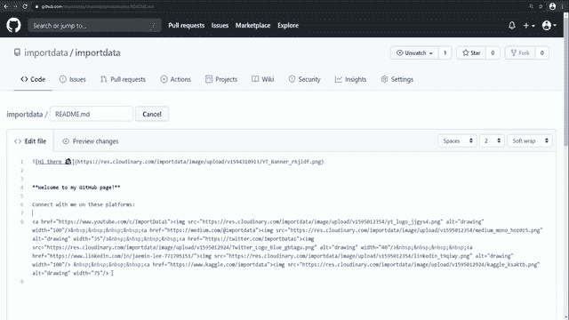

# 在 GitHub Profile 上扩展您的网络的方法

> 原文：<https://towardsdatascience.com/a-way-to-extend-your-network-on-github-profile-44ff68ce8726?source=collection_archive---------37----------------------->

## 简单解释一下如何在 GitHub 上链接你的社交媒体页面


[产品学院](https://unsplash.com/@productschool?utm_source=medium&utm_medium=referral)在 [Unsplash](https://unsplash.com?utm_source=medium&utm_medium=referral) 上的照片

# 介绍

建立你的关系网和分享你的作品可能是让你的名字出现在社区的最好方式。

你们中的一些人可能已经知道，GitHub 最近增加了一个隐藏的功能，可以让你自定义你的 GitHub 个人资料页面。下面是如何解锁隐藏功能的教程。

[](/unlocking-githubs-hidden-feature-in-3-minutes-2c21c8e47a20) [## 3 分钟解锁 GitHub 的隐藏功能

### 关于如何定制 GitHub 个人资料页面的简单说明

towardsdatascience.com](/unlocking-githubs-hidden-feature-in-3-minutes-2c21c8e47a20) 

GitHub 个人资料页面是 GitHub 的门面，你想让它尽可能吸引人。我个人认为，你应该尽可能简单地提供尽可能多的信息——提供你的项目、网站或社交媒体的链接。通过这样做，你可以很容易地与查看你的 GitHub 的人分享你的作品，你也有机会与他们联系。

在这篇文章中，我想演示如何简单地将你的社交媒体页面与 GitHub 上的标志链接起来。



# 社交媒体品牌指南

首先，你需要了解并遵循品牌指南，以便使用他们的标志。下面是每个品牌的指导方针，我将使用这些标志。

**YouTube**

[](https://www.youtube.com/about/brand-resources/#logos-icons-colors) [## 品牌资源

### YouTube 的使命是给每个人一个声音，向他们展示这个世界。了解我们的品牌、社区、职业和…

www.youtube.com](https://www.youtube.com/about/brand-resources/#logos-icons-colors) 

**中等**

[](https://medium.design/logos-and-brand-guidelines-f1a01a733592) [## 徽标和品牌指南

中等设计](https://medium.design/logos-and-brand-guidelines-f1a01a733592) 

**推特**

[](https://about.twitter.com/en_us/company/brand-resources.html) [## Twitter 品牌资源

### 从推文处理到徽标和社交图标，我们的模板和工具将帮助您使用 Twitter 内容和我们的…

about.twitter.com](https://about.twitter.com/en_us/company/brand-resources.html) 

**领英**

[](https://brand.linkedin.com/downloads) [## LinkedIn 品牌指南|下载

### 为了确保我们的标志清晰可辨，并保持其完整性，保持其周围的区域没有其他元素…

brand.linkedin.com](https://brand.linkedin.com/downloads) 

**卡格尔**

 [## Kaggle 品牌指南

### 关于如何以及何时利用 Kaggle 品牌的指南

www.kaggle.com](https://www.kaggle.com/brand-guidelines) 

# 下载和上传徽标

一旦你理解了他们的指导方针，你就想下载徽标，并把它们上传到任何可以获得图像 URL 的平台上。我将使用 [Cloudinary](https://cloudinary.com/) 来上传它们并获取 URL。你也可以使用 Google Drive 或 Dropbox。

# 使用 HTML 代码将徽标与您的社交媒体链接结合起来

一旦你解锁了 GitHub 的隐藏特性并初始化了 README 文件，你就可以用 HTML 来编辑它了。

使用 HTML 代码，我们可以将您的社交媒体链接和您上传的徽标结合起来。

## 访问您的社交媒体链接的 HTML 代码

```
<a href="[https://www.youtube.com/c/ImportData1](https://www.youtube.com/c/ImportData1)">
```

## 访问社交媒体徽标的 HTML 代码

```

```

您可以通过调整**【宽度】**来改变图像尺寸

你要把上面的代码一个挨着一个地放在一起，以充分地把标志和链接结合起来。

```
<a href="[https://www.youtube.com/c/ImportData1](https://www.youtube.com/c/ImportData1)">
```

可以把**放在&nbsp；**如果您想在标志之间添加空格。

```
<a href="[https://www.youtube.com/c/ImportData1](https://www.youtube.com/c/ImportData1)">**&nbsp;&nbsp;&nbsp;&nbsp;**<a href="[https://medium.com/@importdata](https://medium.com/@importdata)">
```

就是这个！非常感谢你阅读这篇文章，希望你觉得有用！

在这些平台上与我联系:
🔗 [YouTube](https://www.youtube.com/c/ImportData1)
🔗[推特](https://twitter.com/ImportData1)
🔗 [LinkedIn](https://www.linkedin.com/in/jaemin-lee-771705151/)
🔗[GitHub](https://github.com/importdata)🔗[卡格尔](https://www.kaggle.com/importdata)