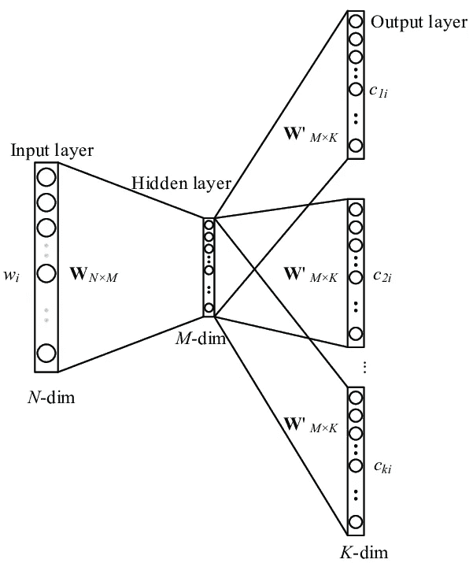
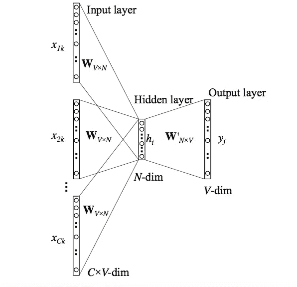
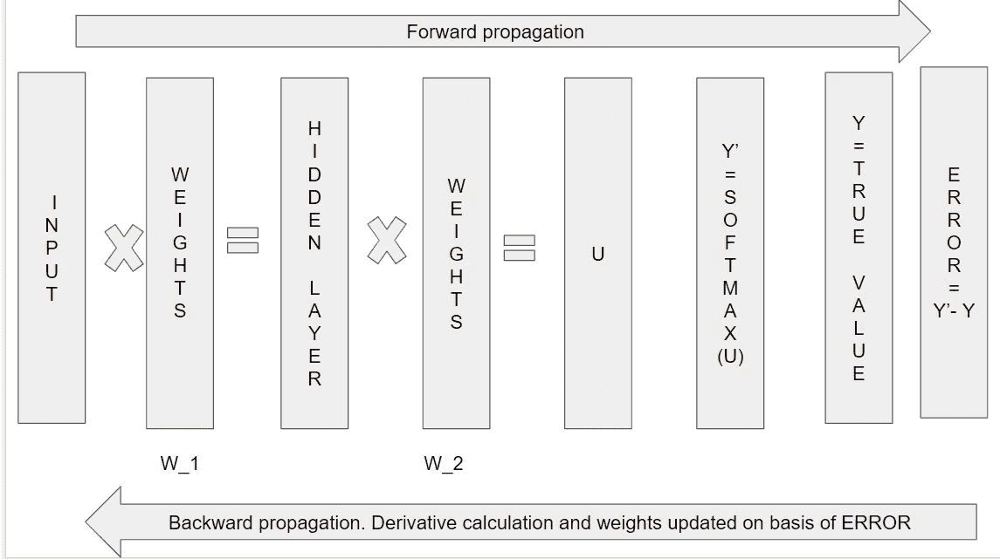
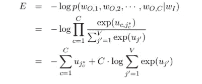
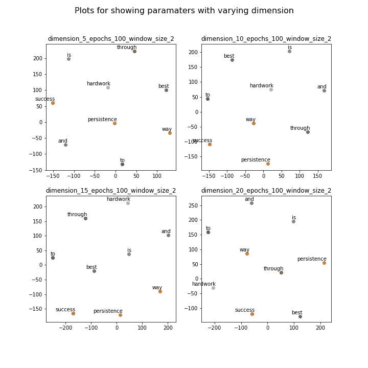
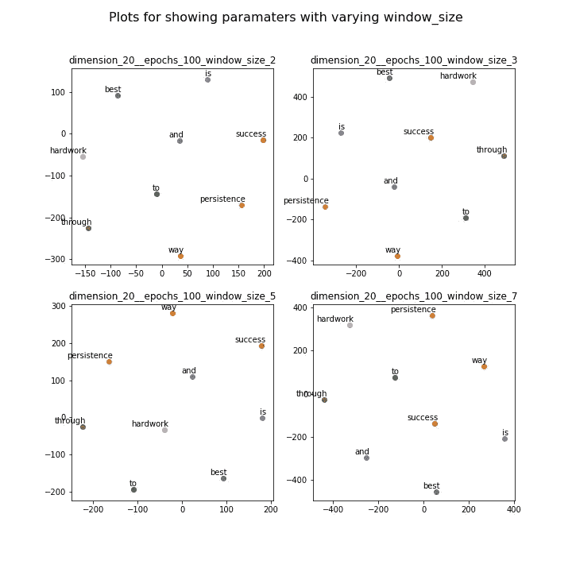
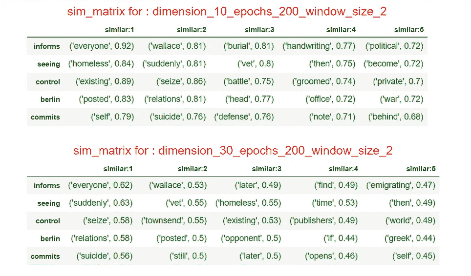
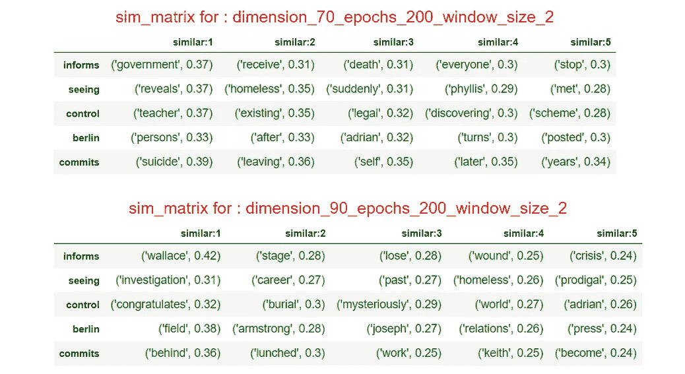
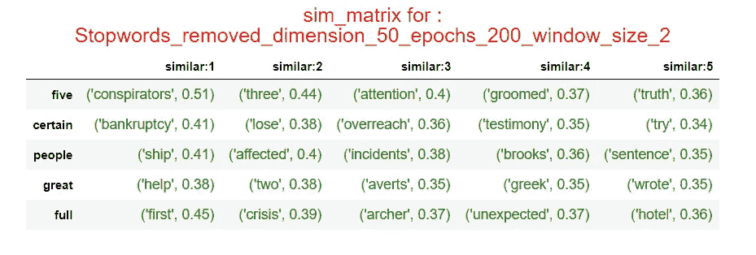
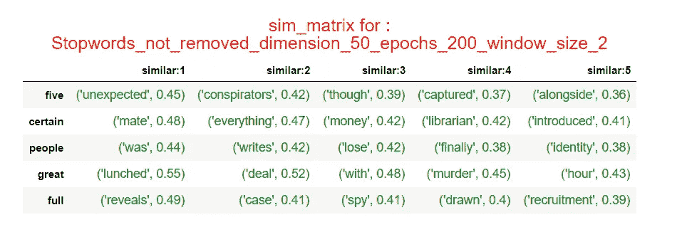

# Word2Vec 实现

> 原文：<https://towardsdatascience.com/a-word2vec-implementation-using-numpy-and-python-d256cf0e5f28?source=collection_archive---------2----------------------->

## 如何使用 numpy 和 python 实现 Word2Vec

本文是关于一种非常流行的单词嵌入技术 Word2Vec 的实现。它是由[谷歌](https://en.wikipedia.org/wiki/Google)的[托马斯·米科洛夫](https://en.wikipedia.org/wiki/Tomas_Mikolov)实现的。

# 内容:

# 概念

*   目标
*   介绍
*   核心理念
*   体系结构

# B —实施

*   数据准备
*   模特培训
*   模型推理和分析

## 目标

本文的目的是使用 numpy 展示 python 中 Word2Vec 的内部工作方式。我不会为此使用任何其他库。这个实现不是一个有效的实现，因为这里的目的是理解它背后的机制。你可以在这里找到官方报纸。

## 介绍

计算机只理解数字语言。我们将文本数据编码成数字的方式对结果影响很大。一般来说，有 3 种技术可以用来完成这项任务。

*   [文字袋](https://en.wikipedia.org/wiki/Bag-of-words_model)
*   [Tf-Idf](https://en.wikipedia.org/wiki/Tf%E2%80%93idf)
*   Word2Vec

其中，word2vec 在 NLP 任务中表现得非常好。这个概念背后的核心思想非常简单，但却能产生惊人的效果。

## 核心理念

> “看一个人交的朋友就知道他是谁”
> 
> ― **伊索**

这是一句众所周知的谚语。word2vec 也主要基于这个想法。一言既出，驷马难追。这听起来如此奇怪和有趣，但它给出了惊人的结果。让我们试着多理解一点。

一些例句:

*   你在花园里辛勤劳动的回报显而易见。
*   保持我的房间整洁是一件困难的工作。
*   艰苦的工作开始对他产生影响。

在这里，我们可以很容易地看到，“努力”和“工作”这两个词出现的位置非常接近。作为人类来说，这似乎很容易观察到，但对于计算机来说，这是一项非常困难的任务。因此，当我们将这些单词矢量化(将单词转化为数字)时，它们作为数字的表示应该是相似或接近的，这似乎是显而易见的。这正是 word2vec 所要实现的，并且取得了非常好的结果。说够了，现在是我们动手的时候了！

## 体系结构

因此，在理解了核心思想之后，我们知道该算法是基于识别彼此邻近的单词。换句话说，我们可以说，如果计算机试图学习单词“hard”和“work”在彼此附近出现，那么它将据此学习向量。

如果我们说我们的“目标”单词是“硬的”,我们需要学习一个好的向量，我们向计算机提供它的邻近单词或“上下文”单词，在这种情况下是“工作”,在“the，began，is 等”中。

有两种主要的架构试图了解上述内容。跳过 gram 和 CBOW

*:这样我们就了解了目标词和语境词的概念。该模型试图学习每个目标单词的上下文单词。*

**

*图 1:跳过 gram 架构。[演职员表](https://www.researchgate.net/figure/The-architecture-of-Skip-gram-model-20_fig1_322905432)*

*直觉:*

*正文:['成功的最佳途径是努力工作和坚持']*

*因此，对于该模型，我们的输入如下:*

*   *目标词:**最好。**上下文词:**(方式)**。*
*   *目标词:**方式**。现在我们有两个词，一个在前面，一个在后面。所以在这个场景中，我们的上下文单词将是: **(Best，to)** 。*
*   *目标词:**到**。现在我们也有两个词，一个在 I 之前，一个在 I 之后，即(成功之路)。但如果我们再想一想，那么“to”和“is”可以在彼此相邻的句子中找到。比如“他要去市场”。因此，如果我们将单词“is”包含在上下文单词列表中，这是一个好主意。但现在我们可以争论“最好”或“通过”。于是就有了“**窗口大小**的概念。窗口大小是我们决定要考虑多少邻近单词的数字。因此，如果窗口大小为 1，那么我们的上下文单词列表就变成了 **(way，success)** 。并且如果窗口大小是 2，那么我们的上下文单词列表变成**(最佳，方式，成功，是)**。*
*   *类似地，我们可以列出其余的单词*

*我们看到这里有一个输入层、一个隐藏层和一个输出层。我们还可以看到有两组权重(W，W `)。*

****CBOW:*** 语境包词。从概念上来说，这与 skip-gram 正好相反。这里我们试图从上下文单词列表中预测目标单词。因此，对于我们的示例，我们将输入为**(最佳、方式、成功、是)**，我们需要从中预测**到**。*

**

*图 2: Cbow 模型架构*

*我们可以看到，这与跳格模型正好相反。*

# *实现进程*

*在本文中，我将实现跳格模型。*

## *数据准备*

*为了训练一个模型来学习单词的良好向量，我们需要大量的数据。但是在本文中，我将尝试展示一个非常小的数据集的工作原理。数据集由取自维基百科的杰弗里·阿彻各种故事的情节组成。*

**步骤 1:从文件中读取数据**

*解释:*

*   *第 2–4 行:将文本文件的内容读取到列表中*
*   *第 7–8 行:只保留字母，删除每行中的其他内容*
*   *第 9–17 行:重复句子中的每个单词，如果指定了停用词，则删除停用词*

**第二步:生成变量**

*我们将需要一些变量，这些变量将在后面的章节中派上用场。*

```
*word_to_index : A dictionary mapping each word to an integer value {‘modern’: 0, ‘humans’: 1} index_to_word : A dictionary mapping each integer value to a word {0: ‘modern’, 1: ‘humans’}corpus : The entire data consisting of all the words vocab_size : Number of unique words in the corpus*
```

*解释:*

*   *第 10 行:将每个单词转换成小写*
*   *第 12–15 行:用这个单词更新字典，如果这个单词还没有出现在字典中，就进行计数*

*该代码的输出将给出:*

```
*text = ['Best way to success is through hardwork and persistence']Number of unique words: 9word_to_index :  {'best': 0, 'way': 1, 'to': 2, 'success': 3, 'is': 4, 'through': 5, 'hardwork': 6, 'and': 7, 'persistence': 8}index_to_word :  {0: 'best', 1: 'way', 2: 'to', 3: 'success', 4: 'is', 5: 'through', 6: 'hardwork', 7: 'and', 8: 'persistence'}corpus: ['best', 'way', 'to', 'success', 'is', 'through', 'hardwork', 'and', 'persistence']Length of corpus : 9*
```

**第三步:生成训练数据**

*在看代码之前，让我们先了解一些概念。*

*   *One-hot-vector:基本上这是一种用 0 和 1 对数据进行编码的方法。因此，我们的 one-hot-vector 的大小将为 2，因为我们有两个单词，我们将有两个单独的向量，一个用于 hi，一个用于 john。例如:(word: hi，one-hot-vector: [1，0])，(word: john，one-hot-vector: [0，1]*

*以下代码为我们的数据生成一个热向量:*

*解释:*

```
*text = ['Best way to success is through hardwork and persistence']Window size = 2, Vocab size = 9 We will set the indices as 1 according to the word_to_index dict i.e best : 0,  so we set the 0th index as 1 to denote naturalTarget word = best    
Context words = (way,to)
Target_word_one_hot_vector = [1, 0, 0, 0, 0, 0, 0, 0, 0]
Context_word_one_hot_vector = [0, 1, 1, 0, 0, 0, 0, 0, 0]Target word = way    
Context words = (best,to,success)
Target_word_one_hot_vector = [0, 1, 0, 0, 0, 0, 0, 0, 0]
Context_word_one_hot_vector= [1, 0, 1, 1, 0, 0, 0, 0, 0]*
```

*有一种替代方法来生成上下文 _ 单词 _ 一个 _ 热 _ 向量。*

```
*Target word = best    
Context words = (way,to)
Target_word_one_hot_vector = [1, 0, 0, 0, 0, 0, 0, 0, 0]
Context_word_one_hot_vector = [0, 1, 0, 0, 0, 0, 0, 0, 0],[0, 0, 1, 0, 0, 0, 0, 0, 0]*
```

*我们有两个不同的列表，而不是在一个列表中显示索引。但这种方法的问题是，如果我们的数据量增加，它将占用大量空间。我已经用 python 脚本说明了这一点。参考[代码](https://github.com/rahul1728jha/Word2Vec_Implementation/blob/master/Memory_comparison.ipynb)查看不同之处。*

*现在我们有了为目标单词和上下文单词生成的向量。为了训练模型，我们需要(X，Y)形式的数据，即(目标单词，上下文单词)。*

*这是通过以下代码实现的:*

*解释:*

```
*text = ['Best way to success is through hardwork and persistence']*
```

*   *第 7 行:迭代语料库*
*   *第 9 行:将第 I 个单词设置为目标单词*
*   *第 14，21，27 行:检查第 9 行的第 I 个单词是(first :Best)，(middle : way)还是(last : persistence)单词的条件。*
*   *第 17 行:如果是第一个单词，获取接下来的 2 个(window_size =2)单词，并将它们设置为上下文单词*
*   *第 21 行:如果是最后一个单词，获取前面的 2 个(window_size =2)单词，并将其设置为上下文单词*
*   *第 30，37 行:如果我们的第 I 个单词是中间单词，那么我们需要在第 I 个单词之前获取 2 个(window_size =2)单词，在第 I 个单词之后获取 2 个(window_size =2)单词，并将所有 4 个单词都设置为上下文单词。如果在第 I 个单词之前或之后只有 1 个单词，我们只能得到 1 个单词。*

*示例:*

```
***************************************************
Target word:best . Target vector: [1\. 0\. 0\. 0\. 0\. 0\. 0\. 0\. 0.] 
Context word:['way', 'to'] .
Context  vector: [0\. 1\. 1\. 0\. 0\. 0\. 0\. 0\. 0.] 
**************************************************
Target word:way . Target vector: [0\. 1\. 0\. 0\. 0\. 0\. 0\. 0\. 0.] 
Context word:['best', 'to', 'success'] .
Context  vector: [1\. 0\. 1\. 1\. 0\. 0\. 0\. 0\. 0.] 
**************************************************
Target word:hardwork . Target vector: [0\. 0\. 0\. 0\. 0\. 0\. 1\. 0\. 0.] 
Context word:['through', 'is', 'and', 'persistence'] .
Context  vector: [0\. 0\. 0\. 0\. 1\. 1\. 0\. 1\. 1.] 
**************************************************
Target word:and . Target vector: [0\. 0\. 0\. 0\. 0\. 0\. 0\. 1\. 0.] 
Context word:['hardwork', 'through', 'persistence'] . 
Context  vector: [0\. 0\. 0\. 0\. 0\. 1\. 1\. 0\. 1.] 
**************************************************
Target word:persistence . Target vector: [0\. 0\. 0\. 0\. 0\. 0\. 0\. 0\. 1.] 
Context word:['and', 'hardwork'] .
Context  vector: [0\. 0\. 0\. 0\. 0\. 0\. 1\. 1\. 0.]*
```

## *模特培训*

**

*图 3:跳跃图的训练*

*上图显示了一个[神经网络](https://en.wikipedia.org/wiki/Neural_network)是如何被训练的，在这个例子中是一个 skip-gram 模型。这里我们可以看到只有一个隐藏层。当我们在深度学习中训练一个神经网络时，我们往往会有几个隐藏层。这就是这个跳过程序工作得如此好的地方。尽管只有一个隐藏层，但这是一个最先进的算法。*

****正向传播****

*这里我们有以下参数:*

*   *输入:我们给模型的输入。我们场景中的目标词*
*   *W_1 或 weight_inp_hidden:第一组权重与输入相乘得到隐藏层。*
*   *W_2 或 weight_hidden_output:第二组权重乘以隐藏层。*
*   *Softmax 层:这是在 0 和 1 之间挤压输出概率的最后一层。关于 softmax 函数的一个很好的解释可以在[这里](/the-softmax-function-neural-net-outputs-as-probabilities-and-ensemble-classifiers-9bd94d75932)找到。*

****训练错误:****

*现在，一旦我们完成了一轮前向传播，我们就会得到一些输出值。所以很明显，和初始值相比，我们的预测会有一些误差。*

*解释:这是反向传播，以更新下一次迭代的权重*

```
*Example: below if we have 2 context words. These are not actual values.These are just for showing how the error is calculatedcontext_words = [1 0 0 1 0]y_pred = [9 6 5 4 2]So if we break the context_word vector : [1 0 0 0 0] and [0 0 0 1 0] . 1 at index 0 and 3The error should be calculated as :diff_1 = y_pred - context_word_vector_1 =
 [9 6 5 4 2] - [1 0 0 0 0] = [8 6 5 4 2]diff_2 = y_pred - context_word_vector_2 = 
[9 6 5 4 2] - [0 0 0 1 0] = [9 6 5 3 2]Total_error = diff_1 + diff_2(column_wise) = [17 12 10 7 4]Since our context vector has only 1 array , we implement the above as:index_of_1_in_context_words -> **Line (6,7)**
A dictionary which has the index of 1's in the context_word_vector -> {0: 'yes', 3: 'yes'}number_of_1_in_context_vector -> A count for the above -> 2We loop the y_pred array and do the calculations as:for i,value in enumerate(y_p):**Line(13,14)** if the ith index of y_pred has a 1 in context_word_vector:
    total_error[i]  -> i:0 . y_pred[i]:9\.  -> (9-1) + (1*9) 
    ->error_calculated: 17
    total_error[i]  -> i:3 . y_pred[i]:4\.  -> (4-1) + (1*4)
    ->error_calculated: 7**Line(15,16)** else:
    total_error[i]  -> i:1 . y_pred[i]:6\.  -> 6*2 
     ->error_calculated: 12
    total_error[i]  -> i:2 . y_pred[i]:5\.  -> 5*2
     ->error_calculated: 10
    total_error[i]  -> i:4 . y_pred[i]:2\.  -> 2*2
     -> error_calculated: 4total_error  ->  [17 12 10 7 4]*
```

****反向传播****

*利用上面计算的误差，我们需要更新权重(w1 和 w2 ),以便我们的网络尝试纠正该误差。*

*[这里的](http://www.claudiobellei.com/2018/01/06/backprop-word2vec/#skipgram)是一个很好的链接，解释了反向传播的导数方程。*

****最后损失计算****

*损失计算如下:*

**

*图 4:损失函数。[学分](https://arxiv.org/pdf/1411.2738.pdf)*

*如果我们稍微深入地观察损失函数 E，我们会发现，在给定 WI(输入单词)的情况下，我们正试图优化找到正确上下文单词 p(WO，1，WO，2，，WO，C)的概率。因此，当我们更接近为每个给定的目标单词找到正确的上下文单词的分布时，损失将会减少。*

*解释:*

*损失函数由两部分组成。*

1.  *第一部分:我们取一个负值，其中上下文单词的值为 1*
2.  *第二部分:我们取一个 u 的 exp，这是我们用隐藏层乘以第二组权重后得到的输出。*

```
*u : [ 0.3831286   0.89608496  2.69426738 -1.60230182  0.45482701  0.73644591 1.10365796  1.1675781  -0.78555069]context: [0, 1, 1, 0, 0, 0, 0, 0, 0]sum_1 = -(0.89608496 + 2.69426738)sum_2 = number_of_context_words * np.log(np.sum(np.exp(u)))total_loss = sum_1 + sum_2*
```

****超参数****

*到目前为止，我们可以看到在这个过程中涉及到许多变量。所以训练的一个很大的部分是找到给出最佳结果的正确的变量集。我们将逐一讨论这些变量。*

1.  *窗口大小:这是我们为每个目标单词准备的上下文单词的数量。*
2.  *学习率:如果我们看到反向传播代码，我们会看到权重与学习率相乘。这是称为[梯度下降](https://en.wikipedia.org/wiki/Gradient_descent)的优化过程的一部分。一个好的学习率定义了我们的模型多快达到它的最优值。*
3.  *纪元:假设我们有 100 个训练例子。因此，当我们对每 100 个记录执行上述整个过程时，这被计为 1 个时期。*
4.  *维度:当我们的最终模型准备好了，我们得到了每个单词的向量。该向量可以具有范围从 50 到 300 各种维数。*
5.  *停用词:这些词像 a，an，the。它们本身没有任何意义，因此我们可以检查模型在有和没有它们的情况下是如何工作的。*

*在保持学习率为 0.01 的情况下，我做了一些有趣的实验，包括窗口大小、时期、尺寸、停用词*

## *模型推理和分析*

*为了获得每个单词的单词向量，在最终训练之后，使用第一组权重，即 weight_1 来检索每个单词的向量。*

*为了找到相似的单词集，使用余弦相似度。这是一种度量标准，用来衡量多维空间中两个向量的相似程度。基本上，它测量两个向量之间的角度，以确定它们有多相似。很好的解释可以在[这里](https://www.machinelearningplus.com/nlp/cosine-similarity/)找到。*

*现在我使用了两组不同的数据，一组是单行文本，另一组是文本语料库。*

****用单行文本作为输入进行推理****

```
*Text : [‘best way to success is through hardwork and persistence’]*
```

*下面显示的散点图是二维的。这是通过降维实现的。我已经为它使用了 [T-SNE](https://www.analyticsvidhya.com/blog/2017/01/t-sne-implementation-r-python/) 。下图并没有给出一个确切的图像，因为我们把几个维度压缩成了 2 个。*

*不同维度的散点图:*

**

*图 5:变暗*

*我们可以在这里看到“最佳”和“方式”是多么接近。即使一行文字对于一个模型来说是非常稀缺的，但是它可以学习很好的嵌入。*

*不同窗口大小的散点图:*

**

*图 6:不同的窗口大小*

****用相对较大的语料库进行推理****

*为了了解这个模型的效果，我打印了一个相似度矩阵，用于一些拥有更大语料库的单词*

*变化尺寸:*

****

*图 7:变维相似矩阵*

*这里要注意的一件事是，对于更高的维度，相似性的数字很低。这背后的原因是语料库非常小，只有大约 700 个独特的单词。所以要学习更高维度的嵌入，需要一个庞大的语料库。word2vec 算法是在数百万规模的语料库上训练的。*

*停用词:*

****

*图 8:停用词效应*

*该模型在没有停用词的情况下似乎表现得更好，因为每个时期的损失曲线都更好。为了更好地理解它，我们需要在更大的语料库上进行尝试。*

*上面的散点图可以在我的 github 链接[这里](https://github.com/rahul1728jha/Word2Vec_Implementation/tree/master/output_images_bigger_data)找到。*

# *进一步改进:*

*word2vec 的训练是一个计算量非常大的过程。由于有数百万字，训练可能要花很多时间。对抗这种情况的一些方法是[负采样](http://mccormickml.com/2017/01/11/word2vec-tutorial-part-2-negative-sampling/)和分级 softmax。理解这两者的好链接可以在[这里](/hierarchical-softmax-and-negative-sampling-short-notes-worth-telling-2672010dbe08)找到。*

*完整的代码可以在我的 github 资源库中找到:*

*[https://github . com/Rahul 1728 jha/Word 2 vec _ Implementation/blob/master/Word _ 2 _ vec . ipynb](https://github.com/rahul1728jha/Word2Vec_Implementation/blob/master/Word_2_Vec.ipynb)*

*请留下任何澄清或问题的评论。*

*快乐学习😃*