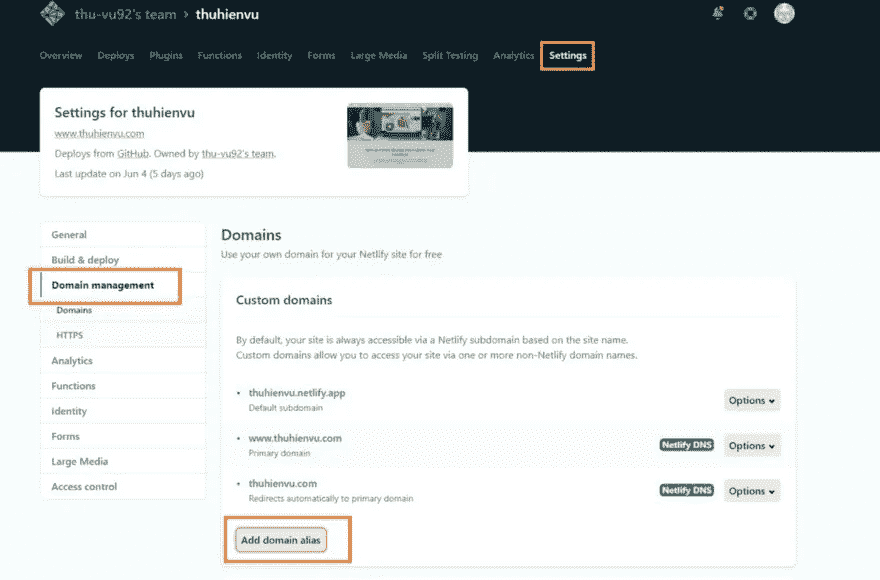
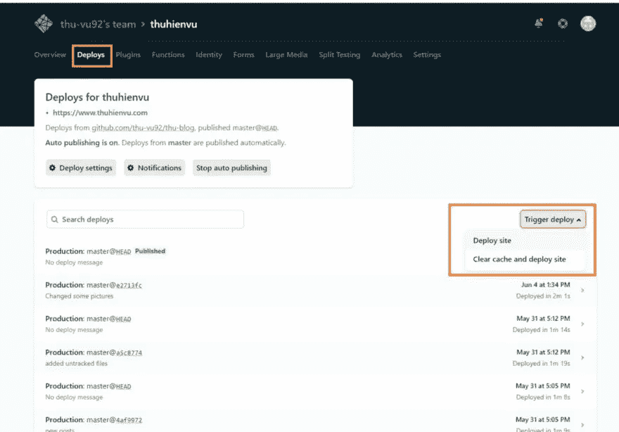

# 如何用 GatsbyJS、GitHub 和 Netlify 创建和部署一个超快的网站

> 原文：<https://towardsdatascience.com/a-z-guide-to-create-and-deploy-a-website-with-gatsbyjs-github-netlify-fd8339650fc7?source=collection_archive---------25----------------------->

## 完整的指南，以建立和部署一个非常快速和现代化的网站免费(自定义域)。

伊戈尔·米斯克在 [Unsplash](https://unsplash.com?utm_source=medium&utm_medium=referral) 上的照片

我创建了一个个人博客网站，展示我的一些创意项目。这是一个相当坎坷的学习曲线，因为我一路上有很多问题和考虑。不幸的是，我找到的大部分教程都是零散的，所以我想我应该写一个详细的教程。如果你不是 web 开发人员，但有一些编码知识，并且想免费建立一个现代化的个人网站(没有 Wordpress 或网站建设者)，这篇文章就是为你准备的！

这篇文章的目的是一步一步地向你展示如何创建、部署和配置一个简单的博客/作品集网站，并使用你自己的自定义域名。我们开始吧！

# 我的攻击计划(即工具设置)

一开始，我在我的小博客/作品集网站的几个选项中来来回回:

*   从头开始编写我的网站
*   使用静态站点生成器
*   使用 Wordpress/其他 CMS。

下面是我在搜索了这么多帖子和网站后创建的一个概述。我在以下几个方面对它们进行比较: ***(1)灵活性&自由度，(2)性能，(3)需要的知识和技能，(4)安全性，(5)可扩展性和维护*** 。这将有望帮助你回答这个百万美元的问题:选择什么:

建立投资组合网站的选择。来源:作者。

在分析了这些选择的利弊之后，我决定选择静态站点生成器(SSG)。这是因为我可以编码，并希望对我的网站的底层内容有更多的控制。此外，我只是想要一个简单整洁的博客网站，所以安装大量的 Wordpress 插件对我来说听起来不是很有吸引力。

具体来说，我使用了 [GatsbyJS](https://www.gatsbyjs.org/) ，因为我对 JavaScript 和 React 更加熟悉和熟悉，这是 Gatsby 所基于的语言。此外，它是一个已经成熟的 SSG，拥有强大的功能和插件生态系统。如果你有兴趣了解更多关于其他 SSG 的信息，这里有一个目前顶级 SSG 的比较。

> ***什么是静态站点生成器？***
> 
> *静态站点生成器是一个应用程序，它获取内容(通常用 Markdown 编写)，将其应用于模板，并生成一组纯静态的 HTML 文件，准备交付给访问者。*

接下来，我们还需要解决网站的其他问题，即域名、托管和部署。以下是我的设置:

工具安装。来源:作者。

如果你想让数据库操作更加用户友好(例如，当你的网站落入非技术用户手中，他们将很难浏览代码仓库)，你可以考虑将你的 SSG 与无头 CMS 配对，例如 [Contentful](https://www.contentful.com/) 。但是这是可选的，没有它你也可以做得很好。

# 设置您的开发环境

在构建您的第一个 Gatsby 站点之前，您需要进行一些安装。

## #1.节点. js

由于 Gatsby 是用 [Node.js](https://nodejs.org/en/) 构建的，我们需要安装它才能使用 Gatsby。如果你使用的是 Windows 操作系统，你可以简单地[下载](https://nodejs.org/en/download/)并安装到你的机器上。

## #2.饭桶

我们将需要 Git 来下载 Gatsby“starter”(带有一些默认配置的部分构建的站点)，并在稍后使用版本控制+托管我们的项目。如果你还没有它，你可以在这里为 Windows 安装[它。](https://www.atlassian.com/git/tutorials/install-git#windows)

## #3.盖茨比 CLI

Gatsby CLI 工具允许您快速创建新的 Gatsby 支持的站点，并运行命令来开发 Gatsby 站点。您可以使用 npm 进行全局安装。打开您的终端并运行以下命令:

`npm install -g gatsby-cli`

您还可以查看可用于 Gatsby CLI 的命令:

`gatsby --help`

# 开始建立你的网站

Gatsby 提供了许多(免费的)[预建启动器](https://www.gatsbyjs.org/showcase/)供您选择，以满足您网站的目的，包括博客网站、在线商店或简单的投资组合网站。假设你想使用这个虚构的博客主题，它是开源的，你可以简单地进入终端，将目录切换到你想要存储你的网站的文件夹，并从 Git 下载代码(注意，你可以给你的网站文件夹起任何名字，而不是`mynewwebsite`):

`gatsby new mynewwebsite [https://github.com/dvzrd/gatsby-sfiction](https://github.com/dvzrd/gatsby-sfiction)`

下载完成后，您可以使用本地主机为站点提供服务:

`gatsby develop`

现在，如果你在 [http://localhost:8000/](http://localhost:8000/) 打开你的网页浏览器，你应该会在那里看到这个网站。

接下来，您可能想要更改`gatsby-config.js`文件中的默认值，以适合您的个人资料信息。你应该看到一个文件夹，里面有 markdown 文件(`.md`)中的所有帖子，在那里你可以开始创建自己的帖子！如果您更熟悉 React、HTML 和 CSS，您还可以深入 React 组件并调整它们的外观，以及添加新的动态功能。

gatsby 文档和教程为你理解和开始操作 Gatsby 启动器提供了一个很好的基础。

此外，在 markdown 中写帖子相当容易。这里有 [markdown 语法](https://www.gatsbyjs.org/docs/mdx/markdown-syntax/)文档供你参考。

# 上传到 Github

一旦你对新网站的配置和基本功能感到满意，我们就进入有趣的部分——托管和部署你的网站。

在 Github 上创建一个存储库，并上传您的网站文件夹。由于您的 Gatsby 网站文件夹包含几个子文件夹，使用 Github 网站并尝试将您的文件夹拖放到 Git repo 中可能行不通。因此，最简单的方法是使用 Git Bash。首先，您将光盘放入您的网站文件夹，然后键入以下内容:

`git commit -am "Uploading files"`

`git remote add origin [https://github.com/yourUsername/yourRepository.git](https://github.com/yourUsername/yourRepository.git)`

`git push -u origin master`

`git push origin master`

现在，您的所有文件都应该上传到您的 Git repo。我们现在准备部署我们的网站！

# 部署到网络

在这一节中，我将解释如何使用 Netlify 免费部署您的个人网站。

## Netlify 与 Github 页面

注意，另一个免费选项是使用 Github 页面，事实上，许多人都将其用于个人网站。这也是一个很好的选择——简单直接地让你的网站开始运行。然而，从长远来看，使用 Netlify 可能会更好，因为它提供了额外的功能。此外，如果您需要在未来扩大您的网站，有付费计划供您选择。

下面是 Netlify 做的一个比较(可能有点偏，但只是给你一个思路):

Github Pages vs. Netlify。来源:[https://www.netlify.com/github-pages-vs-netlify/](https://www.netlify.com/github-pages-vs-netlify/)

实际上，我见过一些专业开发人员和精通编码的人在他们的博客中使用 Netlify(这里的和这里的)。对我来说，这是另一个证明，它是静态页面的一个很好的选择。

## 什么是[网络生活](https://www.netlify.com/)

它是一家云计算公司，为 web 应用程序和静态网站提供托管和无服务器后端服务。根据项目的规模，他们为网站托管提供了几种方案。对于个人网站，使用免费选项就可以了。

## 从 Github 部署您的站点

首先，你需要用你的 Github 账户在 Netlify 网站上注册[。这将连接您的 Netlify 帐户和 Github。](https://app.netlify.com/signup?_ga=2.114350400.631877549.1591689955-1920722782.1588677506)

你可以按照这个[一步一步的教程](https://www.netlify.com/blog/2016/09/29/a-step-by-step-guide-deploying-on-netlify/)从 Github 部署你的站点。一旦你完成了，你应该有这样一个概述:

概述网络生活网站。来源:作者。

注意，这里我已经有了一个自定义域名(。com)。在你的情况下，很可能你的网站在这个阶段仍然有一个`random-name.netlify.app`域名。你可能暂时还能接受这个域名，但是如果你已经拥有一个域名，你当然可以配置它来连接到你的网站。

## 使用自定义域

要自定义您的域名，请进入**设置>域管理>添加域别名**。

在 Netlify 上配置自定义域。来源:作者。

一旦你添加了你的自定义域名，接下来要做的就是去你的域名注册商那里配置你的域名。不同的主要注册商有不同的具体说明，但一般来说，您需要配置以下内容:

*   **A 主机**:104.198.14.52(这是网络服务器 IP 地址)
*   **CNAME** :【你的网站名称】. netlify.app(比如我的情况就是 thuhienvu.netlify.app)
*   **名称服务器:**
    dns1.p01.nsone.net
    dns2.p01.nsone.net
    dns3.p01.nsone.net
    dns4.p01.nsone.net

确保你保存了所有东西。到目前为止，您应该能够看到您的网站与您的自定义域生活！恭喜你！:)

但是等等，你可能会在浏览器上看到一些奇怪的东西:

来源:[https://www . digicert . com/blog/not-secure-warning-what-to-do/](https://www.digicert.com/blog/not-secure-warning-what-to-do/)

这是因为您的站点仍在使用 HTTP 协议，该协议无法提供安全连接。如今，互联网上的所有网站都必须使用 HTTPS 协议，数据在互联网上传输时都要加密(“S”代表“安全”)。传统上，你必须为你的网站购买一个 SSL 证书。然而，Netlify(还有 Github Pages)现在提供免费的 SSL/TLS 证书。

向下滚动到 HTTPS 部分(**设置>域名管理> HTTPS** )。现在，您只需点击一下鼠标，即可为您的网站提供 SSL/TLS 证书。很简单，不是吗？

如果您看到出现某种错误，很可能是因为证书实际工作需要一些时间。与此同时，你可以喝杯咖啡，你的网站应该很快就能正常工作了。

## 更新您的网站

在本地对您的网站进行更改时，您可以通过运行以下命令来查看网站在本地的外观(在 [http://localhost:8000/](http://localhost:8000/) ):

`gatsby develop`

要将您的更改推送到您的网站，首先，您需要将更改提交并推送到您的 Git repo。之后，在 Netlify 网站上，进入`Deploys`选项卡，点击**触发部署>部署站点**按钮，如下所示:

在 Netlify 上部署。来源:作者。

几分钟后，您的网站应该会有新的变化。您还可以看到部署日志在站点部署时展开。如果你想了解更多的细节，这里有一个完整的教程。

# 祝贺和最后的想法

我想首先祝贺你得到你的网站生活！

在这篇文章中，你学会了如何:

*   使用入门工具创建一个盖茨比网站
*   使用 Github 托管和版本控制您的站点
*   使用 Netlify 从 Github 部署您的站点

你现在有了自己的网站，用 Git 控制版本，有了自己的域名。全部免费托管！最棒的是，你可以完全控制你的网站，包括代码、外观和所有附加功能。

希望这个帖子有用。我很想在评论区听到你的想法，以及你是如何建立个人网站的。

*原载于*[*https://www.thuhienvu.com*](https://www.thuhienvu.com/gatsby-website)*。*